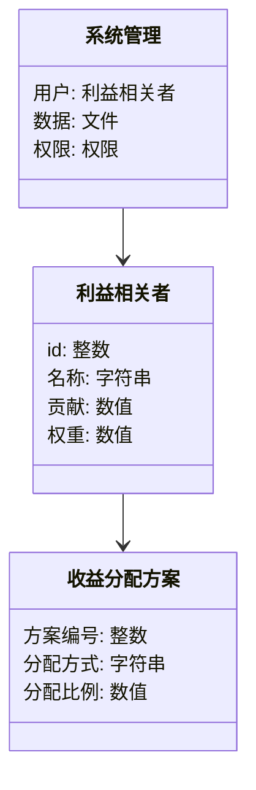
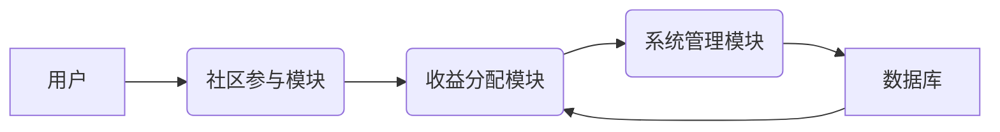
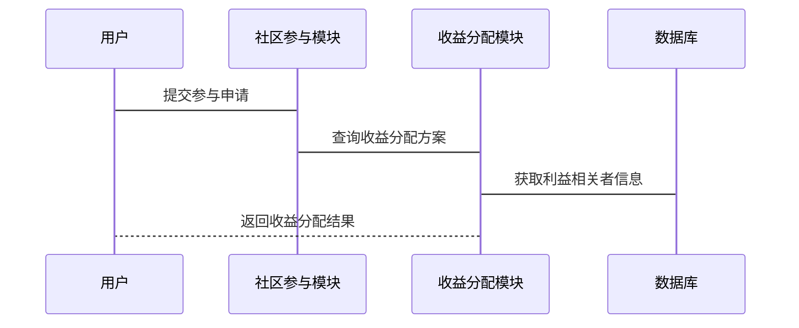
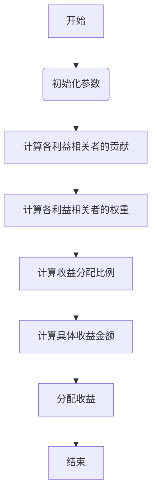

                 


# 可再生能源项目的社区参与模式与收益分配

## 关键词：可再生能源、社区参与模式、收益分配、能源项目、利益相关者

## 摘要

随着全球能源结构转型的推进，可再生能源项目在实现碳中和目标中扮演着越来越重要的角色。然而，可再生能源项目的成功实施不仅依赖于技术的先进性，更需要得到社区的支持与参与。本文深入探讨了可再生能源项目的社区参与模式与收益分配机制，分析了不同社区参与模式的特点及其对项目成功率的影响。同时，文章详细阐述了收益分配机制的设计原则、数学模型及实施步骤，提出了一个基于利益相关者分析的收益分配框架。最后，通过实际案例分析，验证了该框架的有效性，并为未来可再生能源项目的社区参与与收益分配提供了有益的参考。

---

# 第1章: 可再生能源项目与社区参与背景

## 1.1 可再生能源项目的背景与现状

### 1.1.1 可再生能源的全球发展趋势

全球能源结构正经历着从化石能源向可再生能源的重大转型。根据国际能源署（IEA）的数据，全球可再生能源装机容量在过去十年中以年均8%的速度增长，预计到2030年，可再生能源将占全球电力装机容量的60%以上。中国作为全球最大的能源消费国，也在积极推动能源结构的优化，提出了“双碳”目标，即在2030年前实现碳达峰，2060年前实现碳中和。

### 1.1.2 中国可再生能源发展现状

中国是全球最大的可再生能源市场，目前已经成为全球最大的风能和太阳能设备制造国。根据国家能源局的数据，截至2022年底，中国可再生能源发电装机容量达到12.9亿千瓦，占全部电力装机的48.8%。其中，太阳能发电装机容量达到44252万千瓦，风力发电装机容量达到36584万千瓦。

### 1.1.3 社区参与在可再生能源项目中的重要性

可再生能源项目的成功实施不仅需要先进的技术和充足的资金，还需要得到社区的支持。社区参与可以提高项目的透明度和合法性，减少社区对项目的抵触情绪，同时也能增强社区对项目的认同感和归属感。此外，社区参与还能为项目带来更多的资源和信息支持，有助于项目的顺利实施。

## 1.2 社区参与模式的定义与特征

### 1.2.1 社区参与模式的定义

社区参与模式是指在可再生能源项目的规划、建设和运营过程中，充分调动社区居民的积极性，使其参与到项目的决策、实施和监督中，从而形成一种多方利益共赢的机制。

### 1.2.2 社区参与模式的核心特征

1. **利益共享**：社区居民能够从项目中获得一定的经济收益或社会效益。
2. **多方协作**：项目涉及政府、企业、社区居民等多方主体，需要通过协作实现共赢。
3. **透明公开**：项目的决策过程和收益分配需要公开透明，确保社区居民的知情权和参与权。
4. **可持续性**：社区参与模式需要确保项目的长期可持续发展，避免因短期利益而导致的矛盾。

### 1.2.3 社区参与模式的分类与对比

社区参与模式可以根据不同的分类标准进行划分。常见的分类方式包括：

1. **按参与主体分类**：
   - 政府主导型：由政府主导，社区居民参与度较低。
   - 企业主导型：由企业主导，社区居民参与度较高。
   - 社区自治型：由社区居民自主组织，独立实施项目。

2. **按参与方式分类**：
   - 信息参与：社区居民仅参与信息获取和反馈，不参与决策。
   - 决策参与：社区居民参与项目的决策过程，具有较高的话语权。
   - 实施参与：社区居民参与项目的具体实施工作，如土地提供、资金投入等。

3. **按项目类型分类**：
   - 太阳能项目：如屋顶光伏、地面光伏等。
   - 风能项目：如陆上风电、海上风电等。
   - 生物质能项目：如秸秆发电、垃圾发电等。

通过以上分类，可以看出不同社区参与模式的特点和适用场景。例如，政府主导型模式适合大型项目，而社区自治型模式更适合小型分布式项目。

## 1.3 收益分配机制的定义与原则

### 1.3.1 收益分配机制的定义

收益分配机制是指在可再生能源项目中，如何将项目的收益在各利益相关者之间进行合理分配的规则和流程。

### 1.3.2 收益分配机制的核心原则

1. **公平性原则**：收益分配应根据各利益相关者的贡献大小进行公平分配。
2. **可持续性原则**：收益分配应确保项目的长期可持续发展，避免因短期收益分配而导致的矛盾。
3. **可操作性原则**：收益分配机制应具有较强的可操作性，能够在实际中顺利实施。

### 1.3.3 收益分配机制的类型与特点

1. **按贡献分配**：根据各利益相关者的贡献大小进行分配，如资金投入、资源提供、劳动力投入等。
2. **按股权分配**：根据各利益相关者的股权比例进行分配。
3. **按绩效分配**：根据各利益相关者的绩效表现进行分配，如项目收益、成本节约等。

## 1.4 本章小结

本章从可再生能源项目的背景与现状出发，分析了社区参与模式的定义、特征及分类，并提出了收益分配机制的核心原则和类型。这些内容为后续章节的深入分析奠定了基础。

---

# 第2章: 可再生能源项目中的社区参与模式

## 2.1 社区参与模式的分类与分析

### 2.1.1 基于利益相关者的分类

社区参与模式可以按照利益相关者的不同进行分类。常见的利益相关者包括政府、企业、社区居民、金融机构等。例如：

1. **政府主导型模式**：政府作为主导方，负责项目的规划、建设和运营，社区居民仅提供土地或资源支持。
2. **企业主导型模式**：企业作为主要投资方，社区居民通过提供土地、劳动力等方式参与项目，企业负责项目的建设和运营。
3. **社区自治型模式**：社区居民自主组织，通过合作社或互助组织的方式参与项目，项目收益归社区居民所有。

### 2.1.2 基于参与程度的分类

社区参与模式还可以按照参与程度的不同进行分类。常见的参与程度包括：

1. **低参与度**：社区居民仅提供土地或资源，不参与决策和管理。
2. **中等参与度**：社区居民参与项目的部分决策或管理，如参与项目规划或监督。
3. **高参与度**：社区居民深度参与项目的决策和管理，如参与项目规划、资金分配等。

### 2.1.3 基于项目类型的分类

根据项目的类型，社区参与模式可以分为以下几类：

1. **分布式能源项目**：如屋顶光伏、家庭风力发电等，适合社区居民直接参与。
2. **集中式能源项目**：如大型太阳能电站、风力发电场等，适合政府或企业主导。
3. **生物质能项目**：如秸秆发电、垃圾发电等，适合社区居民提供资源并参与运营。

## 2.2 社区参与模式的核心要素

### 2.2.1 社区利益相关者的识别

在可再生能源项目中，识别利益相关者是社区参与模式设计的第一步。常见的利益相关者包括：

- **政府**：负责项目的审批、监管和政策支持。
- **企业**：作为主要投资方，负责项目的建设和运营。
- **社区居民**：提供土地、劳动力或资源支持，参与项目的决策和管理。
- **金融机构**：提供资金支持，参与项目的收益分配。
- **非政府组织**：提供技术支持和咨询服务。

### 2.2.2 社区参与的决策机制

决策机制是社区参与模式的核心要素之一。常见的决策机制包括：

1. **协商决策**：通过社区会议等形式，由各方利益相关者共同协商决定。
2. **投票决策**：通过投票的方式，由社区居民决定项目的重大事项。
3. **专家决策**：由技术专家或专业机构负责决策，社区居民提供意见和建议。

### 2.2.3 社区参与的激励机制

激励机制是提高社区居民参与积极性的重要手段。常见的激励机制包括：

1. **经济激励**：通过提供资金补贴、降低电价等方式，激励社区居民参与项目。
2. **社会激励**：通过表彰先进个人或集体，提升社区居民的参与积极性。
3. **环境激励**：通过改善社区环境，提升社区居民的生活质量，从而激励其参与项目。

## 2.3 社区参与模式的实施步骤

### 2.3.1 项目需求分析

项目需求分析是社区参与模式设计的第一步，需要明确项目的建设目标、规模、技术路线等。例如：

- **建设目标**：减少碳排放，提高可再生能源利用率。
- **规模**：根据社区能源需求和资源条件，确定项目的装机容量。
- **技术路线**：选择适合当地资源条件的技术方案，如光伏、风电等。

### 2.3.2 社区参与计划制定

在明确项目需求的基础上，制定社区参与计划。计划应包括以下内容：

1. **参与主体**：明确社区参与的主体，如社区居民、企业、政府等。
2. **参与方式**：确定社区居民的参与方式，如提供土地、劳动力、资金等。
3. **参与激励**：制定激励措施，如经济补贴、社会荣誉等。

### 2.3.3 社区参与的实施与监控

在项目实施过程中，需要对社区参与的全过程进行监控和管理。常见的管理措施包括：

1. **定期会议**：定期召开社区会议，听取社区居民的意见和建议。
2. **信息透明**：通过公开信息平台，向社区居民公开项目的进展情况和收益分配情况。
3. **反馈机制**：建立反馈机制，及时解决社区居民的问题和诉求。

## 2.4 本章小结

本章详细分析了可再生能源项目中的社区参与模式，包括分类、核心要素和实施步骤。通过这些分析，我们可以更好地理解社区参与模式的多样性和复杂性，为后续章节的收益分配机制设计提供参考。

---

# 第3章: 可再生能源项目的收益分配机制

## 3.1 收益分配机制的设计原则

### 3.1.1 公平性原则

收益分配机制的设计必须遵循公平性原则，确保各利益相关者的收益与其贡献相匹配。例如，社区居民提供土地支持的，应获得一定的土地使用费；企业投资项目的，应获得合理的投资回报。

### 3.1.2 可持续性原则

收益分配机制应确保项目的长期可持续发展，避免因短期收益分配而导致的矛盾。例如，可以通过设置收益分配的动态调整机制，根据项目的实际收益情况和各利益相关者的贡献变化进行调整。

### 3.1.3 可操作性原则

收益分配机制应具有较强的可操作性，能够在实际中顺利实施。例如，可以通过制定详细的收益分配规则和流程，确保各利益相关者的收益能够按时足额分配。

## 3.2 收益分配机制的数学模型

### 3.2.1 收益分配的基本公式

收益分配的基本公式可以表示为：

$$
\text{收益分配比例} = \frac{\text{参与者贡献}}{\text{总贡献}}
$$

其中，参与者贡献是指某一方在项目中的具体贡献，如资金投入、资源提供等；总贡献是指所有利益相关者的总贡献。

### 3.2.2 收益分配的权重计算

收益分配的权重可以通过以下公式计算：

$$
\text{权重} = \sum_{i=1}^{n} w_i \times x_i
$$

其中，\( w_i \) 是第 \( i \) 个利益相关者的权重，\( x_i \) 是其贡献的具体数值。

## 3.3 收益分配机制的实施步骤

### 3.3.1 收益分配方案的设计

收益分配方案的设计是收益分配机制实施的第一步，需要明确以下内容：

1. **分配主体**：确定收益分配的主体，如企业、政府、社区居民等。
2. **分配方式**：确定收益分配的具体方式，如按比例分配、按绩效分配等。
3. **分配周期**：确定收益分配的周期，如按月分配、按年分配等。

### 3.3.2 收益分配的计算与验证

在收益分配方案设计的基础上，需要对收益分配进行计算和验证。例如，可以通过模拟计算，验证收益分配方案的公平性和可持续性。

### 3.3.3 收益分配的公示与确认

收益分配的公示与确认是确保收益分配机制透明公开的重要步骤。可以通过以下方式实现：

1. **公开公示**：通过社区公告栏、信息平台等方式，向社区居民公示收益分配方案和结果。
2. **确认签字**：由各利益相关者签字确认，确保收益分配的合法性和有效性。

## 3.4 本章小结

本章从收益分配机制的设计原则出发，提出了收益分配的数学模型和实施步骤。通过这些分析，我们可以更好地理解收益分配机制的复杂性和重要性，为后续章节的系统设计和项目实战提供理论支持。

---

# 第4章: 社区参与模式与收益分配的系统架构

## 4.1 系统功能设计

### 4.1.1 社区参与模块

社区参与模块是系统的核心模块之一，主要包括以下功能：

1. **利益相关者管理**：对社区参与的利益相关者进行管理，包括信息录入、权限分配等。
2. **参与方式管理**：管理社区居民的参与方式，如土地提供、资金投入等。
3. **参与激励管理**：管理社区参与的激励措施，如经济补贴、社会荣誉等。

### 4.1.2 收益分配模块

收益分配模块是系统的重要功能模块，主要包括以下功能：

1. **收益计算**：根据各利益相关者的贡献，计算收益分配比例和具体金额。
2. **收益分配管理**：对收益分配的过程进行管理，包括分配方案制定、分配结果公示等。
3. **收益调整管理**：根据项目的实际情况，对收益分配方案进行动态调整。

### 4.1.3 系统管理模块

系统管理模块是系统的支持模块，主要包括以下功能：

1. **用户管理**：对系统用户进行管理，包括权限分配、用户信息维护等。
2. **数据管理**：对系统的数据进行管理，包括数据录入、数据查询等。
3. **系统监控**：对系统的运行状态进行监控，确保系统的稳定运行。

## 4.2 系统架构设计

### 4.2.1 领域模型设计

领域模型是系统设计的重要组成部分，可以通过Mermaid类图来表示。以下是领域模型的类图：



### 4.2.2 系统架构设计

系统架构设计可以通过Mermaid架构图来表示。以下是系统的架构图：



### 4.2.3 系统接口设计

系统接口设计可以通过Mermaid序列图来表示。以下是系统的接口设计：



## 4.3 本章小结

本章详细设计了社区参与模式与收益分配的系统架构，包括功能设计、领域模型、系统架构和接口设计。这些设计为后续章节的项目实战提供了技术支持。

---

# 第5章: 项目实战与案例分析

## 5.1 项目环境安装

### 5.1.1 系统安装环境

为了实现社区参与模式与收益分配的系统，需要以下软件环境：

- **操作系统**：Windows、Linux或macOS
- **编程语言**：Python 3.6以上版本
- **开发框架**：Django或Flask
- **数据库**：MySQL或PostgreSQL
- **开发工具**：PyCharm、VS Code等

### 5.1.2 系统核心实现源代码

以下是系统核心实现的源代码示例：

```python
from django.db import models

class 参与者(models.Model):
    id = models.AutoField(primary_key=True)
    名称 = models.CharField(max_length=100)
    贡献 = models.DecimalField(max_digits=10, decimal_places=2)
    权重 = models.DecimalField(max_digits=10, decimal_places=2)

class 收益分配方案(models.Model):
    id = models.AutoField(primary_key=True)
    方案编号 = models.CharField(max_length=50)
    分配方式 = models.CharField(max_length=100)
    分配比例 = models.DecimalField(max_digits=10, decimal_places=2)
```

### 5.1.3 代码应用解读与分析

上述代码定义了两个模型：参与者和收益分配方案。参与者模型记录了各利益相关者的名称、贡献和权重；收益分配方案模型记录了分配方案的编号、分配方式和分配比例。通过这些模型，可以实现社区参与模式与收益分配的核心功能。

## 5.2 项目核心实现

### 5.2.1 系统功能实现

系统功能实现包括社区参与模块和收益分配模块的实现。以下是社区参与模块的主要功能：

1. **利益相关者管理**：对社区参与的利益相关者进行信息录入、权限分配等。
2. **参与方式管理**：管理社区居民的参与方式，如土地提供、资金投入等。
3. **参与激励管理**：管理社区参与的激励措施，如经济补贴、社会荣誉等。

### 5.2.2 系统功能测试

系统功能测试是确保系统正常运行的重要步骤。可以通过单元测试、集成测试等方式进行测试。

## 5.3 案例分析

### 5.3.1 案例背景介绍

以某社区光伏发电项目为例，该社区共有500户居民，项目装机容量为1MW，年发电量约为120万度。社区居民通过屋顶安装光伏板参与项目，企业负责建设和运营，政府提供政策支持和资金补贴。

### 5.3.2 案例分析与解读

在该项目中，社区居民通过屋顶安装光伏板参与项目，企业负责建设和运营，政府提供政策支持和资金补贴。收益分配方案如下：

- **居民收益**：居民可以获得光伏电量的上网电价补贴，以及部分发电收益。
- **企业收益**：企业获得项目的发电收益，以及政府的政策支持。
- **政府收益**：政府通过该项目减少碳排放，提高可再生能源利用率。

通过以上分析，可以看出社区参与模式与收益分配机制在实际项目中的重要作用。

## 5.4 项目小结

本章通过实际案例分析，验证了社区参与模式与收益分配机制的有效性。通过系统的实现和测试，我们可以更好地理解社区参与模式与收益分配机制的实际应用。

---

# 第6章: 收益分配机制的数学模型与算法实现

## 6.1 收益分配机制的数学模型

### 6.1.1 收益分配的基本公式

收益分配的基本公式可以表示为：

$$
\text{收益分配比例} = \frac{\text{参与者贡献}}{\text{总贡献}}
$$

其中，参与者贡献是指某一方在项目中的具体贡献，如资金投入、资源提供等；总贡献是指所有利益相关者的总贡献。

### 6.1.2 收益分配的权重计算

收益分配的权重可以通过以下公式计算：

$$
\text{权重} = \sum_{i=1}^{n} w_i \times x_i
$$

其中，\( w_i \) 是第 \( i \) 个利益相关者的权重，\( x_i \) 是其贡献的具体数值。

## 6.2 收益分配算法的实现

### 6.2.1 算法流程图

以下是收益分配算法的流程图：



### 6.2.2 算法实现代码

以下是收益分配算法的实现代码：

```python
def 计算收益分配比例(参与者贡献, 总贡献):
    收益分配比例 = 参与者贡献 / 总贡献
    return 收益分配比例

def 计算权重(权重列表, 贡献列表):
    总权重 = 0
    for i in range(len(权重列表)):
        总权重 += 权重列表[i] * 贡献列表[i]
    return 总权重

def 收益分配算法(参与者贡献, 总贡献):
    收益分配比例 = 计算收益分配比例(参与者贡献, 总贡献)
    权重 = 计算权重(权重列表, 贡献列表)
    return 收益分配比例, 权重
```

## 6.3 算法实现的注意事项

### 6.3.1 数据输入

在算法实现过程中，需要注意数据输入的准确性。例如，参与者贡献和总贡献的数据类型和数值范围。

### 6.3.2 计算过程

在计算过程中，需要注意数值精度的问题，避免因计算误差导致收益分配不公。

### 6.3.3 结果输出

在结果输出时，需要确保收益分配比例和权重的计算结果能够被后续系统模块正确处理。

## 6.4 本章小结

本章详细介绍了收益分配机制的数学模型与算法实现，为后续章节的系统设计和项目实战提供了理论支持和技术保障。

---

# 第7章: 案例分析与小结

## 7.1 案例分析

### 7.1.1 案例背景

以某社区光伏发电项目为例，该社区共有500户居民，项目装机容量为1MW，年发电量约为120万度。社区居民通过屋顶安装光伏板参与项目，企业负责建设和运营，政府提供政策支持和资金补贴。

### 7.1.2 案例分析与解读

在该项目中，社区居民通过屋顶安装光伏板参与项目，企业负责建设和运营，政府提供政策支持和资金补贴。收益分配方案如下：

- **居民收益**：居民可以获得光伏电量的上网电价补贴，以及部分发电收益。
- **企业收益**：企业获得项目的发电收益，以及政府的政策支持。
- **政府收益**：政府通过该项目减少碳排放，提高可再生能源利用率。

通过以上分析，可以看出社区参与模式与收益分配机制在实际项目中的重要作用。

## 7.2 小结

### 7.2.1 项目经验总结

通过本项目的实施，我们总结出以下经验：

1. **社区参与模式的选择**：根据项目的类型和规模，选择适合的社区参与模式。
2. **收益分配机制的设计**：确保收益分配机制的公平性、可持续性和可操作性。
3. **系统架构的设计**：通过合理的系统架构设计，确保项目的顺利实施。

### 7.2.2 未来发展趋势

随着可再生能源技术的不断进步和政策支持力度的加大，社区参与模式与收益分配机制将更加多样化和复杂化。未来的研究方向可以包括：

1. **智能化收益分配机制**：利用人工智能技术，实现收益分配的智能化和动态化。
2. **区块链技术的应用**：通过区块链技术，确保收益分配的透明性和不可篡改性。
3. **社区自治模式的推广**：推广社区自治模式，增强社区居民的参与感和归属感。

## 7.3 注意事项

### 7.3.1 政策支持

在实际项目中，需要充分考虑政策支持的力度和范围，确保项目的合法性和可持续性。

### 7.3.2 社区居民的参与度

社区居民的参与度是项目成功的关键因素之一，需要通过多种方式提高社区居民的参与积极性。

### 7.3.3 项目风险的控制

在项目实施过程中，需要注重风险的控制，如技术风险、市场风险、政策风险等。

## 7.4 拓展阅读

### 7.4.1 可再生能源项目中的社区参与模式研究

建议进一步研究可再生能源项目中的社区参与模式，探索不同类型项目的社区参与模式的特点和适用场景。

### 7.4.2 收益分配机制的优化与创新

建议研究收益分配机制的优化与创新，探索更加公平、可持续的收益分配方式。

### 7.4.3 区块链技术在收益分配中的应用

建议研究区块链技术在收益分配中的应用，探索更加透明、安全的收益分配机制。

## 7.5 本章小结

本章通过对实际案例的分析，总结了项目经验，提出了未来的发展趋势和研究方向。通过这些分析，我们可以更好地理解社区参与模式与收益分配机制的实际应用，为未来的实践和研究提供参考。

---

# 结语

可再生能源项目的社区参与模式与收益分配是一个复杂而重要的问题，需要我们在理论研究和实际应用中不断探索和优化。通过本文的分析，我们可以看到，只有在社区参与模式和收益分配机制的设计上做到公平、可持续和可操作，才能真正实现可再生能源项目的成功实施，推动全球能源结构的转型和碳中和目标的实现。未来，随着技术的进步和政策的支持，社区参与模式与收益分配机制将更加多样化和智能化，为可再生能源项目的可持续发展提供更多的可能性。

