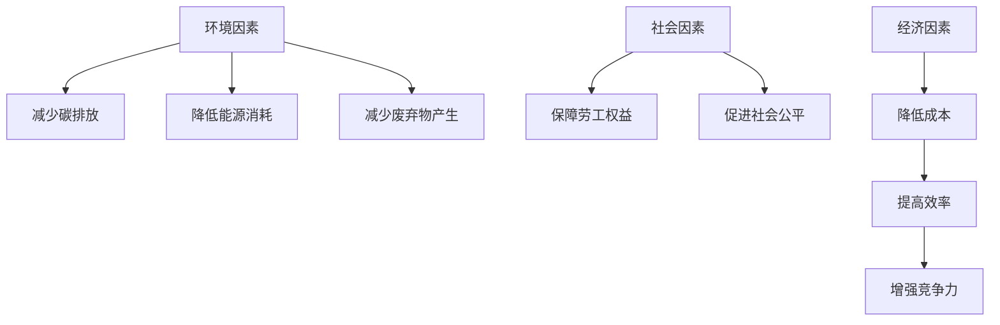
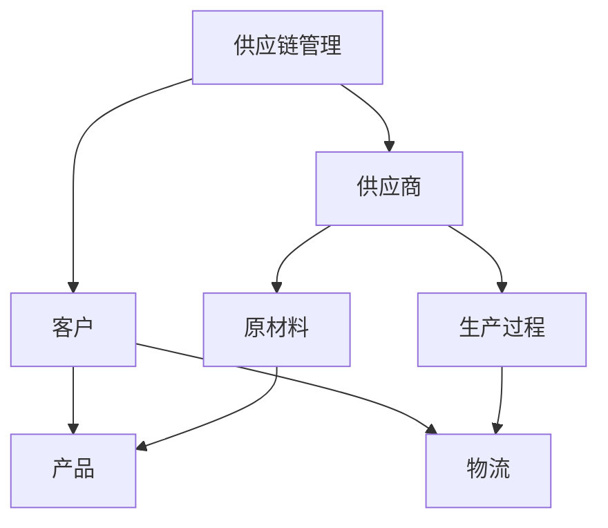
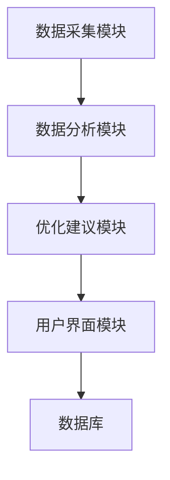
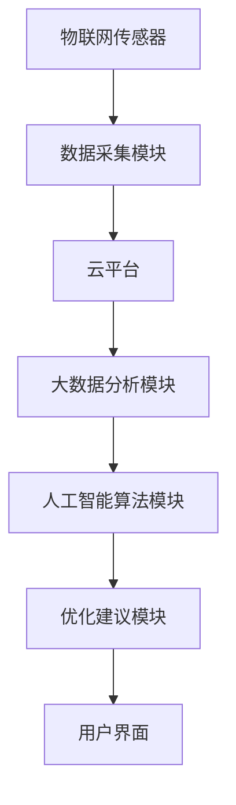

                 

# 可持续供应链管理的经济效益与投资机会

## 关键词
- 可持续供应链管理
- 经济效益
- 投资机会
- 数字化技术
- 绿色供应链
- 生命周期评价

## 摘要
可持续供应链管理是一种整合了环境、经济和社会因素的现代供应链管理方式，旨在实现长期的可持续发展目标。本文从经济效益和投资机会两个方面详细探讨了可持续供应链管理的重要性和实现路径。通过分析成本节约、收入增长和风险管理等经济层面的效益，本文揭示了可持续供应链管理如何为企业创造价值。同时，结合数字化技术的应用、政策支持和市场趋势，本文为企业提供了可持续供应链管理的投资机会分析。最后，本文通过具体案例和系统架构图，详细阐述了可持续供应链管理的技术方法和实施策略。

---

## 第1章: 可持续供应链管理的基本概念

### 1.1 可持续供应链管理的定义与内涵

#### 1.1.1 可持续供应链管理的定义
可持续供应链管理是指在供应链的全生命周期中，综合考虑环境、社会和经济因素，通过优化资源利用、减少浪费和降低环境影响，实现经济效益和社会价值最大化的过程。

#### 1.1.2 可持续供应链管理的核心要素
- **环境因素**：减少碳排放、降低能源消耗、减少废弃物产生。
- **社会因素**：保障劳工权益、促进社会公平、推动社区发展。
- **经济因素**：降低成本、提高效率、增强竞争力。

#### 1.1.3 可持续供应链管理的边界与外延
可持续供应链管理不仅关注企业的内部运营，还涉及供应商、客户、消费者和整个生态系统的利益相关者。其外延包括从原材料采购到产品交付的全过程，以及从产品生命周期到供应链网络的全维度。

#### 1.1.4 可持续供应链管理的概念结构与核心要素组成

### 1.2 可持续供应链管理的背景与问题背景

#### 1.2.1 当前供应链管理面临的挑战
- 环境问题日益严峻，如气候变化、资源枯竭和环境污染。
- 社会问题频发，如劳工权益保护不足和供应链透明度低。
- 传统供应链管理的线性思维难以应对复杂多变的市场环境。

#### 1.2.2 可持续发展的重要性
可持续发展已成为全球共识，企业需要在追求经济效益的同时，承担社会责任，实现长期发展。

#### 1.2.3 可持续供应链管理的必要性
- 提高企业竞争力：通过优化资源利用和降低运营成本，增强企业的市场地位。
- 满足客户需求：消费者越来越关注产品和服务的可持续性，推动企业向绿色供应链转型。
- 应对政策法规：政府出台的环保法规和碳排放标准要求企业必须采取可持续的供应链管理方式。

### 1.3 可持续供应链管理的核心概念与联系

#### 1.3.1 核心概念原理
可持续供应链管理通过整合环境、社会和经济三重因素，优化供应链的整体效率和价值。

#### 1.3.2 核心概念属性特征对比表格

| **属性**       | **环境因素**       | **社会因素**       | **经济因素**        |
|----------------|--------------------|--------------------|---------------------|
| **目标**       | 减少环境影响       | 促进社会公平       | 实现经济效益最大化   |
| **关键指标**   | 碳排放量、能源消耗 | 劳工权益、社区参与 | 成本、效率、利润     |
| **实施难点**   | 技术复杂性         | 利益协调难度       | 投资回报周期较长     |

#### 1.3.3 ER实体关系图架构（Mermaid流程图）

---

## 第2章: 可持续供应链管理的经济效益

### 2.1 可持续供应链管理的成本节约

#### 2.1.1 资源优化利用的成本节约
通过优化资源分配和减少浪费，企业可以显著降低采购和生产成本。例如，采用循环经济模式，将废弃物转化为新的资源，可以减少原材料的使用成本。

#### 2.1.2 环境友好型供应链的成本优势
环境友好型供应链通过减少能源消耗和降低碳排放，可以享受政府的税收优惠和政策支持，进一步降低成本。

#### 2.1.3 可持续供应链管理的长期成本效益
尽管初期投资较大，但通过长期的成本节约和效率提升，可持续供应链管理可以在中长期为企业创造更高的经济效益。

### 2.2 可持续供应链管理的收入增长

#### 2.2.1 绿色产品的市场溢价
随着消费者环保意识的增强，绿色产品在市场上的溢价能力不断提高，为企业带来额外的收入增长。

#### 2.2.2 可持续供应链管理的品牌价值
通过实施可持续供应链管理，企业可以提升品牌形象，增强客户忠诚度，从而实现收入增长。

#### 2.2.3 可持续供应链管理的客户忠诚度
客户越来越关注企业的社会责任和可持续发展能力，通过可持续供应链管理，企业可以吸引更多的忠实客户，从而实现收入增长。

### 2.3 可持续供应链管理的风险管理

#### 2.3.1 环境风险的降低
通过减少碳排放和降低环境影响，企业可以有效降低环境法规的风险，避免因环境问题导致的罚款和声誉损失。

#### 2.3.2 社会责任风险的降低
通过保障劳工权益和促进社会公平，企业可以降低社会责任风险，避免因供应链中的不公正行为导致的法律诉讼和声誉损失。

#### 2.3.3 可持续供应链管理的长期风险管理
可持续供应链管理可以帮助企业识别和应对潜在的风险，如供应链中断和资源短缺，从而实现长期的稳定发展。

---

## 第3章: 可持续供应链管理的投资机会

### 3.1 可持续供应链管理的技术驱动

#### 3.1.1 数字化技术的应用
数字化技术，如物联网、大数据和人工智能，可以提高供应链的透明度和效率，降低成本，并优化资源利用。

#### 3.1.2 人工智能在供应链管理中的应用
人工智能可以通过预测分析和机器学习优化供应链的规划和执行，提高供应链的响应能力和灵活性。

#### 3.1.3 区块链技术在供应链透明化中的应用
区块链技术可以实现供应链的全程透明化，确保数据的不可篡改性和可追溯性，提高供应链的可信度。

### 3.2 可持续供应链管理的政策支持

#### 3.2.1 政府政策对可持续供应链的支持
政府通过出台环保法规和补贴政策，鼓励企业实施可持续供应链管理，为企业提供政策支持和资金保障。

#### 3.2.2 环保法规对供应链管理的影响
环保法规的日益严格要求企业必须采取可持续的供应链管理方式，否则将面临罚款和市场准入限制。

#### 3.2.3 可持续供应链管理的政策投资机会
政府政策和环保法规为企业提供了明确的投资方向和政策支持，企业可以通过抓住政策机遇，实现可持续发展和投资回报。

### 3.3 可持续供应链管理的市场趋势

#### 3.3.1 绿色消费市场的兴起
消费者越来越关注产品的环保性和社会责任性，绿色消费市场正在快速增长，为企业提供了新的投资机会。

#### 3.3.2 可持续供应链管理的市场需求
企业和社会对可持续供应链管理的需求不断增加，推动了相关技术和解决方案的发展，为企业提供了广泛的投资机会。

#### 3.3.3 可持续供应链管理的未来投资趋势
未来，随着技术的进步和市场的发展，可持续供应链管理将在更多领域展现出投资潜力，成为企业实现可持续发展的核心竞争力。

---

## 第4章: 可持续供应链管理的技术方法

### 4.1 可持续供应链管理的生命周期评价

#### 4.1.1 生命周期评价的定义
生命周期评价（LCA）是一种系统化的方法，用于评估产品或服务在整个生命周期中的环境影响，包括原材料采购、生产、使用和废弃等阶段。

#### 4.1.2 生命周期评价的方法
- **输入阶段**：原材料采购和运输。
- **生产阶段**：生产过程中的能源消耗和排放。
- **使用阶段**：产品使用过程中的能源消耗和环境影响。
- **废弃阶段**：产品的回收和处理。

#### 4.1.3 生命周期评价的数学模型
生命周期评价的总环境影响可以通过以下公式计算：
$$
\text{总环境影响} = \sum_{i=1}^{n} \text{各阶段环境影响}
$$
其中，$$n$$ 为生命周期的阶段数。

### 4.2 可持续供应链管理的碳足迹分析

#### 4.2.1 碳足迹分析的定义
碳足迹分析是一种方法，用于量化产品或服务在整个生命周期中的碳排放量。

#### 4.2.2 碳足迹分析的步骤
1. **确定范围**：明确分析的范围和边界。
2. **数据收集**：收集各阶段的碳排放数据。
3. **计算碳排放**：使用数学模型计算总碳排放量。
4. **结果分析**：识别碳排放的关键环节，制定减排措施。

#### 4.2.3 碳足迹分析的数学公式
总碳排放量可以表示为：
$$
\text{总碳排放量} = \sum_{j=1}^{m} \text{各环节碳排放量}
$$
其中，$$m$$ 为碳排放环节的数量。

### 4.3 可持续供应链管理的系统架构设计

#### 4.3.1 系统功能设计
- **数据采集**：收集供应链各环节的数据。
- **数据分析**：对数据进行处理和分析，识别优化点。
- **优化建议**：基于分析结果，提出优化建议。

#### 4.3.2 系统架构设计（Mermaid架构图）

---

## 第5章: 可持续供应链管理的项目实战

### 5.1 项目背景介绍
某跨国企业希望通过实施可持续供应链管理，降低碳排放、优化资源利用，并提升品牌形象。

### 5.2 系统功能设计
- **数据采集**：通过物联网技术采集供应链各环节的实时数据。
- **数据分析**：利用大数据和人工智能技术分析数据，识别优化点。
- **优化建议**：基于分析结果，提出具体的优化建议，如供应商选择和运输路线优化。

### 5.3 系统架构设计

### 5.4 项目小结
通过实施可持续供应链管理，该企业成功降低了碳排放，优化了资源利用，并提升了品牌形象，实现了经济效益和社会价值的双重目标。

---

## 第6章: 可持续供应链管理的总结与展望

### 6.1 总结
可持续供应链管理不仅是一种管理方式，更是一种商业模式的创新。通过整合环境、社会和经济三重因素，企业可以实现长期的可持续发展。

### 6.2 展望
随着技术的进步和市场的发展，可持续供应链管理将在更多领域展现出投资潜力，成为企业实现可持续发展的核心竞争力。

---

## 最佳实践 Tips

1. **从小处着手**：企业可以从小规模的项目开始，逐步推进可持续供应链管理的实施。
2. **注重技术驱动**：利用数字化技术优化供应链的透明度和效率。
3. **关注政策支持**：抓住政府政策和环保法规带来的投资机会。
4. **加强供应链透明度**：通过区块链等技术实现供应链的全程透明化，提升供应链的可信度。

---

通过本文的分析，我们可以看到，可持续供应链管理不仅能够为企业创造经济效益，还能为社会和环境带来积极影响。未来，随着技术的进步和市场的发展，可持续供应链管理将成为企业实现可持续发展的重要手段。

