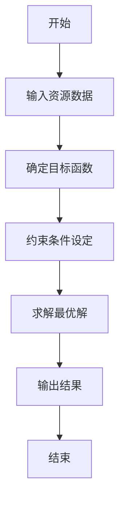
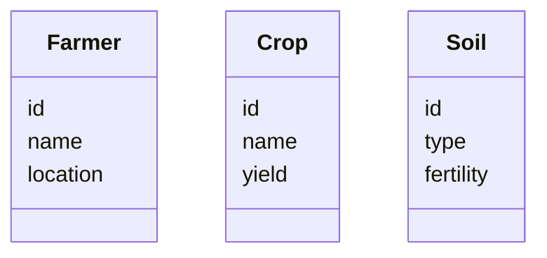
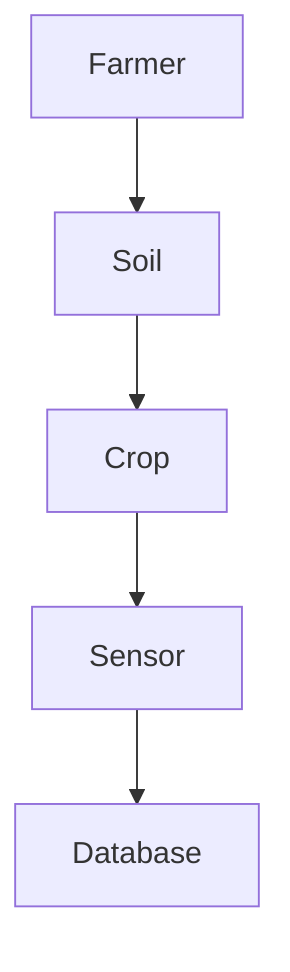
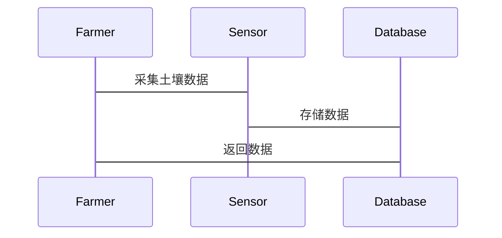

                 


```markdown
# 可持续农业实践与相关产业链投资

## 关键词：可持续农业、产业链投资、环境保护、农业生产效率、资源优化配置

## 摘要：本书探讨了可持续农业的定义、核心概念、产业链结构以及相关投资机会。通过分析农业资源优化配置模型、智慧农业系统设计等技术内容，结合实际案例，为读者提供可持续农业实践与产业链投资的全面指导。

---

## 第一部分：可持续农业的背景与核心概念

### 第1章：可持续农业的定义与背景

#### 1.1 可持续农业的定义与内涵
- 从传统农业到可持续农业的演进
- 可持续农业的核心目标与原则
- 可持续农业与环境保护的关系

#### 1.2 可持续农业的背景与问题背景
- 全球粮食安全与资源短缺的挑战
- 农业生产对环境的影响
- 可持续农业在实现联合国SDGs中的作用

#### 1.3 可持续农业的产业链整合
- 农业产业链的构成与整合
- 可持续农业与产业链效率的关系
- 可持续农业对产业链各环节的影响

---

## 第二部分：可持续农业的核心概念与联系

### 第2章：可持续农业的核心要素与属性

#### 2.1 可持续农业的核心要素
- 生产效率
- 资源利用效率
- 环境保护
- 社会公平

#### 2.2 可持续农业的属性特征对比表
| 属性 | 特征 |
|------|------|
| 生产效率 | 高效、生态 |
| 资源利用 | 循环、节约 |
| 环境保护 | 无污染、可持续 |
| 社会公平 | 公正、共享 |

#### 2.3 可持续农业的ER实体关系图
```mermaid
erd
actor Farmer {
  id
  name
  location
}
actor Consumer {
  id
  name
  location
}
actor Investor {
  id
  name
  investment_amount
}
```

---

## 第三部分：可持续农业的算法原理

### 第3章：资源优化配置模型

#### 3.1 资源分配优化模型
- 算法流程图


#### 3.2 算法实现
- Python代码示例
```python
import numpy as np

# 定义目标函数
def objective(x):
    return np.sum(x)

# 约束条件
def constraint(x):
    return np.sum(x) <= 100

# 使用 scipy 求解线性规划问题
from scipy.optimize import minimize

# 初始猜测值
x0 = np.array([0, 0, 0])

# 定义问题
problem = {
    'fun': objective,
    'cons': {'type': 'ineq', 'fun': constraint},
    'bounds': [(0, None), (0, None), (0, None)]
}

# 求解
result = minimize(objective, x0, method='SLSQP', constraints=problem['cons'], bounds=problem['bounds'])
print(result.x)
```

#### 3.3 数学模型
- 线性规划模型
$$ \text{minimize} \quad \sum_{i=1}^{n} c_i x_i $$
$$ \text{subject to} \quad \sum_{i=1}^{n} a_i x_i \leq b $$
$$ x_i \geq 0 $$

---

## 第四部分：可持续农业的系统架构设计

### 第4章：智慧农业系统设计

#### 4.1 项目背景与目标
- 智慧农业系统的应用场景
- 系统目标

#### 4.2 系统功能设计
- 领域模型类图


#### 4.3 系统架构设计
- 系统架构图


#### 4.4 系统接口与交互
- 系统交互序列图


---

## 第五部分：可持续农业的项目实战

### 第5章：有机农业种植项目

#### 5.1 项目背景与环境搭建
- 项目背景
- 环境搭建步骤

#### 5.2 核心代码实现
- 核心代码示例
```python
def grow_organic_crops():
    # 初始化土壤参数
    soil = {
        'type': 'organic',
        'fertility': 80
    }
    # 种植过程
    for _ in range(3):
        print(f"种植批次：{soil['type']}, 肥力：{soil['fertility']}")
        soil['fertility'] += 10
```

#### 5.3 项目分析与优化
- 项目分析
- 优化建议

#### 5.4 项目小结
- 项目成果
- 经验总结

---

## 第六部分：可持续农业的投资策略

### 第6章：产业链投资机会

#### 6.1 投资策略概述
- 投资策略类型
- 投资风险与回报分析

#### 6.2 产业链投资案例
- 典型案例分析
- 投资回报模型

---

## 第七部分：总结与展望

### 第7章：结论与未来趋势

#### 7.1 核心观点总结
- 可持续农业的重要性
- 产业链投资的价值

#### 7.2 未来发展趋势
- 数字化农业的发展
- 绿色金融与可持续投资的结合

---

## 参考文献

1. 《可持续农业的理论与实践》
2. 《产业链投资分析》
3. 相关学术论文与行业报告

---

## 最佳实践 Tips

- 在实施可持续农业时，需综合考虑生态、经济和社会效益。
- 投资者应关注绿色金融工具，如ESG投资。
- 采用先进技术，如物联网和大数据，提高农业生产效率。

---

## 小结

通过系统的分析和实践案例，本书为读者提供了可持续农业实践与产业链投资的全面指导，帮助读者在环境保护与经济发展之间找到平衡点。

---

## 注意事项

- 农业生产中需注意生态环境的保护，避免过度开发。
- 投资者需谨慎评估风险，确保投资的可持续性。

---

## 拓展阅读

- 《现代农业技术与创新》
- 《绿色金融与可持续投资》
- 相关学术期刊中的最新研究

---

## 附录

### 附录A：术语解释

- 可持续农业（Sustainable Agriculture）：指在满足人类食物需求的同时，不破坏环境和资源的农业实践。
- 产业链投资（Value Chain Investment）：指对农业产业链各环节进行投资，以提高整体效率和可持续性。

### 附录B：工具与资源

- 开源农业管理软件推荐
- 相关学术资源与数据库

---

## 作者简介

[此处添加作者简介]

---

## 版权信息

[此处添加版权信息]
```

