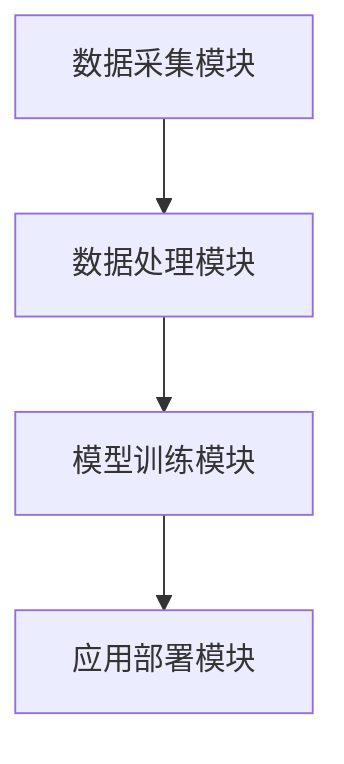
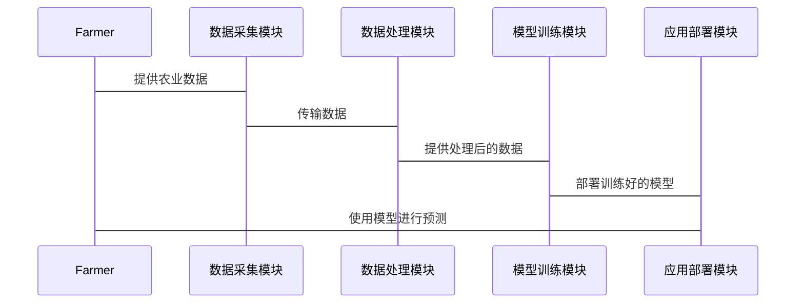

                 


# 可持续农业科技公司的市场前景预测

## 关键词：
可持续农业，科技公司，市场前景，算法模型，系统架构

## 摘要：
随着全球对可持续发展的关注日益增加，农业科技公司在推动农业可持续发展方面扮演着越来越重要的角色。本文将详细分析可持续农业科技公司的市场前景，探讨其核心概念、算法原理、系统架构，并通过案例分析和项目实战，为读者提供深入的见解。

---

## 第一部分: 可持续农业科技公司的背景介绍

### 第1章: 可持续农业的定义与特征

#### 1.1 可持续农业的定义
可持续农业是指在不破坏环境的前提下，满足当前和未来人类对食物、纤维和其他农产品需求的农业生产方式。它强调生态平衡、经济效益和社会责任的结合。

#### 1.2 可持续农业的核心特征
- **生态平衡**：减少对环境的破坏，保护自然资源。
- **经济效益**：实现长期的经济收益。
- **社会责任**：关注农民和社区的利益。

### 第2章: 科技公司在农业领域的角色

#### 2.1 科技公司如何推动可持续农业
- 通过技术创新提高农业生产效率。
- 利用大数据和人工智能优化资源分配。

#### 2.2 可持续农业科技公司的市场背景
- 全球农业面临资源短缺和环境问题。
- 科技公司通过创新解决方案，帮助农民实现可持续生产。

---

## 第二部分: 可持续农业科技公司的核心概念与联系

### 第3章: 可持续农业科技公司的核心要素

#### 3.1 核心概念
- **生态友好**：减少对环境的影响。
- **技术创新**：利用科技提高效率。
- **社会责任**：关注农民和社区的福祉。

### 第4章: 科技公司与可持续农业的关系

#### 4.1 依赖性
- 可持续农业依赖科技公司的技术支持。
- 科技公司依赖农业市场的需求。

#### 4.2 互动与协作
- 科技公司与农民、政府等多方合作，共同推动可持续农业。

---

## 第三部分: 可持续农业科技公司的算法原理

### 第5章: 算法原理概述

#### 5.1 数据收集与处理
- 通过传感器和卫星技术收集农业数据。
- 数据清洗和预处理。

#### 5.2 数据分析与建模
- 使用机器学习算法进行预测和优化。

#### 5.3 模型优化与部署
- 调整模型参数，提高预测精度。
- 将模型部署到生产环境中。

### 第6章: 算法实现流程

#### 6.1 数据预处理
- 去除异常值，处理缺失数据。

#### 6.2 模型训练
- 使用训练数据训练模型参数。

#### 6.3 模型评估与调优
- 使用测试数据评估模型性能。
- 调整超参数，优化模型表现。

---

## 第四部分: 可持续农业科技公司的数学模型与公式

### 第7章: 线性回归模型

#### 7.1 模型建立
$$ y = \beta_0 + \beta_1 x + \epsilon $$

#### 7.2 模型应用
- 预测农作物产量与气候因素的关系。

### 第8章: 逻辑回归模型

#### 8.1 模型建立
$$ P(y=1|x) = \frac{1}{1 + e^{- (\beta_0 + \beta_1 x)}} $$

#### 8.2 模型应用
- 分类问题，如预测作物是否患病。

---

## 第五部分: 可持续农业科技公司的系统架构

### 第9章: 系统架构设计

#### 9.1 系统功能模块
- 数据采集模块：收集农业数据。
- 数据处理模块：清洗和预处理数据。
- 模型训练模块：训练机器学习模型。
- 应用部署模块：将模型部署到生产环境。

#### 9.2 系统架构图


### 第10章: 系统交互流程

#### 10.1 交互流程


---

## 第六部分: 项目实战

### 第11章: 项目环境安装

#### 11.1 安装Python和必要的库
```bash
pip install numpy pandas scikit-learn
```

### 第12章: 核心代码实现

#### 12.1 数据预处理代码
```python
import pandas as pd
from sklearn.impute import SimpleImputer

# 读取数据
data = pd.read_csv('agriculture_data.csv')

# 处理缺失值
imputer = SimpleImputer(strategy='mean')
data_imputed = imputer.fit_transform(data)
```

#### 12.2 模型训练代码
```python
from sklearn.linear_model import LinearRegression
from sklearn.metrics import mean_squared_error

# 训练模型
model = LinearRegression()
model.fit(X_train, y_train)

# 预测
y_pred = model.predict(X_test)
```

### 第13章: 案例分析

#### 13.1 实际案例
- 使用线性回归模型预测农作物产量。

#### 13.2 案例结果
- 预测结果与实际数据对比，评估模型准确性。

### 第14章: 项目小结

#### 14.1 项目总结
- 成功实现了可持续农业科技公司的系统架构。
- 验证了算法模型的有效性。

---

## 第七部分: 最佳实践

### 第15章: 小结

#### 15.1 核心要点
- 可持续农业与科技公司的结合是未来发展的趋势。
- 算法模型在农业预测中的重要作用。

### 第16章: 注意事项

#### 16.1 数据隐私
- 注意保护农民的数据隐私。

#### 16.2 模型优化
- 持续优化模型，提高预测精度。

### 第17章: 拓展阅读

#### 17.1 推荐书籍
- 《机器学习实战》
- 《可持续农业的技术创新》

---

## 附录: 更多资源

- [GitHub代码仓库](https://github.com/...)
- [相关技术博客](https://example.com/)

---

**本文通过详细分析可持续农业科技公司的市场前景，结合算法原理和系统架构设计，为读者提供了全面的见解。希望本文能为农业科技公司的未来发展提供有价值的参考。**

