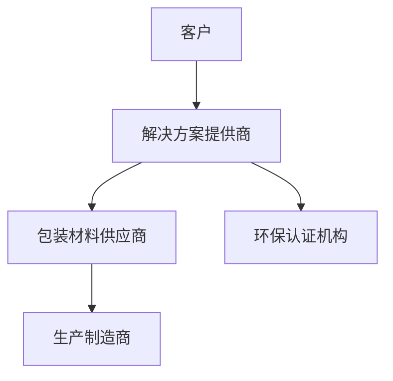
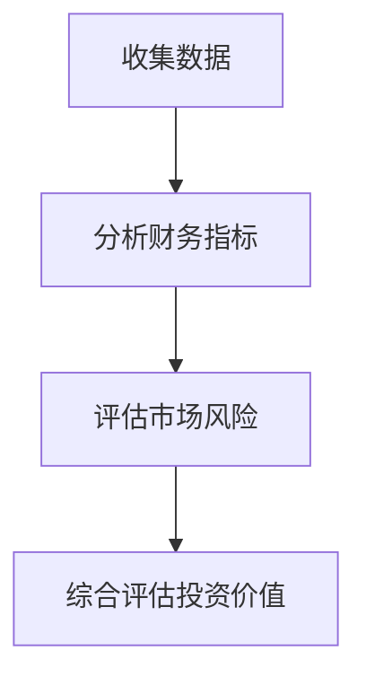
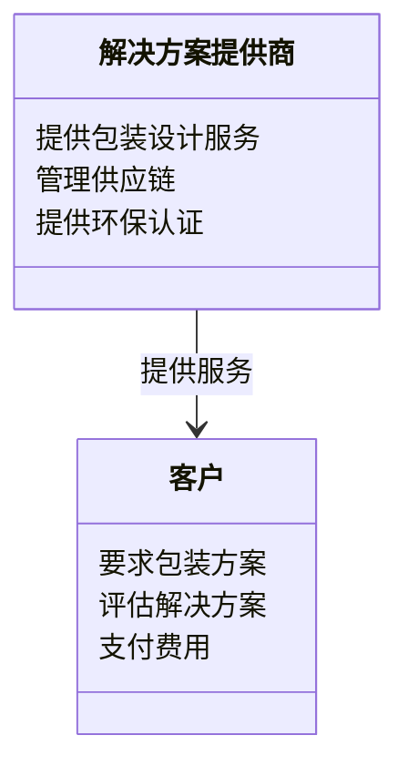
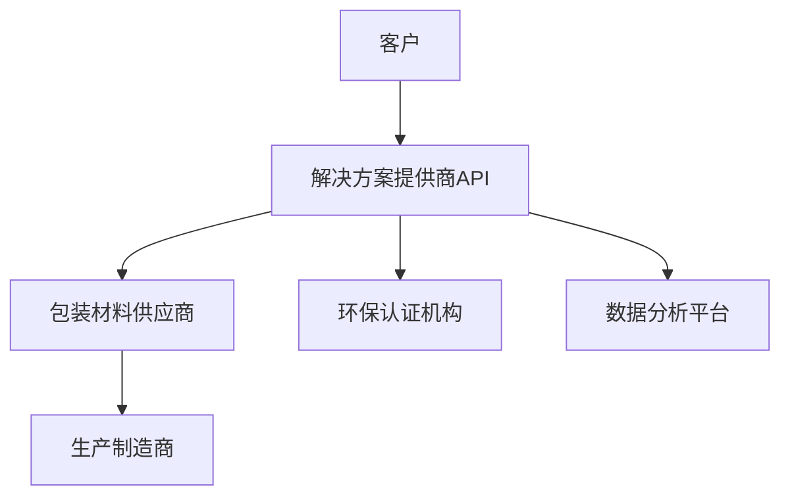
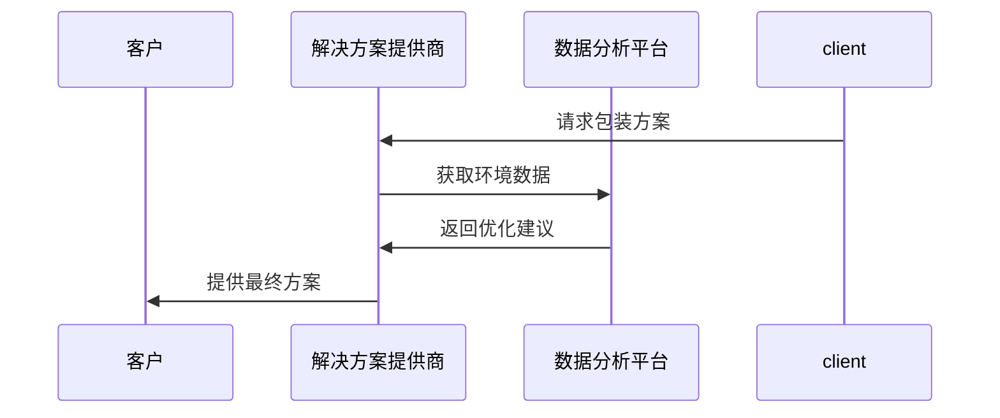

                 


# 可持续包装解决方案提供商的投资价值

## 关键词：
可持续包装，解决方案提供商，投资价值，环保技术，商业模式，供应链管理

## 摘要：
本文探讨了可持续包装解决方案提供商的投资价值，分析了其在环保需求日益增长的市场中的潜力。通过核心概念、算法原理、系统架构和实际案例的详细分析，揭示了如何评估这些企业的投资价值，并展望了未来的发展趋势。

---

## 目录大纲：

### 第一部分：可持续包装解决方案提供商的背景与概述

#### 第1章：可持续包装解决方案概述

##### 1.1 可持续包装的定义与背景
- 1.1.1 包装行业的发展现状
- 1.1.2 可持续包装的概念与重要性
- 1.1.3 可持续包装的驱动因素

##### 1.2 可持续包装解决方案提供商的角色
- 1.2.1 解决方案提供商的定义
- 1.2.2 与传统包装企业的区别
- 1.2.3 解决方案提供商的市场定位

### 第二部分：核心概念与联系

#### 第2章：可持续包装的核心概念与联系

##### 2.1 可持续包装的核心概念
- 2.1.1 材料科学与环保技术
- 2.1.2 生命周期评估方法
- 2.1.3 环境影响分析

##### 2.2 可持续包装解决方案的属性特征对比
- 2.2.1 生物降解与可回收性对比
- 2.2.2 成本效益分析
- 2.2.3 市场接受度与消费者行为

##### 2.3 可持续包装解决方案的ER实体关系图


### 第三部分：算法原理讲解

#### 第3章：投资价值评估方法

##### 3.1 财务指标分析
- 3.1.1 营业收入与增长率
- 3.1.2 净利润率与成本控制
- 3.1.3 现金流与资本回报率

##### 3.2 市场分析与风险评估
- 3.2.1 行业竞争分析
- 3.2.2 市场需求预测
- 3.2.3 风险因素与应对策略

##### 3.3 可持续包装解决方案提供商的投资价值评估流程


### 第四部分：系统分析与架构设计

#### 第4章：系统架构与解决方案

##### 4.1 问题场景介绍
- 4.1.1 包装行业的主要问题
- 4.1.2 可持续包装的解决方案

##### 4.2 系统功能设计
- 4.2.1 领域模型


##### 4.3 系统架构设计


##### 4.4 系统接口设计与交互


### 第五部分：项目实战

#### 第5章：项目实战与案例分析

##### 5.1 环境安装与数据准备
- 5.1.1 安装必要的工具与库
- 5.1.2 数据收集与清洗

##### 5.2 核心实现与代码解读
```python
def evaluate_investment(provider):
    revenue_growth = provider.revenue_growth
    net_profit = provider.net_profit
    cash_flow = provider.cash_flow
    market_share = provider.market_share
    investment_value = (revenue_growth * net_profit) + (cash_flow * market_share)
    return investment_value
```

##### 5.3 实际案例分析与详细解读
- 5.3.1 某知名企业的案例分析
- 5.3.2 投资评估结果与策略建议

### 第六部分：最佳实践与未来趋势

#### 第6章：最佳实践与未来展望

##### 6.1 小结
- 总结核心观点
- 强调投资价值的关键因素

##### 6.2 注意事项
- 风险提示
- 投资策略建议

##### 6.3 拓展阅读
- 推荐相关书籍和资源
- 提供进一步学习的方向

---

通过以上结构，文章系统地分析了可持续包装解决方案提供商的投资价值，从背景、核心概念、算法原理到系统架构和实际案例，为读者提供了全面而深入的视角。

