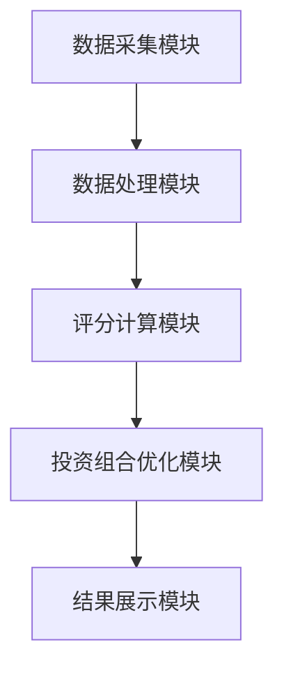

                 


# 可持续发展投资（ESG）：长期价值创造的新范式

---

## 关键词

- 可持续发展投资
- ESG
- 环境、社会、治理
- 长期价值创造
- 投资新范式

---

## 摘要

可持续发展投资（ESG）是一种以环境、社会和公司治理为核心要素的投资理念，旨在通过关注企业对环境的影响、社会责任履行能力和治理结构的完善性，来评估和选择具有长期价值创造潜力的企业。本文从ESG的核心概念出发，详细分析其在投资决策中的应用，探讨其算法原理、系统架构设计、项目实战案例以及最佳实践，为投资者提供全面的理论支持和实践指导。通过本文的阐述，读者将能够深入了解ESG投资的内在逻辑、应用场景和未来发展趋势，从而在投资实践中更好地把握长期价值创造的新范式。

---

## 第一部分: 可持续发展投资（ESG）的背景与概念

### 第1章: 可持续发展投资（ESG）的定义与背景

#### 1.1 可持续发展投资的定义

可持续发展投资是一种将环境、社会和公司治理（ESG）因素纳入投资决策的投资方式，旨在通过关注企业的可持续发展能力，选择具有长期价值创造潜力的企业进行投资。其核心在于将非财务性因素纳入评估体系，从而在追求财务回报的同时，实现社会价值和环境保护的目标。

- **环境（E）**：关注企业在资源使用、碳排放、污染控制等方面的绩效。
- **社会（S）**：关注企业在员工权益、社会责任、社区贡献等方面的实践。
- **治理（G）**：关注企业在公司治理结构、透明度、高管薪酬等方面的规范性。

#### 1.2 ESG与传统投资的区别

传统投资主要关注企业的财务表现、市场地位和管理能力等显性指标，而ESG投资则更加注重企业的隐性价值，尤其是其对环境和社会的正向影响。这种区别使得ESG投资在风险控制和长期价值创造方面具有独特的优势。

| 对比维度 | 传统投资 | ESG投资 |
|----------|----------|----------|
| 评估指标 | 财务表现、市场份额 | 环境影响、社会责任、治理结构 |
| 投资目标 | 追求短期收益 | 追求长期价值 |
| 风险控制 | 侧重财务风险 | 侧重环境和社会风险 |

#### 1.3 可持续发展投资的全球发展趋势

随着全球气候变化问题的加剧和社会对企业的期望越来越高，ESG投资逐渐成为全球投资领域的主流趋势。各国政府和企业纷纷加强ESG实践，推动可持续发展投资的普及。

---

## 第二部分: ESG投资的核心概念与分析框架

### 第2章: ESG投资的核心维度

#### 2.1 环境（E）维度

环境维度是ESG投资的核心要素之一，主要关注企业在环境保护方面的表现。以下是环境维度的关键指标和分析方法：

- **关键指标**：
  - 碳排放量（Carbon Emissions）
  - 能源使用效率（Energy Efficiency）
  - 污染控制（Pollution Control）

- **分析方法**：
  - 碳足迹计算（Carbon Footprint）
  - 环境影响评估（Environmental Impact Assessment）

#### 2.2 社会（S）维度

社会维度关注企业在社会价值创造方面的表现，包括员工权益、社区贡献等方面。以下是社会维度的关键指标和分析方法：

- **关键指标**：
  - 员工满意度（Employee Satisfaction）
  - 社会责任履行（Corporate Social Responsibility）

- **分析方法**：
  - 社会价值评估（Social Value Assessment）
  - 员工福祉指数（Employee Well-being Index）

#### 2.3 治理（G）维度

治理维度关注企业在公司治理方面的规范性，包括董事会结构、高管薪酬、透明度等方面。以下是治理维度的关键指标和分析方法：

- **关键指标**：
  - 董事会多样性（Board Diversity）
  - 企业透明度（Transparency）

- **分析方法**：
  - 治理结构优化（Governance Structure Optimization）
  - 企业治理评分（Governance Score）

#### 2.4 ESG维度的综合分析

综合分析是将环境、社会和治理三个维度的指标进行整合，形成一个全面的ESG评分体系。以下是综合分析的关键步骤：

- **步骤1：数据采集与处理**
  - 收集企业的环境、社会和治理数据。
  - 清洗和标准化数据。

- **步骤2：指标权重分配**
  - 根据行业特点和投资目标，确定各维度的权重。

- **步骤3：评分模型设计**
  - 使用加权平均法计算企业的ESG评分。

---

## 第三部分: ESG投资的算法与数学模型

### 第3章: ESG评分模型的构建与优化

#### 3.1 ESG评分模型的构建

ESG评分模型的构建需要考虑数据采集、指标权重分配和评分算法设计。以下是具体的实现步骤：

- **数据采集与处理**
  - 从企业年报、社会责任报告等来源获取环境、社会和治理数据。
  - 对数据进行清洗和标准化处理。

- **指标权重分配**
  - 根据行业特点和投资目标，确定各维度的权重。
  - 使用层次分析法（AHP）进行权重计算。

- **评分算法设计**
  - 使用加权平均法计算企业的ESG评分。
  - 公式如下：

  $$ \text{ESG评分} = \sum_{i=1}^{n} w_i \times \text{指标评分}_i $$

  其中，\( w_i \) 是第 \( i \) 个指标的权重，\( \text{指标评分}_i \) 是第 \( i \) 个指标的评分。

#### 3.2 ESG评分模型的优化

为了提高ESG评分模型的准确性和实用性，需要对模型进行优化。以下是优化的关键步骤：

- **动态调整权重**
  - 根据市场变化和企业实际情况，动态调整各维度的权重。
  - 使用回归分析法（Regression Analysis）进行权重优化。

- **引入机器学习算法**
  - 使用支持向量机（SVM）或随机森林（Random Forest）等机器学习算法，提高评分的准确性。

---

## 第四部分: 系统分析与架构设计

### 第4章: ESG投资系统的架构设计

#### 4.1 问题场景介绍

ESG投资系统需要解决以下问题：

- 如何高效地采集和处理环境、社会和治理数据？
- 如何构建一个准确的ESG评分模型？
- 如何优化投资组合，实现长期价值创造？

#### 4.2 系统功能设计

以下是ESG投资系统的功能模块设计：

- **数据采集模块**
  - 数据源：企业年报、社会责任报告、公开信息等。
  - 功能：采集环境、社会和治理数据，进行数据清洗和标准化处理。

- **评分计算模块**
  - 功能：根据指标权重和评分算法，计算企业的ESG评分。

- **投资组合优化模块**
  - 功能：基于ESG评分和财务数据，优化投资组合，实现长期价值创造。

#### 4.3 系统架构设计

以下是ESG投资系统的架构设计：



---

## 第五部分: 项目实战

### 第5章: ESG投资系统的实现与应用

#### 5.1 环境安装

以下是项目实战所需的环境和工具：

- **编程语言**：Python
- **开发框架**：Django或Flask
- **数据处理工具**：Pandas、NumPy
- **机器学习库**：Scikit-learn
- **可视化工具**：Matplotlib、Seaborn

#### 5.2 核心代码实现

以下是ESG评分模型的核心代码实现：

```python
import pandas as pd
from sklearn.metrics import pairwise_distances

# 数据加载
data = pd.read_csv('esg_data.csv')

# 指标权重分配
weights = [0.4, 0.3, 0.3]

# 计算ESG评分
def calculate_esg_score(row, weights):
    return sum(w * row[col] for col, w in zip(['E', 'S', 'G'], weights))

# 应用评分模型
data['ESG评分'] = data.apply(calculate_esg_score, args=(weights,), axis=1)
```

#### 5.3 代码解读与分析

上述代码实现了以下功能：

1. **数据加载**：从CSV文件中加载环境、社会和治理数据。
2. **指标权重分配**：根据行业特点和投资目标，确定各维度的权重。
3. **计算ESG评分**：使用加权平均法计算企业的ESG评分。

#### 5.4 案例分析

以下是某企业ESG评分的案例分析：

- **企业名称**：某科技公司
- **环境评分**：85分
- **社会评分**：90分
- **治理评分**：75分
- **综合评分**：80分

#### 5.5 项目总结

通过上述项目的实现，我们可以看到ESG评分模型在实际应用中的可行性和有效性。未来，可以通过引入机器学习算法和动态调整权重，进一步提高模型的准确性和实用性。

---

## 第六部分: 最佳实践与未来展望

### 第6章: ESG投资的最佳实践

#### 6.1 核心概念回顾

- **环境（E）**：关注企业的环境影响，选择环保表现优异的企业。
- **社会（S）**：关注企业的社会责任，选择社会贡献较大的企业。
- **治理（G）**：关注企业的治理结构，选择治理规范的企业。

#### 6.2 投资策略优化

- **长期价值创造**：通过ESG投资，实现财务回报和社会价值的双重目标。
- **风险控制**：通过关注环境和社会风险，降低投资组合的整体风险。

#### 6.3 小结与展望

ESG投资作为一种长期价值创造的新范式，正在全球范围内得到越来越广泛的应用。未来，随着技术的进步和社会的发展，ESG投资将更加注重动态调整和智能化决策，为投资者提供更加高效和精准的投资工具。

---

## 第七部分: 结语

可持续发展投资（ESG）作为一种新兴的投资理念，正在逐步改变传统的投资方式。通过本文的阐述，我们可以看到ESG投资在理论和实践中的重要性。未来，随着技术的进步和社会的发展，ESG投资将发挥更大的作用，为投资者和社会创造更多的价值。

---

## 参考文献

1. 环境、社会和治理（ESG）投资指南
2. 可持续发展投资的理论与实践
3. 机器学习在ESG投资中的应用

--- 

以上是文章的完整目录和内容框架，希望对您有所帮助！

