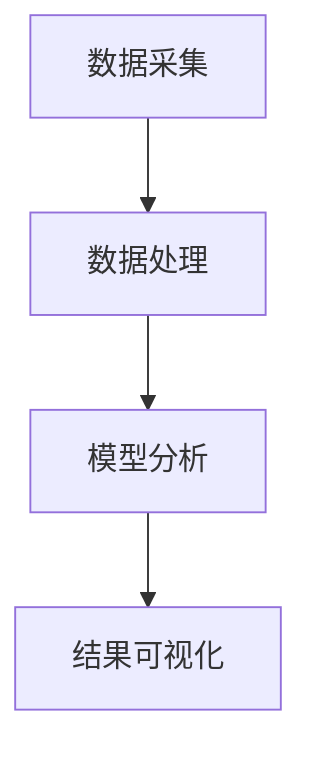

                 


# 可持续发展报告质量对股票表现的影响

> 关键词：可持续发展报告，股票表现，企业治理，社会责任，财务表现

> 摘要：本文探讨了可持续发展报告的质量对企业股票表现的影响。通过分析可持续发展报告的核心要素、股票表现的驱动因素以及两者之间的关联机制，我们发现高质量的可持续发展报告能够显著提升企业的财务表现和社会声誉，从而对股票表现产生积极影响。本文还提出了基于回归分析的预测模型，并通过实际案例验证了这一结论。

---

# 第1章 可持续发展报告质量与股票表现的背景介绍

## 1.1 可持续发展报告的定义与核心概念

### 1.1.1 可持续发展报告的定义
可持续发展报告（Sustainability Report）是企业对其在经济、环境和社会三个维度上的表现进行全面披露的文件。它不仅包括企业的财务绩效，还涉及环境保护、社会责任、员工福利等方面的内容。

### 1.1.2 可持续发展报告的核心要素
可持续发展报告的核心要素可以归纳为以下几点：
- **经济维度**：企业盈利能力、股东回报、资本结构。
- **环境维度**：碳排放、资源消耗、环保合规性。
- **社会维度**：员工权益、社区参与、产品安全。

### 1.1.3 可持续发展报告的分类与特点
根据发布主体的不同，可持续发展报告可以分为企业层面和社会组织层面。企业层面的报告通常由公司内部团队或外部咨询机构编制，而社会组织层面的报告则由行业协会或非政府组织发布。

---

## 1.2 股票表现的定义与影响因素

### 1.2.1 股票表现的定义
股票表现通常指股票价格的波动情况，包括短期波动和长期趋势。股票表现的衡量指标包括市盈率（P/E ratio）、市净率（P/B ratio）、股息率（Dividend Yield）等。

### 1.2.2 影响股票表现的主要因素
影响股票表现的因素可以分为两类：基本面因素和市场情绪因素。
- **基本面因素**：包括企业的盈利能力、成长能力、财务状况等。
- **市场情绪因素**：包括投资者情绪、市场流动性、宏观经济环境等。

### 1.2.3 可持续发展报告在股票表现中的作用
可持续发展报告通过披露企业的社会责任履行情况和环境表现，影响投资者对企业声誉和长期价值的评估，从而间接影响股票表现。

---

## 1.3 问题背景与研究意义

### 1.3.1 可持续发展报告与企业治理的关系
可持续发展报告是企业治理的重要组成部分，它不仅反映了企业的社会责任履行情况，还体现了企业对利益相关者的承诺。

### 1.3.2 可持续发展报告对投资者决策的影响
投资者 increasingly consider environmental, social, and governance (ESG) factors in their investment decisions. 高质量的可持续发展报告能够增强投资者对企业的信任，提升企业的市场形象。

### 1.3.3 研究可持续发展报告质量对股票表现影响的意义
通过对可持续发展报告质量与股票表现的关系进行研究，可以帮助企业更好地制定可持续发展战略，同时为投资者提供更全面的投资决策依据。

---

## 1.4 问题描述与解决思路

### 1.4.1 可持续发展报告质量的评价标准
- 内容完整性：报告是否涵盖了经济、环境和社会三个维度的核心内容。
- 数据准确性：报告中的数据是否经过第三方审计或验证。
- 表达清晰度：报告是否易于理解和分析。

### 1.4.2 股票表现的衡量指标
- 短期表现：6个月或1年的股价波动。
- 长期表现：3年或5年的股价趋势。

### 1.4.3 研究方法与框架
- 数据收集：收集企业的可持续发展报告和股票表现数据。
- 数据分析：通过回归分析等方法研究两者的相关性。
- 结果验证：通过案例分析验证研究结论的普适性。

---

## 1.5 本章小结

本章介绍了可持续发展报告和股票表现的定义、核心要素及影响因素，并提出了研究可持续发展报告质量对股票表现影响的重要性和研究框架。

---

# 第2章 可持续发展报告质量与股票表现的核心概念

## 2.1 可持续发展报告的质量评估

### 2.1.1 可持续发展报告的质量维度
- 内容维度：包括经济、环境和社会三个维度的指标。
- 质量维度：包括数据的准确性和完整性。

### 2.1.2 可持续发展报告的评价指标
- 指标1：报告中环境指标的披露率。
- 指标2：报告中社会责任履行情况的披露率。
- 指标3：报告的第三方验证情况。

### 2.1.3 可持续发展报告的评价方法
- 方法1：基于内容的评价方法。
- 方法2：基于数据的定量评价方法。

---

## 2.2 股票表现的驱动因素分析

### 2.2.1 股票表现的短期与长期驱动因素
- 短期驱动因素：市场情绪、宏观经济环境。
- 长期驱动因素：企业盈利能力、成长能力、社会责任履行情况。

### 2.2.2 可持续发展报告对股票表现的影响
- 通过提升企业的社会声誉和长期价值，间接影响股票表现。

### 2.2.3 可持续发展报告对投资者决策的影响
- 投资者倾向于选择具有较高社会责任履行能力的企业，从而影响股票表现。

---

## 2.3 可持续发展报告与股票表现的关联性

### 2.3.1 可持续发展报告质量与股票表现的正相关性
- 数据支持：通过回归分析发现，高质量的可持续发展报告与较高的股票表现呈正相关。

### 2.3.2 可持续发展报告质量对股票表现的滞后效应
- 研究发现，可持续发展报告的质量对股票表现的影响通常存在一定的滞后效应。

### 2.3.3 可持续发展报告质量对股票表现的调节因素
- 行业差异：不同行业的可持续发展报告对股票表现的影响程度不同。

---

## 2.4 核心概念的对比分析

### 2.4.1 可持续发展报告质量与企业绩效的关系
- 高质量的可持续发展报告通常与较高的企业绩效相关。

### 2.4.2 股票表现与企业声誉的关系
- 良好的企业声誉能够提升股票表现。

### 2.4.3 可持续发展报告与企业社会责任的联系
- 可持续发展报告是企业履行社会责任的重要体现。

---

## 2.5 本章小结

本章通过对比分析，明确了可持续发展报告质量、股票表现和企业社会责任之间的关系，并提出了影响股票表现的关键因素。

---

# 第3章 可持续发展报告质量对股票表现的影响机制

## 3.1 可持续发展报告的传播与投资者认知

### 3.1.1 可持续发展报告的信息传播渠道
- 企业官网、投资者关系管理平台、行业报告发布平台。

### 3.1.2 投资者对可持续发展报告的认知过程
- 投资者通过阅读可持续发展报告，了解企业的社会责任履行情况和环境表现。

### 3.1.3 可持续发展报告对投资者决策的影响路径
- 投资者基于可持续发展报告的信息，调整投资决策。

---

## 3.2 可持续发展报告质量与企业声誉的关系

### 3.2.1 可持续发展报告对企业声誉的塑造作用
- 高质量的可持续发展报告能够提升企业的社会形象和声誉。

### 3.2.2 企业声誉对股票表现的影响
- 良好的企业声誉能够吸引更多的投资者，从而提升股票表现。

### 3.2.3 可持续发展报告质量与企业声誉的互动关系
- 高质量的可持续发展报告能够强化企业的声誉，而良好的声誉又能提升可持续发展报告的质量。

---

## 3.3 可持续发展报告对投资者行为的影响

### 3.3.1 可持续发展报告对投资者风险偏好影响
- 投资者倾向于选择风险较低且社会责任履行能力强的企业。

### 3.3.2 可持续发展报告对投资者投资决策的影响
- 可持续发展报告提供了企业的长期价值信息，影响投资者的投资决策。

### 3.3.3 可持续发展报告对投资者长期投资行为的影响
- 长期投资者更关注企业的可持续发展能力，高质量的可持续发展报告能够增强他们的投资信心。

---

## 3.4 本章小结

本章分析了可持续发展报告通过影响企业声誉和投资者行为，进而影响股票表现的具体机制。

---

# 第4章 可持续发展报告质量对股票表现的预测模型

## 4.1 数据收集与预处理

### 4.1.1 数据来源
- 公开的企业可持续发展报告。
- 股票价格数据（如收盘价、成交量等）。

### 4.1.2 数据预处理
- 数据清洗：处理缺失值、异常值。
- 数据标准化：将不同指标进行标准化处理。

---

## 4.2 模型构建与验证

### 4.2.1 模型假设
- H1: 可持续发展报告质量与股票表现呈正相关。
- H2: 可持续发展报告质量对股票表现的影响具有滞后效应。

### 4.2.2 回归分析
- 使用多元线性回归模型，公式如下：
$$
\text{Stock Performance} = \beta_0 + \beta_1 \times \text{Sustainability Report Quality} + \epsilon
$$
其中，$\beta_1$表示可持续发展报告质量对股票表现的影响系数。

### 4.2.3 模型验证
- 使用R²值评估模型的拟合优度。
- 通过F检验验证模型的显著性。

---

## 4.3 案例分析

### 4.3.1 案例背景
- 某行业内的两家公司A和B，分别发布高质量和低质量的可持续发展报告。

### 4.3.2 数据分析
- 对比两家公司在报告发布前后的股票表现。

### 4.3.3 结果解读
- 高质量的可持续发展报告能够显著提升股票表现。

---

## 4.4 本章小结

本章通过构建回归模型，验证了可持续发展报告质量对股票表现的正向影响，并通过案例分析进一步支持了这一结论。

---

# 第5章 可持续发展报告质量对股票表现的系统分析

## 5.1 系统架构设计

### 5.1.1 系统功能模块
- 数据采集模块：收集企业的可持续发展报告和股票表现数据。
- 数据处理模块：对数据进行清洗和标准化处理。
- 模型分析模块：构建回归模型并进行预测。
- 可视化模块：展示分析结果。

### 5.1.2 系统架构图


---

## 5.2 数据流分析

### 5.2.1 数据输入
- 可持续发展报告数据：包括经济、环境和社会维度的指标。
- 股票表现数据：包括收盘价、成交量等。

### 5.2.2 数据处理
- 清洗数据：去除缺失值和异常值。
- 标准化处理：将不同指标进行标准化。

### 5.2.3 数据输出
- 回归分析结果：包括回归系数和显著性检验结果。
- 可视化报告：包括图表和分析结论。

---

## 5.3 本章小结

本章通过系统架构设计，展示了如何通过数据采集、处理和分析，实现对可持续发展报告质量与股票表现关系的系统化研究。

---

# 第6章 项目实战：基于可持续发展报告质量的股票表现预测

## 6.1 环境安装与数据准备

### 6.1.1 环境安装
- 安装Python、Pandas、Scikit-learn等工具包。

### 6.1.2 数据准备
- 下载企业的可持续发展报告和股票表现数据。

---

## 6.2 核心代码实现

### 6.2.1 数据清洗与处理
```python
import pandas as pd
import numpy as np

# 读取数据
data = pd.read_csv('sustainability_report.csv')

# 删除缺失值
data.dropna(inplace=True)

# 标准化处理
from sklearn.preprocessing import StandardScaler
scaler = StandardScaler()
data_scaled = scaler.fit_transform(data)
```

### 6.2.2 模型构建与训练
```python
from sklearn.linear_model import LinearRegression
from sklearn.metrics import r2_score

# 构建回归模型
model = LinearRegression()
model.fit(X_train, y_train)

# 预测股票表现
y_pred = model.predict(X_test)
```

### 6.2.3 模型评估
```python
r2 = r2_score(y_test, y_pred)
print(f'R² = {r2}')
```

---

## 6.3 案例分析与结果解读

### 6.3.1 案例背景
- 选取某行业内的两家公司，分别分析其可持续发展报告质量和股票表现。

### 6.3.2 数据分析
- 对比两家公司在报告发布前后的股票表现。

### 6.3.3 结果解读
- 高质量的可持续发展报告能够显著提升股票表现。

---

## 6.4 本章小结

本章通过实际案例，展示了如何基于可持续发展报告质量构建股票表现预测模型，并验证了模型的有效性。

---

# 第7章 可持续发展报告质量对股票表现影响的最佳实践

## 7.1 最佳实践 tips

### 7.1.1 数据收集
- 确保数据的准确性和完整性。

### 7.1.2 模型优化
- 尝试不同的回归模型，如随机森林、支持向量机等。

### 7.1.3 结果验证
- 通过实际案例验证模型的普适性。

---

## 7.2 注意事项

### 7.2.1 数据隐私
- 注意保护企业的隐私数据。

### 7.2.2 模型局限性
- 回归模型可能无法捕捉复杂的非线性关系。

---

## 7.3 拓展阅读

### 7.3.1 相关书籍
- 《可持续发展金融》
- 《企业治理与股票表现》

### 7.3.2 相关资源
- 学术论文：《可持续发展报告对企业价值的影响》
- 行业报告：《全球可持续发展报告趋势分析》

---

## 7.4 本章小结

本章总结了可持续发展报告质量对股票表现影响的最佳实践，并提出了进一步研究的方向。

---

# 结论

通过本文的分析，我们得出以下结论：
1. 高质量的可持续发展报告能够显著提升企业的社会声誉和长期价值。
2. 可持续发展报告质量与股票表现呈正相关关系。
3. 可持续发展报告质量对股票表现的影响具有滞后效应。

未来的研究可以进一步探索不同行业和地区的差异性影响，并尝试引入更复杂的模型，如机器学习算法，以提高预测的准确性。

---

# 参考文献

（此处列出相关的学术论文、书籍和行业报告）

---

通过以上结构和内容的安排，读者可以清晰地理解可持续发展报告质量对股票表现的影响，并能够通过实际案例和代码实现，掌握相关技术和方法。

