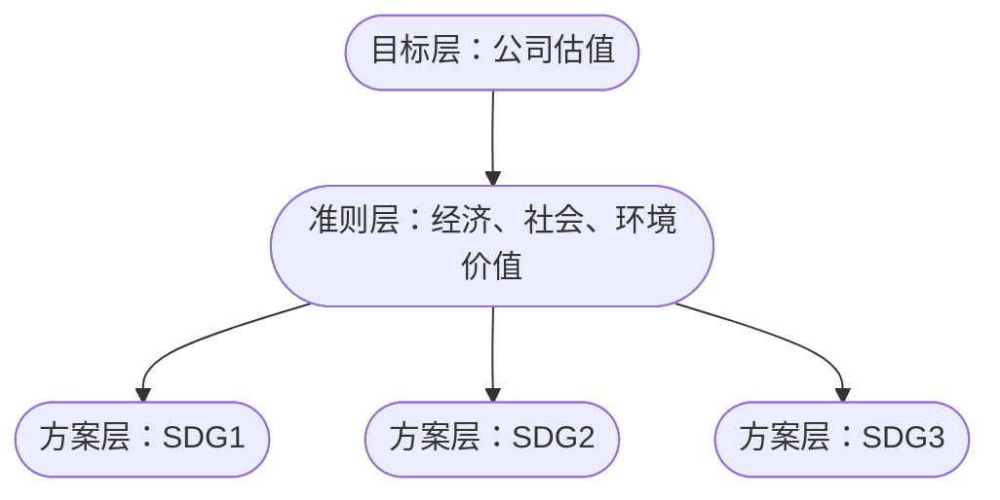
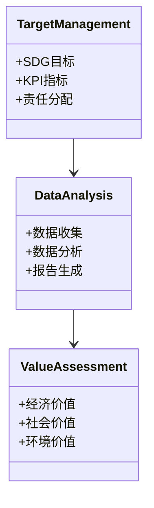

                 


# 可持续发展目标对公司估值的长期影响

## 关键词：
- 可持续发展目标
- 公司估值
- 长期影响
- 经济价值
- 社会价值
- 环境价值
- 可持续发展

## 摘要：
可持续发展目标（SDGs）是全球关注的焦点，对企业长期发展和公司估值具有深远影响。本文从SDGs的核心概念出发，分析其对公司估值的经济、社会和环境价值的影响，探讨SDGs与公司治理的关系，构建影响评估模型，并通过案例分析和系统设计，提供实际应用的指导。最终得出结论：SDGs不仅是社会责任，更是提升公司长期价值的关键因素。

---

# 第一部分：可持续发展目标的背景与概念

## 第1章：可持续发展目标的核心概念

### 1.1 可持续发展目标的定义与内涵

#### 1.1.1 可持续发展目标的基本概念
可持续发展目标（Sustainable Development Goals, SDGs）是联合国提出的17个全球目标，涵盖经济、社会和环境三个方面。SDGs旨在指导各国在2030年前实现消除贫困、保护地球和促进繁荣的目标。

$$SDGs = \{Goal_1, Goal_2, ..., Goal_{17}\}$$

例如，Goal 3是“确保健康的生活方式，促进各年龄段人群的福祉”。

#### 1.1.2 可持续发展目标的核心内涵
SDGs强调三重底线：**People（人）**、**Planet（地球）**和**Profit（利润）**。公司通过实现SDGs，不仅创造经济价值，还能提升社会和环境价值。

#### 1.1.3 可持续发展目标的分类与层次
SDGs分为三个层次：**全球目标**（如消除贫困）、**行业目标**（如清洁饮水）和**企业目标**（如减少碳排放）。企业可以根据自身业务选择相关目标。

### 1.2 可持续发展目标与公司治理的关系

#### 1.2.1 可持续发展目标对公司治理的影响
SDGs要求公司在决策中考虑社会和环境因素，影响公司治理的透明度和责任感。例如，公司治理需要将SDGs纳入战略规划。

#### 1.2.2 公司治理在实现可持续发展目标中的作用
公司治理通过制定政策、分配资源和监控进展，推动SDGs的实现。例如，董事会负责制定SDG战略，管理层负责执行。

#### 1.2.3 可持续发展目标与公司战略的结合
公司将SDGs融入长期战略，通过创新和合作实现目标。例如，企业与非政府组织合作，共同推动环境保护目标。

### 1.3 可持续发展目标的长期影响

#### 1.3.1 可持续发展目标对社会价值的影响
SDGs提升公司品牌形象，增强客户忠诚度。例如，企业通过减少碳排放，提升社会声誉。

#### 1.3.2 可持续发展目标对经济价值的影响
SDGs降低风险，创造新市场机会。例如，绿色能源企业通过技术创新降低成本，提高竞争力。

#### 1.3.3 可持续发展目标对环境价值的影响
SDGs保护环境资源，减少环境风险。例如，企业减少塑料使用，降低环境负担。

### 1.4 本章小结
SDGs不仅是全球目标，更是公司长期发展的关键因素。通过实现SDGs，公司可以提升经济、社会和环境价值，增强竞争力和品牌价值。

---

## 第2章：可持续发展目标与公司估值的理论基础

### 2.1 可持续发展目标的经济价值分析

#### 2.1.1 可持续发展目标对经济价值的贡献
SDGs通过降低成本、提高效率和开拓市场，增加公司经济价值。例如，节能技术降低运营成本。

#### 2.1.2 可持续发展目标对投资价值的影响
投资者倾向于投资符合SDGs的企业，提升公司市值。例如，环保企业吸引更多ESG投资者。

#### 2.1.3 可持续发展目标对股东价值的影响
SDGs提升股东回报，减少风险。例如，可持续企业股票表现优于传统企业。

### 2.2 可持续发展目标的社会价值分析

#### 2.2.1 可持续发展目标对社会价值的贡献
SDGs提升公司社会形象，增强员工忠诚度。例如，企业参与教育项目，提升社会责任感。

#### 2.2.2 可持续发展目标对品牌价值的影响
SDGs增强品牌认知度和忠诚度。例如，可持续时尚品牌吸引更多消费者。

#### 2.2.3 可持续发展目标对员工价值的影响
SDGs提升员工满意度和归属感。例如，公司提供公平的工作环境，增强员工幸福感。

### 2.3 可持续发展目标的环境价值分析

#### 2.3.1 可持续发展目标对环境价值的贡献
SDGs减少环境破坏，提升生态系统价值。例如，企业采用可再生能源，降低碳排放。

#### 2.3.2 可持续发展目标对资源利用效率的影响
SDGs优化资源使用，降低浪费。例如，企业采用循环经济模式，减少资源消耗。

#### 2.3.3 可持续发展目标对环境风险的降低
SDGs减少环境风险，提升企业稳定性。例如，企业减少污染，降低法律风险。

### 2.4 本章小结
SDGs通过经济、社会和环境三方面提升公司价值，增强长期竞争力。

---

## 第3章：可持续发展目标影响公司估值的分析模型

### 3.1 可持续发展目标影响公司估值的层次分析

#### 3.1.1 分析模型的构建
层次分析模型（AHP）用于评估SDGs对估值的影响。模型分为目标层、准则层和方案层。



#### 3.1.2 分析模型的假设条件
假设公司选择与业务相关的SDGs，且目标影响可量化。

#### 3.1.3 分析模型的验证与优化
通过实际数据验证模型，并根据反馈优化权重。

### 3.2 可持续发展目标影响公司估值的数学模型

#### 3.2.1 数学模型的构建
使用线性回归模型评估SDGs对估值的影响：

$$Valuation = \beta_0 + \beta_1SDG_1 + \beta_2SDG_2 + ... + \beta_nSDG_n + \epsilon$$

#### 3.2.2 数学模型的参数设定
$\beta$表示各SDG对估值的权重，$\epsilon$为误差项。

#### 3.2.3 数学模型的验证与应用
通过历史数据验证模型，并应用于预测。

### 3.3 本章小结
层次分析和回归模型为SDGs对估值的影响提供了科学依据。

---

## 第4章：可持续发展目标的案例分析

### 4.1 可持续发展目标的行业案例分析

#### 4.1.1 科技行业案例：科技企业的SDG实践
例如，谷歌通过可再生能源项目实现SDG7，提升品牌形象。

#### 4.1.2 能源行业案例：能源企业的SDG实践
例如，壳牌通过减少碳排放实现SDG13，提升环境价值。

#### 4.1.3 制造业案例：制造企业的SDG实践
例如，特斯拉通过生产电动汽车实现SDG12，推动可持续发展。

### 4.2 可持续发展目标的失败教训

#### 4.2.1 某公司未能有效实现SDG的案例
例如，某公司虚假宣传环保成就，导致品牌形象受损。

#### 4.2.2 可持续发展失败的原因分析
资源不足、缺乏战略规划、利益相关者协调不力。

### 4.3 本章小结
成功案例证明SDGs对估值的积极影响，失败案例提醒企业重视实施过程。

---

## 第5章：可持续发展目标的系统设计

### 5.1 可持续发展目标的系统分析与架构设计

#### 5.1.1 系统功能设计
领域模型包括目标管理、数据分析和价值评估模块。



#### 5.1.2 系统架构设计
采用微服务架构，包括数据采集、分析和可视化模块。


### 5.2 可持续发展目标的系统实现

#### 5.2.1 环境配置
安装Python、Pandas、Matplotlib等工具。

#### 5.2.2 核心代码实现
实现数据分析和价值评估的代码。

```python
import pandas as pd
import numpy as np

# 数据预处理
data = pd.read_csv('SDG_data.csv')
data_clean = data.dropna()

# 模型训练
from sklearn.linear_model import LinearRegression
model = LinearRegression()
model.fit(data_clean[['SDG1', 'SDG2']], data_clean['Valuation'])

# 结果可视化
import matplotlib.pyplot as plt
plt.scatter(data_clean['Valuation'], model.predict(data_clean[['SDG1', 'SDG2']]))
plt.xlabel('实际估值')
plt.ylabel('预测估值')
plt.show()
```

#### 5.2.3 代码解读与分析
代码实现数据预处理、模型训练和结果可视化，展示SDGs对估值的影响。

### 5.3 本章小结
系统设计为SDGs的实施提供了技术支持，帮助企业有效评估和提升估值。

---

## 第6章：可持续发展目标的项目实战

### 6.1 项目背景介绍
假设某科技公司计划实现SDG9（工业创新）和SDG12（负责任消费）。

### 6.2 项目核心实现

#### 6.2.1 环境配置
安装Python、Flask框架和相关库。

#### 6.2.2 核心代码实现
实现SDG项目管理的Web界面。

```python
from flask import Flask, render_template, request
import pandas as pd

app = Flask(__name__)

@app.route('/')
def home():
    return render_template('index.html')

@app.route('/submit', methods=['POST'])
def submit():
    data = request.form.to_dict()
    # 数据处理
    return "SDG项目提交成功！"
```

#### 6.2.3 代码应用解读
代码实现项目管理功能，包括目标设定和进度跟踪。

### 6.3 实际案例分析
分析某公司SDG项目的实施过程，总结成功经验。

### 6.4 本章小结
项目实战展示了SDGs在实际中的应用，帮助企业有效提升估值。

---

## 第7章：结论与展望

### 7.1 结论

#### 7.1.1 可持续发展目标对估值的长期影响
SDGs通过经济、社会和环境三方面提升公司长期价值。

#### 7.1.2 本研究的主要发现
SDGs是公司长期发展的关键因素，企业应积极融入SDGs。

### 7.2 未来研究方向

#### 7.2.1 可持续发展目标与公司治理的进一步研究
研究SDGs如何影响公司治理结构。

#### 7.2.2 可持续发展目标的定量评估方法
开发更精确的SDG影响评估模型。

#### 7.2.3 可持续发展目标的国际合作机制
研究国际合作对SDGs实现的影响。

### 7.3 最佳实践 tips

#### 7.3.1 制定明确的SDG战略
将SDGs融入公司战略，明确目标和责任。

#### 7.3.2 建立利益相关者参与机制
与利益相关者合作，共同实现SDGs。

#### 7.3.3 持续监测与评估
定期监测SDG进展，及时调整策略。

### 7.4 本章小结
SDGs不仅是社会责任，更是提升公司长期价值的关键因素。企业应积极融入SDGs，制定明确战略，建立合作机制，并持续监测进展。

---

## 参考文献

（此处列出相关文献和资源）

---

## 致谢

感谢在撰写过程中提供帮助和支持的团队和机构。

---

通过以上结构，我们可以系统地分析可持续发展目标对公司估值的长期影响，为企业制定有效的战略提供理论和实践指导。

