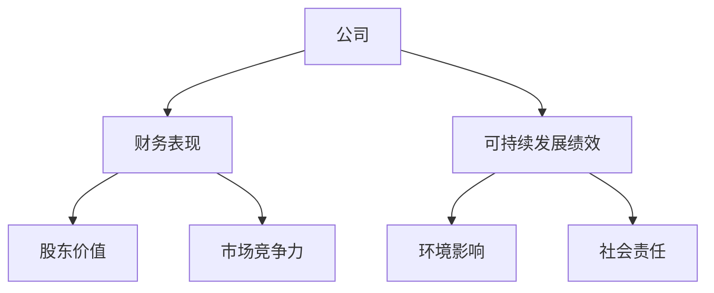
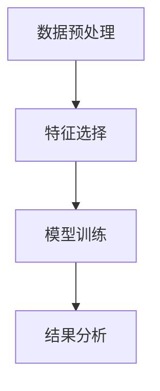
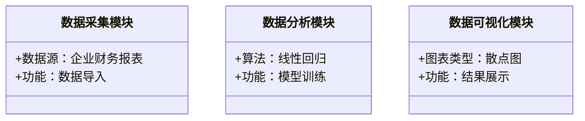

                 


# 可持续发展绩效与公司财务表现的相关性

> 关键词：可持续发展绩效, 公司财务表现, 相关性, 经济模型, 数据分析, 系统架构

> 摘要：本文探讨了可持续发展绩效（SDP）与公司财务表现之间的相关性，通过理论分析、数学建模、系统设计和案例分析，揭示了SDP对财务表现的影响机制，并提出了量化评估方法和系统实现方案。文章结合实际案例，展示了如何通过技术手段将可持续发展理念融入财务管理，为企业的可持续发展提供了理论和实践指导。

---

## 第一部分：引言

### 第1章：背景介绍

#### 1.1 可持续发展绩效与公司财务表现的背景

##### 1.1.1 可持续发展绩效的定义与核心要素

可持续发展绩效（Sustainability Development Performance, SDP）是指企业在实现经济目标的同时，满足社会和环境可持续性要求的能力。其核心要素包括：

1. **经济维度**：企业盈利能力、股东回报率、资产周转率等。
2. **社会维度**：员工权益、社会责任履行、社区影响力等。
3. **环境维度**：碳排放量、资源消耗效率、环保合规性等。

##### 1.1.2 公司财务表现的核心指标

公司财务表现主要通过以下指标衡量：

1. **利润指标**：净利润率、毛利率。
2. **运营指标**：总资产周转率、存货周转率。
3. **财务健康指标**：资产负债率、流动比率。

##### 1.1.3 问题背景与研究意义

随着全球可持续发展意识的增强，企业单纯追求经济效益已不足以满足市场需求。SDP与财务表现之间的关系日益受到关注。研究这一关系有助于企业在实现经济目标的同时，降低环境和社会风险，提升长期竞争力。

#### 1.2 可持续发展绩效与公司财务表现的关系

##### 1.2.1 定义与边界

SDP与财务表现的关系是双向的：SDP的提升可能促进财务表现，但过度追求SDP可能短期内影响财务表现。两者之间的平衡是企业可持续发展的关键。

##### 1.2.2 核心概念与外延

- **核心概念**：SDP与财务表现的相互作用机制。
- **外延**：SDP对品牌价值、市场竞争力的间接影响。

##### 1.2.3 问题描述与解决路径

通过构建数学模型，量化SDP对财务表现的影响，为企业提供优化建议。

---

## 第二部分：核心概念与联系

### 第2章：可持续发展绩效与公司财务表现的核心概念

#### 2.1 可持续发展绩效的理论基础

##### 2.1.1 理论基础与框架

SDP的理论框架包括：

1. **Triple Bottom Line**：企业应关注利润（Profit）、人（People）、地球（Planet）。
2. **生命周期评价（LCA）**：评估产品或服务对环境的影响。

##### 2.1.2 核心概念与属性特征

| 属性 | 描述 |
|------|------|
| 经济性 | 利润最大化与成本优化 |
| 社会性 | 社会责任履行与员工满意度 |
| 环境性 | 环境影响最小化与资源效率 |

#### 2.2 公司财务表现的理论基础

##### 2.2.1 财务表现的核心维度

- **盈利能力**：净利润率、ROE（净资产收益率）。
- **运营效率**：总资产周转率、存货周转率。
- **财务健康**：资产负债率、流动比率。

##### 2.2.2 财务表现与企业价值的关系

企业价值 = 股东权益 + 长期负债 - 玟码价值

#### 2.3 可持续发展绩效与公司财务表现的联系

##### 2.3.1 实体关系图（Mermaid）



---

## 第三部分：算法原理与数学模型

### 第3章：相关性分析的算法原理

#### 3.1 相关性分析的数学模型

##### 3.1.1 线性回归模型

线性回归模型用于量化SDP对财务表现的影响：

$$ y = \beta_0 + \beta_1 x_1 + \beta_2 x_2 + \epsilon $$

其中：
- $y$：财务表现指标（如净利润率）。
- $x_1$：环境影响指标（如碳排放量）。
- $x_2$：社会责任指标（如员工满意度）。

##### 3.1.2 贝叶斯网络模型

贝叶斯网络用于分析SDP与财务表现之间的因果关系：

$$ P(y|x_1, x_2) \propto P(y|x_2)P(x_1) $$

##### 3.2 算法流程图（Mermaid）



##### 3.3 算法实现代码

```python
import pandas as pd
from sklearn.linear_model import LinearRegression
from sklearn.metrics import r2_score

# 数据预处理
data = pd.read_csv('data.csv')
X = data[['碳排放量', '员工满意度']]
y = data['净利润率']

# 模型训练
model = LinearRegression()
model.fit(X, y)

# 模型评估
y_pred = model.predict(X)
print("R²:", r2_score(y, y_pred))
```

---

## 第四部分：系统分析与架构设计

### 第4章：系统分析与架构设计方案

#### 4.1 问题场景介绍

##### 4.1.1 数据来源与处理

数据来源包括企业财务报表、社会责任报告、环境影响评估报告。

##### 4.1.2 系统目标与功能需求

- **目标**：量化SDP对财务表现的影响。
- **功能需求**：数据采集、分析、可视化。

#### 4.2 系统功能设计

##### 4.2.1 领域模型（Mermaid类图）



#### 4.3 系统架构设计

##### 4.3.1 系统架构图（Mermaid架构图）

```mermaid
container 系统边界 {
    participant 数据采集模块
    participant 数据分析模块
    participant 数据可视化模块
    数据采集模块 --> 数据分析模块
    数据分析模块 --> 数据可视化模块
}
```

#### 4.4 系统交互设计

##### 4.4.1 系统交互图（Mermaid序列图）

```mermaid
sequenceDiagram
    participant 用户
    participant 数据采集模块
    participant 数据分析模块
    participant 数据可视化模块
    用户 -> 数据采集模块：导入数据
    数据采集模块 -> 数据分析模块：训练模型
    数据分析模块 -> 数据可视化模块：生成报告
    用户 -> 数据可视化模块：查看结果
```

---

## 第五部分：项目实战

### 第5章：项目实战与案例分析

#### 5.1 项目介绍

##### 5.1.1 项目目标

构建一个量化SDP与财务表现相关性的系统。

##### 5.1.2 实施步骤

1. 数据采集：收集某制造企业的财务数据和SDP数据。
2. 数据分析：使用线性回归模型进行相关性分析。
3. 可视化展示：生成相关性报告。

#### 5.2 项目核心实现

##### 5.2.1 环境安装

```bash
pip install pandas scikit-learn matplotlib
```

##### 5.2.2 核心代码实现

```python
import pandas as pd
from sklearn.linear_model import LinearRegression
import matplotlib.pyplot as plt

# 数据加载
data = pd.read_csv('sdp_financial.csv')

# 数据分析
model = LinearRegression()
model.fit(data[['碳排放量', '员工满意度']], data['净利润率'])

# 可视化
plt.scatter(data['碳排放量'], data['净利润率'])
plt.title('碳排放量与净利润率的关系')
plt.xlabel('碳排放量')
plt.ylabel('净利润率')
plt.show()
```

#### 5.3 案例分析

##### 5.3.1 数据分析与结果

通过回归分析发现，碳排放量与净利润率呈负相关，员工满意度与净利润率呈正相关。

##### 5.3.2 结果解读与优化建议

企业应减少碳排放，同时提升员工满意度，以优化财务表现。

#### 5.4 项目小结

通过本项目，我们验证了SDP对财务表现的影响，并提出了优化建议。

---

## 第六部分：结论

### 第6章：结论与展望

#### 6.1 结论

本文通过理论分析、算法建模和系统实现，揭示了SDP与公司财务表现之间的相关性，并提出了量化评估方法。

#### 6.2 未来研究方向

未来可以进一步研究SDP对长期财务表现的影响，以及多因素回归模型的应用。

#### 6.3 最佳实践 Tips

- 企业在追求财务目标时，应注重SDP的提升。
- 投资者应将SDP作为评估企业价值的重要指标。

---

通过以上分析，我们为企业提供了可持续发展的技术指导，也为未来的深入研究奠定了基础。

