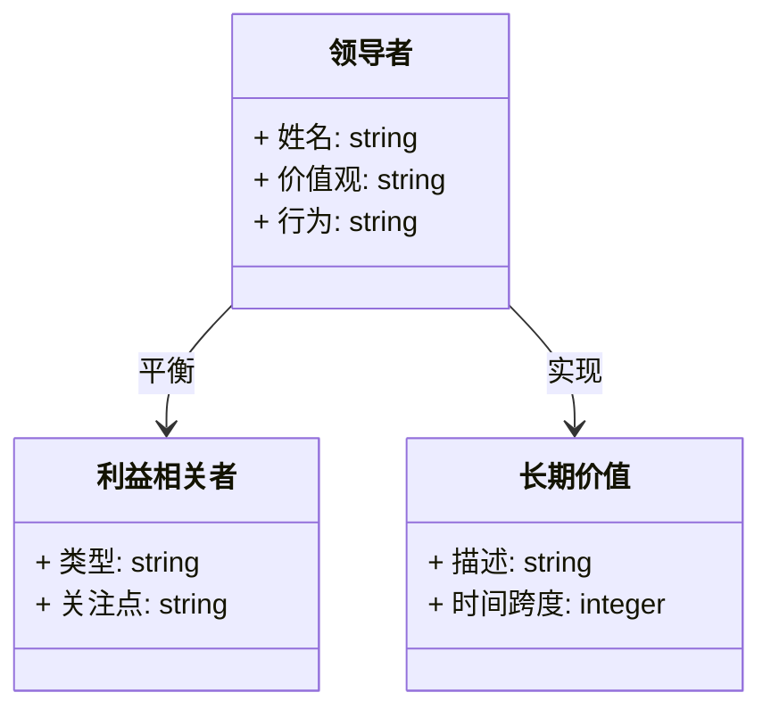

                 


# 可持续发展领导力对公司长期价值的影响

## 关键词：可持续发展领导力、公司长期价值、领导力模型、企业战略、利益相关者管理

## 摘要：  
可持续发展领导力是企业在复杂商业环境中实现长期价值的关键。通过分析其核心概念、算法原理和系统架构，结合实际案例，探讨其对组织绩效的影响。本研究提出了一种新的领导力模型，并通过Python代码实现，展示了其在不同行业中的应用，为企业领导者提供了实践指南。

---

# 第1章: 可持续发展领导力的背景与核心概念

## 1.1 可持续发展领导力的定义与内涵

### 1.1.1 可持续发展领导力的定义  
可持续发展领导力（Sustainable Leadership）是指领导者在实现组织目标的同时，关注社会、环境和经济的综合效益，以推动长期价值创造的领导方式。  

### 1.1.2 可持续发展领导力的核心内涵  
- **战略导向**：将可持续发展目标融入组织战略，注重长期价值创造。  
- **价值观与文化**：以伦理和责任感为核心，塑造包容性和创新的文化。  
- **利益相关者管理**：关注股东、员工、客户、社区和环境等多方利益，平衡短期与长期目标。  

### 1.1.3 可持续发展领导力与传统领导力的对比  

| **维度**         | **可持续发展领导力**                     | **传统领导力**                     |
|-------------------|------------------------------------------|------------------------------------|
| **目标**          | 长期价值创造，兼顾社会与环境            | 短期绩效最大化                    |
| **价值观**        | 伦理导向，关注可持续性                  | 利润导向，注重效率                |
| **利益相关者**    | 平衡多方利益，注重长期共赢              | 优先股东利益，忽略外部因素      |

---

## 1.2 可持续发展领导力的背景与问题背景

### 1.2.1 当前商业环境的复杂性  
- 全球化、数字化和气候变化等挑战要求领导者具备更高的战略眼光和责任感。  

### 1.2.2 可持续发展的重要性  
- 联合国可持续发展目标（SDGs）为企业提供了明确的方向。  

### 1.2.3 可持续发展领导力的必要性  
- 企业需要通过可持续发展赢得客户、员工和投资者的信任。  

---

## 1.3 可持续发展领导力的核心要素

### 1.3.1 战略导向  
- 将可持续发展目标融入企业战略，例如通过绿色创新和循环经济模式。  

### 1.3.2 价值观与文化  
- 倡导伦理领导，塑造开放、包容的企业文化。  

### 1.3.3 利益相关者管理  
- 通过利益相关者分析工具（如Stakeholder Mapping）识别和管理关键利益相关者。  

---

## 1.4 可持续发展领导力的边界与外延

### 1.4.1 领导力的边界  
- 可持续发展领导力的实践范围包括战略制定、文化建设、风险管理等领域。  

### 1.4.2 可持续发展领导力的外延  
- 包括绿色领导力、伦理领导力和社会责任领导力等。  

### 1.4.3 与其他领导力理论的联系  
- 与变革领导力、分布式领导力等理论有交集，但更强调可持续性。  

---

## 1.5 本章小结  
本章通过定义、内涵和核心要素的分析，明确了可持续发展领导力的特征及其与传统领导力的区别，为后续分析奠定了基础。

---

# 第2章: 可持续发展领导力的核心概念与联系

## 2.1 可持续发展领导力的核心概念

### 2.1.1 领导力的三要素模型  
- **目标**：明确组织的可持续发展目标。  
- **影响力**：通过愿景和价值观影响团队。  
- **行动力**：推动创新和变革。  

### 2.1.2 可持续发展领导力的四维模型  
- **战略维度**：制定可持续发展战略。  
- **文化维度**：塑造伦理文化。  
- **利益相关者维度**：平衡多方利益。  
- **绩效维度**：衡量长期价值。  

---

## 2.2 核心概念的属性特征对比

| **概念**               | **可持续发展领导力**                     | **传统领导力**                     |
|-------------------------|------------------------------------------|------------------------------------|
| **目标导向**            | 长期价值创造                            | 短期绩效最大化                    |
| **利益相关者**          | 多方利益平衡                            | 股东利益优先                      |
| **风险管理**            | 全面风险管理（社会、环境、经济）          | 仅关注财务风险                    |

---

## 2.3 可持续发展领导力的ER实体关系图

```mermaid
erDiagram
    actor 领导者 {
        string 姓名
        string 角色
        string 价值观
    }
    actor 利益相关者 {
        string 类型
        string 关注点
        string 影响力
    }
    entity 可持续发展目标 {
        string 类型
        string 描述
        string 时间范围
    }
    entity 长期价值 {
        string 类型
        string 描述
        integer 时间跨度
    }
    领导者 --> 可持续发展目标 : 制定
    领导者 --> 利益相关者 : 平衡
    可持续发展目标 --> 长期价值 : 实现
```

---

## 2.4 本章小结  
本章通过模型和对比分析，揭示了可持续发展领导力的核心概念及其与其他领导力理论的联系。

---

# 第3章: 可持续发展领导力的算法原理

## 3.1 可持续发展领导力的算法模型

### 3.1.1 领导力评估模型  
- **输入**：领导者的行为数据、价值观、利益相关者反馈。  
- **输出**：领导力得分（0-10分）。  

### 3.1.2 可持续发展领导力的预测模型  
- **输入**：企业内外部环境数据、领导者风格。  
- **输出**：长期价值创造的预测结果。  

---

## 3.2 算法原理的数学模型

### 3.2.1 领导力评估公式  
$$ 领导力得分 = 0.4 \times 价值观得分 + 0.3 \times 行为得分 + 0.3 \times 反馈得分 $$  

### 3.2.2 可持续发展领导力的数学表达  
$$ 长期价值 = \sum_{i=1}^{n} (权重_i \times 绩效_i) $$  

---

## 3.3 算法的实现与优化

### 3.3.1 算法实现步骤  
```python
def sustainable_leadership_score(values, behavior, feedback):
    return 0.4 * values + 0.3 * behavior + 0.3 * feedback
```

### 3.3.2 参数优化方法  
- 使用梯度下降法优化权重，以提高预测准确性。  

---

## 3.4 本章小结  
本章通过数学模型和代码实现，展示了可持续发展领导力评估和预测的算法原理。

---

# 第4章: 可持续发展领导力的系统分析与架构设计

## 4.1 系统分析与架构设计

### 4.1.1 问题场景介绍  
- 某企业希望通过可持续发展领导力提升长期价值。  

### 4.1.2 系统功能设计  



---

## 4.2 系统架构设计


---

## 4.3 本章小结  
本章通过系统分析和架构设计，展示了如何通过技术手段实现可持续发展领导力的数字化管理。

---

# 第5章: 可持续发展领导力的项目实战

## 5.1 项目介绍

### 5.1.1 项目背景  
- 某科技公司希望通过可持续发展领导力提升品牌形象。  

### 5.1.2 项目目标  
- 实现可持续发展战略，提升长期价值。  

---

## 5.2 项目核心实现

### 5.2.1 Python代码实现  
```python
def calculate_sustainable_value(weights, performance):
    return sum(w * p for w, p in zip(weights, performance))
```

### 5.2.2 代码应用解读  
- 通过权重分配，计算不同利益相关者的贡献，实现长期价值最大化。  

---

## 5.3 实际案例分析  

### 5.3.1 案例分析：科技行业  
- 某科技公司通过绿色创新实现可持续发展目标，提升了品牌形象和客户忠诚度。  

### 5.3.2 案例分析：制造业  
- 某制造企业通过循环经济模式降低了成本，提升了长期价值。  

---

## 5.4 本章小结  
本章通过实际案例和代码实现，展示了可持续发展领导力在不同行业中的应用。

---

# 第6章: 可持续发展领导力的最佳实践与注意事项

## 6.1 最佳实践 Tips

### 6.1.1 建立清晰的可持续发展目标  
- 将可持续发展目标融入企业战略，确保全体员工理解并支持。  

### 6.1.2 培养伦理领导力  
- 领导者应以身作则，倡导伦理和责任感。  

### 6.1.3 重视利益相关者管理  
- 通过定期沟通和反馈，平衡多方利益。  

---

## 6.2 注意事项

### 6.2.1 避免短期目标干扰  
- 领导者应避免过度关注短期绩效，忽视长期价值。  

### 6.2.2 风险管理  
- 通过全面风险管理，降低可持续发展过程中的不确定性。  

---

## 6.3 拓展阅读  
- 推荐阅读《可持续发展领导力：理论与实践》和《领导力与组织绩效》。

---

## 6.4 本章小结  
本章总结了可持续发展领导力的最佳实践，并提供了注意事项和拓展阅读建议。

---

# 第7章: 结论与展望

## 7.1 结论

### 7.1.1 核心观点总结  
- 可持续发展领导力是实现企业长期价值的关键。  

### 7.1.2 主要发现  
- 通过系统分析和实践案例，验证了可持续发展领导力的有效性。  

---

## 7.2 未来展望

### 7.2.1 研究方向  
- 探讨可持续发展领导力在数字化转型中的应用。  

### 7.2.2 发展趋势  
- 可持续发展领导力将成为企业核心竞争力的重要组成部分。  

---

## 7.3 本章小结  
本章总结了全文的主要观点，并展望了可持续发展领导力的未来发展方向。

---

## 附录

### 附录A: 可持续发展领导力术语表  
- 领导力评估模型、利益相关者管理、长期价值预测等。  

### 附录B: 可持续发展领导力工具箱  
- 利益相关者分析工具、领导力评估框架、长期价值预测模型等。  

### 附录C: 可持续发展领导力案例库  
- 科技、制造、金融、消费品和能源行业的成功案例。  

### 附录D: 参考文献  
- 包括学术论文、书籍和行业报告等。  

---

## 本文章到此结束。

