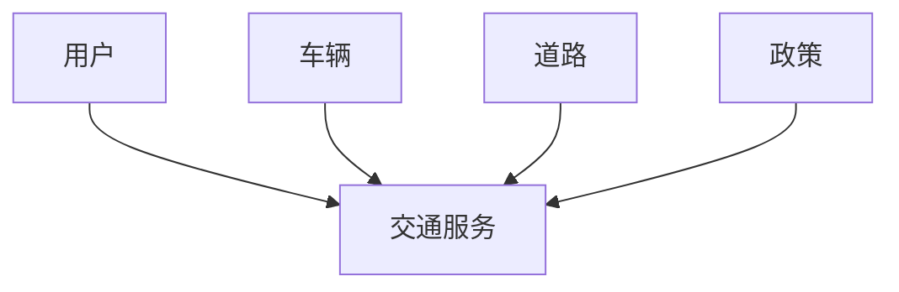
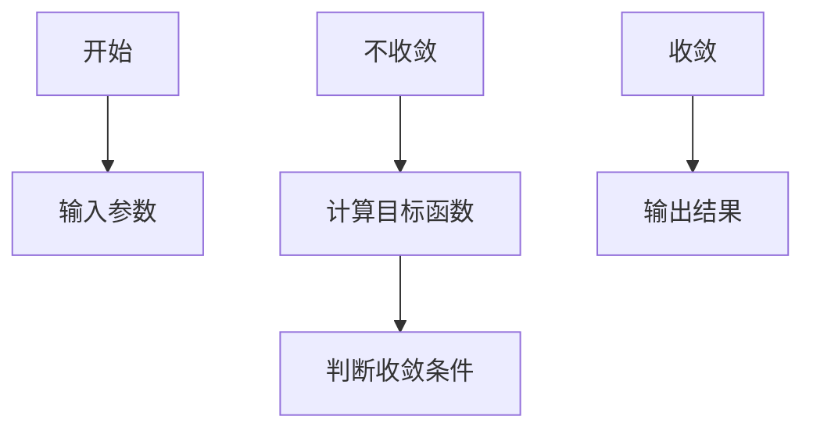
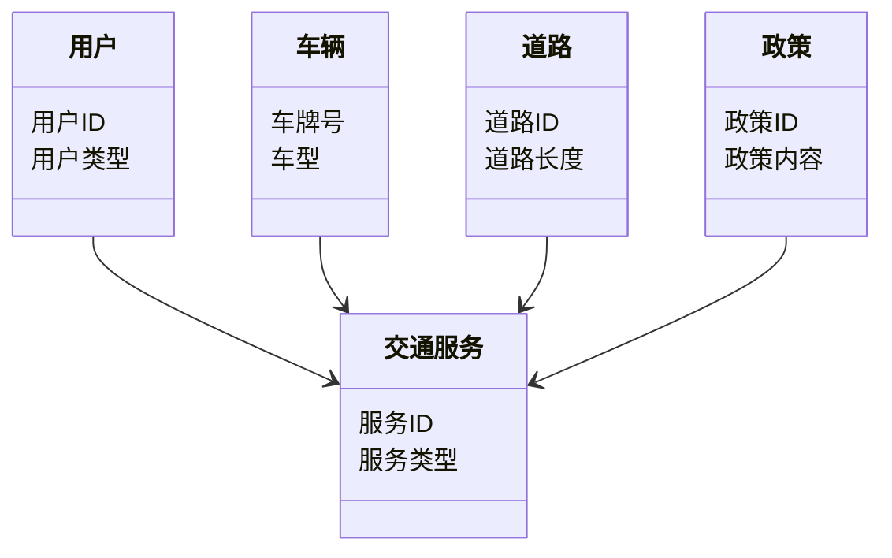
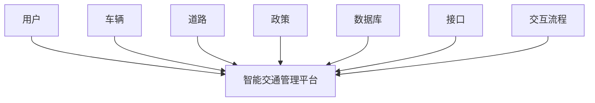
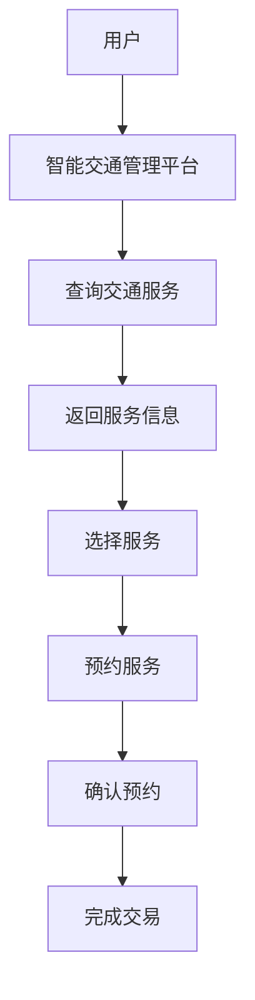

                 


# 可持续城市交通解决方案的市场前景

## 关键词：可持续城市交通，智能交通系统，绿色出行，市场前景，技术创新

## 摘要：随着城市化进程的加快，城市交通问题日益突出，传统的交通模式已经无法满足可持续发展的需求。本文从可持续城市交通的核心概念出发，分析了交通优化算法的数学模型和实现，提出了智能交通管理系统的架构设计方案，并通过实际案例展示了可持续交通解决方案的市场前景。文章最后总结了实际应用中的最佳实践和未来发展趋势。

---

# 第1章：可持续城市交通的背景与问题背景

## 1.1 城市交通问题的现状

### 1.1.1 城市化进程中交通需求的增长
随着城市化进程的加快，城市人口和车辆数量急剧增加，传统的交通基础设施已无法满足日益增长的交通需求。交通拥堵、通勤时间延长等问题逐渐成为城市发展的瓶颈。

### 1.1.2 传统交通模式的局限性
传统交通模式以汽车为主，导致能源消耗大、环境污染严重。同时，交通管理手段单一，难以实现资源的优化配置。

### 1.1.3 城市交通问题对环境和社会的影响
交通拥堵不仅浪费时间，还增加了能源消耗和污染物排放，加剧了城市环境污染和气候变化问题。此外，交通问题还影响了城市的经济活力和社会公平。

## 1.2 可持续发展的必要性

### 1.2.1 可持续发展的核心理念
可持续发展强调在满足当前需求的同时，不损害后代发展的可能性。在交通领域，这意味着需要减少能源消耗、降低污染排放，同时提高交通效率。

### 1.2.2 城市交通与可持续发展的关系
城市交通是城市运行的重要组成部分，其发展模式直接影响城市的可持续性。通过优化交通系统，可以减少能源消耗和环境污染，促进城市的可持续发展。

### 1.2.3 可持续交通对城市发展的意义
可持续交通能够提高交通效率，减少交通拥堵，降低能源消耗和污染排放，同时促进城市经济的健康发展和社会的公平与和谐。

## 1.3 可持续城市交通的定义与边界

### 1.3.1 可持续城市交通的定义
可持续城市交通是指通过优化交通组织、技术创新和政策引导，实现交通系统的高效、清洁和公平发展。

### 1.3.2 可持续交通的核心要素
- **交通模式**：包括步行、骑行、公共交通和绿色出行。
- **技术手段**：利用智能交通系统（ITS）优化交通流量和资源配置。
- **政策支持**：通过政策引导和激励措施推动可持续交通的发展。

### 1.3.3 可持续交通的边界与外延
可持续交通的边界包括城市交通系统的所有组成部分，如道路、车辆、交通设施和交通管理。外延则涉及能源供应、环境保护和社会经济等多个领域。

## 1.4 本章小结

- **城市交通问题的复杂性**：交通拥堵、环境污染和能源消耗等问题对城市发展的影响日益显著。
- **可持续交通的重要性**：通过优化交通系统，可以实现资源的高效利用和环境的保护。
- **本书研究的范围与目标**：本书将从技术、政策和市场等多个角度分析可持续城市交通解决方案的市场前景。

---

# 第2章：可持续城市交通的核心概念与联系

## 2.1 可持续交通的核心原理

### 2.1.1 交通系统的整体性
可持续交通强调交通系统的整体性，包括交通模式、基础设施和技术手段的协同优化。

### 2.1.2 可持续交通的多目标优化
可持续交通需要在交通效率、能源消耗和环境污染之间找到平衡点，实现多目标优化。

### 2.1.3 技术与政策的协同作用
技术进步和政策引导是推动可持续交通发展的两个关键因素，二者需要协同作用才能实现目标。

## 2.2 可持续交通的核心要素对比

### 2.2.1 交通模式对比分析
| 交通模式 | 优点 | 缺点 |
|----------|------|------|
| 步行     | 环保、健康 | 适用范围有限 |
| 骑行     | 环保、灵活 | 道路条件限制 |
| 公共交通 | 节能、高效 | 需要大量投资 |
| 智能交通 | 高效、精准 | 技术依赖性强 |

### 2.2.2 ER实体关系图


## 2.3 可持续交通的实体关系架构

### 2.3.1 ER实体关系图


## 2.4 本章小结

- **可持续交通的核心要素**：包括交通模式、技术手段和政策支持。
- **各要素之间的关系**：用户、车辆、道路和政策之间相互关联，共同构成可持续交通系统。
- **本书研究的重点**：通过技术创新和政策引导，推动可持续交通的发展。

---

# 第3章：可持续城市交通优化算法

## 3.1 交通流优化模型

### 3.1.1 线性规划模型
$$ \text{目标函数：} \min \sum_{i} c_i x_i $$
$$ \text{约束条件：} \sum_{i} x_i \leq C $$

### 3.1.2 机器学习模型
$$ y = f(x) $$

## 3.2 算法实现

### 3.2.1 优化算法流程图


### 3.2.2 Python代码实现
```python
import numpy as np

def traffic_optimization(c, C):
    x = np.zeros(len(c))
    while True:
        # 计算目标函数
        obj = np.dot(c, x)
        # 判断收敛条件
        if obj <= C:
            break
        # 更新x
        x = np.maximum(x - 1, 0)
    return x

# 示例
c = [1, 2, 3]
C = 6
result = traffic_optimization(c, C)
print(result)
```

---

## 3.3 本章小结

- **优化算法的重要性**：通过优化算法可以实现交通流量的合理分配，提高交通效率。
- **数学模型的应用**：线性规划和机器学习模型为交通优化提供了理论基础和技术支持。
- **算法实现的步骤**：从输入参数到输出结果，算法流程清晰明确。

---

# 第4章：可持续城市交通解决方案的系统分析与架构设计

## 4.1 系统功能设计

### 4.1.1 领域模型图


### 4.1.2 系统架构图


## 4.2 接口与交互设计

### 4.2.1 系统接口设计
- 用户接口：提供交通服务查询、预约和反馈功能。
- 车辆接口：实现车辆状态更新和位置追踪。
- 政策接口：获取政策信息并更新系统配置。

### 4.2.2 交互流程图


## 4.3 本章小结

- **系统功能设计**：通过领域模型图展示了系统的组成和关系。
- **系统架构设计**：智能交通管理平台为核心，与用户、车辆、道路和政策等模块交互。
- **接口与交互设计**：清晰的接口和交互流程确保系统的高效运行。

---

# 第5章：可持续城市交通解决方案的项目实战

## 5.1 环境与工具

### 5.1.1 环境需求
- 硬件：高性能计算机、网络设备。
- 软件：Python、机器学习库、数据库管理系统。
- 数据接口：与交通管理部门的数据接口。

## 5.2 核心代码实现

### 5.2.1 优化算法实现
```python
import numpy as np

def traffic_optimization(c, C):
    x = np.zeros(len(c))
    while True:
        obj = np.dot(c, x)
        if obj <= C:
            break
        x = np.maximum(x - 1, 0)
    return x

# 示例
c = [1, 2, 3]
C = 6
result = traffic_optimization(c, C)
print(result)
```

### 5.2.2 系统实现
```python
class TrafficManagementSystem:
    def __init__(self):
        self.users = []
        self.services = []
        self.policies = []
    
    def add_user(self, user):
        self.users.append(user)
    
    def add_service(self, service):
        self.services.append(service)
    
    def add_policy(self, policy):
        self.policies.append(policy)
    
    def optimize_traffic(self):
        # 调用优化算法
        pass

# 示例
tms = TrafficManagementSystem()
tms.add_user(User(1, "普通用户"))
tms.add_service(Service(1, "公交"))
tms.add_policy(Policy(1, "限行令"))
tms.optimize_traffic()
```

## 5.3 案例分析

### 5.3.1 案例选择
以某城市CBD区域为例，分析智能交通管理系统的实际应用效果。

### 5.3.2 代码应用解读
通过代码实现交通流量的优化，减少拥堵和排放。

## 5.4 本章小结

- **环境与工具的选择**：确保系统的高效运行和数据接口的畅通。
- **核心代码实现**：优化算法和系统架构是实现可持续交通的关键。
- **案例分析**：通过实际案例验证系统的可行性和效果。

---

# 第6章：最佳实践与未来展望

## 6.1 最佳实践 tips

- **技术创新**：持续推动智能交通技术的研发和应用。
- **政策支持**：制定和实施有利于可持续交通发展的政策。
- **公众参与**：通过宣传教育提高公众的环保意识和参与度。

## 6.2 小结

- **可持续交通的核心价值**：通过技术创新和政策引导，实现交通系统的高效、清洁和公平发展。
- **本书的主要内容**：从背景分析、核心概念、算法实现到系统设计和项目实战，全面探讨了可持续城市交通解决方案的市场前景。

## 6.3 注意事项

- **技术依赖**：智能交通系统的运行依赖于先进的技术手段，技术故障可能影响系统运行。
- **数据隐私**：交通数据的收集和使用需要注意用户隐私保护。
- **成本投入**：智能交通系统的建设和维护需要较大的资金投入。

## 6.4 拓展阅读

- **推荐书籍**：《智能交通系统》、《可持续城市规划》。
- **相关期刊**：《交通工程与管理》、《城市交通研究》。
- **网络资源**：相关领域的学术论文、技术报告和行业资讯。

---

# 附录

## 附录A：参考文献

- [1] 《智能交通系统》
- [2] 《可持续城市规划》
- [3] 《城市交通管理技术》

## 附录B：术语解释

- **智能交通系统（ITS）**：利用先进的信息技术优化交通管理。
- **可持续交通**：在满足交通需求的同时，减少能源消耗和环境污染。

---

# 结语

可持续城市交通解决方案是实现城市可持续发展的重要组成部分。通过技术创新、政策引导和公众参与，我们可以构建一个高效、清洁、公平的交通系统，为城市的未来发展奠定坚实的基础。

