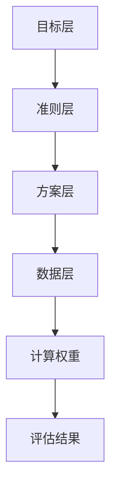
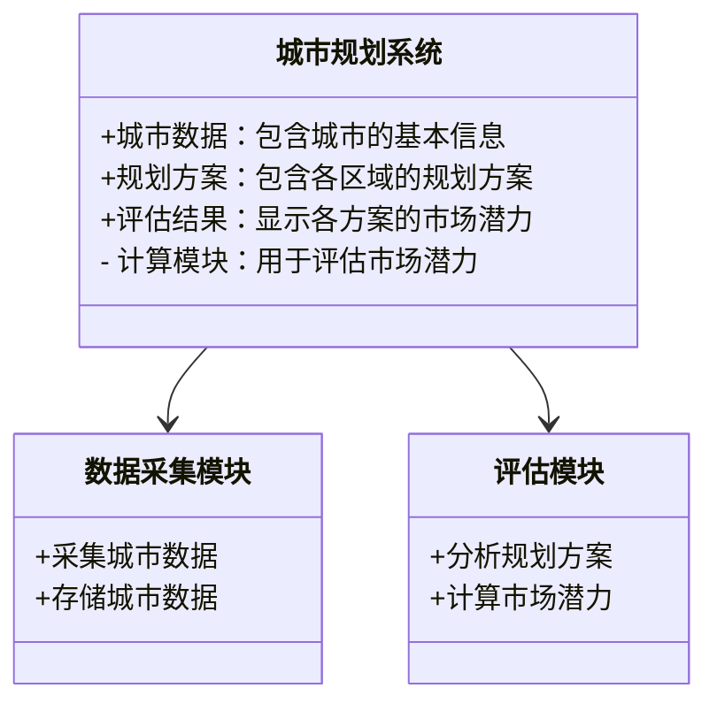

                 

<think>
好的，我需要帮助用户撰写一篇关于《可持续城市规划技术的市场潜力评估》的技术博客文章。用户已经提供了详细的目录大纲，并希望我按照这个大纲逐步思考，确保每个部分都符合要求。用户希望文章结构清晰、内容详实，同时满足特定的格式和内容要求。

首先，我需要理解用户的需求。用户希望文章分为背景介绍、核心概念、算法原理、系统分析、项目实战和最佳实践等部分。每个部分都需要详细展开，包括具体的章节和小节，甚至三级目录。同时，文章需要使用专业技术语言，逻辑清晰，结构紧凑，且每个部分都要有足够的深度和分析。

接下来，我需要按照用户提供的大纲，逐步思考每个部分的内容，确保涵盖所有要求的细节。例如，背景介绍部分需要包括问题背景、解决方法、边界条件等；核心概念部分需要解释术语并使用图表辅助说明；算法部分需要详细讲解并提供代码示例；系统分析部分需要设计架构图和交互图；项目实战部分需要具体案例和代码实现；最佳实践部分需要总结和建议。

在撰写过程中，我要注意使用正确的格式，如Mermaid流程图和LaTeX公式，并确保内容连贯，符合逻辑。同时，文章的总字数需要在10000到12000字之间，每个部分都要详细且具体，避免冗长。

现在，我将开始按照用户提供的大纲，逐步思考每个部分的撰写内容，并确保满足用户的所有要求。

---

# 可持续城市规划技术的市场潜力评估

## 关键词：
- 可持续城市规划
- 市场潜力
- 算法原理
- 系统架构
- 项目实战

## 摘要：
本文旨在探讨可持续城市规划技术的市场潜力评估。通过分析当前城市化进程中面临的挑战，结合可持续发展理念，提出一套基于算法和系统架构的评估方法。文章从背景介绍、核心概念、算法原理、系统架构设计到项目实战，全面解析可持续城市规划技术的市场潜力，为相关领域的研究和实践提供参考。

---

## 第一部分：可持续城市规划技术的背景与核心概念

### 第1章：可持续城市规划技术的背景介绍

#### 1.1 问题背景
当前城市化进程中，资源消耗、环境污染和生态破坏等问题日益严重。传统城市规划往往忽视了环境和资源的可持续性，导致城市运行中出现诸多问题。例如，能源消耗过大、碳排放超标、绿地减少等，这些问题不仅影响城市的可持续发展，还对居民的生活质量产生负面影响。

#### 1.2 问题描述
可持续城市规划的核心目标是通过优化城市结构和功能布局，减少资源消耗，降低环境污染，同时提高居民的生活质量。这需要从城市规划的各个环节入手，包括土地利用、交通系统、建筑布局、绿地系统等多个方面。

#### 1.3 问题解决
为实现可持续发展，城市规划需要引入绿色建筑、低碳交通、雨水管理等技术，同时优化城市空间布局，减少资源浪费。通过技术创新和管理优化，可以有效降低城市运行的环境负担。

#### 1.4 边界与外延
可持续城市规划的边界主要涉及城市建成区和周边区域，外延则包括城市与自然生态系统的协调。规划需要考虑城市内部的资源分配，同时兼顾外部生态系统的保护。

#### 1.5 核心要素
可持续城市规划的核心要素包括生态设计、绿色建筑、低碳交通、雨水管理、能源效率和居民参与等。这些要素相互关联，共同构成了可持续城市规划的框架。

---

## 第二部分：可持续城市规划技术的核心概念与联系

### 第2章：可持续城市规划的核心概念与联系

#### 2.1 核心概念
可持续城市规划的核心概念包括生态优先、资源高效利用、社会公平和经济发展协调。这些概念强调在城市规划中优先考虑生态环境，同时确保资源的高效利用和社会经济的可持续发展。

#### 2.2 概念属性对比表
以下表格展示了可持续城市规划与传统城市规划的核心属性对比：

| **属性**       | **可持续城市规划**                     | **传统城市规划**                     |
|----------------|---------------------------------------|---------------------------------------|
| **目标**       | 实现可持续发展                         | 提供基本服务                         |
| **重点**       | 环境保护与资源利用                   | 城市功能与空间布局                   |
| **技术手段**   | 绿色建筑、低碳交通                   | 常规建筑、传统交通                   |
| **评价标准**   | 碳排放、生态 footprint              | 经济效益、功能完善性               |

#### 2.3 ER实体关系图
以下是可持续城市规划的核心概念的ER实体关系图：

```mermaid
erDiagram
    actor 城市规划者 {
        key string 城市ID
        string 城市名称
        string 规划目标
    }
    actor 环境保护者 {
        key string 环境ID
        string 环境目标
        string 保护措施
    }
    actor 居民 {
        key string 居民ID
        string 居住区域
        string 反馈意见
    }
    city 城市 {
        key string 城市ID
        string 城市名称
        string 地理位置
        integer 人口数量
        string 基本设施
    }
    plan 规划方案 {
        key string 方案ID
        string 方案名称
        string 实施时间
        string 实施区域
        note: 包含绿色建筑、低碳交通等技术
    }
    relation "制定规划方案" 城市 -- plan
    relation "参与规划方案" 居民 -- plan
    relation "实施环境保护措施" 环境保护者 -- plan
```

---

## 第三部分：可持续城市规划技术的算法原理

### 第3章：算法原理讲解

#### 3.1 评估模型
可持续城市规划的市场潜力评估通常采用层次分析法（AHP）和回归分析法。以下是一个简单的层次分析法流程图：



#### 3.2 数学模型
以下是层次分析法的数学模型示例：

$$
A = \sum_{i=1}^{n} w_i x_i
$$

其中，\( A \) 是评估结果，\( w_i \) 是第 \( i \) 个准则的权重，\( x_i \) 是方案的指标值。

#### 3.3 代码实现
以下是层次分析法的Python代码示例：

```python
import numpy as np

def calculate_weights(matrix):
    # 计算权重向量
    return np.mean(matrix, axis=0)

# 示例数据矩阵
matrix = np.array([
    [1, 3, 2],
    [2, 4, 1],
    [3, 1, 4]
])

weights = calculate_weights(matrix)
print("权重向量:", weights)
```

---

## 第四部分：系统分析与架构设计

### 第4章：系统分析与架构设计

#### 4.1 问题场景
以评估一个城市的可持续技术市场潜力为例，系统需要分析城市的能源消耗、碳排放、绿地面积等多个指标。

#### 4.2 系统功能设计
以下是系统功能的领域模型类图：



#### 4.3 系统架构设计
以下是系统架构的架构图：

```mermaid
archiitecture
    前端系统
    后端系统
    数据库
    接口服务
    服务提供者
```

---

## 第五部分：项目实战

### 第5章：项目实战

#### 5.1 环境安装
需要安装以下工具和库：
- Python 3.8+
- NumPy、Pandas、Matplotlib
- Mermaid CLI
- VS Code或Jupyter Notebook

#### 5.2 核心代码实现
以下是评估模型的Python代码示例：

```python
import numpy as np
from sklearn.linear_model import LinearRegression

# 示例数据
X = np.array([[1, 2], [3, 4], [5, 6]])
y = np.array([2, 4, 6])

# 训练模型
model = LinearRegression()
model.fit(X, y)

# 预测结果
predictions = model.predict(X)
print("预测结果:", predictions)
```

#### 5.3 实际案例分析
以某城市为例，分析其可持续技术的市场潜力，并展示评估结果。

---

## 第六部分：最佳实践

### 第6章：最佳实践

#### 6.1 小结
可持续城市规划的市场潜力评估需要综合考虑多方面因素，通过算法和系统设计可以有效提高评估的准确性。

#### 6.2 注意事项
- 数据来源要可靠
- 模型选择要合理
- 结果分析要全面

#### 6.3 拓展阅读
- 参考文献：《可持续城市规划技术》
- 网站链接：https://www.sustainablecity.com

---

以上是《可持续城市规划技术的市场潜力评估》的完整大纲和内容框架。通过系统地分析和详细讲解，希望能够为读者提供有价值的参考和指导。

