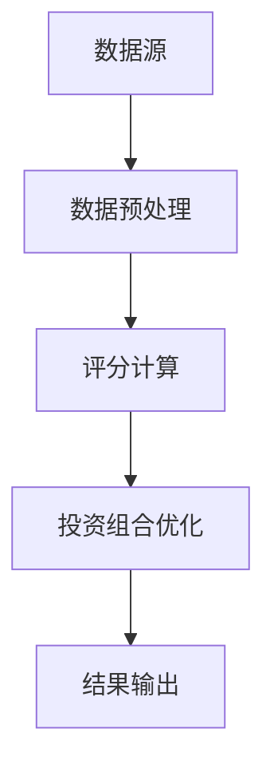
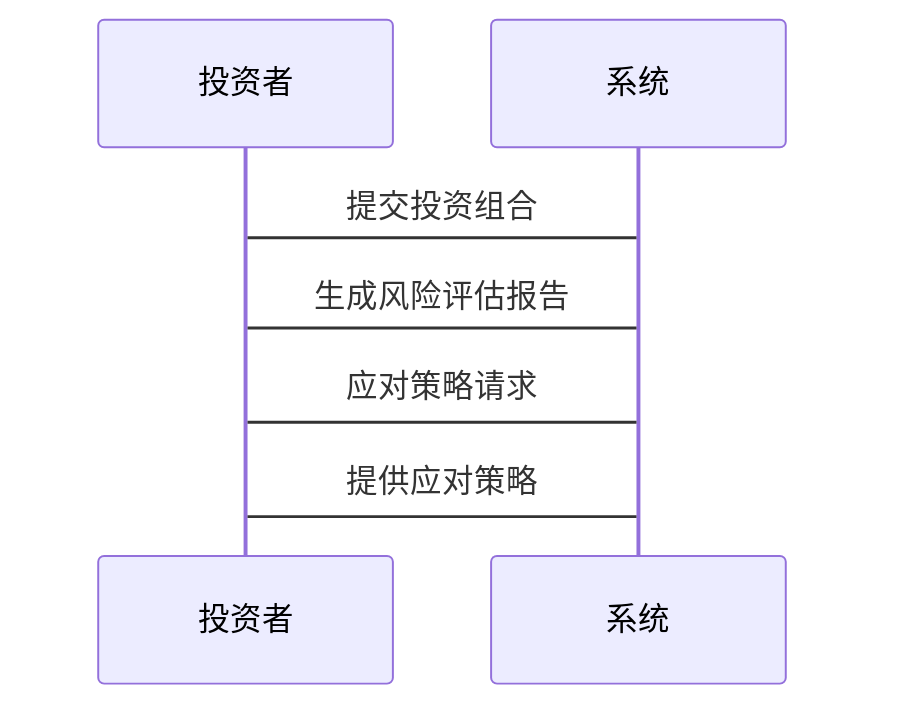

                 


# 可持续投资：ESG因素在当前市场中的重要性

> 关键词：可持续投资, ESG, 环境因素, 社会因素, 治理因素, 投资组合优化

> 摘要：随着全球对可持续发展的关注增加，ESG（环境、社会和治理）因素在投资决策中的重要性日益凸显。本文深入探讨了ESG的核心概念、其在投资组合中的应用、风险管理策略以及评级系统的设计。通过分析环境、社会和治理因素，本文展示了如何将ESG整合到投资策略中，以实现长期的财务回报和可持续发展目标。

---

## 第1章：可持续投资与ESG的背景介绍

### 1.1 可持续投资的定义与核心概念

#### 1.1.1 可持续投资的定义
可持续投资是指在投资过程中考虑环境、社会和治理（ESG）因素的投资策略。其目标是在追求财务回报的同时，促进社会和环境的可持续发展。

#### 1.1.2 ESG的定义与核心要素
ESG是可持续投资的核心要素，包括：
- **环境（E）**：公司对环境的影响，如碳排放、资源利用效率等。
- **社会（S）**：公司与社会的关系，包括员工权益、社区参与等。
- **治理（G）**：公司治理结构和做法，包括董事会结构、高管薪酬等。

#### 1.1.3 可持续投资与传统投资的区别
可持续投资不仅关注财务回报，还考虑非财务因素（ESG）对长期风险和收益的影响。传统投资主要关注财务指标，如收益和风险。

### 1.2 ESG的重要性与市场影响

#### 1.2.1 ESG对投资决策的影响
ESG因素帮助投资者识别潜在风险和机会，如环境法规变化可能带来的成本或收益。

#### 1.2.2 ESG在当前市场中的地位
越来越多的投资者和机构将ESG作为投资决策的重要依据，推动了绿色金融和可持续投资的发展。

#### 1.2.3 ESG对长期投资回报的影响
研究表明，ESG表现良好的公司通常具有更强的抗风险能力和长期增长潜力，这有助于提高投资组合的回报。

---

## 第2章：ESG的核心概念与联系

### 2.1 ESG的三要素分析

#### 2.1.1 环境因素（E）
环境因素关注公司对自然资源的利用和环境影响，如碳排放、能源消耗等。

#### 2.1.2 社会因素（S）
社会因素涉及公司与员工、社区和社会的关系，包括劳动权益、社会责任等。

#### 2.1.3 治理因素（G）
治理因素关注公司的治理结构和决策过程，包括董事会多样性、高管薪酬透明度等。

### 2.2 ESG三要素的对比分析

#### 2.2.1 ESG三要素的属性特征对比
| 要素 | 环境（E） | 社会（S） | 治理（G） |
|------|------------|-----------|-----------|
| 关注点 | 资源利用、排放 | 劳工权益、社会责任 | 董事会结构、高管薪酬 |
| 示例 | 碳排放量 | 员工福利 | 股权激励计划 |

#### 2.2.2 ESG三要素的ER实体关系图
```mermaid
erd
    Customer
    Invoice
    Order
    Product
    Supplier
    links:
        - Customer --> Order
        - Order --> Product
        - Order --> Invoice
        - Product --> Supplier
```

---

## 第3章：ESG评估的算法原理

### 3.1 ESG评估的算法概述

#### 3.1.1 ESG评估的基本流程
1. 数据收集：获取公司的ESG相关数据。
2. 标准化处理：对数据进行标准化，消除量纲影响。
3. 权重分配：根据重要性分配权重。
4. 综合评分：计算综合得分，评估公司ESG表现。

### 3.2 ESG评估的数学模型与公式

#### 3.2.1 ESG评分公式
$$ \text{ESG评分} = \sum_{i=1}^{n} w_i \cdot s_i $$
其中，\( w_i \) 是第 \( i \) 个因素的权重，\( s_i \) 是第 \( i \) 个因素的评分。

#### 3.2.2 ESG权重分配模型
权重分配可基于行业标准或专家判断，例如：
$$ w_E = 0.4, \quad w_S = 0.3, \quad w_G = 0.3 $$

### 3.3 算法实现与案例分析

#### 3.3.1 算法实现步骤
1. 数据预处理：清洗和标准化数据。
2. 权重分配：确定各因素的权重。
3. 综合评分：计算各公司的ESG评分。

#### 3.3.2 案例分析
假设某公司环境评分为80，社会评分为70，治理评分为60，权重分别为0.4、0.3、0.3：
$$ \text{ESG评分} = 0.4 \times 80 + 0.3 \times 70 + 0.3 \times 60 = 32 + 21 + 18 = 71 $$

---

## 第4章：ESG在投资组合中的应用

### 4.1 投资组合中的ESG整合

#### 4.1.1 ESG在投资组合中的整合方式
1. 责任投资（PRI）：将ESG因素纳入投资决策。
2. 环境、社会和治理投资（ESG投资）：专门投资于ESG表现良好的公司。

### 4.2 ESG投资组合优化的系统架构

#### 4.2.1 系统功能设计
- 数据采集：收集公司ESG数据。
- 评分计算：计算ESG评分。
- 投资组合优化：优化投资组合，最大化收益并最小化风险。

#### 4.2.2 系统架构设计


---

## 第5章：ESG风险管理与应对策略

### 5.1 ESG风险管理的定义与重要性

#### 5.1.1 ESG风险管理的定义
ESG风险管理是指识别、评估和应对与环境、社会和治理相关的风险。

### 5.2 ESG风险管理的系统设计

#### 5.2.1 系统功能设计
- 风险识别：识别潜在的ESG风险。
- 风险评估：评估风险的影响和可能性。
- 风险应对：制定应对策略，如风险规避或缓解。

#### 5.2.2 系统交互设计


---

## 第6章：ESG评级系统的设计与实现

### 6.1 ESG评级系统的定义与目标

#### 6.1.1 ESG评级系统的定义
ESG评级系统是对公司环境、社会和治理表现进行评级的系统。

### 6.2 评级系统的详细设计

#### 6.2.1 评级流程
1. 数据收集：收集公司ESG相关数据。
2. 评分计算：计算各因素的评分。
3. 综合评级：根据评分确定评级等级。

#### 6.2.2 评级等级
- 优秀：评分≥85
- 良好：评分70-84
- 一般：评分50-69
- 不达标：评分<50

---

## 总结与未来展望

随着全球可持续发展目标的推进，ESG因素在投资中的重要性日益增加。本文详细探讨了ESG的核心概念、评估方法、投资应用和风险管理策略，为投资者提供了理论和实践指导。未来，随着技术的发展，ESG评估将更加精准，投资策略也将更加多样化，推动可持续投资的进一步发展。

---

通过以上结构，您可以逐步深入理解ESG在可持续投资中的重要性，并将其应用于实际投资决策中。

