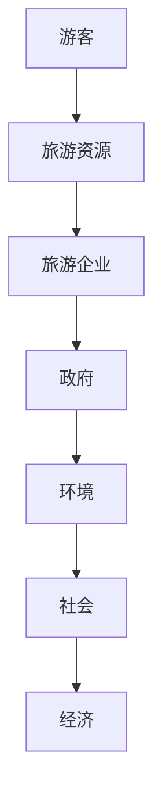
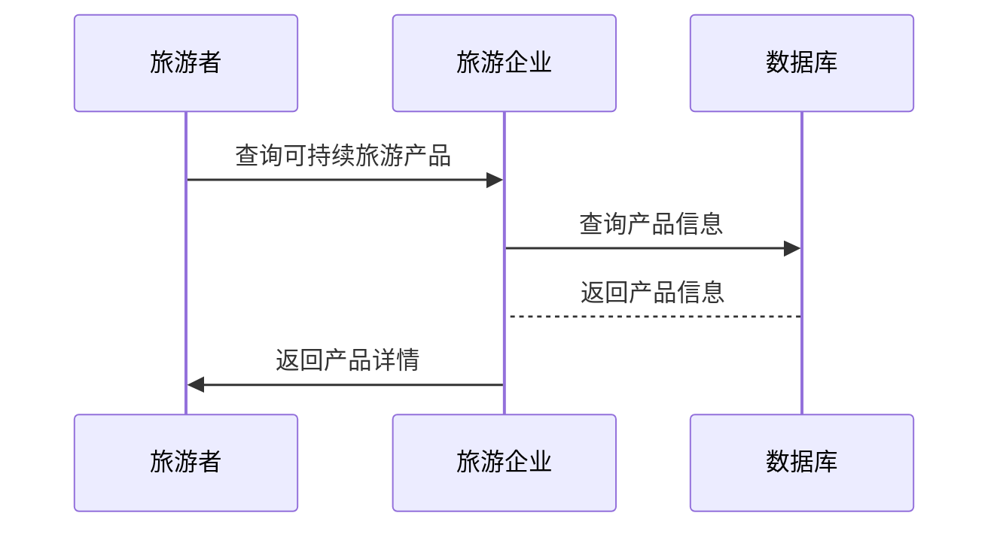

                 


# 可持续旅游业的投资机会与风险评估

## 关键词：可持续旅游，投资机会，风险评估，旅游业，绿色经济

## 摘要：  
可持续旅游业作为全球经济增长的重要驱动力，正面临着前所未有的投资机会与风险挑战。本文将深入分析可持续旅游业的核心概念、风险评估方法以及投资机会，结合系统模型与实际案例，为投资者提供科学的决策依据。通过构建系统的风险评估模型和机会分析框架，本文旨在帮助投资者在可持续旅游业中找到平衡点，实现经济效益与环境保护的双赢。

---

# 第一部分: 可持续旅游业的背景与核心概念

## 第1章: 可持续旅游的基本概念与问题背景

### 1.1 可持续旅游的定义与核心要素

#### 1.1.1 可持续旅游的定义  
可持续旅游（Sustainable Tourism）是一种旨在在满足当前旅游需求的同时，保护环境、促进经济和社会福祉的旅游实践。它强调在旅游开发和运营过程中，实现资源的高效利用和生态系统的保护，同时关注当地社区的参与和受益。

#### 1.1.2 可持续旅游的核心要素  
可持续旅游的核心要素包括：  
1. **环境保护**：减少对自然环境的破坏，保护生物多样性。  
2. **经济利益**：为当地社区创造经济价值，确保旅游收益的公平分配。  
3. **社会效益**：促进社会公平，提升当地居民的生活质量。  

#### 1.1.3 可持续旅游的边界与外延  
可持续旅游不仅关注旅游资源的开发，还包括旅游过程中的行为规范、游客的环保意识以及旅游企业的社会责任。其外延涉及政府政策、技术应用、文化传承等多个方面。

### 1.2 可持续旅游业的现状与发展趋势

#### 1.2.1 全球旅游业的现状分析  
全球旅游业近年来持续增长，但同时也面临资源过度开发、环境污染等问题。根据联合国世界旅游组织（UNWTO）的数据，2019年全球国际游客数量达到14.9亿人次，创历史新高。然而，旅游业的增长也带来了能源消耗、碳排放增加等问题。

#### 1.2.2 可持续旅游的发展趋势  
随着环保意识的增强，越来越多的游客开始选择可持续旅游方式。例如，生态旅游、低碳旅游等模式逐渐兴起。同时，政府和企业也在积极制定相关政策和标准，推动旅游业的可持续发展。

#### 1.2.3 可持续旅游与经济、社会、环境的协调发展  
可持续旅游的目标是在不破坏环境的前提下，实现经济和社会的可持续发展。它强调通过合理规划和管理，平衡旅游开发与环境保护之间的关系。

---

## 第2章: 可持续旅游业的核心概念与联系

### 2.1 可持续旅游的核心概念原理

#### 2.1.1 可持续旅游的三重底线原则  
可持续旅游遵循“三重底线”原则，即在经济、社会和环境三个方面实现可持续发展。  
1. **经济方面**：创造经济价值，确保旅游企业的盈利能力和当地社区的经济收益。  
2. **社会方面**：促进社会公平，尊重当地文化和习俗，提升居民生活质量。  
3. **环境方面**：减少资源消耗和环境污染，保护生态系统。  

#### 2.1.2 可持续旅游与绿色经济的关系  
可持续旅游是绿色经济的重要组成部分。通过优化资源配置、减少能源消耗和污染排放，可持续旅游为绿色经济的发展提供了新的增长点。

#### 2.1.3 可持续旅游与社会公平性  
可持续旅游强调社会公平，确保旅游收益能够公平分配，避免资源过度集中在少数人手中。同时，它关注当地居民的就业机会和权益保护。

### 2.2 可持续旅游的核心属性特征对比

#### 2.2.1 可持续旅游与传统旅游的对比分析  
| 特性 | 可持续旅游 | 传统旅游 |  
|------|------------|-----------|  
| 环境影响 | 最小化 | 较大 |  
| 经济收益 | 长期稳定 | 短期波动 |  
| 社会影响 | 积极 | 可能负面 |  

#### 2.2.2 可持续旅游的经济、社会、环境效益对比  
| 效益类型 | 经济效益 | 社会效益 | 环境效益 |  
|----------|-----------|-----------|-----------|  
| 核心目标 | 创造收益 | 提升生活质量 | 保护环境 |  
| 实现方式 | 合理定价、多元化产品 | 社区参与、文化传承 | 节能减排、生态修复 |  

#### 2.2.3 可持续旅游的风险与机会对比  
| 风险 | 机会 |  
|------|-------|  
| 环境破坏 | 市场需求增长 |  
| 经济波动 | 政策支持 |  
| 社会冲突 | 技术创新 |  

### 2.3 可持续旅游的ER实体关系图



---

# 第二部分: 可持续旅游业的风险评估与机会分析

## 第3章: 可持续旅游业的风险评估方法

### 3.1 风险评估的定性与定量分析

#### 3.1.1 定性风险分析方法  
定性分析主要通过专家访谈、问卷调查等方式，评估风险的影响程度和发生概率。例如，可以通过问卷调查了解游客对可持续旅游产品的接受程度。

#### 3.1.2 定量风险评估模型  
定量分析通过数学模型计算风险的具体数值。例如，使用概率加权法（PW）计算风险值：

$$ \text{风险值} = \sum (\text{风险发生概率} \times \text{风险影响程度}) $$

#### 3.1.3 综合分析方法  
综合分析方法结合定性和定量分析，通过层次分析法（AHP）等方法确定各风险因素的权重。

### 3.2 可持续旅游业的主要风险因素

#### 3.2.1 环境风险  
环境风险包括旅游资源退化、生态破坏等。例如，过度开发可能导致旅游资源枯竭。

#### 3.2.2 经济风险  
经济风险包括市场需求波动、成本上升等。例如，全球经济波动可能影响旅游需求。

#### 3.2.3 社会风险  
社会风险包括社区反对、文化冲突等。例如，旅游开发可能引发当地居民的不满。

#### 3.2.4 政策风险  
政策风险包括政策变化、法规调整等。例如，政府可能出台更严格的环保法规，增加企业成本。

### 3.3 风险的量化与管理策略

#### 3.3.1 风险量化模型  
使用线性回归模型预测风险发生概率：

$$ P = aX + b $$

其中，$P$ 是风险概率，$X$ 是影响因素，$a$ 和 $b$ 是参数。

#### 3.3.2 风险管理的策略选择  
根据风险的严重程度，采取不同的管理策略，如风险规避、转移、减轻和接受。

#### 3.3.3 风险转移与规避机制  
通过保险、合作等方式转移风险，或通过技术创新规避风险。

## 第4章: 可持续旅游业的投资机会分析

### 4.1 投资机会的识别与评估

#### 4.1.1 可持续旅游项目的市场潜力  
随着环保意识的增强，可持续旅游市场潜力巨大。例如，生态旅游、低碳旅游等模式市场需求增长迅速。

#### 4.1.2 可持续旅游产品的创新机会  
开发新型旅游产品，如生态旅游线路、绿色酒店等，能够吸引更多的游客。

#### 4.1.3 可持续旅游技术的应用前景  
利用大数据、人工智能等技术优化旅游管理，提升游客体验。

### 4.2 投资机会的经济与社会价值

#### 4.2.1 可持续旅游的经济收益分析  
通过合理定价和多元化产品，可持续旅游能够创造稳定的经济收益。

#### 4.2.2 可持续旅游的社会价值创造  
可持续旅游能够提升当地居民的就业机会和生活质量，促进社会公平。

#### 4.2.3 可持续旅游的环境效益评估  
通过节能减排和生态修复，可持续旅游能够有效保护环境。

### 4.3 投资机会的风险与收益平衡

#### 4.3.1 投资机会的收益与风险对比  
可持续旅游的投资收益稳定，但需要面对环境、经济和社会等多重风险。

#### 4.3.2 可持续旅游项目的可行性分析  
通过SWOT分析等方法，评估项目的可行性。

#### 4.3.3 投资机会的长期与短期价值  
可持续旅游具有长期稳定的收益，但也需要较长的投资周期。

---

# 第三部分: 可持续旅游业的系统分析与项目实战

## 第5章: 可持续旅游业的系统分析

### 5.1 问题场景介绍  
以一个生态旅游景区为例，分析其在可持续旅游发展中的问题和机会。

### 5.2 系统功能设计

#### 5.2.1 领域模型（mermaid类图）  


### 5.3 系统架构设计

#### 5.3.1 系统架构图（mermaid架构图）  


### 5.4 系统接口设计  
定义系统接口，如游客预订、企业数据提交等。

### 5.5 系统交互设计（mermaid序列图）  


## 第6章: 项目实战

### 6.1 环境安装  
安装必要的开发工具，如Python、Django框架等。

### 6.2 系统核心实现源代码  
以下是一个简单的可持续旅游项目管理系统的核心代码：

```python
# 可持续旅游项目管理系统
class TourismProject:
    def __init__(self, name, location):
        self.name = name
        self.location = location
        self.profit = 0

    def calculate_profit(self, revenue, cost):
        self.profit = revenue - cost
        return self.profit

    def assess_sustainability(self):
        # 假设评估指标为利润和环境影响
        if self.profit > 0 and self.location.is_sustainable():
            return True
        else:
            return False

# 示例用法
project = TourismProject("生态度假村", True)
project.calculate_profit(50000, 30000)
print(project.profit)  # 输出：20000
print(project.assess_sustainability())  # 输出：True
```

### 6.3 代码应用解读与分析  
上述代码实现了旅游项目的利润计算和可持续性评估功能。通过`calculate_profit`方法计算项目利润，通过`assess_sustainability`方法评估项目的可持续性。

### 6.4 实际案例分析  
以某生态度假村为例，分析其投资机会和风险。

### 6.5 项目小结  
通过系统分析和项目实战，投资者可以更好地理解可持续旅游的潜力和挑战，制定科学的投资策略。

---

## 结语

可持续旅游业的投资机会与风险评估是一个复杂但充满潜力的领域。通过系统的分析和科学的决策，投资者可以在保护环境的同时，实现经济效益的最大化。未来，随着技术的进步和社会的发展，可持续旅游将变得更加重要，成为全球经济增长的重要驱动力。

---

**最佳实践 Tips：**  
1. 在进行可持续旅游投资时，建议优先选择具有政策支持和市场需求的项目。  
2. 与当地社区合作，确保社会公平和利益共享。  
3. 关注技术创新，利用大数据和人工智能优化旅游管理。  
4. 定期进行风险评估和调整投资策略。

