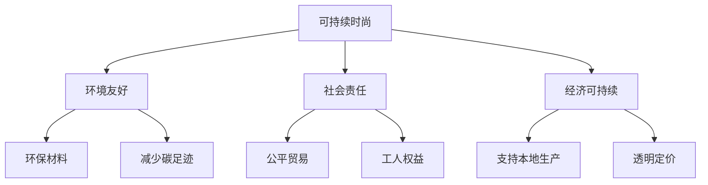
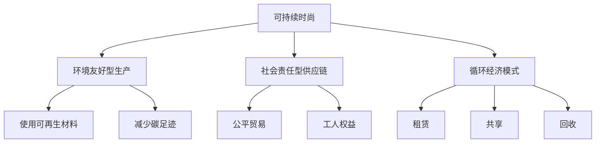
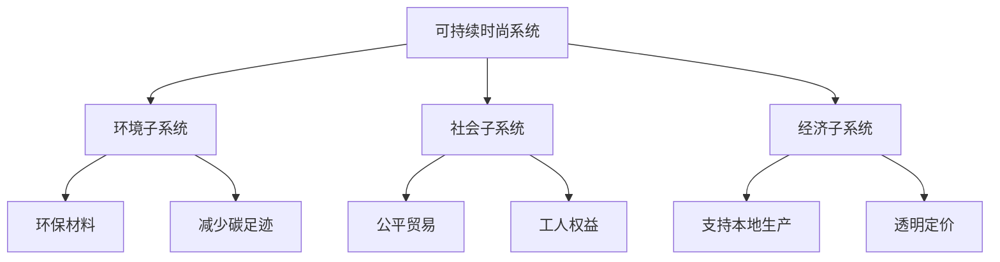

                 


# 可持续时尚产业的发展趋势与投资前景

## 关键词：
可持续时尚，发展趋势，投资前景，环保材料，循环经济，可持续商业模式

## 摘要：
本文深入探讨了可持续时尚产业的背景、核心概念、发展趋势以及投资前景。通过分析环境、社会和经济三个维度，揭示了可持续时尚产业与传统时尚产业的差异，并结合实际案例，探讨了可持续时尚的投资机会和挑战。本文还详细介绍了可持续时尚产业的算法与数学模型，系统分析与架构设计，并通过项目实战展示了可持续时尚的实际应用。最后，本文总结了可持续时尚产业的未来发展方向和投资建议。

---

## 第一部分：可持续时尚产业的背景与概念

### 第1章：可持续时尚的背景与问题背景

#### 1.1 可持续发展的背景与问题背景
可持续发展是全球关注的焦点，尤其是在时尚产业。随着工业化和消费主义的普及，传统时尚产业对环境、社会和经济造成了巨大压力。过度生产和浪费导致资源枯竭、环境污染和社会不公。因此，可持续时尚的兴起是应对这些挑战的重要途径。

#### 1.2 可持续时尚的定义与核心要素
可持续时尚是指在服装、鞋类和配饰的设计、生产、分销、使用和 disposal 等全生命周期中，最大限度地减少对环境的负面影响，同时促进社会公平和经济可持续性。其核心要素包括：
1. **环境友好**：使用环保材料、减少碳足迹、节约资源。
2. **社会责任**：公平贸易、工人权益保护、反对童工。
3. **经济可持续**：支持小型企业、本地生产、透明定价。

#### 1.3 可持续时尚与传统时尚的对比
| **维度**       | **可持续时尚**                          | **传统时尚**                            |
|----------------|----------------------------------------|----------------------------------------|
| **材料使用**    | 使用环保材料，如有机棉、再生聚酯纤维 | 常规材料，可能包含有害物质             |
| **生产方式**    | 环保生产，减少水和能源消耗             | 可能存在污染性生产                     |
| **社会责任**    | 公平贸易，工人权益保护                 | 可能存在剥削性劳动条件                 |
| **消费模式**    | 鼓励循环经济，提倡共享和再利用         | 一次性消费，产生大量废弃物             |

### 第1.3节：核心概念的架构图


---

## 第二部分：可持续时尚产业的核心概念与联系

### 第2章：可持续时尚的核心概念与原理

#### 2.1 可持续时尚的核心概念
可持续时尚不仅仅是生产环保产品，更是一种整体的商业模式创新。它强调从“快时尚”转向“慢时尚”，鼓励消费者减少过度消费，延长产品生命周期。

#### 2.2 可持续时尚的核心原理
- **环境友好型生产**：使用可再生材料，减少水和能源消耗。
- **社会责任型供应链**：确保工人权益，避免剥削性劳动。
- **循环经济模式**：通过租赁、共享和回收等方式延长产品生命周期。

### 第2.2节：可持续时尚的核心原理架构图


---

## 第三部分：可持续时尚产业的算法与数学模型

### 第3章：可持续时尚产业的算法原理

#### 3.1 环境影响评估算法
环境影响评估算法用于量化时尚产品对环境的综合影响，包括材料使用、水消耗、碳排放等。公式如下：
$$
\text{环境影响指数} = \sum_{i=1}^{n} w_i \times x_i
$$
其中，$w_i$ 是第 $i$ 个因素的权重，$x_i$ 是第 $i$ 个因素的具体影响值。

#### 3.2 社会责任评估算法
社会责任评估算法用于评估时尚产业的社会责任履行情况，包括工人权益、公平贸易等。公式如下：
$$
\text{社会责任指数} = \sum_{j=1}^{m} w_j \times y_j
$$
其中，$w_j$ 是第 $j$ 个因素的权重，$y_j$ 是第 $j$ 个因素的具体影响值。

### 第3.2节：可持续时尚产业的数学模型
#### 环境影响评估模型
$$
\text{环境影响} = \alpha \times \text{材料影响} + \beta \times \text{水消耗} + \gamma \times \text{碳排放}
$$

#### 社会责任评估模型
$$
\text{社会责任} = \alpha \times \text{工人权益} + \beta \times \text{公平贸易} + \gamma \times \text{社会公益}
$$

---

## 第四部分：可持续时尚产业的系统分析与架构设计

### 第4章：可持续时尚产业的系统分析

#### 4.1 系统分析
可持续时尚产业的系统分析包括环境、社会和经济三个维度的系统分析。通过分析各维度的相互作用，优化整个系统的可持续性。

#### 4.2 系统架构设计


---

## 第五部分：可持续时尚产业的项目实战

### 第5章：可持续时尚产业的项目实战

#### 5.1 项目环境与工具安装
- **环境**：Python 3.8+
- **工具**：Jupyter Notebook，Mermaid，Git

#### 5.2 核心代码实现
```python
def calculate_environmental_impact(material_usage, water_consumption, carbon_emission):
    return material_usage * 0.5 + water_consumption * 0.3 + carbon_emission * 0.2

def calculate_social Responsibility(fair_trade, worker_rights, social_contributions):
    return fair_trade * 0.4 + worker_rights * 0.3 + social_contributions * 0.3

# 示例计算
material_usage = 100
water_consumption = 50
carbon_emission = 80
fair_trade = 0.8
worker_rights = 0.7
social_contributions = 0.9

environmental_impact = calculate_environmental_impact(material_usage, water_consumption, carbon_emission)
social_responsibility = calculate_social Responsibility(fair_trade, worker_rights, social_contributions)

print("环境影响指数:", environmental_impact)
print("社会责任指数:", social_responsibility)
```

---

## 第六部分：结论

### 6.1 总结
可持续时尚产业是未来发展的趋势，其在环境、社会和经济三个维度的平衡将推动整个产业的升级。通过技术创新和商业模式创新，可持续时尚产业将实现经济增长与环境保护的双赢。

### 6.2 投资建议
- **关注环保材料**：投资使用环保材料的公司。
- **支持循环经济**：投资租赁、共享和回收模式的公司。
- **关注社会责任**：投资公平贸易和工人权益保护的公司。

### 6.3 展望
未来，可持续时尚产业将更加成熟，技术进步和消费者意识的提高将进一步推动其发展。投资可持续时尚产业将带来可观的经济回报和社会价值。

---

通过以上分析，我们看到可持续时尚产业不仅在环境保护方面具有重要意义，也在经济和社会方面展现了巨大的潜力。未来，随着技术的进步和消费者意识的提高，可持续时尚产业将更加繁荣。

