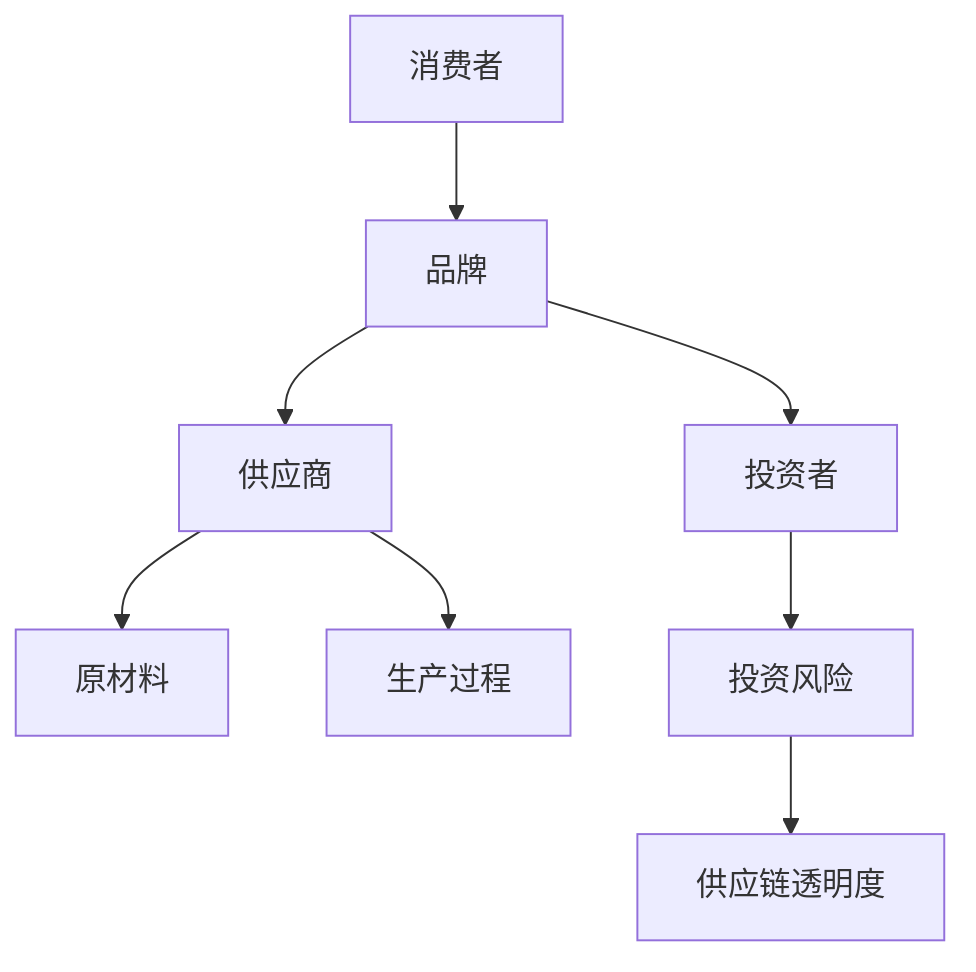
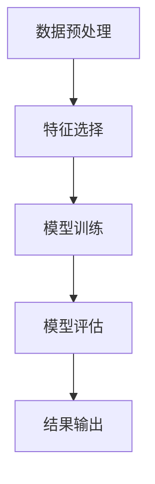
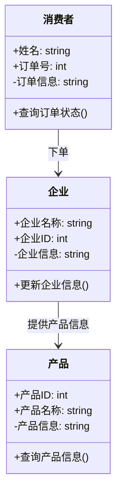
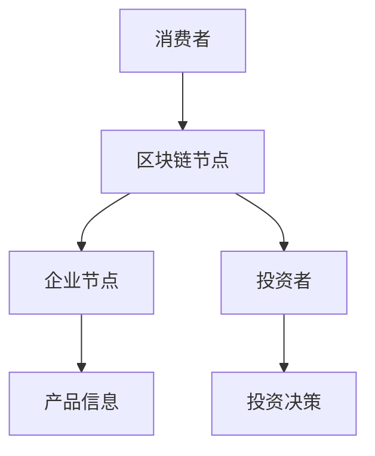
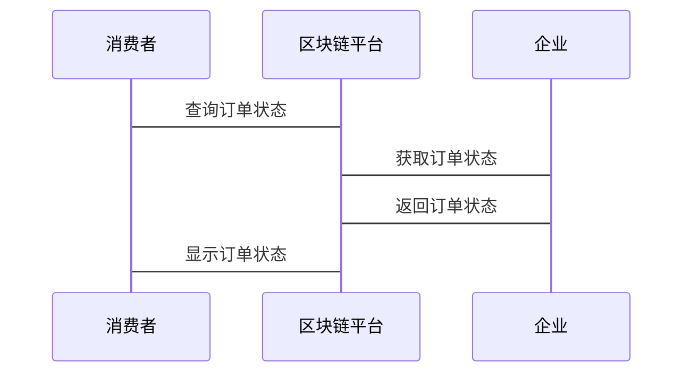

                 


# 可持续时尚供应链的透明度与投资风险

## 关键词：
- 可持续时尚
- 供应链透明度
- 投资风险
- 数据分析
- 系统架构

## 摘要：
本文探讨了可持续时尚供应链中的透明度与投资风险之间的关系。通过分析透明度对投资风险的影响，本文提出了结合数据分析和系统架构的方法，以降低投资风险并提升供应链的可持续性。文章详细介绍了透明度和投资风险的核心概念、算法原理、系统设计及实际案例，为投资决策提供了实践指导。

---

# 第一部分: 可持续时尚供应链的背景与概念

## 第1章: 可持续时尚供应链的背景与概念

### 1.1 可持续时尚的定义与内涵
可持续时尚是一种以环境保护和社会责任为核心，通过减少资源消耗、降低污染和提高社会福祉的服装产业模式。其内涵包括从原材料采购、生产过程到产品生命周期的全链条可持续性。

- **1.1.1 可持续时尚的定义**  
  可持续时尚强调在满足消费者需求的同时，最大限度地减少对环境的负面影响，并确保生产过程中的社会公平性。

- **1.1.2 可持续时尚的核心内涵**  
  可持续时尚关注材料的环保性、生产过程的公平性以及产品的循环利用性。例如，使用有机棉和再生聚酯纤维，以及采用零排放的生产技术。

- **1.1.3 可持续时尚与传统时尚的区别**  
  传统时尚模式往往以快时尚为主，追求低价和快速生产，而可持续时尚注重产品质量和长期性，强调生态和社会责任。

---

### 1.2 供应链透明度的定义与重要性
供应链透明度是指供应链各环节的信息公开程度，包括原材料来源、生产过程、运输和交付等信息。透明度越高，消费者和投资者越能信任企业的社会责任履行情况。

- **1.2.1 供应链透明度的定义**  
  供应链透明度是指企业在供应链各环节中向消费者、投资者和其他利益相关方公开信息的程度。

- **1.2.2 供应链透明度的重要性**  
  透明度高的供应链有助于建立消费者信任，减少供应链中的不道德行为，如童工和环境污染。同时，透明度高的企业更容易吸引投资，提升品牌价值。

- **1.2.3 供应链透明度与企业社会责任的关系**  
  企业社会责任（CSR）要求企业在经营过程中关注环境、社会和治理（ESG）因素。供应链透明度是企业履行CSR的重要体现。

---

### 1.3 投资风险的定义与分类
投资风险是指在投资过程中由于不确定性因素导致投资收益低于预期甚至损失本金的风险。投资风险可以分为系统性风险和非系统性风险。

- **1.3.1 投资风险的定义**  
  投资风险是指在投资过程中，由于市场波动、政策变化、企业经营状况等因素导致投资收益不确定的风险。

- **1.3.2 投资风险的分类**  
  - **系统性风险**：由整体市场环境变化引起的风险，如经济衰退和政策变化。
  - **非系统性风险**：由企业自身经营状况变化引起的风险，如管理不善和产品质量问题。

- **1.3.3 投资风险与供应链透明度的关系**  
  供应链透明度高的企业更容易获得投资者的信任，降低投资风险。同时，透明度高的供应链能够及时发现和解决潜在问题，减少因供应链中断导致的风险。

---

### 1.4 可持续时尚供应链透明度与投资风险的核心问题
- **问题背景**  
  随着消费者环保意识的增强，企业若不注重供应链的透明度，容易面临消费者 boycott 和投资风险。

- **问题描述**  
  可持续时尚供应链中的透明度不足可能导致投资者无法准确评估企业的社会责任履行情况，从而影响投资决策。

- **问题解决的思路**  
  通过建立透明的供应链信息管理系统，利用大数据和区块链技术，提高供应链的可追溯性和透明度。

- **问题的边界与外延**  
  供应链透明度的提升需要企业内部和外部利益相关方的共同努力，包括消费者、投资者和监管机构。

- **核心概念与组成要素**  
  可持续时尚供应链透明度的核心要素包括：原材料来源、生产过程、碳排放、社会责任和产品生命周期。

---

### 1.5 本章小结
本章从可持续时尚的定义、供应链透明度的重要性以及投资风险的分类入手，分析了可持续时尚供应链透明度与投资风险的核心问题。透明度高的供应链能够降低投资风险，同时提升企业的社会责任履行能力。

---

# 第二部分: 可持续时尚供应链透明度与投资风险的核心概念与联系

## 第2章: 可持续时尚供应链透明度与投资风险的核心概念与联系

### 2.1 可持续时尚供应链透明度的核心原理
- **透明度的实现机制**  
  通过区块链技术和大数据分析，实现供应链各环节信息的实时追踪和记录，确保信息的真实性和可追溯性。

- **透明度的关键驱动因素**  
  - 消费者需求：消费者对环保和社会责任的关注推动企业提高透明度。
  - 政策法规：政府出台的环保法规要求企业公开供应链信息。
  - 技术支持：大数据和区块链技术为供应链透明度的实现提供了技术保障。

- **透明度与消费者信任的关系**  
  透明度高的供应链能够增强消费者的信任，提升品牌形象，从而间接降低投资风险。

---

### 2.2 投资风险的核心原理
- **投资风险的来源**  
  - 市场风险：市场需求变化导致的库存积压和产品贬值。
  - 供应链风险：原材料供应中断或生产成本上升导致的利润下降。
  - 环境风险：环境政策变化或环境事件对企业声誉的影响。

- **透明度对投资风险的影响**  
  透明度高的供应链能够降低环境风险和供应链中断的风险，从而降低投资风险。

---

### 2.3 可持续时尚供应链透明度与投资风险的联系
- **透明度对投资风险的影响**  
  透明度高的供应链能够降低环境风险和供应链中断的风险，从而降低投资风险。

- **投资风险对供应链透明度的反向影响**  
  高投资风险可能导致投资者对企业的透明度要求更高，从而推动企业提高供应链的透明度。

- **两者的协同关系与动态平衡**  
  在可持续时尚供应链中，透明度和投资风险之间存在动态平衡关系。透明度的提升可以降低投资风险，而投资风险的变化也会反过来影响透明度的实现。

---

### 2.4 核心概念的属性特征对比
下表展示了可持续时尚供应链透明度与投资风险的核心概念在属性特征上的对比：

| 属性        | 供应链透明度                          | 投资风险                              |
|-------------|--------------------------------------|--------------------------------------|
| **定义**    | 供应链各环节信息的公开程度          | 投资过程中收益的不确定性           |
| **影响因素** | 企业的信息公开能力、技术实现能力    | 市场波动、政策变化、企业经营状况   |
| **目标**    | 提高企业社会责任履行能力              | 降低投资风险，提高投资回报率        |
| **结果**    | 建立消费者信任，提升品牌形象          | 优化投资决策，降低损失              |

---

### 2.5 ER实体关系图
以下是供应链透明度与投资风险的实体关系图：



---

# 第三部分: 可持续时尚供应链透明度与投资风险的算法原理

## 第3章: 可持续时尚供应链透明度与投资风险的算法原理

### 3.1 数据分析算法原理
为了评估供应链透明度对投资风险的影响，我们采用数据挖掘和机器学习算法，分析历史数据中的潜在关联性。

- **数据预处理**  
  对收集到的供应链数据进行清洗和标准化处理，确保数据的准确性和一致性。

- **特征选择**  
  从供应链数据中提取关键特征，如原材料来源、生产过程中的碳排放量、社会责任履行情况等。

- **模型训练**  
  使用随机森林算法对数据进行分类，识别供应链透明度与投资风险之间的关系。

---

### 3.2 投资风险评估的算法原理
投资风险评估模型采用线性回归和概率模型，结合供应链透明度数据，预测投资风险。

- **线性回归模型**  
  $$ \text{投资风险} = \beta_0 + \beta_1 \times \text{透明度} + \epsilon $$  
  其中，$$\beta_0$$ 是截距，$$\beta_1$$ 是透明度的回归系数，$$\epsilon$$ 是误差项。

- **概率模型**  
  使用逻辑回归模型预测供应链透明度对投资风险的影响概率。

---

### 3.3 算法实现
以下是投资风险评估的Python代码实现：

```python
import pandas as pd
from sklearn.linear_model import LinearRegression
from sklearn.metrics import mean_squared_error

# 数据预处理
data = pd.read_csv('supply_chain.csv')
data = data.dropna()
data = (data - data.mean()) / data.std()  # 标准化处理

# 特征选择
features = data[['transparency', 'carbon_emission', 'social Responsibility']]
target = data['investment_risk']

# 模型训练
model = LinearRegression()
model.fit(features, target)

# 模型评估
predictions = model.predict(features)
 mse = mean_squared_error(target, predictions)
 print('均方误差:', mse)
```

---

### 3.4 算法流程图
以下是投资风险评估算法的流程图：



---

# 第四部分: 可持续时尚供应链透明度与投资风险的系统分析与架构设计

## 第4章: 可持续时尚供应链透明度与投资风险的系统分析与架构设计

### 4.1 问题场景介绍
为了降低投资风险，我们设计了一个基于区块链技术的供应链透明度管理系统，实现供应链各环节信息的实时追踪和记录。

---

### 4.2 系统功能设计
以下是系统的功能模块设计：



---

### 4.3 系统架构设计
以下是系统的架构设计图：



---

### 4.4 系统接口设计
- **消费者查询接口**  
  消费者可以通过区块链平台查询订单状态和产品信息。

- **企业信息更新接口**  
  企业可以通过区块链平台更新企业信息和产品信息。

---

### 4.5 系统交互设计
以下是系统交互的序列图：



---

# 第五部分: 可持续时尚供应链透明度与投资风险的项目实战

## 第5章: 可持续时尚供应链透明度与投资风险的项目实战

### 5.1 项目背景
本项目旨在通过区块链技术和大数据分析，提高可持续时尚供应链的透明度，降低投资风险。

---

### 5.2 核心代码实现
以下是供应链透明度管理系统的Python代码实现：

```python
import hashlib
import json
from datetime import datetime

class Block:
    def __init__(self, data):
        self.data = data
        self.timestamp = datetime.now()
        self.previous_hash = None
        self.hash = self.compute_hash()

    def compute_hash(self):
        return hashlib.sha256(json.dumps(self.data).encode()).hexdigest()

class Blockchain:
    def __init__(self):
        self.chain = []
        self.create_genesis_block()

    def create_genesis_block(self):
        genesis_data = {
            'message': 'Genesis Block',
            'timestamp': str(datetime.now())
        }
        self.chain.append(Block(genesis_data))

    def add_block(self, data):
        last_block = self.chain[-1]
        new_block = Block(data)
        new_block.previous_hash = last_block.hash
        self.chain.append(new_block)

# 创建区块链实例
blockchain = Blockchain()

# 添加订单信息
order_data = {
    'product_id': '123',
    'customer_name': '张三',
    'order_date': str(datetime.now())
}
blockchain.add_block(order_data)

# 查询订单信息
def get_block_by_index(index):
    return blockchain.chain[index]

# 返回订单信息
print(get_block_by_index(-1).data)
```

---

### 5.3 代码应用解读
上述代码实现了一个简单的区块链系统，用于记录订单信息。通过区块链技术，我们可以确保订单信息的不可篡改性和可追溯性，提高供应链的透明度。

---

### 5.4 案例分析
以下是一个实际案例分析：

- **案例背景**  
  某品牌服装企业希望通过区块链技术实现供应链透明化，降低投资风险。

- **实施步骤**  
  1. 企业与供应商签订透明化协议，确保原材料来源和生产过程的信息公开。
  2. 使用区块链技术记录原材料采购、生产过程和运输信息。
  3. 投资者通过区块链平台查询供应链信息，评估投资风险。

- **结果分析**  
  透明度的提高使投资者对企业的社会责任履行情况更加信任，降低了投资风险，提升了品牌价值。

---

### 5.5 本章小结
本章通过一个实际案例展示了如何利用区块链技术和大数据分析提高供应链透明度，降低投资风险。通过区块链技术实现的信息追溯和数据透明化，为投资决策提供了可靠依据。

---

# 第六部分: 可持续时尚供应链透明度与投资风险的总结与展望

## 第6章: 可持续时尚供应链透明度与投资风险的总结与展望

### 6.1 总结
本文从可持续时尚供应链的透明度与投资风险入手，分析了透明度对投资风险的影响，提出了结合区块链技术和大数据分析的解决方案。通过案例分析，验证了透明度的提高能够降低投资风险，提升企业社会责任履行能力。

---

### 6.2 最佳实践
- **企业层面**  
  企业应积极采用区块链技术和大数据分析，建立透明的供应链信息管理系统。

- **投资者层面**  
  投资者应关注企业的供应链透明度，选择透明度高、社会责任履行能力强的企业进行投资。

- **政府层面**  
  政府应出台相关政策，鼓励企业提高供应链透明度，推动可持续时尚的发展。

---

### 6.3 注意事项
- **数据隐私**  
  在提高供应链透明度的同时，企业需要保护自身的数据隐私，防止信息泄露。

- **技术实现**  
  区块链技术和大数据分析的实现需要投入大量资源，企业需要做好技术储备。

---

### 6.4 拓展阅读
- **区块链技术在供应链管理中的应用**  
  推荐阅读《Blockchain in Supply Chain Management》。
- **可持续时尚与投资风险**  
  推荐阅读《Sustainable Fashion and Investment Risk》。

---

# 结语
通过本文的分析，我们可以看到，可持续时尚供应链的透明度与投资风险之间存在着密切的联系。企业和社会需要共同努力，推动供应链的透明化，降低投资风险，实现可持续发展。未来，随着技术的不断进步，可持续时尚供应链的透明度和投资风险管理将变得更加高效和精准。

