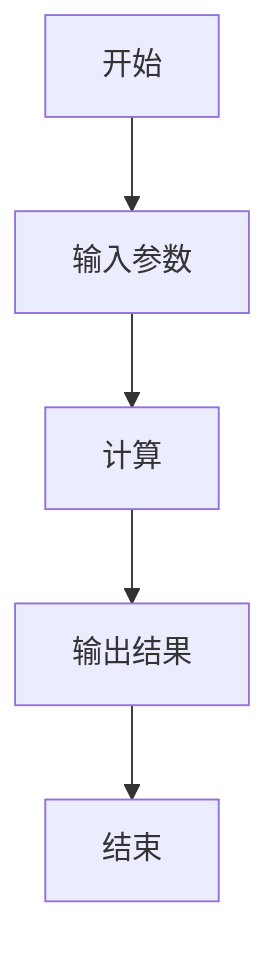
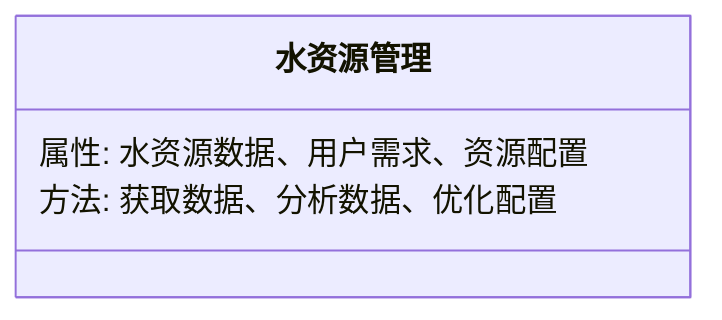
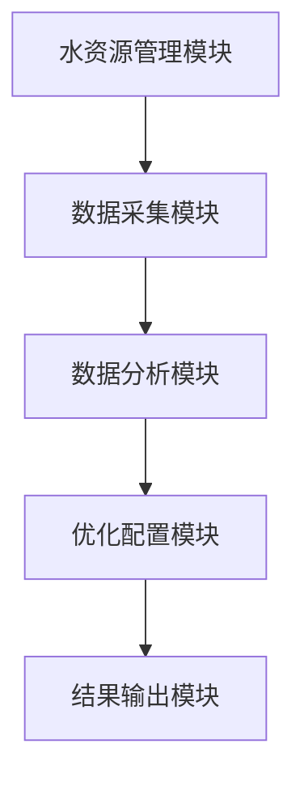
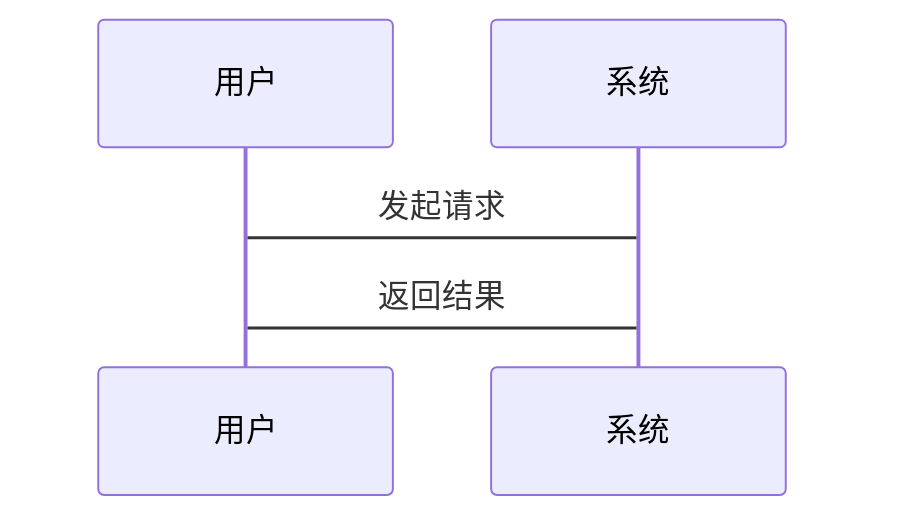

                 


# 可持续水资源管理的创新商业模式研究

---

## 关键词

- 可持续水资源管理  
- 创新商业模式  
- 资源优化配置  
- 大数据应用  
- 绿色金融  

---

## 摘要

随着全球水资源短缺问题日益严重，可持续水资源管理已成为全球关注的焦点。传统的水资源管理模式面临效率低下、资源浪费和环境破坏等问题，亟需通过创新的商业模式来实现资源的高效利用和可持续发展。本文从可持续水资源管理的核心要素出发，分析创新商业模式的定义、分类及其在水资源管理中的应用场景。通过案例分析和理论探讨，本文提出了基于共享经济、大数据优化配置和绿色金融的创新商业模式，为水资源管理的可持续发展提供了理论支持和实践指导。

---

## 第一部分：可持续水资源管理的背景与挑战

### 第1章：可持续水资源管理的背景介绍

#### 1.1 可持续水资源管理的定义与核心概念

- 1.1.1 水资源管理的基本概念
  - 水资源的定义与分类
  - 水资源的开发与利用
  - 水资源的保护与修复

- 1.1.2 可持续水资源管理的内涵
  - 可持续发展的定义
  - 可持续水资源管理的目标
  - 可持续水资源管理的原则

- 1.1.3 可持续水资源管理的核心要素
  - 资源要素
  - 经济要素
  - 社会要素
  - 环境要素

#### 1.2 创新商业模式的定义与分类

- 1.2.1 商业模式的基本概念
  - 商业模式的定义
  - 商业模式的核心要素
  - 商业模式的分类

- 1.2.2 创新商业模式的分类
  - 基于共享经济的商业模式
  - 基于大数据的商业模式
  - 基于绿色金融的商业模式

- 1.2.3 可持续水资源管理中的商业模式创新
  - 创新商业模式在水资源管理中的应用
  - 创新商业模式的优势与挑战

### 第2章：可持续水资源管理的核心要素与问题背景

#### 2.1 可持续水资源管理的现状与问题

- 2.1.1 全球水资源分布与利用现状
  - 水资源分布的不均衡性
  - 水资源利用的低效性

- 2.1.2 可持续水资源管理的主要问题
  - 水资源浪费
  - 水污染问题
  - 资源分配不均

- 2.1.3 可持续水资源管理的必要性
  - 应对气候变化
  - 保障水资源安全
  - 促进可持续发展

#### 2.2 可持续水资源管理的核心要素

- 2.2.1 水资源的物理特性
  - 水资源的循环特性
  - 水资源的可再生性

- 2.2.2 水资源的经济价值
  - 水资源的经济利用
  - 水资源的市场价值

- 2.2.3 水资源的社会价值
  - 水资源与社会稳定
  - 水资源与社会公平

### 第3章：可持续水资源管理的创新商业模式

#### 3.1 创新商业模式的核心要素

- 3.1.1 价值主张
  - 价值主张的定义
  - 价值主张在水资源管理中的应用

- 3.1.2 客户关系
  - 客户关系的定义
  - 客户关系在水资源管理中的应用

- 3.1.3 资源配置
  - 资源配置的定义
  - 资源配置在水资源管理中的应用

- 3.1.4 价值传递
  - 价值传递的定义
  - 价值传递在水资源管理中的应用

#### 3.2 可持续水资源管理中的商业模式创新

- 3.2.1 基于共享经济的水资源管理模式
  - 共享经济的定义
  - 共享经济在水资源管理中的应用

- 3.2.2 基于大数据的水资源优化配置模式
  - 大数据的定义
  - 大数据在水资源管理中的应用

- 3.2.3 基于绿色金融的水资源可持续发展模式
  - 绿色金融的定义
  - 绿色金融在水资源管理中的应用

### 第4章：可持续水资源管理的创新商业模式的核心概念与联系

#### 4.1 创新商业模式的核心概念

- 4.1.1 创新商业模式的原理
  - 创新商业模式的基本原理
  - 创新商业模式的核心要素

- 4.1.2 创新商业模式的属性特征对比
  - 表格形式对比
  - 图形形式对比

- 4.1.3 创新商业模式的ER实体关系图

```mermaid
er
actor 创新商业模式核心概念 {
  类别: 创新商业模式核心要素
  属性: 价值主张、客户关系、资源配置、价值传递
}
```

---

## 第二部分：可持续水资源管理的创新商业模式的算法与系统分析

### 第5章：可持续水资源管理的创新商业模式的算法原理

#### 5.1 创新商业模式的算法原理

- 5.1.1 算法的定义
  - 算法的基本概念
  - 算法的核心要素

- 5.1.2 创新商业模式的算法原理
  - 创新商业模式的算法流程
  - 创新商业模式的算法实现

#### 5.2 创新商业模式的算法实现

- 5.2.1 算法的流程图



- 5.2.2 算法的数学模型

$$
\text{数学模型的定义与推导}
$$

- 5.2.3 算法的Python代码实现

```python
def innovative_business_model():
    # 算法的实现
    pass
```

#### 5.3 创新商业模式的数学模型

- 5.3.1 数学模型的定义
  - 数学模型的基本概念
  - 数学模型的核心要素

- 5.3.2 数学模型的推导
  - 数学模型的推导过程
  - 数学模型的验证

- 5.3.3 数学模型的应用
  - 数学模型在水资源管理中的应用
  - 数学模型的优化

### 第6章：可持续水资源管理的创新商业模式的系统分析与架构设计

#### 6.1 系统分析

- 6.1.1 问题场景介绍
  - 问题场景的定义
  - 问题场景的分析

- 6.1.2 系统功能设计
  - 系统功能的定义
  - 系统功能的实现

- 6.1.3 系统功能的领域模型



#### 6.2 系统架构设计

- 6.2.1 系统架构的定义
  - 系统架构的基本概念
  - 系统架构的核心要素

- 6.2.2 系统架构的实现



- 6.2.3 系统架构的优化
  - 系统架构的优化方法
  - 系统架构的优化效果

#### 6.3 接口设计与交互流程

- 6.3.1 接口设计
  - 接口的定义
  - 接口的设计

- 6.3.2 交互流程图



### 第7章：可持续水资源管理的创新商业模式的项目实战

#### 7.1 环境安装与系统配置

- 7.1.1 环境安装
  - 安装Python
  - 安装相关库

- 7.1.2 系统配置
  - 系统配置的步骤
  - 系统配置的注意事项

#### 7.2 系统核心实现

- 7.2.1 核心代码实现

```python
def main():
    # 核心代码实现
    pass
```

- 7.2.2 代码解读与分析
  - 代码的功能解读
  - 代码的优化建议

#### 7.3 实际案例分析

- 7.3.1 案例背景介绍
  - 案例的定义
  - 案例的分析

- 7.3.2 案例的实现过程
  - 案例的实现步骤
  - 案例的实现结果

- 7.3.3 案例的总结与反思
  - 案例的总结
  - 案例的反思

#### 7.4 项目小结

- 7.4.1 项目的总结
  - 项目的成果
  - 项目的不足

- 7.4.2 项目的未来展望
  - 项目的优化方向
  - 项目的拓展方向

---

## 第三部分：可持续水资源管理的创新商业模式的最佳实践与总结

### 第8章：可持续水资源管理的创新商业模式的最佳实践

#### 8.1 创新商业模式的最佳实践

- 8.1.1 最佳实践的定义
  - 最佳实践的基本概念
  - 最佳实践的核心要素

- 8.1.2 最佳实践的分类
  - 最佳实践的分类方法
  - 最佳实践的分类结果

- 8.1.3 最佳实践的应用

#### 8.2 创新商业模式的小结

- 8.2.1 小结的定义
  - 小结的基本概念
  - 小结的核心要素

- 8.2.2 小结的内容
  - 小结的内容结构
  - 小结的内容详细解读

### 第9章：可持续水资源管理的创新商业模式的注意事项与拓展阅读

#### 9.1 注意事项

- 9.1.1 注意事项的定义
  - 注意事项的基本概念
  - 注意事项的核心要素

- 9.1.2 注意事项的分类
  - 注意事项的分类方法
  - 注意事项的分类结果

- 9.1.3 注意事项的应用

#### 9.2 拓展阅读

- 9.2.1 拓展阅读的定义
  - 拓展阅读的基本概念
  - 拓展阅读的核心要素

- 9.2.2 拓展阅读的分类
  - 拓展阅读的分类方法
  - 拓展阅读的分类结果

- 9.2.3 拓展阅读的应用

---

## 总结

通过以上章节的详细分析与探讨，我们深入了解了可持续水资源管理的创新商业模式的核心概念、算法原理、系统架构设计以及实际应用。未来，随着技术的不断进步和社会的发展，创新商业模式将在可持续水资源管理中发挥越来越重要的作用。

