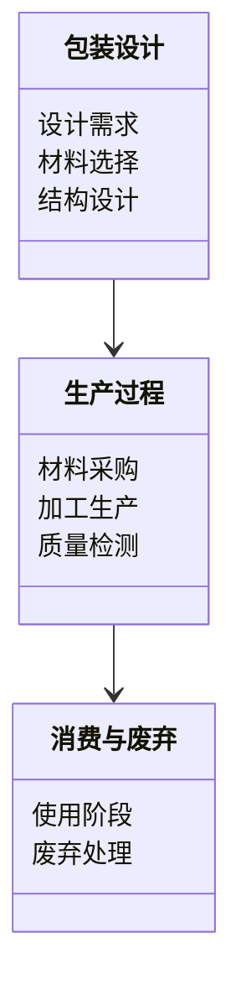
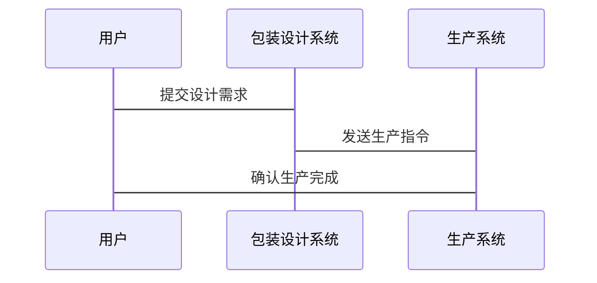

                 


# 可持续食品包装创新的市场接受度研究

## 关键词
- 可持续包装
- 食品包装创新
- 市场接受度
- 消费者行为
- 环保材料

## 摘要
《可持续食品包装创新的市场接受度研究》一书深入探讨了可持续食品包装的创新技术及其在市场中的接受度。通过对消费者行为、技术发展和市场策略的系统分析，本书揭示了影响市场接受度的关键因素，并提出了优化策略。书中结合实际案例，分析了环保材料、智能包装等创新技术的应用，为食品包装行业提供了理论支持和实践指导。

---

# 第1章：可持续包装的定义与背景

## 1.1 可持续包装的定义与核心概念
### 1.1.1 可持续包装的定义
可持续包装是指在材料选择、生产过程、使用阶段和废弃处理全生命周期中，尽可能减少对环境的影响，同时具备可重复使用、可降解或可回收的特性。

### 1.1.2 可持续包装的核心要素
- **环境友好性**：选择环保材料，减少资源消耗。
- **可重复性**：包装材料可多次使用，降低浪费。
- **可降解性**：材料在自然环境中可分解，减少污染。
- **技术创新性**：采用新型技术（如智能包装、纳米材料）提升包装性能。

### 1.1.3 可持续包装的背景与发展趋势
随着全球环保意识的增强，消费者对环保产品的需求日益增长。食品包装行业面临减少塑料污染、提高资源利用效率的双重挑战。技术创新和政策支持推动了可持续包装的快速发展。

---

# 第2章：可持续食品包装创新的技术与应用

## 2.1 可持续包装材料的创新技术
### 2.1.1 生物基材料的应用
生物基材料（如 PLA、淀粉基材料）通过可再生资源制成，降解性能优于传统塑料，是可持续包装的重要方向。

### 2.1.2 可降解材料的技术突破
可降解材料（如 PHA）在堆肥条件下可完全分解为二氧化碳和水，减少对环境的负担。

### 2.1.3 纳米材料在包装中的应用
纳米材料（如纳米 clay）可提升包装材料的机械性能和阻隔性能，同时减少材料用量。

## 2.2 智能包装技术的发展
### 2.2.1 智能包装的定义与特点
智能包装通过集成传感器、电子标签等技术，实时监测包装状态（如温度、湿度），确保食品质量安全。

### 2.2.2 温度敏感包装
温度敏感包装可监测食品运输过程中的温度变化，确保冷链运输的完整性。

### 2.2.3 湿度敏感包装
湿度敏感包装通过颜色变化或传感器检测包装内湿度，防止食品受潮变质。

## 2.3 可持续包装设计的创新案例
### 2.3.1 环保可分解包装设计
某品牌采用可降解纸质包装，减少塑料使用，提升品牌形象。

### 2.3.2 重复使用包装设计
咖啡品牌推出可重复使用的咖啡杯包装，鼓励消费者参与环保行动。

### 2.3.3 智能包装的实际应用案例
某食品企业采用智能标签技术，实时监测食品新鲜度，提升消费者信任度。

---

# 第3章：可持续食品包装市场的接受度影响因素

## 3.1 消费者行为与市场接受度
### 3.1.1 消费者对可持续包装的认知
消费者对可持续包装的认知程度直接影响其购买决策。调查显示，80%的消费者愿意为环保包装支付额外费用。

### 3.1.2 消费者购买决策的影响因素
- **环保属性**：包装是否可降解或可回收。
- **价格敏感性**：消费者对价格的敏感程度。
- **品牌信任度**：消费者对品牌的信任影响其对环保包装的接受度。

### 3.1.3 消费者对价格的敏感性
研究表明，消费者愿意为环保包装支付5%-10%的溢价，但价格过高会降低购买意愿。

## 3.2 包装创新的技术与成本平衡
### 3.2.1 技术创新的成本分析
新型可持续包装技术的研发和生产成本较高，但随着规模化生产，成本逐渐降低。

### 3.2.2 可持续包装的经济性与市场接受度
经济性是影响市场接受度的关键因素。企业需在技术创新和成本控制之间找到平衡点。

### 3.2.3 技术成熟度与市场推广的关系
技术成熟度越高，市场接受度越高。企业需优先推广成熟的技术，逐步引入创新技术。

## 3.3 市场竞争与企业策略
### 3.3.1 可持续包装在市场竞争中的优势
在市场竞争中，采用可持续包装可提升品牌形象，吸引环保意识强的消费者。

### 3.3.2 企业推广可持续包装的策略
- **消费者教育**：通过宣传提升消费者对可持续包装的认知。
- **合作伙伴关系**：与环保组织合作，增强品牌公信力。
- **技术创新**：持续投入研发，提升包装性能。

### 3.3.3 消费者教育与市场接受度的关系
消费者教育可提升市场接受度，但需注意教育内容的真实性和科学性。

---

# 第4章：可持续食品包装市场的分析与预测

## 4.1 全球可持续包装市场的现状与趋势
### 4.1.1 全球可持续包装市场容量
预计到2030年，全球可持续包装市场规模将达到1,500亿美元，年均增长率超过8%。

### 4.1.2 不同地区的市场发展差异
欧洲和北美地区市场发展较为成熟，亚太地区市场增长潜力巨大。

## 4.2 可持续包装市场的竞争格局
### 4.2.1 主要企业的市场份额
国际大企业（如雀巢、百事可乐）在可持续包装领域占据主导地位。

### 4.2.2 新兴企业的创新策略
新兴企业通过技术创新和差异化策略，逐步进入市场。

## 4.3 可持续包装市场的未来趋势
### 4.3.1 技术创新的持续推动
未来，智能包装和纳米材料将在包装领域得到广泛应用。

### 4.3.2 市场需求的多样化
消费者对个性化、定制化包装的需求将推动市场进一步细分。

### 4.3.3 政策法规的强化
政府将出台更多环保政策，推动包装行业的可持续发展。

---

# 第5章：可持续食品包装创新的系统分析与架构设计

## 5.1 系统功能设计
### 5.1.1 领域模型设计
使用 Mermaid 绘制领域模型类图，展示包装设计、生产、消费的主要功能模块。



## 5.2 系统架构设计
### 5.2.1 系统架构设计
使用 Mermaid 绘制系统架构图，展示系统的模块划分和交互关系。


## 5.3 系统接口设计
### 5.3.1 核心接口设计
- **包装设计接口**：提供材料选择和结构设计的API。
- **生产过程接口**：提供材料采购和加工生产的API。

## 5.4 系统交互设计
### 5.4.1 交互流程设计
使用 Mermaid 绘制系统交互序列图，展示用户与系统之间的交互流程。



---

# 第6章：项目实战：可持续包装的创新与实现

## 6.1 环境安装与配置
### 6.1.1 开发环境
- 操作系统：Linux 或 macOS
- 开发工具：Python、Git、Docker
- 依赖管理：pip、virtualenv

## 6.2 核心实现
### 6.2.1 包装材料选择算法
```python
def choose_material(cost, environmental_impact):
    if environmental_impact < 0.5 and cost < 10:
        return "PLA"
    elif environmental_impact < 0.7 and cost < 15:
        return "淀粉基材料"
    else:
        return "传统塑料"
```

### 6.2.2 智能包装监测系统
```python
def monitor_temperature(temp, threshold):
    if temp > threshold:
        return "警告：温度过高"
    else:
        return "正常"
```

## 6.3 实际案例分析
### 6.3.1 案例背景
某食品企业采用智能包装技术，实时监测食品运输过程中的温度变化。

### 6.3.2 系统实现
- **硬件部分**：温度传感器、无线通信模块。
- **软件部分**：数据采集、分析和预警系统。

## 6.4 项目小结
通过实际案例分析，验证了可持续包装创新的可行性和市场潜力。

---

# 第7章：总结与展望

## 7.1 研究总结
本书系统分析了可持续食品包装创新的技术与市场接受度，揭示了影响市场接受度的关键因素。

## 7.2 未来展望
未来，可持续包装技术将更加智能化和个性化，市场需求将进一步增长。

## 7.3 最佳实践 tips
- **企业**：积极推广环保包装，提升品牌形象。
- **消费者**：支持环保包装，践行可持续消费。

---

# 附录

## 附录 A：调研问卷
```plaintext
1. 您对可持续包装的认知程度？
   a. 非常了解
   b. 一般了解
   c. 不了解
2. 您是否愿意为环保包装支付额外费用？
   a. 是
   b. 否
```

## 附录 B：数据表格
| 材料类型 | 成本（美元） | 环境影响评分 |
|----------|--------------|---------------|
| PLA      | 0.8          | 0.9           |
| 淀粉基材料 | 0.6          | 0.7           |
| 传统塑料 | 0.4          | 0.3           |

---

以上是《可持续食品包装创新的市场接受度研究》的目录大纲，涵盖从概念到技术、从理论到实践的各个方面，帮助读者全面理解可持续包装的创新与市场接受度问题。

