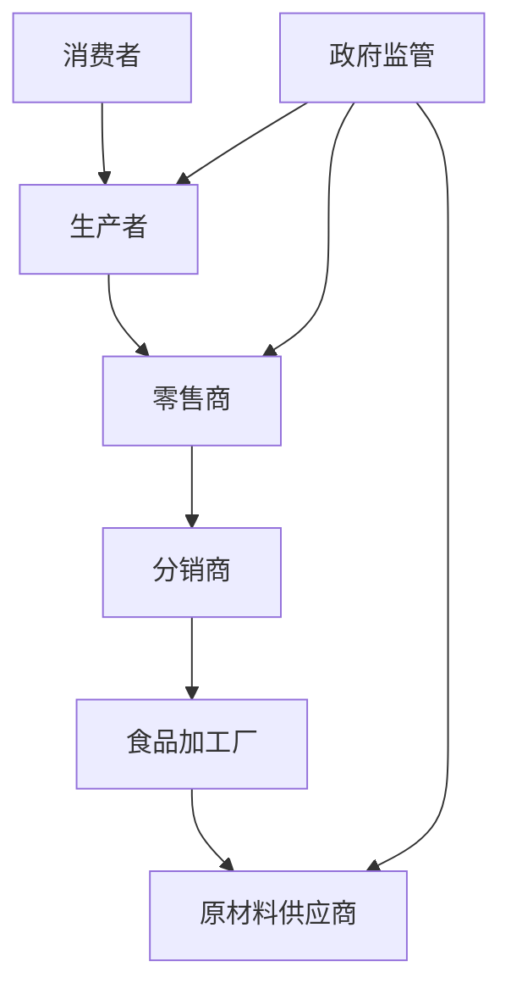
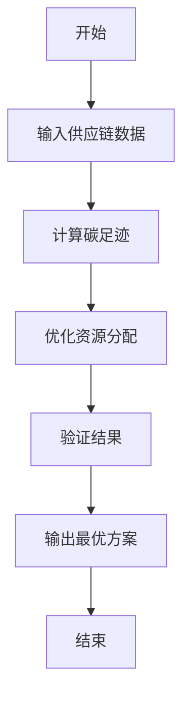
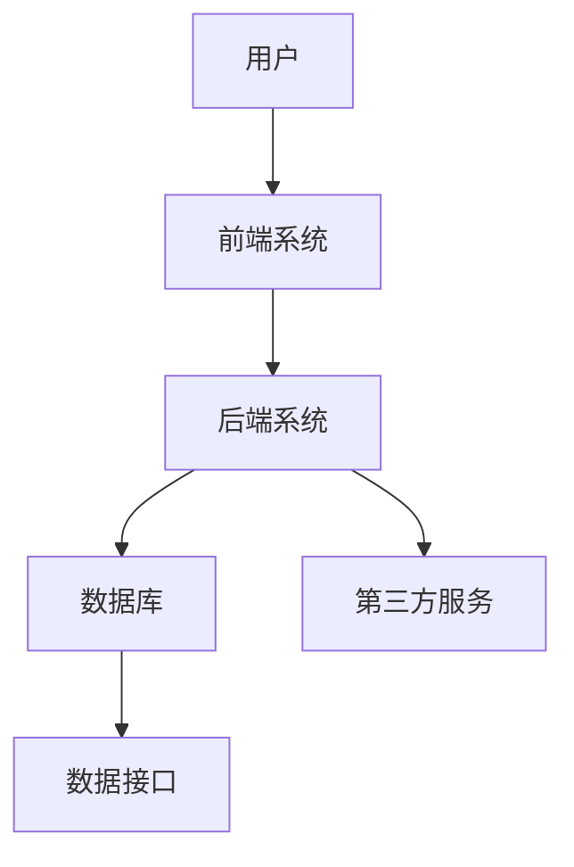

                 

# 可持续食品系统的创新与投资机会

## 关键词：
可持续食品系统, 食品技术创新, 环境影响评估, 投资机会分析, 系统架构设计

## 摘要：
本文深入探讨了可持续食品系统的核心概念、技术创新与投资机会。通过分析系统的架构设计、技术创新和实际案例，展示了如何通过技术手段优化食品供应链，减少环境影响，实现经济、社会与环境的三重目标。文章还结合了当前市场趋势，提出了投资机会分析和未来发展方向的建议。

---

# 目录大纲

## 第一部分: 可持续食品系统背景与核心概念

### 第1章: 可持续食品系统的背景与问题背景

#### 1.1 可持续食品系统的定义与内涵
- 1.1.1 传统食品系统的局限性
- 1.1.2 可持续食品系统的定义
- 1.1.3 可持续食品系统的三重目标（经济、社会、环境）

#### 1.2 可持续食品系统的核心问题
- 1.2.1 食品安全与营养问题
- 1.2.2 环境资源压力
- 1.2.3 社会公平与伦理问题

#### 1.3 可持续食品系统的边界与外延
- 1.3.1 系统边界分析
- 1.3.2 外延与相关领域（如循环经济、绿色科技）

#### 1.4 可持续食品系统的概念结构
- 1.4.1 核心要素分析
- 1.4.2 关键驱动因素
- 1.4.3 系统间的相互作用

### 第2章: 可持续食品系统的核心概念与联系

#### 2.1 可持续食品系统的原理
- 2.1.1 生态学原理在食品系统中的应用
- 2.1.2 循环经济与可持续发展原则

#### 2.2 核心概念对比分析
- 2.2.1 可持续食品 vs. 传统食品
- 2.2.2 有机农业 vs. 常规农业
- 2.2.3 现代食品科技 vs. 传统食品加工

#### 2.3 可持续食品系统的ER实体关系图

### 第3章: 可持续食品系统的算法原理

#### 3.1 可持续食品供应链优化算法
- 3.1.1 算法目标：最小化环境影响
- 3.1.2 算法步骤：

#### 3.2 优化模型的数学公式
- 3.2.1 碳足迹计算公式：
$$\text{碳足迹} = \sum_{i=1}^{n} w_i \times c_i$$
其中，$w_i$ 是活动 $i$ 的权重，$c_i$ 是活动 $i$ 的碳排放强度。
- 3.2.2 资源分配优化公式：
$$\text{Minimize} \sum_{j=1}^{m} c_j \times x_j$$
其中，$x_j$ 是资源 $j$ 的分配量，$c_j$ 是资源 $j$ 的成本。

---

## 第二部分: 可持续食品系统的技术创新与系统架构

### 第4章: 食品技术创新与应用场景

#### 4.1 创新技术概述
- 4.1.1 垂直农业技术
- 4.1.2 替代蛋白技术（如植物基肉制品）
- 4.1.3 精准农业技术

#### 4.2 技术创新对可持续食品系统的推动作用
- 4.2.1 提高资源利用效率
- 4.2.2 减少环境影响
- 4.2.3 提供更健康的产品

#### 4.3 技术创新的风险与挑战
- 4.3.1 技术成本高昂
- 4.3.2 市场接受度问题
- 4.3.3 技术 scalability 问题

### 第5章: 可持续食品系统的系统架构设计

#### 5.1 系统架构概述
- 5.1.1 系统模块划分
- 5.1.2 系统功能描述
- 5.1.3 系统性能指标

#### 5.2 系统架构图

#### 5.3 系统模块设计
- 5.3.1 数据采集模块
- 5.3.2 数据处理模块
- 5.3.3 数据展示模块

### 第6章: 可持续食品系统的项目实战

#### 6.1 项目背景与目标
- 6.1.1 项目背景
- 6.1.2 项目目标
- 6.1.3 项目范围

#### 6.2 项目环境安装
- 6.2.1 系统运行环境要求
- 6.2.2 开发工具安装
- 6.2.3 数据库安装与配置

#### 6.3 项目核心代码实现
- 6.3.1 系统功能模块实现
- 6.3.2 算法实现
- 6.3.3 系统测试与优化

#### 6.4 项目案例分析
- 6.4.1 案例背景
- 6.4.2 案例实施过程
- 6.4.3 案例效果分析

---

## 第三部分: 可持续食品系统的投资机会分析

### 第7章: 可持续食品系统的投资机会分析

#### 7.1 当前市场趋势
- 7.1.1 全球可持续食品市场的增长趋势
- 7.1.2 主要国家与地区市场分析
- 7.1.3 市场驱动因素

#### 7.2 投资领域分析
- 7.2.1 农业技术创新
- 7.2.2 食品加工技术
- 7.2.3 零售与供应链优化

#### 7.3 投资策略与建议
- 7.3.1 风险控制策略
- 7.3.2 投资组合优化
- 7.3.3 长期投资价值评估

### 第8章: 可持续食品系统的未来展望

#### 8.1 技术发展趋势
- 8.1.1 人工智能在食品供应链中的应用
- 8.1.2 生物技术在食品生产中的应用
- 8.1.3 数字化与智能化趋势

#### 8.2 可持续食品系统的社会影响
- 8.2.1 对环境保护的贡献
- 8.2.2 对社会经济的影响
- 8.2.3 对人类健康的影响

#### 8.3 未来投资机会展望
- 8.3.1 新兴技术领域的投资机会
- 8.3.2 市场需求变化带来的机会
- 8.3.3 全球合作与政策支持的影响

---

## 结语

可持续食品系统是未来发展的必然趋势，技术创新与投资机会并存。通过本文的系统分析与实际案例，我们能够更好地理解如何在技术和商业层面推动可持续食品系统的实现。未来，随着技术的进步和市场的成熟，可持续食品系统将为全球的食品安全与环境保护做出更大的贡献。

