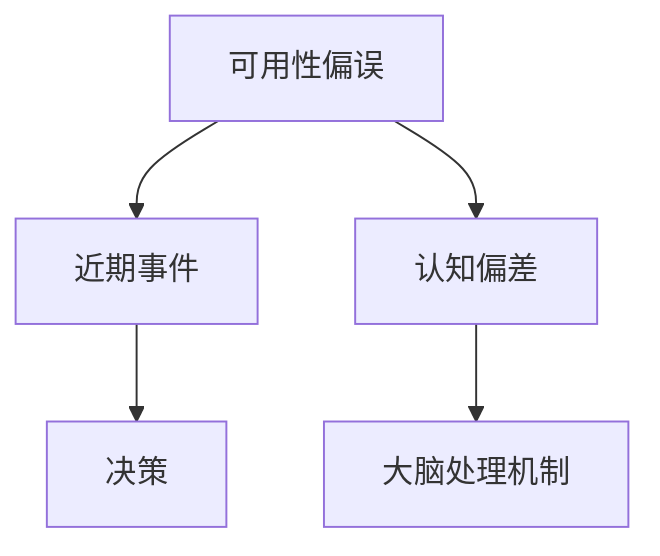
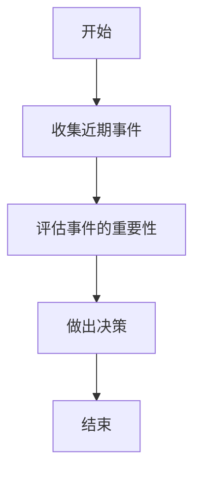

                 


## 第一部分：背景介绍

### 第1章：可用性偏误概述

#### 1.1 问题背景
- **认知偏差的普遍性**：人类在决策过程中容易受到各种认知偏差的影响，这些偏差可能导致非理性的决策。
- **可用性偏误的定义**：可用性偏误是指人们在做决策时，过度依赖最近发生的事件，而忽略了整体情况。
- **问题的严重性**：在金融、医疗、司法等领域，可用性偏误可能导致重大错误。

#### 1.2 问题描述
- **典型案例**：例如在股市中，投资者往往因为近期的暴跌而过度看空市场，忽略长期趋势。
- **成因分析**：大脑倾向于记住最近的事件，导致对近期信息的过度权重。
- **边界与外延**：可用性偏误与其他认知偏差（如确认偏误）的区别在于其时间上的侧重。

#### 1.3 问题解决
- **识别方法**：通过记录决策过程，分析是否过度依赖近期信息。
- **应对策略**：采用基于数据的决策方法，避免情绪化决策。

#### 1.4 概念结构与核心要素
- **核心要素**：记忆的易得性、信息的时间性、大脑的处理机制。
- **与其他偏差的关系**：可用性偏误与确认偏误不同，后者侧重于确认已有观点，而前者侧重于近期事件的影响。

---

## 第二部分：核心概念与联系

### 第2章：可用性偏误的核心概念

#### 2.1 可用性偏误的原理
- **神经机制**：大脑前额叶皮层在决策中起关键作用，近期事件更容易被编码和检索。
- **心理学模型**：基于启发式决策模型，人们倾向于使用最近的信息作为决策依据。

#### 2.2 可用性偏误与其他认知偏差的对比
| 偏差类型       | 定义                                                                 | 示例场景                             |
|----------------|------------------------------------------------------------------|-------------------------------------|
| 可用性偏误     | 过度依赖近期事件的信息                                       | 投资者因近期市场下跌而过度看空市场   |
| 确认偏误       | 倾向于寻找支持已有假设的信息                               | 医生在诊断时可能过度依赖已有假设     |
| 代表性偏误     | 根据样本与原型的相似性来判断概率                           | 路人判断某个事件的概率高于实际概率   |

#### 2.3 实体关系图



---

## 第三部分：算法原理讲解

### 第3章：可用性偏误的算法模型

#### 3.1 启发式模型
- **启发式决策**：人们倾向于使用简单的规则来简化决策过程。
- **可用性启发式**：基于信息的易得性来评估其概率。

#### 3.2 算法流程图



#### 3.3 代码实现

```python
def availability_bias(recent_events, historical_data):
    # 计算近期事件的影响权重
    weight = len(recent_events) / len(historical_data)
    # 评估可用性偏误
    if weight > 0.5:
        return "存在可用性偏误"
    else:
        return "没有可用性偏误"

# 示例调用
recent_events = ["市场下跌", "业绩不佳"]
historical_data = ["市场下跌", "业绩不佳", "市场上涨", "业绩良好"]
print(availability_bias(recent_events, historical_data))
```

---

## 第四部分：数学模型与公式

### 第4章：可用性偏误的数学模型

#### 4.1 概率模型
- **公式推导**：
  $$ P(A|B) = \frac{P(B|A) \cdot P(A)}{P(B)} $$
- **解释**：可用性偏误可能导致对条件概率的误判，因为近期事件更容易被检索。

#### 4.2 修正公式
- **修正后的概率模型**：
  $$ P(A|B)_{\text{修正}} = \frac{P(B|A) \cdot P(A)}{P(B)} \cdot \text{权重调整因子} $$

---

## 第五部分：系统分析与架构设计

### 第5章：系统架构设计

#### 5.1 问题场景介绍
- **系统目标**：设计一个能够识别和纠正可用性偏误的决策支持系统。

#### 5.2 功能需求
- **数据收集**：收集历史和近期事件数据。
- **决策评估**：评估可用性偏误的影响。
- **结果输出**：提供纠正建议。

#### 5.3 系统架构图


---

## 第六部分：项目实战

### 第6章：项目实现

#### 6.1 环境安装
- **工具**：Python、TensorFlow、Jupyter Notebook。

#### 6.2 核心代码实现

```python
import pandas as pd

def calculate_bias(dataframe):
    # 计算近期事件的影响
    recent_weight = dataframe['recent_events'].apply(len)
    total_weight = dataframe['historical_data'].apply(len)
    bias_score = recent_weight / total_weight
    return bias_score.mean()

# 示例数据
data = {
    'recent_events': [['市场下跌'], ['业绩不佳']],
    'historical_data': [['市场下跌', '市场上涨'], ['业绩不佳', '业绩良好']]
}
df = pd.DataFrame(data)
print(calculate_bias(df))
```

---

## 第七部分：最佳实践

### 第7章：总结与建议

#### 7.1 总结
- 可用性偏误是决策中的常见问题，需通过数据驱动的方法进行纠正。

#### 7.2 注意事项
- 定期回顾决策过程，避免过度依赖近期信息。
- 采用多元化的数据源，全面评估问题。

#### 7.3 拓展阅读
- 建议阅读Kahneman的《思考，快与慢》，深入理解认知偏差。

---

通过以上详细的内容安排和步骤分析，这篇文章将系统地探讨可用性偏误的各个方面，帮助读者深入理解其本质和影响，并提供实际应对策略。

