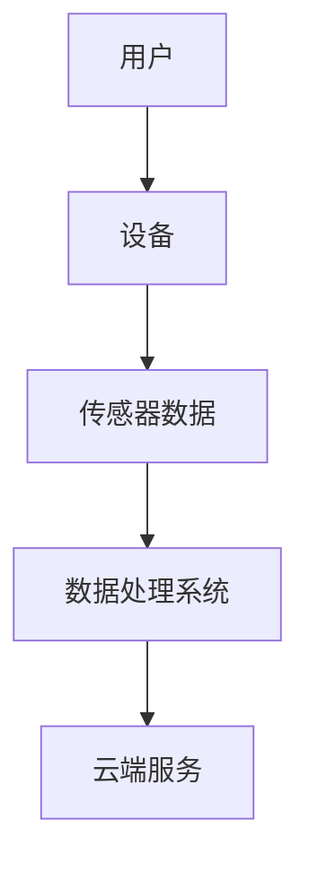

                 

# 《可穿戴设备市场的增长潜力与投资策略》

## 关键词：可穿戴设备，市场增长，投资策略，传感器技术，人工智能，5G，新材料

## 摘要：本文将深入分析可穿戴设备市场的定义、现状、技术趋势以及投资策略。通过探讨传感器技术、人工智能和5G技术在可穿戴设备中的应用，揭示市场增长的潜力，并为投资者提供可行的投资建议。

---

# 第一部分: 可穿戴设备市场的背景与现状

## 第1章: 可穿戴设备市场的定义与背景

### 1.1 可穿戴设备的定义与分类
可穿戴设备是指能够佩戴在身体部位或附着在衣物上的智能设备，具有感知、计算和交互功能。根据功能和应用场景，可穿戴设备主要分为以下几类：

- **健康监测类**：如智能手表、健康手环，主要用于心率监测、血氧检测、睡眠监测等。
- **运动健身类**：如运动追踪器、智能鞋，主要用于运动数据记录、步数统计等。
- **智能助手类**：如智能眼镜、AR/VR头显，主要用于信息处理、导航、娱乐等。
- **医疗类**：如可穿戴式医疗设备，用于实时监测患者生理数据。

可穿戴设备的核心技术特征包括传感器技术、数据处理能力、低功耗设计以及人机交互界面。

---

### 1.2 可穿戴设备的历史发展与现状
可穿戴设备的发展可以追溯到20世纪70年代，但真正意义上的智能可穿戴设备始于2010年以后。以下是可穿戴设备的历史演变和现状：

- **2010年之前**：早期的可穿戴设备主要用于特定领域，如运动手表、简单的健康监测设备。
- **2010年之后**：随着技术的进步，可穿戴设备逐渐智能化，苹果、谷歌、三星等科技巨头纷纷进入市场，推动了行业的快速发展。
- **现状**：当前市场主要由智能手表、健康手环和运动追踪器占据主导地位，市场呈现多元化和高端化趋势。

---

### 1.3 可穿戴设备的主要应用场景
可穿戴设备的应用场景广泛，以下是几个主要领域：

- **健康与医疗**：可穿戴设备可以帮助用户实时监测健康数据，如心率、血压、血糖等，为医疗诊断提供数据支持。
- **体育与健身**：运动员和健身爱好者可以通过可穿戴设备监测运动数据，如步频、心率、卡路里消耗等。
- **智能助手**：可穿戴设备可以作为智能助手，帮助用户处理信息、导航、控制智能家居设备等。

---

### 1.4 可穿戴设备市场的驱动因素
可穿戴设备市场的增长主要由以下几个因素驱动：

- **技术进步**：传感器技术的提升使得设备更加精准和低功耗。
- **消费者需求**：人们对健康管理、运动监测和智能助手的需求日益增长。
- **行业政策**：政府对健康医疗领域的支持政策推动了可穿戴设备的普及。

---

## 第2章: 可穿戴设备市场的核心概念与联系

### 2.1 核心概念原理
可穿戴设备的核心技术包括传感器、数据处理和人机交互。以下是这些技术的详细说明：

- **传感器技术**：传感器是可穿戴设备的核心组件，用于采集环境数据或生理数据。常见的传感器包括加速度传感器、心率传感器、温度传感器等。
- **数据处理**：采集到的原始数据需要经过处理和分析，如滤波、特征提取等，才能为用户提供有意义的信息。
- **人机交互**：通过屏幕、语音或触觉反馈等方式，设备将处理后的数据呈现给用户，实现人机交互。

---

### 2.2 核心概念属性特征对比
以下是可穿戴设备中几种常见传感器的性能对比：

| 传感器类型    | 优点                          | 缺点                          |
|---------------|-------------------------------|-------------------------------|
| 加速度传感器  | 精度高，功耗低                 | 适用范围有限                   |
| 心率传感器    | 实时监测，数据准确             | 易受运动干扰                   |
| 陀螺仪        | 测量角度变化精准               | 成本较高                       |

---

### 2.3 ER实体关系图
以下是可穿戴设备系统的ER实体关系图：

---

## 第3章: 可穿戴设备市场的技术趋势与创新

### 3.1 传感器技术的演进
随着技术的进步，传感器在可穿戴设备中的应用越来越广泛。以下是传感器技术的演进方向：

- **高精度传感器**：未来的传感器将更加精准，能够捕捉更细微的数据变化。
- **微型化传感器**：传感器的体积将进一步缩小，以适应更复杂的设备设计。
- **多功能传感器**：传感器将集成多种功能，如心率、体温、环境监测等。

---

### 3.2 AI技术在可穿戴设备中的应用
人工智能技术在可穿戴设备中的应用越来越广泛，以下是几个主要方向：

- **健康监测**：AI算法可以分析用户的健康数据，预测潜在的健康问题。
- **运动分析**：AI可以分析用户的运动数据，提供个性化的运动建议。
- **用户体验优化**：AI可以根据用户的使用习惯，优化设备的交互界面和功能。

---

### 3.3 5G技术对可穿戴设备的影响
5G技术的普及将对可穿戴设备产生深远影响，以下是具体表现：

- **高速数据传输**：5G网络的高速传输能力可以实现实时数据同步和云端处理。
- **低延迟通信**：5G的低延迟特性可以提升设备的响应速度，增强用户体验。
- **设备连接性**：5G技术可以支持更多的设备连接，推动物联网的发展。

---

### 3.4 新材料的应用与创新
新材料的应用为可穿戴设备的创新提供了新的可能性，以下是几个主要方向：

- **柔性材料**：柔性材料可以用于设备的可穿戴部分，如智能服装。
- **纳米材料**：纳米材料可以提高传感器的灵敏度和耐用性。
- **生物兼容材料**：生物兼容材料可以用于医疗领域的可穿戴设备。

---

# 第4章: 可穿戴设备市场的投资策略

### 4.1 投资机会分析
可穿戴设备市场具有广阔的增长潜力，以下是几个主要的投资机会：

- **健康监测设备**：随着人们对健康的关注增加，健康监测设备的市场需求将持续增长。
- **运动健身设备**：运动健身领域的竞争日益激烈，具备差异化功能的设备将更具吸引力。
- **医疗领域**：医疗级可穿戴设备的市场潜力巨大，尤其是结合AI技术的产品。

---

### 4.2 风险管理与投资建议
在投资可穿戴设备市场时，需要注意以下几点：

- **技术风险**：技术的快速迭代可能导致设备迅速被淘汰，投资者需要关注技术领先的企业。
- **市场竞争**：市场竞争日益激烈，投资者需要选择具有差异化竞争优势的企业。
- **政策风险**：政策的变化可能对市场产生重大影响，投资者需要关注相关政策动态。

---

### 4.3 成功案例分析
以下是几个成功的可穿戴设备投资案例：

- **苹果Apple Watch**：苹果通过整合健康监测功能，成功占据了智能手表市场的领先地位。
- **Fitbit**：Fitbit通过专注于健康手环市场，成为可穿戴设备领域的知名品牌。

---

# 第5章: 可穿戴设备市场的未来展望与挑战

## 5.1 未来发展趋势
可穿戴设备市场的未来发展趋势包括：

- **智能化**：设备将更加智能化，具备自主学习和决策能力。
- **多样化**：设备将更加多样化，满足不同用户的需求。
- **医疗化**：设备将更加医疗化，与医疗系统深度结合。

---

## 5.2 市场挑战
尽管可穿戴设备市场前景广阔，但也面临一些挑战：

- **技术瓶颈**：传感器精度和功耗问题仍然是技术瓶颈。
- **市场竞争**：市场竞争日益激烈，企业需要不断创新才能保持竞争优势。
- **隐私问题**：用户数据的隐私保护问题需要引起重视。

---

## 5.3 总结
可穿戴设备市场正处于快速发展阶段，具备巨大的增长潜力。投资者需要关注技术趋势和市场动态，选择具有差异化竞争优势的企业进行投资。同时，也需要关注技术瓶颈和市场竞争带来的挑战。

---

通过以上分析，我们可以看到可穿戴设备市场的巨大潜力和投资机会。希望本文能够为读者提供有价值的见解和指导。

