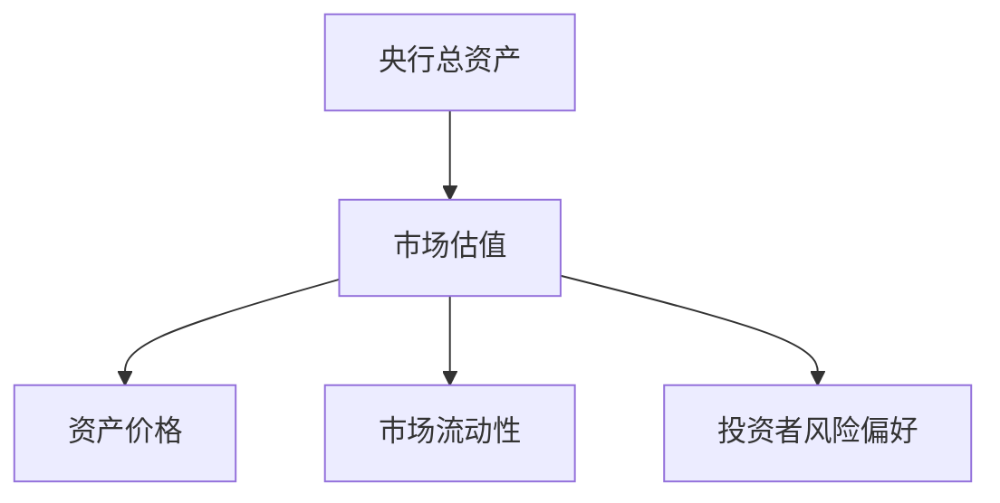
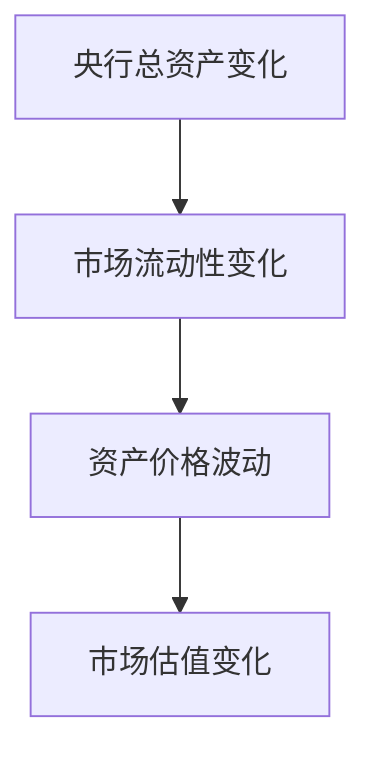

                 


# 各国央行总资产对市场估值的影响分析

## 关键词：各国央行、总资产、市场估值、货币政策、经济周期、流动性

## 摘要：  
本文旨在探讨各国央行总资产规模对市场估值的影响机制。通过分析央行资产负债表的变化、货币政策传导路径以及资产价格波动，揭示央行资产规模变化对市场估值的核心影响因素。结合理论分析与实证研究，本文将深入探讨央行资产规模变化如何通过流动性、风险偏好和资产价格预期等渠道影响市场估值。

---

## 第1章 各国央行总资产与市场估值的背景介绍

### 1.1 各国央行总资产的定义与构成  
各国央行的总资产是指中央银行持有的所有资产，包括政府债券、外汇储备、银行贷款和其他金融资产。这些资产反映了央行在货币政策执行中的角色和目标，同时也是衡量央行资产负债表健康状况的重要指标。  

#### 1.1.1 央行总资产的定义  
央行总资产是央行资产负债表中资产方的总和，包括以下主要组成部分：  
- **政府债券**：央行持有的政府债务工具，通常是国债。  
- **外汇储备**：央行持有的外汇资产，用于维持汇率稳定。  
- **银行贷款**：向商业银行提供的贷款，用于支持金融体系流动性。  
- **其他资产**：包括黄金储备、房地产和其他金融资产。  

#### 1.1.2 央行资产负债表的构成  
央行的资产负债表由资产、负债和所有者权益三部分组成，其中资产和负债是分析的核心：  
- **资产方**：政府债券、外汇储备、银行贷款等。  
- **负债方**：主要是央行发行的货币（基础货币），包括流通中的纸币和硬币，以及商业银行在央行的准备金。  

#### 1.1.3 央行资产与负债的核心要素  
央行的资产和负债规模直接影响货币政策的实施效果。例如，资产规模的增加可能通过货币乘数效应影响市场流动性，而负债规模的变化则直接反映了货币供应量的变化。  

---

### 1.2 市场估值的核心概念  
市场估值是指市场参与者对资产价值的评估，通常通过资产价格的变化来体现。市场估值的核心影响因素包括宏观经济环境、市场流动性、投资者情绪等。  

#### 1.2.1 市场估值的定义  
市场估值是市场参与者对资产或投资标的合理价格的评估，反映了市场对经济前景、企业盈利能力和风险的综合判断。  

#### 1.2.2 市场估值的关键影响因素  
- **宏观经济环境**：GDP增速、通胀率、利率水平等。  
- **市场流动性**：资金供给与需求的变化直接影响资产价格。  
- **投资者情绪**：市场参与者的行为和风险偏好影响资产价格波动。  

#### 1.2.3 市场估值与经济周期的关系  
市场估值通常与经济周期密切相关。在经济扩张期，市场估值往往上升；而在经济衰退期，市场估值可能大幅下降。  

---

### 1.3 央行总资产对市场估值的潜在影响  
央行总资产的变化可能通过多种渠道影响市场估值，包括资产价格、市场流动性和投资者预期。  

#### 1.3.1 央行资产规模的变化趋势  
近年来，全球主要央行（如美联储、欧洲央行、日本央行）通过量化宽松政策大幅增加了资产规模。这些政策直接影响了市场流动性，间接推动了资产价格上涨。  

#### 1.3.2 央行资产规模与市场估值的初步关联  
央行资产规模的增加通常会导致市场流动性增加，从而推高资产价格。例如，央行购买政府债券会降低债券收益率，间接推动债券价格上涨。  

#### 1.3.3 研究问题的边界与外延  
本文的研究范围主要集中在央行资产规模对市场估值的影响，重点关注流动性、资产价格和投资者预期三个核心因素。  

---

## 第2章 央行总资产与市场估值的核心概念与联系

### 2.1 央行总资产的构成与分类  
央行总资产的构成反映了其货币政策目标和经济环境。以下是主要资产的分类：  
- **政府债券**：占比最高，通常用于调节市场流动性。  
- **外汇储备**：用于维护汇率稳定，尤其是在汇率干预时。  
- **银行贷款**：支持商业银行的流动性需求。  

#### 2.1.1 央行资产的主要类别  
通过分类分析，可以更清晰地理解央行资产变化对市场估值的影响。例如，政府债券的增持会直接推高债券价格，降低债券收益率。  

#### 2.1.2 央行负债的主要类别  
央行负债主要包括基础货币和商业银行准备金。负债规模的变化直接影响货币供应量。  

#### 2.1.3 央行资产负债表的核心属性  
央行资产负债表的变化反映了货币政策的实施效果。例如，量化宽松政策会显著增加资产规模，同时扩大负债规模。  

---

### 2.2 市场估值的关键影响因素  
市场估值的变化受到多种因素的综合影响，其中央行资产规模的变化是一个重要变量。  

#### 2.2.1 资产价格的形成机制  
资产价格的形成机制涉及市场供需、风险偏好和宏观经济环境。央行资产规模的变化通过影响市场流动性，间接推动资产价格上涨。  

#### 2.2.2 市场流动性的核心作用  
市场流动性是资产价格波动的核心驱动因素。央行资产规模的增加通常会提高市场流动性，从而推高资产价格。  

#### 2.2.3 投资者风险偏好的影响  
投资者风险偏好通过影响资产需求，间接影响市场估值。央行资产规模的变化可能通过影响市场流动性，改变投资者的风险偏好。  

---

### 2.3 央行总资产与市场估值的关系模型  
为了更好地理解两者的关系，我们可以构建一个概念模型，并通过ER实体关系图和Mermaid流程图进行可视化。  

#### 2.3.1 概念属性对比分析  
央行总资产与市场估值在多个维度上有显著关联：  
- 央行资产规模增加 → 市场流动性提高 → 资产价格上涨。  
- 央行资产规模减少 → 市场流动性下降 → 资产价格下跌。  

#### 2.3.2 ER实体关系图架构  
以下是央行总资产与市场估值的实体关系图：  



---

## 第3章 央行总资产对市场估值的影响机制分析

### 3.1 央行资产规模变化的理论基础  
央行资产规模的变化通过货币政策传导机制影响市场估值。  

#### 3.1.1 货币供应量与资产价格的关系  
货币供应量的增加通常会导致资产价格上涨。例如，量化宽松政策会增加市场流动性，推高资产价格。  

#### 3.1.2 利率政策对市场估值的影响  
央行通过调整利率影响市场流动性。低利率环境通常会推高资产价格，因为投资者寻求更高的收益率。  

#### 3.1.3 资产购买计划的传导机制  
央行通过购买资产（如政府债券和 Mortgage-backed securities）间接影响资产价格。  

---

### 3.2 央行资产规模变化对市场估值的实证分析  
通过回归分析和时间序列分析，我们可以验证央行资产规模变化对市场估值的影响。  

#### 3.2.1 回归分析模型  
以下是回归分析的数学模型：  
$$ \text{Market Valuation} = \beta_0 + \beta_1 \times \text{Central Bank Assets} + \epsilon $$  

#### 3.2.2 时间序列分析  
时间序列分析可以帮助我们识别央行资产规模变化与市场估值波动之间的关系。  

#### 3.2.3 投资者预期与市场反应  
投资者对央行资产规模变化的预期也会影响市场估值。例如，市场预期央行将增加资产购买，通常会提前推高资产价格。  

---

## 第4章 央行总资产对市场估值的系统分析与实践

### 4.1 央行资产规模变化的系统分析  
通过系统分析，我们可以更全面地理解央行资产规模变化对市场估值的影响。  

#### 4.1.1 系统架构设计  
以下是系统架构设计的Mermaid图：  



#### 4.1.2 系统功能设计  
系统功能包括数据采集、模型构建、结果分析和可视化。  

---

### 4.2 项目实战：央行资产规模对市场估值的影响分析  
通过实际案例分析，我们可以更直观地理解央行资产规模变化对市场估值的影响。  

#### 4.2.1 数据准备与环境配置  
需要准备各国央行资产规模数据和市场估值数据。  

#### 4.2.2 模型实现与代码解读  
以下是回归分析的Python代码示例：  

```python
import pandas as pd
import numpy as np
from sklearn.linear_model import LinearRegression
import matplotlib.pyplot as plt

# 数据加载
data = pd.read_csv('central_bank_assets.csv')

# 模型训练
model = LinearRegression()
model.fit(data[['Central Bank Assets']], data['Market Valuation'])

# 模型结果
print('Coefficients:', model.coef_)
print('Intercept:', model.intercept_)

# 图形可视化
plt.scatter(data['Central Bank Assets'], data['Market Valuation'])
plt.plot(data['Central Bank Assets'], model.predict(data[['Central Bank Assets']]))
plt.xlabel('Central Bank Assets')
plt.ylabel('Market Valuation')
plt.show()
```

---

## 第5章 结论与展望

### 5.1 研究结论  
本文研究表明，央行总资产的变化对市场估值有显著影响，主要通过流动性、资产价格和投资者预期三个渠道。  

### 5.2 研究局限  
本文的研究主要基于理论分析和实证分析，未来可以进一步结合微观数据进行更深入的研究。  

### 5.3 未来展望  
未来研究可以进一步探讨央行资产规模变化对不同资产类别（如股票、债券）的影响，以及在全球化背景下各国央行资产规模变化的协同效应。  

---

## 参考文献  
（此处列出相关文献和数据来源）

---

通过以上分析，我们可以全面理解各国央行总资产对市场估值的影响机制，为政策制定者和市场参与者提供重要的理论支持和实践指导。

