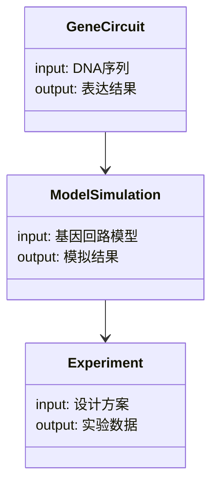
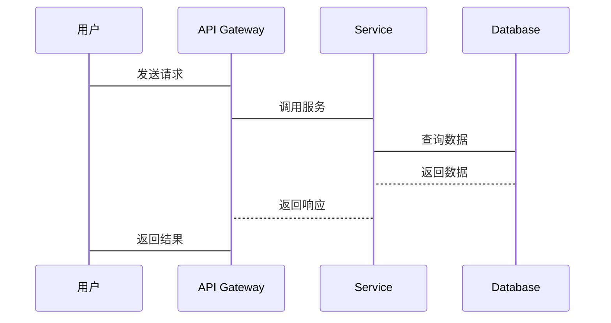

                 


# 合成生物学的发展前景与投资风险分析

> 关键词：合成生物学，投资风险，发展前景，基因编辑，生物系统设计

> 摘要：合成生物学作为一门新兴的交叉学科，结合了生物学、工程学和计算机科学，旨在通过设计和构建生物系统来解决复杂问题。本文将探讨合成生物学的核心概念、算法原理、系统设计以及实际应用案例，并分析其发展前景和投资风险，为投资者提供有益的参考。

---

## 第1章 合成生物学的背景与核心概念

### 1.1 合成生物学的定义与历史发展

#### 1.1.1 合成生物学的定义

合成生物学（Synthetic Biology）是一门结合了生物学、工程学和计算机科学的新兴学科，旨在通过设计和构建新的生物系统或改写现有生物系统，以实现特定的功能。它不同于传统的生物科学，更注重从工程学的角度去理解和改造生物系统。

#### 1.1.2 合成生物学的发展历程

合成生物学的概念最早可以追溯到20世纪中叶，随着基因工程和分子生物学的发展，科学家们开始尝试对生物系统进行人为设计和改造。21世纪初，随着基因组测序技术、合成基因组学和基因编辑技术的进步，合成生物学进入了快速发展阶段。

#### 1.1.3 合成生物学的核心目标与应用领域

合成生物学的核心目标是通过设计和构建生物系统，解决现实中的复杂问题。其主要应用领域包括：

- **医疗健康**：开发新型药物、治疗疾病。
- **能源与环境**：生产生物燃料、治理环境污染。
- **农业**：改良农作物、提高产量。
- **工业生产**：优化工业流程、降低生产成本。

### 1.2 合成生物学与相关学科的联系

#### 1.2.1 系统生物学与合成生物学的异同

系统生物学（Systems Biology）研究生物系统的整体行为，而合成生物学则更注重设计和构建新的生物系统。两者在研究方法上有相似之处，但目标不同。

#### 1.2.2 合成生物学与代谢工程的区别

代谢工程（Metabolic Engineering）专注于通过基因工程技术优化生物体的代谢途径，而合成生物学则更广泛，包括基因回路设计、人工合成基因组等。

#### 1.2.3 合成生物学与基因编辑技术的关系

基因编辑技术（如CRISPR）是合成生物学的重要工具，用于精确修改或设计生物系统。

### 1.3 合成生物学的现状与发展趋势

#### 1.3.1 当前合成生物学的研究热点

当前，合成生物学的研究热点包括基因回路设计、人工合成基因组、生物模块化设计等。

#### 1.3.2 合成生物学在工业、医疗和农业中的应用前景

合成生物学在多个领域展现出巨大的应用潜力，尤其是在生产生物燃料、治疗疾病和提高农作物产量方面。

#### 1.3.3 合成生物学未来的技术突破方向

未来，合成生物学可能在生物系统的智能化设计、跨学科融合、大规模应用等方面取得突破。

---

## 第2章 合成生物学的核心概念与原理

### 2.1 合成生物学的核心概念

#### 2.1.1 基因回路的设计与构建

基因回路（Genetic Circuit）是合成生物学的核心组成部分，类似于电子电路，用于控制生物系统的功能。

#### 2.1.2 模块化生物设计的原理

模块化设计将生物系统分解为功能模块，便于设计和优化。

#### 2.1.3 合成生物系统的稳定性与可预测性

生物系统的稳定性和可预测性是合成生物学成功的关键。

### 2.2 合成生物学的关键技术

#### 2.2.1 基因编辑技术（CRISPR、TALEN等）

基因编辑技术是合成生物学的重要工具，用于精确修改生物系统。

#### 2.2.2 合成基因组学与人工合成基因组

人工合成基因组是合成生物学的重要成果，为设计新生物系统提供了基础。

#### 2.2.3 生物信息学在合成生物学中的应用

生物信息学用于分析和设计生物系统，帮助预测和优化基因回路。

### 2.3 合成生物学的数学建模与系统分析

#### 2.3.1 基因回路的数学模型构建

通过数学模型可以模拟基因回路的行为，帮助设计和优化。

#### 2.3.2 系统动力学模拟与优化

系统动力学模拟帮助预测生物系统的动态行为，并进行优化设计。

#### 2.3.3 生物系统的模块化设计方法

模块化设计方法将生物系统分解为功能模块，便于设计和优化。

---

## 第3章 合成生物学的算法与数学模型

### 3.1 合成生物学中的算法原理

#### 3.1.1 基因回路优化的算法流程

基因回路优化通常包括设计、模拟、实验验证和优化等步骤。

#### 3.1.2 基于动态规划的生物设计算法

动态规划算法用于优化基因回路的设计。

#### 3.1.3 生物系统模拟与验证的算法框架

模拟算法框架包括模型构建、参数优化和实验验证。

### 3.2 数学模型与公式

#### 3.2.1 基因表达的数学模型

基因表达模型描述基因的转录和翻译过程。

#### 3.2.2 生物反应网络的数学建模

生物反应网络模型用于模拟代谢途径。

#### 3.2.3 系统动力学方程的求解方法

系统动力学方程通常通过微分方程求解。

### 3.3 实际案例分析

#### 3.3.1 一个简单的基因回路设计案例

例如，设计一个逻辑门基因回路。

#### 3.3.2 基于数学模型的系统优化

通过数学模型优化基因回路的性能。

---

## 第4章 系统分析与架构设计

### 4.1 问题场景介绍

以设计一个合成生物学项目为例，介绍系统分析与架构设计的重要性。

### 4.2 系统功能设计

使用领域模型（Mermaid类图）描述系统功能模块。



### 4.3 系统架构设计

使用Mermaid架构图描述系统架构。


### 4.4 系统接口设计

描述系统接口的设计，例如API接口。

### 4.5 系统交互设计

使用Mermaid序列图描述系统交互过程。



---

## 第5章 项目实战

### 5.1 环境安装

介绍如何搭建合成生物学项目的开发环境。

### 5.2 系统核心实现源代码

展示基因回路设计的代码示例。

```python
def design_gene_circuit(gene_sequence):
    # 基因回路设计算法
    pass
```

### 5.3 代码应用解读与分析

解释代码的功能和实现细节。

### 5.4 实际案例分析

通过实际案例分析合成生物学项目的实施过程。

### 5.5 项目小结

总结项目经验，指出成功和失败的原因。

---

## 第6章 总结与展望

### 6.1 合成生物学的总结

回顾合成生物学的核心概念和发展现状。

### 6.2 投资风险分析

分析合成生物学的投资风险，包括技术不确定性、市场接受度等。

### 6.3 未来展望

预测合成生物学的未来发展趋势和投资机会。

### 6.4 最佳实践 tips

为投资者提供一些建议和注意事项。

### 6.5 小结

总结全文，强调合成生物学的重要性和投资价值。

---

## 第7章 拓展阅读

### 7.1 推荐书籍

推荐一些与合成生物学相关的书籍。

### 7.2 推荐论文

推荐一些经典的合成生物学论文。

### 7.3 推荐网站

推荐一些合成生物学相关的网站和资源。

---

## 结语

合成生物学作为一门前沿学科，具有广阔的发展前景和巨大的投资潜力。然而，投资者也需要充分认识到其技术风险和市场挑战。通过深入了解合成生物学的核心概念、算法原理和系统设计，投资者可以更好地把握投资机会，规避潜在风险。未来，随着技术的进步和应用的拓展，合成生物学将在更多领域展现出其独特的优势。

