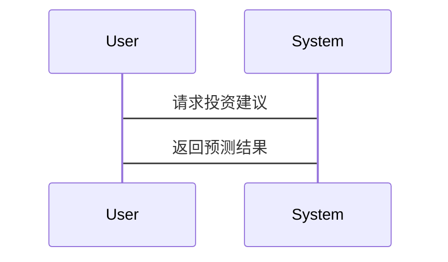

                 


# 吉姆·罗杰斯的商品价值投资：实物资产中的价值

## 关键词
- 吉姆·罗杰斯
- 商品投资
- 实物资产
- 价值投资
- 投资策略
- 市场分析
- 投资组合

## 摘要
本文深入探讨了吉姆·罗杰斯的商品价值投资理念，重点分析了实物资产在投资组合中的重要性。通过详细讲解商品市场的供需关系、价格波动规律以及投资策略，结合数学模型和系统架构设计，帮助读者理解如何在实物资产中发现价值并制定有效的投资策略。

---

## 第1章 商品投资与实物资产的价值

### 1.1 商品投资的基本概念
#### 1.1.1 商品投资的定义与分类
商品投资是指通过购买实物资产（如黄金、原油、农产品等）以获得投资收益的行为。商品可以分为四类：能源类（原油、天然气）、金属类（黄金、铜）、农业类（小麦、大豆）和工业类（塑料、橡胶）。

#### 1.1.2 实物资产的特征与优势
实物资产具有保值、分散风险、抗通胀等特点。与传统金融资产相比，实物资产的价格波动通常与股市、债市的相关性较低，从而提供更好的风险分散效果。

#### 1.1.3 商品投资与传统金融投资的区别
商品投资更关注于实物资产的供需变化和价格波动，而传统金融投资主要关注于股票、债券等金融资产的价格波动。

### 1.2 吉姆·罗杰斯的投资理念
#### 1.2.1 吉姆·罗杰斯的背景与投资风格
吉姆·罗杰斯是著名投资专家，专注于商品投资，主张通过长期持有实物资产来实现财富保值和增值。

#### 1.2.2 商品投资在罗杰斯投资体系中的地位
在罗杰斯的投资体系中，商品投资是核心部分之一，他认为实物资产是抵御通胀和经济不确定性的重要工具。

#### 1.2.3 罗杰斯对实物资产的长期看法
罗杰斯认为，随着全球经济的发展和资源的稀缺性，实物资产的需求将持续增长，价格也将稳步上涨。

### 1.3 商品投资的市场背景
#### 1.3.1 当前全球经济与商品市场的现状
当前全球经济不确定性增加，商品市场供需失衡，价格波动剧烈。

#### 1.3.2 商品价格波动的主要驱动因素
商品价格波动主要受供需关系、宏观经济政策、地缘政治和市场情绪等因素影响。

#### 1.3.3 实物资产投资的避险功能
实物资产在经济下行周期中能够有效对冲通胀风险，保护投资者的财富。

---

## 第2章 商品市场的供需分析

### 2.1 商品市场的供需关系
#### 2.1.1 供给端分析
供给端主要包括生产成本、生产能力、政策法规等因素。供给变化直接影响商品价格波动。

#### 2.1.2 需求端分析
需求端主要包括消费量、工业需求、投资需求等因素。需求变化是商品价格波动的重要推动力。

#### 2.1.3 供需平衡与价格波动
供需平衡是商品价格波动的核心因素，供给和需求的相互作用决定了市场价格的波动方向和幅度。

### 2.2 商品价格的周期性
#### 2.2.1 商品价格周期的四个阶段
商品价格周期通常分为复苏阶段、繁荣阶段、衰退阶段和萧条阶段。

#### 2.2.2 周期性对投资决策的影响
投资者需要根据价格周期的不同阶段调整投资策略，例如在复苏阶段增加投资，在繁荣阶段减少投资。

#### 2.2.3 如何识别周期拐点
识别周期拐点需要结合技术分析和基本面分析，重点关注价格走势和市场情绪的变化。

### 2.3 商品市场的波动性
#### 2.3.1 市场波动的来源
市场波动主要来源于供需失衡、政策变化、地缘政治和市场情绪等因素。

#### 2.3.2 如何衡量市场波动
通过波动率指标（如标准差、波幅）和相关性分析来衡量市场波动。

#### 2.3.3 波动性对投资策略的影响
高波动性意味着高风险和高收益并存，投资者需要根据自身风险承受能力调整投资策略。

---

## 第3章 商品投资的策略与实践

### 3.1 商品投资的策略框架
#### 3.1.1 长期持有策略
长期持有策略适用于那些看好实物资产长期价格走势的投资者，适合用于财富保值。

#### 3.1.2 短期交易策略
短期交易策略适用于那些能够准确捕捉市场波动的投资者，适合用于追求短期收益。

#### 3.1.3 对冲策略
对冲策略通过同时投资于相关和不相关的资产来降低风险，适合用于市场不确定性较高的情况。

### 3.2 商品投资的组合管理
#### 3.2.1 投资组合的构建原则
投资组合应根据投资者的风险承受能力、投资目标和市场环境进行动态调整。

#### 3.2.2 风险管理与资产配置
投资者需要合理配置资产，分散投资风险，同时设置止损点以保护投资本金。

#### 3.2.3 如何动态调整投资组合
投资者需要根据市场变化和自身目标，定期审视和调整投资组合。

### 3.3 商品投资的市场进入与退出策略
#### 3.3.1 如何选择进入市场的时机
进入市场的时机应基于对市场趋势的准确判断和风险评估。

#### 3.3.2 如何制定退出策略
退出策略应基于设定的投资目标和市场变化，灵活调整。

#### 3.3.3 实例分析：吉姆·罗杰斯的经典案例
通过具体案例分析，展示如何运用罗杰斯的投资理念进行实物资产投资。

---

## 第4章 数学模型与算法原理

### 4.1 商品价格预测的数学模型
#### 4.1.1 需求弹性模型
$$ E_d = \frac{\% \Delta Q_d}{\% \Delta P} $$
需求弹性衡量需求量对价格变化的敏感程度。

#### 4.1.2 供给弹性模型
$$ E_s = \frac{\% \Delta Q_s}{\% \Delta P} $$
供给弹性衡量供给量对价格变化的敏感程度。

#### 4.1.3 均衡价格模型
$$ P = \frac{MC}{MR} $$
均衡价格是边际成本等于边际收益时的价格。

### 4.2 商品价格波动的算法
#### 4.2.1 时间序列分析
使用ARIMA模型对商品价格进行预测，代码示例：
```python
from statsmodels.tsa.arima_model import ARIMA
model = ARIMA(train, order=(5,1,0))
model_fit = model.fit(disp=0)
```

#### 4.2.2 机器学习算法
使用随机森林对商品价格进行分类，代码示例：
```python
from sklearn.ensemble import RandomForestClassifier
model = RandomForestClassifier(n_estimators=100)
model.fit(X_train, y_train)
```

---

## 第5章 系统架构与设计

### 5.1 投资分析系统架构
#### 5.1.1 数据来源
系统需要实时获取商品价格数据、宏观经济数据和市场新闻。

#### 5.1.2 分析模块
分析模块包括数据清洗、特征提取、模型训练和预测生成。

#### 5.1.3 决策支持
决策支持模块根据模型预测结果生成投资建议，指导投资者进行买卖决策。

### 5.2 系统交互流程
使用Mermaid序列图展示系统交互流程：


---

## 第6章 项目实战

### 6.1 环境配置
#### 6.1.1 安装必要的库
安装Pandas、NumPy、Matplotlib和Scikit-learn等库。

### 6.2 核心实现
#### 6.2.1 数据获取与清洗
使用API获取原油价格数据，并进行数据清洗。

#### 6.2.2 特征提取与建模
提取历史价格、成交量等特征，训练时间序列模型。

#### 6.2.3 结果分析
展示预测结果并与实际价格进行对比，评估模型性能。

### 6.3 实际案例分析
以原油投资为例，详细分析如何运用吉姆·罗杰斯的投资理念进行实际操作。

---

## 第7章 最佳实践与小结

### 7.1 小结
总结文章的主要内容，强调实物资产投资的重要性和方法。

### 7.2 注意事项
提醒读者注意市场风险、模型局限性和投资策略的灵活性。

### 7.3 拓展阅读
推荐相关书籍和资源，帮助读者深入理解商品投资。

---

通过本文的系统分析和详细讲解，读者可以全面理解吉姆·罗杰斯的商品价值投资理念，并能够在实际投资中灵活运用这些方法。

