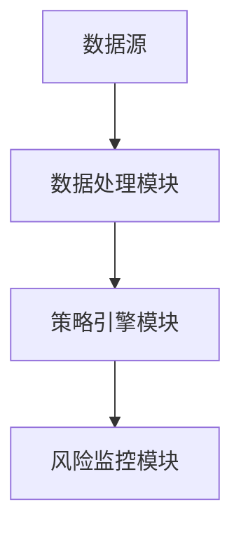
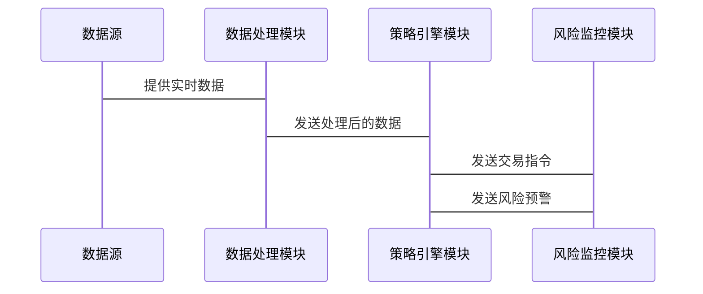

                 


## # 商品投资：在通胀环境中的对冲作用

### # 关键词：商品投资, 通胀对冲, 商品市场, 统计套利, 动态资产配置

### # 摘要：
本文深入探讨商品投资在通胀环境中的对冲作用。首先介绍商品投资的基本概念和通胀的定义及其对经济和投资的影响。接着分析商品市场的运作机制，解释商品期货与现货市场的关联及其在对冲中的作用。然后详细阐述商品投资与通胀对冲的核心概念，包括商品投资在对冲中的优势和与传统对冲策略的对比。之后，从算法原理角度，介绍统计套利和动态资产配置等对冲策略，并通过实例分析和数学模型详细讲解。最后，构建一个基于商品投资的对冲系统，提供系统设计和实现方案，并通过实际案例分析和代码实现，验证这些对冲策略的有效性。最后总结商品投资在通胀环境中的对冲作用，并提出最佳实践和注意事项。

---

## 第一部分: 商品投资与通胀环境的背景介绍

### 第1章: 商品投资的基本概念

#### 1.1 商品投资的定义与特点
商品投资是指通过购买和持有实物商品（如黄金、原油、农产品等）或其衍生品（如商品期货、期权）来实现投资收益的一种方式。商品投资具有以下几个主要特点：
1. **实物资产**：商品投资涉及实物资产，与金融资产（如股票、债券）相比，具有较高的实物属性。
2. **价格波动性**：商品价格受供求关系、市场情绪和宏观经济因素的影响较大，价格波动性较高。
3. **对冲通胀**：商品投资常被视为对冲通胀的有效工具，尤其是在通胀上升周期中，商品价格往往会上涨，从而抵消通胀对购买力的侵蚀。
4. **杠杆效应**：通过商品期货等衍生品，投资者可以利用杠杆效应，以较小的资金投入获取较高的潜在收益。

#### 1.2 通胀的定义与影响
通胀（通货膨胀）是指物价总水平在一段时间内持续上涨，导致货币购买力下降的经济现象。通胀对经济和投资的影响主要体现在以下几个方面：
1. **货币购买力下降**：通胀会导致货币的实际价值下降，使消费者和企业的购买力减弱。
2. **资产价格波动**：通胀通常会导致金融市场（如股票、债券）的价格波动加剧。
3. **债务成本增加**：通胀可能导致实际利率下降，从而增加债务的实际负担。

#### 1.3 商品投资在通胀环境中的对冲作用
在通胀环境下，商品投资可以通过以下方式发挥对冲作用：
1. **保值功能**：商品价格通常会随通胀上升而上涨，从而抵消通胀对货币购买力的侵蚀。
2. **分散投资风险**：商品投资与传统金融资产的相关性较低，可以有效分散投资组合的风险。
3. **利用杠杆效应**：通过商品期货等衍生品，投资者可以在较小的资金投入下获取较高的收益，从而放大对冲效果。

### 第2章: 商品市场的运作机制

#### 2.1 商品市场的基本结构
商品市场由以下几个主要参与主体构成：
1. **生产者**：商品的实际生产者，如农民、矿商等。
2. **消费者**：商品的最终使用者，包括个人和企业。
3. **贸易商**：负责商品的买卖和运输，连接生产者和消费者。
4. **投机者**：通过买卖商品期货或期权，从中获利的投资者。

商品市场的交易流程通常包括以下几个步骤：
1. **订单匹配**：买方和卖方通过交易所提交订单，匹配成交。
2. **交割**：买卖双方按照合同约定的方式进行商品的交付。
3. **结算**：交易所或清算机构负责处理交易资金的划付。

#### 2.2 商品期货与现货市场的关联
商品期货是指以某种商品为标的资产，约定在未来的某一时间以预定价格买卖该商品的标准化合约。现货市场则是指即时买卖商品的市场。

商品期货与现货市场的价格通常会联动，但受市场情绪、库存变化和宏观经济因素的影响，期货价格可能与现货价格出现偏差。这种偏差为套利者提供了机会，通过同时买入或卖出现货和期货合约来获利。

#### 2.3 商品市场的波动性与风险
商品市场的价格波动性较高，主要由以下几个因素引起：
1. **供求关系**：商品的供需变化直接影响价格。
2. **宏观经济因素**：如货币政策、国际贸易政策等。
3. **市场情绪**：投资者情绪的波动也会导致价格波动。

商品投资中的主要风险包括市场风险（价格波动风险）、流动性风险（某些商品的买卖可能不活跃）和操作风险（如合约交割风险）。

---

## 第二部分: 商品投资与通胀对冲的核心概念

### 第3章: 商品投资与通胀对冲的核心概念

#### 3.1 商品投资与通胀的关系
商品价格通常会随着通胀的上升而上涨，尤其是在通胀预期较高的情况下。这是因为通胀会导致商品的实际需求增加，从而推高价格。例如，在能源危机或粮食歉收的情况下，原油和粮食的价格通常会大幅上涨。

#### 3.2 商品投资的对冲机制
商品投资的对冲机制主要包括以下几种方式：
1. **持有实物商品**：通过直接持有黄金、原油等实物商品，投资者可以对冲通胀风险。
2. **商品期货对冲**：通过卖出或买入商品期货合约，投资者可以对冲现货市场的价格波动风险。
3. **统计套利**：通过同时买卖相关商品或金融资产，利用价格差异获利。

#### 3.3 商品投资与传统对冲策略的对比
传统对冲策略主要包括以下几种：
1. **空头对冲**：卖出股票指数期货，以抵消股票投资组合的下行风险。
2. **配对交易**：同时买入低估股票和卖出高估股票，利用价差获利。
3. **市场中性策略**：通过做多和做空相结合，构建一个中性于市场的投资组合。

与传统对冲策略相比，商品投资具有更强的抗通胀能力，尤其是在通胀上升周期中表现更为突出。

---

### 第4章: 商品投资的算法原理

#### 4.1 统计套利算法
统计套利是一种基于统计学的方法，通过寻找资产价格的均值回归特性，利用价格差异进行套利。其基本原理如下：
1. **计算资产价格的均值**：通过历史数据计算资产价格的平均值。
2. **计算价格偏离度**：当价格偏离均值时，认为存在套利机会。
3. **建立套利头寸**：买入低估资产，卖出高估资产，等待价格回归均值后平仓获利。

**数学模型：**
假设资产A和资产B的当前价格分别为$P_A$和$P_B$，历史平均价格分别为$\mu_A$和$\mu_B$。当$P_A < \mu_A$且$P_B > \mu_B$时，买入资产A，卖出资产B。

**Python代码示例：**
```python
import pandas as pd
import numpy as np

# 假设data为包含资产A和资产B的历史价格数据
data = pd.DataFrame({'A': [100, 90, 105, 110, 108], 'B': [80, 85, 75, 90, 88]})

# 计算历史平均价格
mean_A = np.mean(data['A'])
mean_B = np.mean(data['B'])

# 当前价格
current_A = data.iloc[-1]['A']
current_B = data.iloc[-1]['B']

# 判断套利机会
if current_A < mean_A and current_B > mean_B:
    print("买入A，卖出B")
else:
    print("无套利机会")
```

#### 4.2 动态资产配置算法
动态资产配置是一种根据市场环境的变化，动态调整资产配置比例的策略。其核心思想是根据通胀预期和市场走势，动态调整商品投资的比例。

**数学模型：**
假设通胀预期为$\pi$，市场风险溢价为$rf$，商品的预期收益率为$r_c$。根据CAPM模型，商品的预期收益率为：
$$
r_c = rf + \beta_c (\pi - rf)
$$

**Python代码示例：**
```python
import pandas as pd
import numpy as np

# 假设inflation为通胀预期，rf为无风险利率
inflation = 0.03
rf = 0.01

# 计算商品的预期收益率
beta_c = 1.5  # 假设商品的贝塔系数为1.5
expected_return = rf + beta_c * (inflation - rf)
print("商品的预期收益率为：", expected_return)
```

---

### 第5章: 商品投资的系统分析与架构设计

#### 5.1 系统功能设计
商品投资对冲系统的主要功能包括：
1. **数据采集**：采集商品市场的实时价格数据。
2. **数据分析**：对数据进行清洗、处理和分析，识别套利机会。
3. **策略执行**：根据分析结果，执行相应的交易策略。
4. **风险监控**：监控交易风险，及时调整策略。

#### 5.2 系统架构设计
系统的架构设计包括以下几个模块：
1. **数据源模块**：从交易所获取实时数据。
2. **数据处理模块**：对数据进行清洗和转换。
3. **策略引擎模块**：执行统计套利和动态资产配置等策略。
4. **风险监控模块**：监控交易风险，及时发出预警。

**系统架构图：**


#### 5.3 系统接口设计
系统接口设计主要包括：
1. **数据接口**：与数据源（如交易所API）对接，获取实时数据。
2. **交易接口**：与交易系统对接，执行交易指令。
3. **监控接口**：与监控系统对接，实时更新风险指标。

#### 5.4 系统交互设计
系统交互流程如下：
1. **数据采集**：从数据源获取实时数据。
2. **数据处理**：清洗和转换数据，识别套利机会。
3. **策略执行**：根据策略模型，执行交易指令。
4. **风险监控**：监控交易风险，调整策略。

**系统交互图：**


---

### 第6章: 商品投资的项目实战

#### 6.1 项目环境配置
项目环境配置主要包括：
1. **硬件配置**：高性能计算机，支持多线程和大数据处理。
2. **软件配置**：安装Python、Pandas、NumPy等数据处理库，以及交易API接口。

#### 6.2 核心代码实现
以下是统计套利算法的Python代码实现：
```python
import pandas as pd
import numpy as np

# 假设data为包含商品价格的历史数据
data = pd.DataFrame({'price': [100, 90, 105, 110, 108]})

# 计算历史平均价格
mean_price = np.mean(data['price'])

# 当前价格
current_price = data.iloc[-1]['price']

# 判断套利机会
if current_price < mean_price:
    print("买入信号")
else:
    print("无信号")
```

#### 6.3 实际案例分析
以原油价格为例，假设当前原油价格为每桶80美元，历史平均价格为75美元，通胀预期为3%。根据统计套利算法，当前价格高于历史平均价格，因此无套利机会。但根据动态资产配置算法，商品的预期收益率为：
$$
r_c = 0.01 + 1.5 \times (0.03 - 0.01) = 0.05
$$
即5%的预期收益率。因此，建议增加商品投资比例。

---

## 第三部分: 商品投资的最佳实践

### 第7章: 最佳实践

#### 7.1 小结
商品投资在通胀环境中的对冲作用主要体现在以下几点：
1. 商品投资可以通过持有实物商品或其衍生品，有效对冲通胀风险。
2. 统计套利和动态资产配置等算法可以提高商品投资的收益和风险控制能力。
3. 商品市场的波动性和风险需要投资者具备较高的市场敏感性和风险意识。

#### 7.2 注意事项
1. **市场风险**：商品市场的价格波动较大，投资者需具备较强的风险承受能力。
2. **操作风险**：商品投资涉及复杂的交易和交割流程，需注意操作风险。
3. **模型局限性**：统计套利和动态资产配置等算法的有效性依赖于市场假设和数据质量，需定期监控和调整。

#### 7.3 拓展阅读
1. 《商品期货交易策略》
2. 《统计套利与算法交易》
3. 《通胀对冲投资指南》

---

通过以上分析，我们可以看到商品投资在通胀环境中的对冲作用不仅体现在理论层面，还可以通过具体的算法和系统实现。希望本文能为投资者提供有益的指导和启示。

