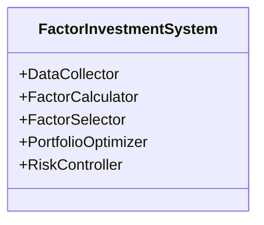

                 


# 因子投资：捕捉市场异常回报的系统方法

## 关键词：因子投资、多因子模型、投资组合优化、因子筛选、系统架构设计

## 摘要：  
因子投资是一种基于系统方法的投资策略，通过分析和利用多个因子（如市值、价值、动量等）来捕捉市场中的异常回报。本文从因子投资的背景、核心概念、算法原理、数学模型、系统架构设计、项目实战以及最佳实践等多个方面进行深入分析，帮助读者全面理解并掌握因子投资的系统方法。

---

## 第一部分：因子投资的背景与核心概念

### 第1章：因子投资的定义与背景

#### 1.1 因子投资的定义
因子投资是一种基于统计和金融理论的投资方法，通过分析影响股票收益的各种因子，构建投资组合以捕捉市场中的超额收益。与传统基本面分析不同，因子投资更注重量化因子对收益的解释能力。

#### 1.2 因子投资的历史发展
- **早期理论基础**：20世纪中期，Markowitz提出现代投资组合理论（MPT），为因子投资奠定了基础。
- **多因子模型的发展**：Fama和French提出了著名的三因子模型，之后逐步发展出更复杂的多因子模型。
- **现代应用**：随着大数据和计算能力的提升，因子投资在量化交易和机构投资中得到广泛应用。

#### 1.3 因子投资与传统投资的区别
- **分析方法**：传统投资依赖基本面分析，而因子投资基于统计和量化方法。
- **投资策略**：传统策略注重个股选择，因子投资通过因子筛选构建组合。
- **风险控制**：传统方法难以系统化，而因子投资通过多因子模型有效控制风险。

### 第2章：因子投资的核心概念

#### 2.1 因子的定义与分类
- **因子的定义**：因子是影响股票收益的可量化因素，如市值（Size）、价值（Value）、动量（Momentum）等。
- **因子的分类**：
  1. **风格因子**：包括市值、价值、动量等。
  2. **质量因子**：如盈利能力、杠杆率等。
  3. **其他因子**：如流动性因子、波动率因子等。

#### 2.2 因子投资的基本原理
- **因子与收益的关系**：因子通过统计回归分析与股票收益相关联，构建多因子模型预测收益。
- **多因子模型**：将多个因子线性组合，构建投资组合以捕捉超额收益。

#### 2.3 因子投资的核心要素
- **数据来源与处理**：使用历史价格、财务数据等构建因子。
- **因子筛选与优化**：通过统计检验筛选显著因子，并优化因子权重。
- **组合构建与风险控制**：通过优化算法构建投资组合，并控制风险敞口。

### 第3章：因子投资的关键概念与联系

#### 3.1 因子投资的核心原理
- **因子与收益的线性关系**：因子对收益的影响是线性的，可以通过回归模型进行量化。
- **多因子模型的构建**：将多个因子组合，形成一个综合的收益预测模型。

#### 3.2 因子的属性特征对比
以下是常见因子的特征对比：

| 因子类型 | 解释能力 | 相关性 | 易投资性 |
|----------|----------|--------|----------|
| 市值     | 高       | 中     | 高       |
| 价值     | 高       | 低     | 高       |
| 动量     | 高       | 中     | 中       |

#### 3.3 因子之间的关系
- **相关性分析**：因子之间可能存在正相关或负相关，需通过统计方法评估。
- **协同作用机制**：多个因子协同作用，提高模型的预测能力。

---

## 第二部分：因子投资的算法原理

### 第4章：因子投资的数学模型

#### 4.1 多因子模型的数学表达
Fama-French三因子模型公式如下：
$$
R_i = \alpha + \beta_1 R_{m} + \beta_2 (R_{m} - R_{F}) + \beta_3 Size + \beta_4 Value + \epsilon
$$
其中，$R_i$是股票i的收益，$R_m$是市场收益，$R_F$是无风险利率，Size是市值因子，Value是价值因子，$\epsilon$是误差项。

#### 4.2 因子筛选与回归分析
通过回归分析筛选显著因子，构建预测模型。以下是回归分析的步骤：
1. **数据准备**：收集相关因子数据。
2. **回归分析**：使用最小二乘法估计因子系数。
3. **显著性检验**：剔除不显著因子。

### 第5章：因子投资的系统架构设计

#### 5.1 问题场景介绍
设计一个因子投资系统，通过筛选和优化因子构建投资组合，实现超额收益。

#### 5.2 系统功能设计
- **数据采集模块**：获取股票数据和财务数据。
- **因子计算模块**：计算各因子值。
- **因子筛选模块**：通过回归分析筛选显著因子。
- **组合优化模块**：构建最优投资组合。
- **风险控制模块**：监控和控制投资风险。

#### 5.3 系统架构设计
以下是系统架构的类图：



#### 5.4 接口设计与交互流程
- **接口设计**：提供API接口供其他系统调用。
- **交互流程**：用户输入参数，系统返回优化后的投资组合。

---

## 第三部分：因子投资的项目实战

### 第6章：因子投资系统的实现

#### 6.1 环境安装
- **Python环境**：安装Python 3.8及以上版本。
- **库的安装**：使用pip安装numpy、pandas、scikit-learn等库。

#### 6.2 核心代码实现
以下是因子筛选和组合优化的代码示例：

```python
import pandas as pd
import numpy as np
from sklearn.linear_model import LinearRegression

# 数据准备
data = pd.read_csv('stock_data.csv')
X = data[['Size', 'Value', 'Momentum']]
y = data['Returns']

# 因子筛选
model = LinearRegression()
model.fit(X, y)
coefficients = pd.DataFrame({'Factor': X.columns, 'Coefficient': model.coef_})
selected_factors = coefficients[abs(coefficients['Coefficient']) > 0.1]

# 组合优化
from scipy.optimize import minimize

def portfolio_optimization(returns, weights):
    def objective(weights, returns):
        return -np.dot(weights.T, returns)  # 最大化收益
    def constraint(weights):
        return np.sum(weights) - 1  # 权重和为1

    result = minimize(objective, weights, 
                     method='SLSQP',
                     constraints={'type': 'eq', 'fun': constraint})
    return result.x

optimal_weights = portfolio_optimization(selected_factors.Coefficient, np.array([1/len(selected_factors)]*len(selected_factors)))
```

#### 6.3 实际案例分析
通过分析历史数据，验证因子模型的有效性，并优化投资组合。

---

## 第四部分：最佳实践与总结

### 第7章：最佳实践

#### 7.1 小结
因子投资通过系统方法捕捉市场异常回报，需结合多因子模型和优化算法。

#### 7.2 注意事项
- 数据质量：确保数据准确性和完整性。
- 因子选择：避免过拟合，选择具有稳定性的因子。
- 风险控制：定期监控和调整投资组合。

#### 7.3 拓展阅读
推荐阅读相关书籍和文献，深入理解因子投资的理论与实践。

---

通过以上分析，读者可以全面理解因子投资的系统方法，并在实际中应用这些策略捕捉市场异常回报。

