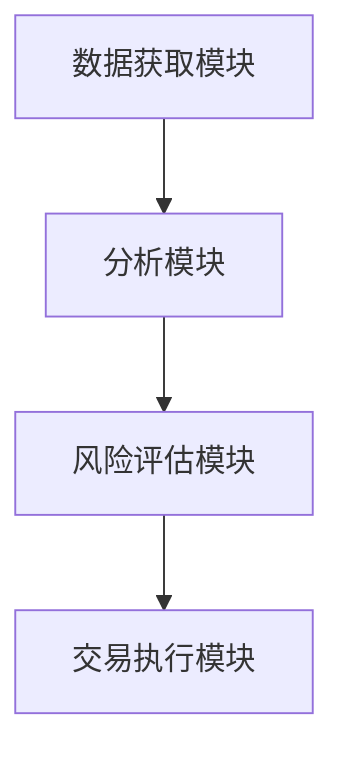
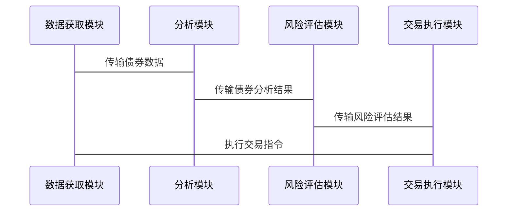

                 

# 《固定收益策略：在低利率环境中寻求收益》

## 关键词：固定收益策略，低利率环境，债券投资，收益最大化，风险控制

## 摘要：
本文详细探讨了在低利率环境下，如何通过固定收益策略实现收益最大化和风险控制。从固定收益市场的基本概念出发，分析了低利率环境对固定收益市场的影响，介绍了多种固定收益策略及其应用，包括久期缺口策略、信用利差套利、杠杆策略等。同时，本文还从量化分析、系统架构和风险管理等多个维度，深入剖析了低利率环境下的投资策略，并通过实际案例分析，为读者提供了切实可行的投资建议。

---

# 第一部分: 固定收益策略基础

# 第1章: 固定收益市场的基本概念

## 1.1 固定收益市场的定义与特点

### 1.1.1 固定收益市场的定义
固定收益市场是指以固定收益证券（如债券、国债、企业债等）为交易对象的金融市场。这类证券的收益主要来源于票息和本金的偿还，具有确定性和固定性的特点。

### 1.1.2 固定收益市场的特点
- **收益固定性**：债券的票息和本金偿还通常是固定的，投资收益相对稳定。
- **期限多样性**：固定收益证券的期限从短期（如国库券）到长期（如长期国债）不等。
- **流动性风险**：虽然固定收益证券的收益固定，但其市场价格受利率波动影响较大，存在流动性风险。

### 1.1.3 固定收益市场的参与者
- **发行人**：政府、企业和金融机构。
- **投资者**：个人投资者、机构投资者（如保险公司、 pension funds）和对冲基金。
- **中介服务机构**：券商、银行和交易所。

## 1.2 固定收益工具的分类

### 1.2.1 政府债券
政府债券是由政府发行的债务工具，包括国债和地方政府债券。这类债券通常被认为风险较低，是固定收益投资中的基础工具。

### 1.2.2 企业债券
企业债券是由企业发行的债务工具，其风险和收益通常高于政府债券。企业债券的评级取决于发行企业的信用状况。

### 1.2.3 金融债券
金融债券是由金融机构（如银行、保险公司）发行的债务工具，通常用于筹集资金。

### 1.2.4 衍生品
固定收益市场的衍生品包括债券期货、期权和互换等，用于对冲或投机利率波动风险。

## 1.3 固定收益市场的收益率计算

### 1.3.1 到期收益率
到期收益率（YTM）是债券的年化收益率，考虑了债券的票息和面值偿还。计算公式为：
$$
YTM = \frac{C + \frac{F - P}{n}}{F}
$$
其中，\( C \) 是票息，\( F \) 是面值，\( P \) 是债券价格，\( n \) 是剩余期限。

### 1.3.2 当前收益率
当前收益率是债券的年化票息与当前市场价格的比率：
$$
Current\ Yield = \frac{C}{P}
$$

### 1.3.3 再投资收益率
再投资收益率是债券持有者在债券持有期间内将收到的现金流以当前市场利率进行再投资的收益率。

## 1.4 低利率环境下的固定收益市场

### 1.4.1 低利率环境的定义
低利率环境是指市场利率水平较低，通常由央行货币政策宽松、经济增速放缓或通货膨胀率下降等因素引起。

### 1.4.2 低利率环境对固定收益市场的影响
- **债券收益率下降**：低利率环境下，债券的票息和到期收益率均下降。
- **期限溢价下降**：长期债券的收益率下降幅度通常大于短期债券。
- **信用风险上升**：低利率环境下，债券发行人可能面临更大的违约风险。

### 1.4.3 低利率环境下的投资机会与风险
- **机会**：低利率环境下，债券价格可能上涨，投资者可以通过持有长期债券获得资本增值。
- **风险**：债券收益率下降，再投资风险增加，同时信用风险上升。

## 1.5 本章小结

---

# 第2章: 固定收益策略的核心概念与分析工具

## 2.1 现金流贴现模型

### 2.1.1 现金流贴现模型的定义
现金流贴现模型（DCF模型）是通过将债券的未来现金流（票息和面值偿还）按当前市场利率贴现，计算其现值的方法。

### 2.1.2 现金流贴现模型的应用
- **债券定价**：通过DCF模型计算债券的公允价值。
- **投资决策**：比较债券的市场价格与DCF模型计算的现值，判断是否低估或高估。

### 2.1.3 现金流贴现模型的优缺点
- **优点**：能够准确反映债券的内在价值，考虑了时间和资金的时间价值。
- **缺点**：模型依赖于市场利率的准确性，利率波动会影响模型的准确性。

## 2.2 久期与凸性

### 2.2.1 久期的定义与计算
久期是债券价格对收益率变动的敏感性指标。久期越长，债券价格对收益率变动的敏感性越高。

### 2.2.2 凸性的定义与作用
凸性是债券价格收益率曲线的弯曲程度，反映了久期在不同收益率水平下的变化。

### 2.2.3 久期与凸性在投资中的应用
- **风险对冲**：通过调整债券组合的久期，对冲利率波动风险。
- **收益最大化**：通过凸性分析，选择凸性较高的债券，获得更高的收益。

## 2.3 信用评级与信用风险

### 2.3.1 信用评级的定义与分类
信用评级是对债券发行人信用状况的评估，通常分为投资级和投机级。

### 2.3.2 信用风险的定义与度量
信用风险是债券发行人违约的可能性，通常通过违约概率和违约损失率来度量。

### 2.3.3 信用评级与债券价格的关系
- **高信用评级**：债券违约风险低，市场价格较高。
- **低信用评级**：债券违约风险高，市场价格较低。

## 2.4 宏观经济分析与固定收益策略

### 2.4.1 宏观经济指标对固定收益市场的影响
- **利率水平**：央行货币政策直接影响市场利率。
- **通货膨胀率**：通货膨胀上升会推高债券收益率。
- **经济增长**：经济增速放缓可能导致债券收益率下降。

### 2.4.2 宏观经济周期与固定收益策略的选择
- **经济衰退期**：选择长期债券和高信用评级债券。
- **经济复苏期**：选择短期债券和低信用评级债券。

### 2.4.3 宏观经济预测在固定收益投资中的应用
- **利率预测**：通过宏观经济分析预测未来利率走势。
- **债券选择**：根据利率预测选择合适的债券品种。

## 2.5 本章小结

---

# 第3章: 低利率环境下的固定收益策略

## 3.1 低利率环境下的债券投资策略

### 3.1.1 久期缺口策略
久期缺口策略是指通过调整债券组合的久期，使组合的久期与目标久期一致，从而对冲利率波动风险。

### 3.1.2 信用利差套利策略
信用利差套利策略是指在不同信用评级的债券之间进行套利，利用信用利差的波动获利。

### 3.1.3 杠杆策略
杠杆策略是指通过借入资金放大债券投资的规模，以获取更高的收益。

## 3.2 低利率环境下的债券组合管理

### 3.2.1 债券组合的风险管理
- **久期管理**：通过调整组合的久期，控制利率风险。
- **信用管理**：通过分散投资降低信用风险。

### 3.2.2 债券组合的流动性管理
- **流动性风险**：债券组合的流动性越低，越难以快速变现。
- **流动性管理**：通过持有高流动性债券或设置流动性缓冲池，降低流动性风险。

### 3.2.3 债券组合的再平衡管理
- **再平衡策略**：定期调整债券组合的构成，保持目标久期和信用评级。

## 3.3 低利率环境下的固定收益策略优化

### 3.3.1 利率曲线策略
- **陡峭曲线**：长期债券收益率高于短期债券，适合选择长期债券。
- **平坦曲线**：长期和短期债券收益率接近，适合选择短期债券。

### 3.3.2 利差策略
- **息差策略**：通过比较不同债券的票息差异，选择票息较高的债券。
- **期限利差策略**：通过比较不同期限债券的利差，选择利差较大的债券。

## 3.4 本章小结

---

# 第4章: 低利率环境下的固定收益策略的量化分析

## 4.1 债券定价模型的量化分析

### 4.1.1 现金流贴现模型的量化实现
- **模型假设**：假设债券的未来现金流是确定的。
- **计算步骤**：
  1. 确定债券的票息、面值和剩余期限。
  2. 选择合适的贴现率。
  3. 计算债券的现值。

### 4.1.2 现金流贴现模型的优缺点
- **优点**：能够准确反映债券的内在价值。
- **缺点**：模型依赖于市场利率的准确性，利率波动会影响模型的准确性。

## 4.2 久期和凸性的量化分析

### 4.2.1 久期的量化计算
- **计算公式**：
  $$
  Duration = \frac{1}{1 + r} \sum_{t=1}^{n} \frac{CF_t}{(1 + r)^t}
  $$
  其中，\( CF_t \) 是第 \( t \) 期的现金流，\( r \) 是市场利率。

### 4.2.2 凸性的量化计算
- **计算公式**：
  $$
  Convexity = \frac{1}{(1 + r)^2} \sum_{t=1}^{n} \frac{CF_t \cdot t}{(1 + r)^{t-1}}
  $$

## 4.3 信用风险的量化分析

### 4.3.1 信用风险的度量模型
- **违约概率（PD）**：债券发行人违约的概率。
- **违约损失率（LGD）**：债券发行人违约时，投资者的平均损失比例。

### 4.3.2 信用风险的管理策略
- **分散投资**：通过投资不同信用评级的债券降低信用风险。
- **信用衍生品**：利用信用违约互换（CDS）对冲信用风险。

## 4.4 低利率环境下的量化投资策略

### 4.4.1 利率预测模型
- **ARIMA模型**：通过历史利率数据预测未来利率走势。
- **回归模型**：利用宏观经济指标预测未来利率。

### 4.4.2 债券组合优化模型
- **均值-方差优化**：通过优化组合的收益率和风险，选择最优债券组合。
- **风险中性定价模型**：在风险中性假设下，计算债券的合理价格。

## 4.5 本章小结

---

# 第5章: 低利率环境下的固定收益策略的系统架构设计

## 5.1 系统功能设计

### 5.1.1 系统功能模块
- **数据获取模块**：获取债券市场数据。
- **分析模块**：计算债券的收益率、久期、凸性等指标。
- **风险评估模块**：评估债券组合的信用风险和市场风险。
- **交易执行模块**：根据策略执行债券交易。

### 5.1.2 系统功能流程
1. 数据获取模块从市场数据源获取债券数据。
2. 分析模块对债券数据进行量化分析，计算债券的收益率和风险指标。
3. 风险评估模块根据分析结果，评估债券组合的风险。
4. 交易执行模块根据风险评估结果，执行债券交易。

## 5.2 系统架构设计

### 5.2.1 系统架构图

### 5.2.2 系统组件设计
- **数据获取模块**：负责从市场数据源获取债券数据，包括债券的票息、面值、期限和信用评级等。
- **分析模块**：负责对债券数据进行量化分析，计算债券的收益率、久期、凸性等指标。
- **风险评估模块**：负责评估债券组合的信用风险和市场风险，计算违约概率和违约损失率。
- **交易执行模块**：负责根据风险评估结果，执行债券交易，调整债券组合。

## 5.3 系统接口设计

### 5.3.1 数据接口
- **输入接口**：从市场数据源获取债券数据。
- **输出接口**：向交易系统输出债券交易指令。

### 5.3.2 交易接口
- **买入指令**：向交易系统发送买入债券的指令。
- **卖出指令**：向交易系统发送卖出债券的指令。

## 5.4 系统交互设计

### 5.4.1 交互流程
1. 数据获取模块从市场数据源获取债券数据。
2. 分析模块对债券数据进行量化分析，计算债券的收益率和风险指标。
3. 风险评估模块根据分析结果，评估债券组合的风险。
4. 交易执行模块根据风险评估结果，执行债券交易。

### 5.4.2 交互序列图

## 5.5 本章小结

---

# 第6章: 低利率环境下的固定收益策略的风险管理

## 6.1 低利率环境下的信用风险管理

### 6.1.1 信用风险的定义与度量
- **信用风险**：债券发行人违约的可能性。
- **违约概率（PD）**：债券发行人违约的概率。
- **违约损失率（LGD）**：债券发行人违约时，投资者的平均损失比例。

### 6.1.2 信用风险的管理策略
- **分散投资**：通过投资不同信用评级的债券降低信用风险。
- **信用衍生品**：利用信用违约互换（CDS）对冲信用风险。

## 6.2 低利率环境下的市场风险管理

### 6.2.1 市场风险的定义与度量
- **市场风险**：债券市场价格波动带来的风险。
- **VaR（Value at Risk）**：在一定置信水平下，债券组合的最大可能损失。

### 6.2.2 市场风险管理策略
- **久期管理**：通过调整债券组合的久期，控制市场风险。
- **凸性管理**：通过选择凸性较高的债券，降低市场风险。

## 6.3 低利率环境下的流动性风险管理

### 6.3.1 流动性风险的定义与度量
- **流动性风险**：债券组合难以快速变现的风险。

### 6.3.2 流动性风险管理策略
- **流动性缓冲池**：持有一定比例的高流动性债券，应对突发的流动性需求。
- **流动性管理工具**：利用回购和拆借等工具，提高债券组合的流动性。

## 6.4 低利率环境下的压力测试与情景分析

### 6.4.1 压力测试的定义与应用
- **压力测试**：在极端市场条件下，评估债券组合的承受能力。

### 6.4.2 情景分析的定义与应用
- **情景分析**：在不同市场情景下，评估债券组合的收益和风险。

## 6.5 本章小结

---

# 第7章: 低利率环境下的固定收益策略的案例分析

## 7.1 案例背景与目标

### 7.1.1 案例背景
- **市场环境**：低利率环境，债券收益率普遍下降。
- **投资目标**：通过固定收益策略实现收益最大化和风险控制。

## 7.2 案例分析

### 7.2.1 投资策略选择
- **久期缺口策略**：选择久期较长的债券，对冲利率波动风险。
- **信用利差套利策略**：投资信用利差较大的债券，利用利差波动获利。

### 7.2.2 投资组合构建
- **债券选择**：选择信用评级较高的长期债券。
- **组合优化**：通过均值-方差优化，选择最优债券组合。

### 7.2.3 风险管理
- **久期管理**：保持组合久期与目标久期一致。
- **信用管理**：分散投资，降低信用风险。

## 7.3 案例结果与分析

### 7.3.1 案例结果
- **收益**：通过久期缺口策略和信用利差套利策略，实现了较高的收益。
- **风险**：通过久期管理和信用管理，有效控制了组合风险。

### 7.3.2 案例分析
- **策略的有效性**：久期缺口策略和信用利差套利策略在低利率环境下表现良好。
- **风险管理的效果**：久期管理和信用管理有效控制了组合风险。

## 7.4 本章小结

---

# 第8章: 低利率环境下的固定收益策略的总结与展望

## 8.1 本章小结

### 8.1.1 核心内容总结
- **固定收益市场的基本概念**：介绍了固定收益市场的定义、特点和主要工具。
- **低利率环境下的固定收益策略**：探讨了久期缺口策略、信用利差套利策略和杠杆策略等。
- **量化分析与系统架构设计**：通过量化分析和系统架构设计，优化了固定收益策略。
- **风险管理**：通过信用风险管理、市场风险管理

