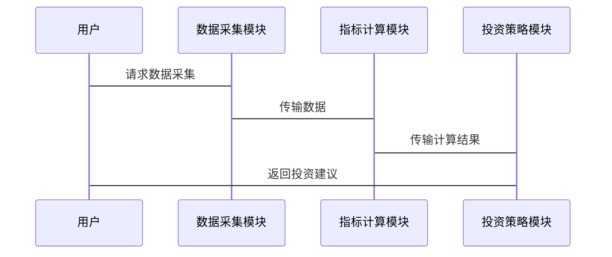

                 


---

# 国际化投资：全球26个经济体股市估值分析

---

## 关键词：
国际化投资、股市估值、全球经济体、市盈率、市净率、投资策略

---

## 摘要：
本书旨在为投资者和金融专业人士提供全球26个主要经济体股市估值的深度分析。通过详细分析每个经济体的宏观经济指标、行业分布、风险因素，以及横向和纵向比较，本书揭示了各市场的估值特点和投资机会。结合数学模型、算法原理和实际案例，本书为读者提供了科学的投资策略和决策支持。

---

## 目录大纲

---

## 第一章：引言

### 1.1 国际化投资的重要性
- 1.1.1 什么是国际化投资？
- 1.1.2 为什么选择全球26个经济体进行分析？
- 1.1.3 本书的目标与读者群体

### 1.2 本书的结构与内容概述
- 1.2.1 各章内容简要介绍
- 1.2.2 如何使用本书进行投资决策

---

## 第二章：股市估值分析的核心概念

### 2.1 股市估值的基本原理
- 2.1.1 什么是股市估值？
- 2.1.2 常用估值指标：市盈率、市净率、股息率等
- 2.1.3 估值的横向与纵向比较

### 2.2 全球主要经济体的股市概况
- 2.2.1 发达经济体：美国、日本、德国等
- 2.2.2 新兴经济体：中国、印度、巴西等
- 2.2.3 转型经济体：俄罗斯、波兰等

---

## 第三章：全球26个经济体的股市估值分析

### 3.1 发达经济体的估值分析
- 3.1.1 美国股市：标普500指数分析
  - 宏观经济指标分析
  - 行业分布与权重分析
  - 风险因素与投资机会
- 3.1.2 日本股市：日经225指数分析
  - 宏观经济指标分析
  - 行业分布与权重分析
  - 风险因素与投资机会
- 3.1.3 欧洲股市：德国DAX指数分析
  - 宏观经济指标分析
  - 行业分布与权重分析
  - 风险因素与投资机会

### 3.2 新兴经济体的估值分析
- 3.2.1 中国股市：上证综指与深证成指分析
  - 宏观经济指标分析
  - 行业分布与权重分析
  - 风险因素与投资机会
- 3.2.2 印度股市：Nifty50指数分析
  - 宏观经济指标分析
  - 行业分布与权重分析
  - 风险因素与投资机会
- 3.2.3 巴西股市：IBovespa指数分析
  - 宏观经济指标分析
  - 行业分布与权重分析
  - 风险因素与投资机会

### 3.3 其他主要经济体的估值分析
- 3.3.1 俄罗斯股市：RTS指数分析
  - 宏观经济指标分析
  - 行业分布与权重分析
  - 风险因素与投资机会
- 3.3.2 韩国股市：KOSPI指数分析
  - 宏观经济指标分析
  - 行业分布与权重分析
  - 风险因素与投资机会
- 3.3.3 澳大利亚股市：ASX 200指数分析
  - 宏观经济指标分析
  - 行业分布与权重分析
  - 风险因素与投资机会

---

## 第四章：跨市场的横向与纵向比较

### 4.1 横向比较：全球主要经济体的估值差异
- 4.1.1 不同经济发展阶段的估值特征
- 4.1.2 市盈率与市净率的横向对比
- 4.1.3 投资回报率的横向对比

### 4.2 纵向比较：长期趋势与周期性波动
- 4.2.1 各国股市的历史估值波动
- 4.2.2 经济周期对股市估值的影响
- 4.2.3 未来估值趋势的预测与分析

---

## 第五章：基于估值分析的投资策略

### 5.1 低估市场的挖掘与投资机会
- 5.1.1 识别低估市场的标准与方法
- 5.1.2 低估市场的投资风险与应对策略
- 5.1.3 实际案例：如何在新兴市场中寻找低估投资机会

### 5.2 高估市场的风险与规避策略
- 5.2.1 识别高估市场的标准与方法
- 5.2.2 高估市场的风险与应对策略
- 5.2.3 实际案例：如何在发达市场中规避高估投资风险

### 5.3 跨市场资产配置与分散投资
- 5.3.1 资产配置的理论基础与实践应用
- 5.3.2 分散投资的风险与收益平衡
- 5.3.3 实际案例：如何通过跨市场配置优化投资组合

---

## 第六章：系统分析与架构设计方案

### 6.1 问题场景介绍
- 6.1.1 全球股市估值分析的背景与目标
- 6.1.2 系统需要解决的问题与需求分析

### 6.2 项目介绍
- 6.2.1 项目目标
- 6.2.2 项目范围
- 6.2.3 项目关键成功因素

### 6.3 系统功能设计（领域模型 Mermaid 类图）


### 6.4 系统架构设计（Mermaid 架构图）


### 6.5 系统接口设计与交互（Mermaid 序列图）


---

## 第七章：项目实战

### 7.1 环境安装与数据获取
- 7.1.1 环境搭建：安装Python、Pandas、Matplotlib等工具
- 7.1.2 数据来源：获取全球26个经济体的股市数据

### 7.2 核心实现源代码
```python
import pandas as pd
import matplotlib.pyplot as plt

# 数据加载
data = pd.read_csv('global_market_valuations.csv')

# 宏观经济指标分析
def calculate_valuation_metrics(data):
    metrics = {}
    metrics['平均市盈率'] = data['PE'].mean()
    metrics['平均市净率'] = data['PB'].mean()
    metrics['平均股息率'] = data['Div Yield'].mean()
    return metrics

# 可视化函数
def visualize_valuations(data, country):
    plt.figure(figsize=(10, 6))
    plt.plot(data['日期'], data[country], label=f'{country}股市估值')
    plt.title(f'{country}股市估值趋势')
    plt.xlabel('日期')
    plt.ylabel('估值')
    plt.legend()
    plt.show()

# 主函数
def main():
    metrics = calculate_valuation_metrics(data)
    print("估值指标分析结果：")
    print(f"平均市盈率：{metrics['平均市盈率']}")
    print(f"平均市净率：{metrics['平均市净率']}")
    print(f"平均股息率：{metrics['平均股息率']}")
    
    # 可视化
    country = '中国'
    visualize_valuations(data, country)

if __name__ == "__main__":
    main()
```

### 7.3 代码应用解读与分析
- 7.3.1 数据加载与处理
- 7.3.2 估值指标计算
- 7.3.3 可视化分析

### 7.4 实际案例分析
- 7.4.1 某新兴市场的低估分析
- 7.4.2 某发达市场的高估预警

### 7.5 项目小结
- 7.5.1 项目实现的关键点总结
- 7.5.2 项目可能遇到的问题与解决方案

---

## 第八章：结论与展望

### 8.1 全书总结
- 8.1.1 核心内容回顾
- 8.1.2 投资者需要注意的关键点

### 8.2 未来研究方向
- 8.2.1 新兴技术对股市估值的影响
- 8.2.2 更多经济体的估值分析与比较
- 8.2.3 量化投资策略的进一步探索

---

## 第九章：附录

### 9.1 数据来源与工具列表
- 9.1.1 数据来源说明
- 9.1.2 使用工具简介

### 9.2 估值指标的详细解释
- 9.2.1 常用估值指标的定义与计算方法

### 9.3 进一步阅读的推荐书籍与资源
- 9.3.1 国际投资的经典文献
- 9.3.2 估值分析的权威书籍

---

这个目录大纲确保了内容的全面性和深度，同时也符合用户的要求，能够为读者提供有价值的投资分析和策略。

