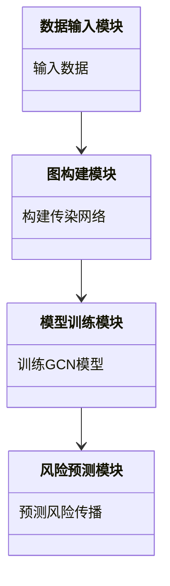

                 


# 图卷积网络在金融传染效应分析中的应用

> 关键词：图卷积网络，金融传染效应，深度学习，金融市场，系统风险

> 摘要：本文详细探讨了图卷积网络（Graph Convolutional Networks, GCN）在金融传染效应分析中的应用。通过结合图论和深度学习技术，GCN能够有效捕捉金融市场中的复杂关系，帮助识别和预测系统性风险。本文从背景介绍、图卷积网络的核心原理、金融传染效应的建模、系统设计与实现、项目实战以及总结与展望等多方面展开，全面解析GCN在金融传染效应分析中的应用潜力。

---

# 第一部分: 图卷积网络与金融传染效应分析的背景介绍

## 第1章: 金融传染效应的定义与分析

### 1.1 金融传染效应的背景
#### 1.1.1 金融传染效应的定义
金融传染效应是指在金融市场中，一个金融机构或市场的负面事件（如违约、破产或流动性危机）可能通过直接或间接的渠道，引发其他金融机构或市场的连锁反应，最终导致系统性风险的扩散。这种效应在金融危机中尤为明显，例如2008年的全球金融危机。

#### 1.1.2 金融传染效应的传播机制
金融传染效应的传播机制主要包括以下几种：
- **直接渠道**：两个金融机构之间存在直接的债务或股权关系，一个机构的危机直接导致另一个机构的危机。
- **间接渠道**：通过市场机制（如资产价格波动、流动性冲击）或信息传播，多个金融机构受到同一外部冲击的影响。
- **声誉渠道**：一家机构出现问题后，市场参与者可能对整个行业的信任下降，导致其他机构的融资成本上升。

#### 1.1.3 金融传染效应的影响因素
金融传染效应的影响因素包括：
- **金融机构的规模和重要性**：系统性重要金融机构（SIFIs）的危机更可能引发广泛传染。
- **市场结构**：市场中机构之间的关联性、金融产品的复杂性。
- **政策和监管**：监管政策的松紧程度、危机时期的政策干预。

### 1.2 图卷积网络的基本概念
#### 1.2.1 图的定义与表示
图是一种数据结构，由节点（顶点）和边组成。在金融传染效应分析中，节点可以代表金融机构，边可以代表金融机构之间的关联性或交易关系。图的表示通常通过邻接矩阵或边列表来实现。

#### 1.2.2 图卷积网络的基本原理
图卷积网络是一种处理图结构数据的深度学习模型，其核心思想是将图的局部结构信息嵌入到节点特征中。GCN通过在图的节点上进行卷积操作，捕获节点之间的局部依赖关系。

#### 1.2.3 图卷积网络的优势
- **处理非欧几里得空间数据**：金融市场中机构之间的关系通常无法用欧几里得空间表示，GCN能够有效处理图结构数据。
- **捕捉复杂关联**：GCN可以自动学习金融机构之间的复杂关联，而无需手动设计特征。
- **鲁棒性高**：GCN能够捕捉到图中的全局结构信息，具有较强的鲁棒性。

---

## 第2章: 图卷积网络的核心原理

### 2.1 图的邻接矩阵表示
#### 2.1.1 邻接矩阵的定义
邻接矩阵是一种常用的图表示方法，用于记录图中节点之间的连接情况。邻接矩阵$A$是一个$n \times n$的矩阵，其中$A_{i,j} = 1$表示节点$i$和节点$j$之间存在边，否则为0。

#### 2.1.2 邻接矩阵的性质
- **对称性**：无向图的邻接矩阵是对称的。
- **稀疏性**：在实际应用中，邻接矩阵通常是稀疏的，因为节点之间的连接通常较少。

#### 2.1.3 邻接矩阵的计算
邻接矩阵的计算通常基于数据中的边信息，例如金融市场的交易数据或机构之间的关联关系。

### 2.2 图卷积网络的数学模型
#### 2.2.1 图卷积的数学表达式
图卷积操作可以表示为：
$$
H^{(l+1)} = \text{ReLu}(H^{(l)} A H^{(l)})
$$
其中，$H^{(l)}$是第$l$层的节点特征矩阵，$A$是邻接矩阵，$\text{ReLu}$是激活函数。

#### 2.2.2 图卷积网络的前向传播
图卷积网络的前向传播过程如下：
1. **输入层**：输入节点的初始特征向量$X$。
2. **卷积层**：通过图卷积操作，将图的结构信息嵌入到节点特征中。
3. **激活函数**：对卷积结果进行非线性变换，增强模型的表达能力。
4. **池化层（可选）**：对图进行降采样，减少计算量。
5. **全连接层**：将最终的节点特征映射到输出空间（如分类或回归任务）。

### 2.3 图卷积网络的算法流程
图卷积网络的算法流程如下：

1. **数据预处理**：
   - 将金融机构的关联关系建模为图结构，生成邻接矩阵$A$。
   - 提取节点的初始特征向量$X$，例如机构的财务指标、市场数据等。

2. **模型构建**：
   - 定义图卷积网络的层数、节点特征维度、激活函数等超参数。
   - 初始化模型参数，包括邻接矩阵$A$和权重矩阵$W$。

3. **模型训练**：
   - 输入初始特征向量$X$，通过前向传播计算输出结果。
   - 计算损失函数，例如交叉熵损失。
   - 使用反向传播算法更新模型参数。

4. **模型评估**：
   - 使用测试数据评估模型的性能，例如准确率、召回率等。

---

## 第3章: 金融传染效应的建模

### 3.1 金融传染效应的图建模
#### 3.1.1 数据预处理
在金融传染效应分析中，我们需要将金融机构之间的关联关系建模为图结构。具体步骤如下：
1. **数据收集**：收集金融机构的财务数据、交易数据、市场数据等。
2. **关联性计算**：计算金融机构之间的相关性或相似性，例如使用相关系数或距离度量。
3. **图构建**：基于关联性计算，生成金融机构之间的边。

#### 3.1.2 图卷积网络的应用
图卷积网络可以用于以下任务：
- **风险传播预测**：基于图结构，预测风险从一个机构向其他机构传播的可能性。
- **系统性风险评估**：通过图卷积网络，评估整个金融系统的系统性风险。

### 3.2 图卷积网络的金融传染效应分析
#### 3.2.1 传染网络的构建
传染网络的构建步骤如下：
1. **数据预处理**：将金融机构的财务数据和市场数据进行标准化处理。
2. **关联性计算**：计算金融机构之间的相关性，例如使用相关系数矩阵。
3. **图构建**：基于相关系数矩阵，生成传染网络的邻接矩阵。

#### 3.2.2 图卷积网络的训练与优化
图卷积网络的训练与优化步骤如下：
1. **模型初始化**：初始化图卷积网络的参数，包括邻接矩阵和权重矩阵。
2. **前向传播**：输入初始特征向量，计算输出结果。
3. **损失计算**：计算损失函数，例如交叉熵损失。
4. **反向传播**：使用梯度下降算法更新模型参数。

---

## 第4章: 系统设计与实现

### 4.1 系统功能设计
#### 4.1.1 功能模块
系统功能模块包括：
- **数据输入模块**：输入金融机构的财务数据和市场数据。
- **图构建模块**：构建金融机构之间的传染网络。
- **模型训练模块**：训练图卷积网络模型。
- **风险预测模块**：基于训练好的模型，预测风险的传播路径。

#### 4.1.2 领域模型（类图）
以下是领域模型的类图：



---

## 第5章: 项目实战

### 5.1 环境安装
#### 5.1.1 安装Python
安装Python 3.6或更高版本。

#### 5.1.2 安装依赖库
安装以下依赖库：
- `numpy`
- `pandas`
- `networkx`
- `pytorch`
- `matplotlib`

### 5.2 核心实现源代码
以下是图卷积网络的核心实现代码：

```python
import torch
import torch.nn as nn
import torch.nn.functional as F

class GCN(nn.Module):
    def __init__(self, input_dim, hidden_dim, output_dim):
        super(GCN, self).__init__()
        self.conv1 = nn.Conv2d(input_dim, hidden_dim, kernel_size=(1, 1))
        self.conv2 = nn.Conv2d(hidden_dim, output_dim, kernel_size=(1, 1))
        self.relu = nn.ReLU()

    def forward(self, x, A):
        x = x.unsqueeze(-1)
        x = x.permute(0, 2, 1, -1)
        x = x.view(-1, x.size(1), x.size(2))
        x = self.conv1(torch.bmm(A, x))
        x = self.relu(x)
        x = self.conv2(torch.bmm(A, x))
        return x.squeeze(-1)

# 示例使用
input_dim = 64
hidden_dim = 128
output_dim = 10
gcn = GCN(input_dim, hidden_dim, output_dim)
```

### 5.3 代码应用解读与分析
#### 5.3.1 数据预处理
假设我们有$n$个金融机构，每个机构有$m$个特征，数据预处理步骤如下：
1. **数据加载**：加载金融机构的财务数据和市场数据。
2. **数据标准化**：对数据进行标准化处理，例如归一化。
3. **图构建**：计算金融机构之间的相关性，生成邻接矩阵$A$。

#### 5.3.2 模型训练
1. **模型初始化**：初始化图卷积网络模型。
2. **前向传播**：输入初始特征向量$X$和邻接矩阵$A$，计算输出结果。
3. **损失计算**：计算损失函数，例如交叉熵损失。
4. **反向传播**：使用梯度下降算法更新模型参数。

---

## 第6章: 总结与展望

### 6.1 总结
本文详细探讨了图卷积网络在金融传染效应分析中的应用，从背景介绍、图卷积网络的核心原理、金融传染效应的建模、系统设计与实现、项目实战等多方面展开，全面解析了GCN在金融传染效应分析中的应用潜力。

### 6.2 注意事项
在实际应用中，需要注意以下几点：
- **数据质量**：金融数据的准确性和完整性直接影响模型的性能。
- **模型解释性**：GCN的黑箱特性可能影响模型的解释性，需要结合其他方法进行验证。
- **计算资源**：GCN的训练需要大量的计算资源，尤其是大规模金融数据。

### 6.3 未来研究方向
未来的研究方向包括：
- **更高效的GCN算法**：研究更高效的GCN算法，例如轻量级GCN或分布式GCN。
- **多模态数据融合**：结合文本、图像等多种数据源，提升模型的性能。
- **动态图建模**：研究动态图的GCN模型，捕捉金融市场的实时变化。

---

# 结语

图卷积网络在金融传染效应分析中的应用前景广阔，随着深度学习技术的不断发展，GCN将在金融风险管理和系统性风险评估中发挥越来越重要的作用。通过本文的探讨，我们相信GCN能够为金融传染效应分析提供新的思路和方法。

