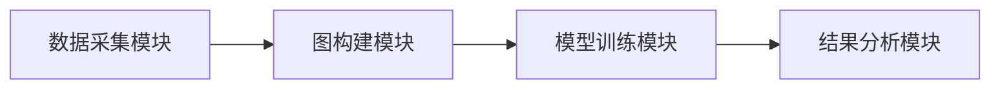
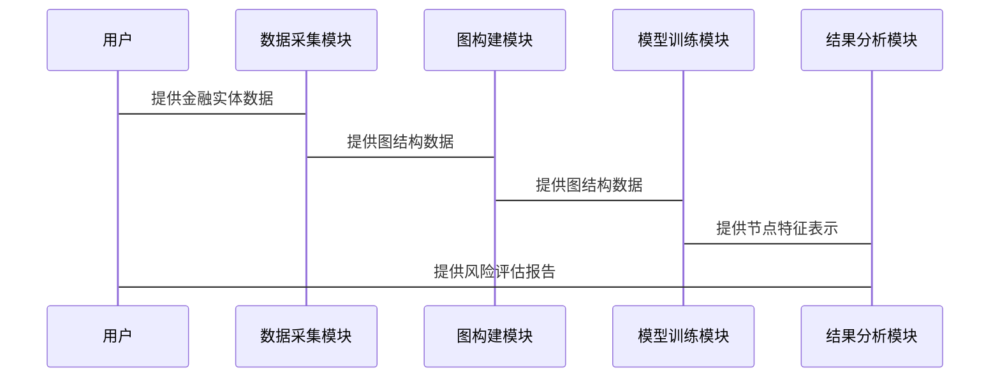

                 


# 图卷积网络在金融关系网络分析中的应用

> 关键词：图卷积网络、金融关系网络、网络分析、深度学习、金融风险评估

> 摘要：本文系统地探讨了图卷积网络（Graph Convolutional Networks，GCN）在金融关系网络分析中的应用。首先，文章介绍了GCN的基本概念和原理，以及金融关系网络的核心特征和分析目标。接着，详细分析了GCN在金融网络中的算法实现，包括图的表示方法、节点特征提取、边特征提取、图卷积操作和激活函数等关键步骤。然后，结合实际应用场景，设计了一个完整的金融关系网络分析系统，包括数据采集模块、图构建模块、模型训练模块和结果分析模块，并给出了系统架构图和交互流程图。最后，通过一个具体的金融网络分析案例，展示了GCN在金融风险评估和欺诈检测中的实际应用效果，并总结了GCN的优势与挑战，提出了进一步优化的建议。

---

# 第一部分: 图卷积网络在金融关系网络分析中的应用背景

# 第1章: 图卷积网络与金融关系网络概述

## 1.1 图卷积网络的基本概念

### 1.1.1 图论基础与图数据表示

图是一种由节点（顶点）和边（边）组成的数学结构，用于描述对象之间的关系。在金融领域，图可以用来表示公司、投资者、交易行为等实体之间的关系。图的表示方式包括邻接矩阵、邻接表和边列表等形式。例如，邻接矩阵可以表示节点之间的连接关系，其中$A_{i,j}=1$表示节点$i$和节点$j$之间存在边，$A_{i,j}=0$表示不存在边。

### 1.1.2 图卷积网络的定义与特点

图卷积网络（Graph Convolutional Networks，GCN）是一种用于处理图结构数据的深度学习模型，其核心思想是通过在图上进行卷积操作来提取节点的特征表示。GCN的主要特点包括：

1. **局部性**：GCN关注节点的局部邻居特征，通过多层传播逐步捕获全局特征。
2. **灵活性**：GCN可以处理不同类型的图结构，包括无向图、有向图和加权图。
3. **鲁棒性**：GCN能够处理图中缺失边或节点的情况，具有一定的鲁棒性。

### 1.1.3 金融关系网络的定义与特征

金融关系网络是由金融实体（如公司、投资者、交易）及其关系（如控股、投资、交易）构成的图结构。其主要特征包括：

1. **节点异质性**：节点代表不同的金融实体，具有不同的属性特征。
2. **边权重**：边表示关系的强度或方向，例如控股关系具有较强的权重。
3. **网络复杂性**：金融网络通常具有复杂的结构，可能存在多个层级的关联关系。

## 1.2 金融关系网络分析的背景与意义

### 1.2.1 金融网络分析的背景

随着金融市场的日益复杂化，传统的基于单一指标的分析方法难以捕捉复杂的金融关系。例如，在企业风险评估中，仅仅分析企业的财务指标是不够的，还需要考虑其与上下游企业、投资者之间的关联关系。

### 1.2.2 图卷积网络在金融网络分析中的优势

GCN能够通过图结构捕捉金融实体之间的关系特征，具有以下优势：

1. **关系建模**：GCN可以自然地建模金融实体之间的关系，通过图结构反映其关联性。
2. **特征提取**：GCN能够自动提取节点的高层次特征，结合节点的属性特征和关系特征进行综合分析。
3. **深度学习能力**：GCN通过多层卷积操作，能够发现复杂的金融关系模式。

### 1.2.3 金融关系网络分析的实际应用

金融关系网络分析在以下几个方面具有实际应用价值：

1. **企业风险评估**：通过分析企业之间的关联关系，评估企业的整体风险。
2. **金融欺诈检测**：通过发现异常交易模式，识别潜在的金融欺诈行为。
3. **投资组合优化**：通过分析投资标的之间的关系，优化投资组合的风险和收益。

## 1.3 问题背景与目标

### 1.3.1 金融网络分析的核心问题

金融网络分析的核心问题是如何通过图结构数据，挖掘金融实体之间的关系特征，进而实现金融风险评估、欺诈检测等目标。

### 1.3.2 图卷积网络在金融网络分析中的应用目标

GCN在金融网络分析中的目标是通过深度学习方法，自动提取金融实体的高层次特征，实现金融关系的建模与分析。

### 1.3.3 问题解决的边界与外延

GCN的应用边界包括：

- **输入数据**：金融实体及其关系的图结构数据。
- **输出结果**：金融实体的特征表示或分类结果。
- **应用场景**：金融风险评估、欺诈检测等。

GCN的应用外延包括：

- **多模态数据融合**：结合文本、图像等其他数据源。
- **动态网络分析**：分析网络的动态变化。

## 1.4 本章小结

本章从图卷积网络和金融关系网络的基本概念出发，分析了GCN在金融网络分析中的优势和实际应用，明确了GCN在金融网络分析中的目标和边界。

---

# 第2章: 图卷积网络的核心概念与联系

## 2.1 图卷积网络的基本原理

### 2.1.1 图的表示方法

图可以通过邻接矩阵、邻接表或边列表等方式表示。邻接矩阵是一种常用的图表示方法，其元素$A_{i,j}$表示节点$i$和节点$j$之间的边是否存在。在金融网络中，邻接矩阵可以表示企业之间的控股关系，其中$A_{i,j}=1$表示企业$i$控股企业$j$。

### 2.1.2 节点与边的特征表示

节点特征表示通常采用向量形式，表示节点的属性特征。例如，在企业风险评估中，节点特征可以包括企业的财务指标、行业特征等。边特征表示通常采用权重或方向，表示边的强度或方向。

### 2.1.3 图卷积的基本原理

图卷积操作通过聚合节点及其邻居的特征，生成节点的高层次特征表示。具体公式如下：

$$
h_i^{(l+1)} = \sigma\left(\sum_{j \in N(i)} \frac{1}{d_i + d_j} A_{i,j} h_j^{(l)}\right)
$$

其中，$h_i^{(l)}$表示节点$i$在第$l$层的特征向量，$N(i)$表示节点$i$的邻居节点集合，$d_i$表示节点$i$的度数，$\sigma$表示激活函数。

## 2.2 金融关系网络的实体关系分析

### 2.2.1 金融网络中的实体类型

金融网络中的实体类型包括企业、投资者、交易等。例如，在企业风险评估中，节点可以表示企业，边可以表示企业之间的控股关系。

### 2.2.2 实体之间的关系类型

在金融网络中，实体之间的关系类型包括控股、投资、交易等。例如，企业A控股企业B，可以用一条从A指向B的有向边表示。

### 2.2.3 金融网络的实体关系图谱

金融网络的实体关系图谱可以通过Mermaid图表示。例如：


该图表示企业A控股企业B，企业B控股企业C，企业C控股企业D。

## 2.3 图卷积网络与传统图算法的对比

### 2.3.1 图算法的核心概念对比

| 算法类型 | 核心概念 | 输入 | 输出 |
|----------|----------|------|------|
| BFS      | 节点遍历 | 图   | 节点序列 |
| PageRank | 节点排序 | 图   | 节点优先级 |
| GCN      | 深度学习 | 图   | 节点特征表示 |

### 2.3.2 图卷积网络的独特优势

GCN的独特优势在于其能够通过深度学习方法，自动提取图结构数据的高层次特征，实现节点的分类或回归任务。

### 2.3.3 图卷积网络与传统算法的联系

GCN与传统图算法的联系主要体现在其依赖图结构数据进行特征提取，但GCN通过多层卷积操作，能够发现更复杂的图结构特征。

## 2.4 本章小结

本章通过对比分析，明确了GCN在金融关系网络分析中的独特优势和核心概念，为后续的算法实现奠定了基础。

---

# 第3章: 图卷积网络的算法原理

## 3.1 图卷积网络的基本原理

### 3.1.1 图卷积操作的数学模型

图卷积操作通过聚合节点及其邻居的特征，生成节点的高层次特征表示。数学模型如下：

$$
h_i^{(l+1)} = \sigma\left(\sum_{j \in N(i)} \frac{1}{d_i + d_j} A_{i,j} h_j^{(l)}\right)
$$

其中，$h_i^{(l)}$表示节点$i$在第$l$层的特征向量，$N(i)$表示节点$i$的邻居节点集合，$d_i$表示节点$i$的度数，$\sigma$表示激活函数。

### 3.1.2 图卷积操作的实现步骤

图卷积操作的实现步骤如下：

1. **输入数据预处理**：将图的邻接矩阵和节点特征矩阵输入GCN。
2. **图卷积操作**：对每个节点，聚合其邻居节点的特征，生成节点的高层次特征表示。
3. **激活函数**：对聚合结果应用激活函数，生成节点的最终特征表示。

### 3.1.3 图卷积操作的Python实现

以下是图卷积操作的Python实现示例：

```python
import torch
import torch.nn as nn

class GraphConvolution(nn.Module):
    def __init__(self, in_features, out_features):
        super(GraphConvolution, self).__init__()
        self.weight = nn.Parameter(torch.randn(in_features, out_features))
        self.bias = nn.Parameter(torch.randn(out_features))

    def forward(self, input, adj):
        # input shape: [n, in_features]
        # adj shape: [n, n]
        output = torch.mm(torch.mm(adj, input), self.weight) + self.bias
        return output
```

### 3.1.4 图卷积操作的流程图

图卷积操作的流程图可以通过Mermaid表示如下：


---

## 3.2 图卷积网络的数学模型

### 3.2.1 图卷积操作的数学推导

图卷积操作的数学推导如下：

$$
h_i^{(l+1)} = \sigma\left(\sum_{j \in N(i)} \frac{1}{d_i + d_j} A_{i,j} h_j^{(l)}\right)
$$

其中，$\sigma$表示激活函数，通常使用ReLU（修正线性单元）函数。

### 3.2.2 图卷积操作的矩阵表示

图卷积操作的矩阵表示如下：

$$
H^{(l+1)} = \sigma\left(A H^{(l)} W^{(l)}\right)
$$

其中，$H^{(l)}$表示节点特征矩阵，$W^{(l)}$表示第$l$层的权重矩阵，$A$表示邻接矩阵。

---

# 第4章: 金融关系网络分析的系统设计

## 4.1 问题场景介绍

金融关系网络分析的目标是通过GCN模型，分析金融实体之间的关系，实现金融风险评估、欺诈检测等任务。

## 4.2 系统功能设计

### 4.2.1 数据采集模块

数据采集模块负责采集金融实体及其关系数据，包括企业名称、财务指标、控股关系等。

### 4.2.2 图构建模块

图构建模块将金融实体及其关系数据转化为图结构数据，包括邻接矩阵和节点特征矩阵。

### 4.2.3 模型训练模块

模型训练模块负责训练GCN模型，输入图结构数据，输出节点的特征表示。

### 4.2.4 结果分析模块

结果分析模块对GCN模型的输出结果进行分析，生成金融实体的风险评估报告。

## 4.3 系统架构设计

### 4.3.1 系统架构图

系统架构图可以通过Mermaid表示如下：



### 4.3.2 系统交互流程图

系统交互流程图可以通过Mermaid表示如下：



---

# 第5章: 项目实战与案例分析

## 5.1 环境安装与配置

### 5.1.1 安装Python环境

安装Python 3.7及以上版本。

### 5.1.2 安装深度学习框架

安装PyTorch和TensorFlow等深度学习框架。

### 5.1.3 安装图分析工具

安装NetworkX和Gephi等图分析工具。

## 5.2 核心代码实现

### 5.2.1 图构建代码

以下是一个简单的图构建代码示例：

```python
import networkx as nx

G = nx.DiGraph()
G.add_node("A")
G.add_node("B")
G.add_edge("A", "B")
```

### 5.2.2 图卷积网络实现

以下是一个简单的GCN实现代码示例：

```python
import torch
import torch.nn as nn

class GCN(nn.Module):
    def __init__(self, input_dim, hidden_dim, output_dim):
        super(GCN, self).__init__()
        self.conv1 = GraphConvolution(input_dim, hidden_dim)
        self.conv2 = GraphConvolution(hidden_dim, output_dim)
        self.relu = nn.ReLU()
        self.dropout = nn.Dropout(0.5)

    def forward(self, x, adj):
        x = self.conv1(x, adj)
        x = self.relu(x)
        x = self.dropout(x)
        x = self.conv2(x, adj)
        x = self.relu(x)
        return x
```

### 5.2.3 模型训练代码

以下是一个简单的模型训练代码示例：

```python
model = GCN(input_dim=10, hidden_dim=20, output_dim=5)
optimizer = torch.optim.Adam(model.parameters(), lr=0.001)
criterion = nn.CrossEntropyLoss()

for epoch in range(100):
    outputs = model(x, adj)
    loss = criterion(outputs, labels)
    optimizer.zero_grad()
    loss.backward()
    optimizer.step()
```

## 5.3 实际案例分析

### 5.3.1 案例背景

以企业风险评估为例，分析企业之间的控股关系，评估企业的整体风险。

### 5.3.2 案例实现

通过GCN模型，输入企业的控股关系图和财务指标，输出企业的风险评估结果。

### 5.3.3 案例分析

分析模型的输出结果，评估模型的准确性和鲁棒性。

## 5.4 本章小结

本章通过具体的项目实战，展示了GCN在金融关系网络分析中的实现过程和实际应用效果。

---

# 第6章: 总结与展望

## 6.1 本章总结

本章系统地探讨了图卷积网络在金融关系网络分析中的应用，从理论基础到实际应用，详细分析了GCN的算法原理、系统设计和项目实现。

## 6.2 最佳实践 Tips

- **数据预处理**：确保输入数据的准确性和完整性。
- **模型调优**：通过交叉验证和超参数调优，提高模型的性能。
- **结果分析**：结合业务背景，对模型输出结果进行深入分析。

## 6.3 注意事项

- **数据隐私**：注意保护金融数据的隐私和安全。
- **模型解释性**：提高GCN模型的可解释性，便于业务人员理解。

## 6.4 拓展阅读

建议进一步阅读以下内容：

1. 图卷积网络的最新研究成果。
2. 其他图神经网络模型（如GraphSAGE、GAT）的应用。
3. 图数据挖掘的高级技术。

---

# 结语

图卷积网络作为一种强大的图数据处理方法，已经在金融关系网络分析中展现出广阔的应用前景。通过本文的系统探讨，我们希望能够为读者提供一个全面的视角，深入理解GCN在金融关系网络分析中的应用，并为实际应用提供参考和指导。

