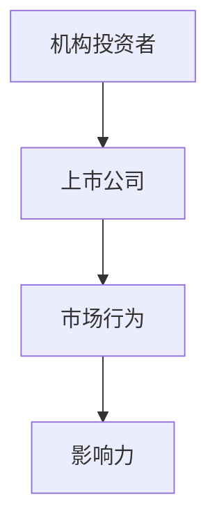
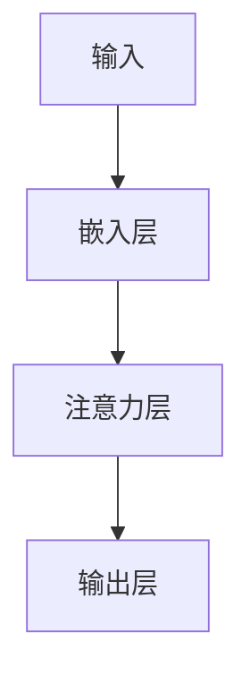
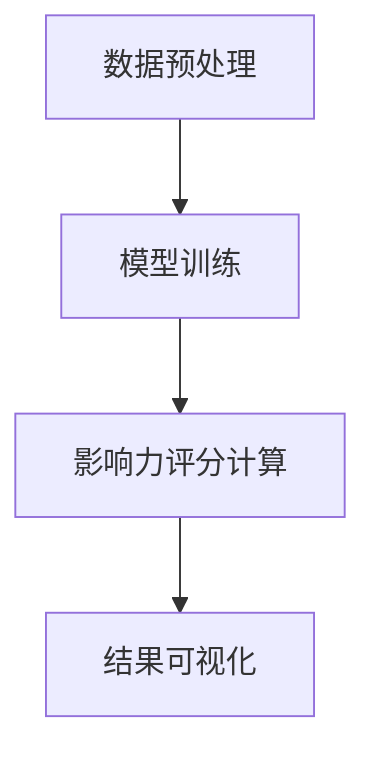
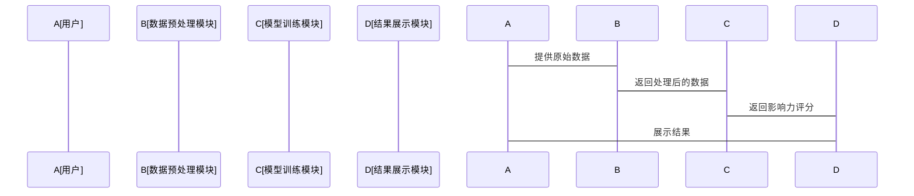

                 


# 图注意力网络在金融影响力分析中的应用

> 关键词：图注意力网络，金融影响力分析，深度学习，图论，注意力机制

> 摘要：本文系统地探讨了图注意力网络在金融影响力分析中的应用。通过结合图论与注意力机制，我们提出了一种新的方法，用于评估金融市场中的影响力。本文首先介绍了问题背景与研究意义，然后详细讲解了图注意力网络的核心概念与原理，接着分析了算法的具体实现过程，并通过实际案例展示了该方法在金融影响力分析中的应用效果。最后，本文总结了研究结果，并提出了未来的研究方向。

---

## 第1章: 问题背景与研究意义

### 1.1 问题背景

金融市场中的影响力分析是一项复杂的任务，涉及多个参与者（如机构投资者、上市公司、监管机构等）之间的相互作用。传统的影响力分析方法通常依赖于统计学或经济学模型，但在面对复杂、动态的金融市场时，这些方法往往显得力不从心。例如，传统的回归分析难以捕捉复杂的非线性关系，也无法有效处理高维数据。

### 1.2 问题描述

金融影响力分析的核心目标是量化各个参与者对市场波动、资产价格变化或其他金融事件的影响力。然而，金融市场数据具有高度的复杂性：参与者之间的关系是非线性的，且存在大量的噪声数据。传统的分析方法在处理这些问题时表现出诸多局限性，例如难以捕捉复杂的网络关系，难以处理高维数据，且模型的解释性较差。

### 1.3 图注意力网络的解决思路

图注意力网络（Graph Attention Network, GAN）是一种结合了图论和注意力机制的深度学习模型。它可以有效地处理图结构数据，捕捉节点之间的关系，并通过注意力机制动态地分配权重。在金融影响力分析中，我们可以将金融市场中的参与者建模为图中的节点，节点之间的关系表示为边，从而构建一个金融影响力图。

### 1.4 问题的边界与外延

金融影响力分析的边界条件包括：参与者的类型（如机构投资者、上市公司等）、数据的时间范围、分析的目标（如股价波动、市场情绪等）。图注意力网络的适用范围主要集中在处理图结构数据和需要动态权重分配的场景中。其局限性在于对大规模图数据的处理能力有限，且模型的训练需要大量的标注数据。

---

## 第2章: 图注意力网络的核心概念与原理

### 2.1 图注意力网络的基本概念

图注意力网络结合了图论和注意力机制。图论用于建模参与者之间的关系，注意力机制用于动态分配节点的重要性权重。通过这种方式，图注意力网络可以捕捉到图中重要的节点和关系。

### 2.2 图注意力网络的核心原理

图注意力网络的模型结构包括嵌入层、注意力层和输出层。嵌入层将图中的节点表示为低维向量；注意力层计算节点之间的注意力权重；输出层生成最终的影响力评分。

### 2.3 图注意力网络与传统图模型的对比

以下是图注意力网络与传统图模型的对比：

| 特性               | 图注意力网络                     | 传统图模型                   |
|--------------------|---------------------------------|------------------------------|
| 处理方式           | 基于注意力机制，动态分配权重     | 基于固定的边权重             |
| 模型复杂度         | 较高，但可以通过注意力机制简化     | 较低，依赖于预定义的边权重     |
| 应用场景           | 适用于复杂的网络关系分析         | 适用于简单的网络关系分析       |

### 2.4 图注意力网络的实体关系图



---

## 第3章: 图注意力网络的算法原理

### 3.1 图注意力网络的模型结构

图注意力网络的模型结构包括以下几个部分：

1. **嵌入层**：将图中的节点表示为低维向量。
2. **注意力层**：计算节点之间的注意力权重。
3. **输出层**：生成最终的影响力评分。

### 3.2 图注意力网络的训练过程



### 3.3 图注意力网络的数学模型

图注意力网络的核心公式如下：

$$ e_{ij} = \text{exp}(\frac{u_i^T u_j}{\tau}) $$

其中，$u_i$ 和 $u_j$ 分别是节点 $i$ 和节点 $j$ 的嵌入向量，$\tau$ 是温度参数。

---

## 第4章: 系统分析与架构设计

### 4.1 项目背景

金融影响力分析的目标是通过图注意力网络模型，量化金融市场中各参与者对市场波动的影响力。

### 4.2 系统功能设计

系统功能包括数据预处理、模型训练、影响力评分计算和结果可视化。

### 4.3 系统架构设计



### 4.4 接口和交互设计



---

## 第5章: 项目实战

### 5.1 环境安装

需要安装以下环境：

1. Python 3.6+
2. PyTorch 1.8+
3. NetworkX 2.6+

### 5.2 核心代码实现

以下是图注意力网络的核心代码：

```python
import torch
import torch.nn as nn
import torch.nn.functional as F

class GraphAttention(nn.Module):
    def __init__(self, in_dim, out_dim, bias=True):
        super(GraphAttention, self).__init__()
        self.in_dim = in_dim
        self.out_dim = out_dim
        self.W = nn.Parameter(torch.randn(in_dim, out_dim))
        self.bias = bias

    def forward(self, x, adj):
        x = x.mm(self.W)
        x = F.softmax(adj.mm(x), dim=1)
        return x

# 示例数据
x = torch.randn(10, 5)
adj = torch.randn(10, 10)

model = GraphAttention(5, 3)
output = model(x, adj)
print(output)
```

### 5.3 案例分析

以某家机构投资者为例，分析其对某上市公司股价的影响。

---

## 第6章: 最佳实践

### 6.1 小结

图注意力网络在金融影响力分析中表现出强大的能力，能够有效捕捉复杂的网络关系。

### 6.2 注意事项

- 数据质量对模型性能影响较大。
- 模型的训练需要大量标注数据。
- 模型的解释性需要进一步提升。

### 6.3 拓展阅读

建议阅读以下文献：

1. Vaswani et al. "Attention Is All You Need." (2017)
2. Hamilton et al. "Graph Attention Networks." (2018)

---

## 第7章: 结论

图注意力网络为金融影响力分析提供了一种新的思路。通过结合图论与注意力机制，我们能够更准确地量化金融市场中的影响力。未来的研究可以进一步优化模型结构，提升模型的解释性和可扩展性。

---

