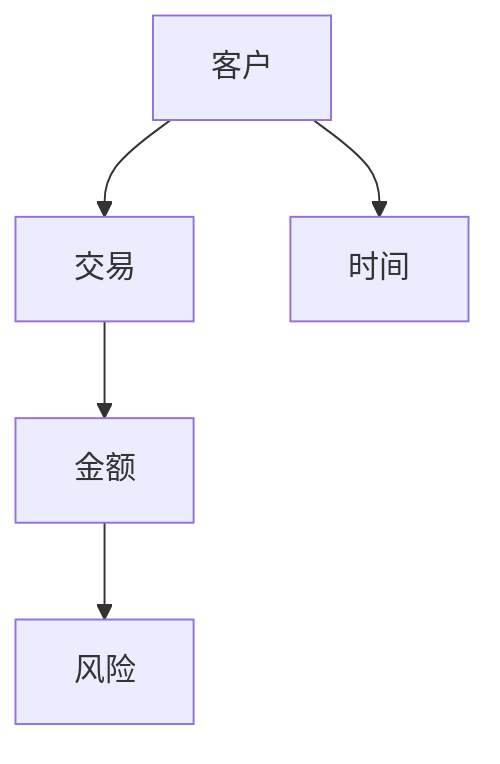
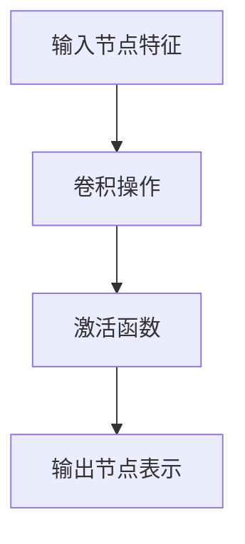
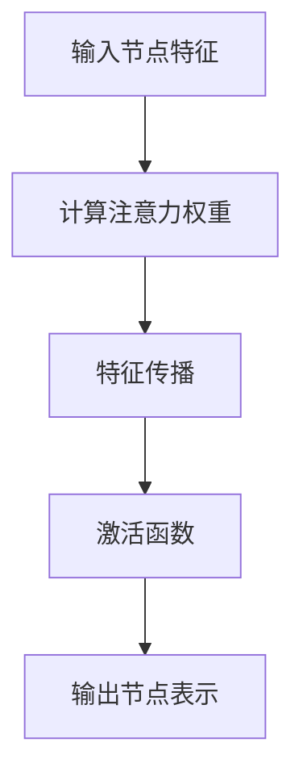
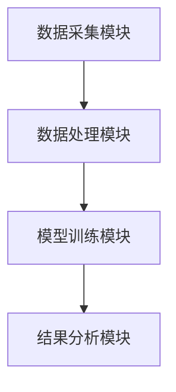
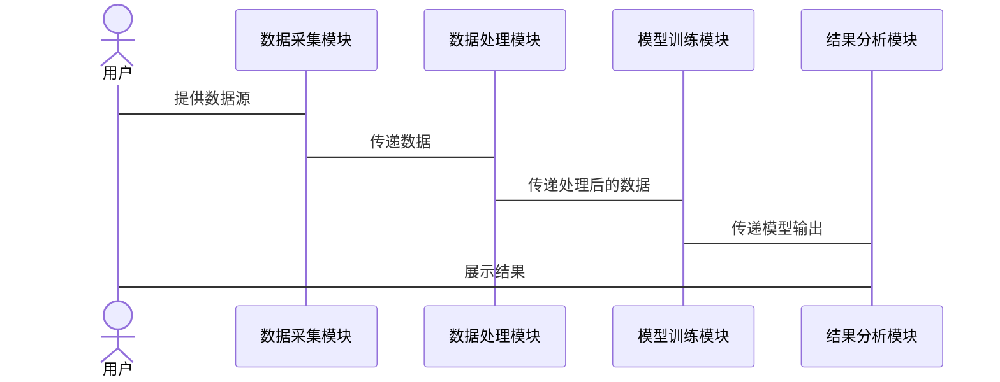

                 


# 图神经网络在金融网络分析中的应用

> **关键词**：图神经网络、金融网络分析、GCN、GAT、金融风险、异常检测

> **摘要**：  
图神经网络（Graph Neural Networks, GNNs）是一种基于图结构的数据分析方法，近年来在金融领域的应用越来越广泛。本文将从图神经网络的基本概念出发，结合金融网络分析的实际场景，详细探讨图神经网络在金融风险评估、异常交易检测、社交网络分析等领域的应用。通过对比分析几种典型的图神经网络算法（如GCN、GAT等），本文将深入剖析其原理与优势，并结合实际项目案例，展示如何利用图神经网络构建高效的金融网络分析系统。

---

# 第一部分: 图神经网络与金融网络分析基础

## 第1章: 图神经网络概述

### 1.1 图神经网络的基本概念

#### 1.1.1 图的基本概念与表示
图（Graph）是一种数据结构，由节点（Vertex）和边（Edge）组成。节点代表实体（如人、机构、交易），边代表实体之间的关系。图可以是有向的（带方向的边）或无向的（无方向的边），还可以带有权重（Weighted）。

#### 1.1.2 图神经网络的定义与特点
图神经网络是一种基于图结构的深度学习模型，能够直接处理图数据，提取节点和边的特征。其特点包括：
- **全局性**：能够捕捉图中节点之间的全局关系。
- **局部性**：能够在局部范围内进行特征传播。
- **灵活性**：适用于多种图结构（如社交网络、交易网络等）。

#### 1.1.3 图神经网络的核心优势
与传统深度学习模型相比，图神经网络的优势在于：
1. 能够处理非欧几里得空间的数据（如社交网络）。
2. 可以直接建模实体之间的关系。
3. 适用于实时动态图数据的分析。

### 1.2 金融网络分析的背景与挑战

#### 1.2.1 金融网络的复杂性
金融网络由多个复杂的子网络组成，例如：
- **交易网络**：节点代表交易主体，边代表交易关系。
- **社交网络**：节点代表金融机构或个人，边代表社交关系。
- **风险网络**：节点代表风险事件，边代表风险传导路径。

#### 1.2.2 传统金融分析的局限性
传统的金融分析方法（如统计分析、时间序列分析）难以处理以下问题：
1. **非线性关系**：金融数据之间的关系往往是非线性的。
2. **复杂网络结构**：传统的模型难以建模复杂的网络关系。
3. **实时性要求**：传统方法难以应对高频交易和实时风险评估。

#### 1.2.3 图神经网络在金融分析中的潜力
图神经网络能够有效捕捉金融网络中的复杂关系，例如：
- **风险传播**：通过图结构建模金融机构之间的风险传导。
- **异常检测**：通过图结构识别异常交易行为。
- **信用评估**：通过图结构分析客户的信用风险。

---

## 第2章: 图神经网络的核心概念与联系

### 2.1 图神经网络的核心原理

#### 2.1.1 节点表示与特征
节点表示是图神经网络的核心任务之一。每个节点可以通过以下方式表示：
- **节点特征**：节点的属性（如交易金额、时间等）。
- **边权重**：边的权重反映了节点之间关系的强弱。

#### 2.1.2 边的权重与关系
边的权重可以通过以下方式计算：
- **相似性度量**：如余弦相似性。
- **概率模型**：如随机游走模型。
- **注意力机制**：如GAT中的注意力权重。

#### 2.1.3 图结构的特征提取
图结构的特征提取可以通过以下步骤完成：
1. **局部特征传播**：将节点特征传播到相邻节点。
2. **全局特征聚合**：将局部特征聚合为全局特征。

### 2.2 核心概念对比分析

#### 2.2.1 图结构与传统数据结构对比

| 数据结构 | 描述 |
|----------|------|
| 图结构 | 包含节点和边，适合建模复杂关系 |
| 向量 | 一维数据，无法建模关系 |
| 矩阵 | 二维数据，适合建模网格关系 |

#### 2.2.2 图神经网络与传统深度学习的对比

| 对比维度 | 图神经网络 | 传统深度学习 |
|----------|------------|---------------|
| 数据类型 | 支持图数据 | 支持向量、矩阵 |
| 关系建模 | 能建模复杂关系 | 无法建模关系 |
| 应用场景 | 适合社交网络、推荐系统 | 适合图像识别、自然语言处理 |

#### 2.2.3 图神经网络与传统金融分析的对比

| 对比维度 | 图神经网络 | 传统金融分析 |
|----------|------------|----------------|
| 数据需求 | 支持复杂网络数据 | 主要依赖统计特征 |
| 模型能力 | 能捕捉非线性关系 | 通常依赖线性假设 |
| 应用场景 | 适合实时风险评估、异常检测 | 适合时间序列预测、统计套利 |

### 2.3 ER实体关系图架构



---

## 第3章: 图神经网络算法原理

### 3.1 图卷积网络（GCN）算法

#### 3.1.1 GCN的基本原理
GCN的核心思想是将节点特征通过图卷积操作传播到相邻节点。图卷积操作可以表示为：

$$
h_i^{(l+1)} = \sum_{j} \frac{A_{ij}}{\sqrt{d_i d_j}} W h_j^{(l)}
$$

其中：
- $A_{ij}$是边的权重。
- $d_i$和$d_j$是节点$i$和$j$的度数。
- $W$是权重矩阵。

#### 3.1.2 GCN的数学模型

GCN的数学模型可以表示为：

$$
X^{(l+1)} = A X^{(l)} W^{(l)}
$$

其中：
- $X^{(l)}$是第$l$层的节点特征矩阵。
- $A$是邻接矩阵。
- $W^{(l)}$是第$l$层的权重矩阵。

#### 3.1.3 GCN的实现流程

1. **输入数据**：节点特征矩阵$X$和邻接矩阵$A$。
2. **卷积操作**：对每个节点进行特征传播。
3. **激活函数**：对传播后的特征进行非线性变换。
4. **输出结果**：得到节点的最终表示。



### 3.2 图注意力网络（GAT）算法

#### 3.2.1 GAT的基本原理
GAT的核心思想是通过注意力机制计算边的权重，然后进行特征传播。注意力机制可以表示为：

$$
\alpha_{ij} = \text{softmax}\left( \frac{W_q q_i^T W_k k_j}{d} \right)
$$

其中：
- $q_i$和$k_j$是查询和键。
- $W_q$和$W_k$是参数矩阵。
- $d$是缩放因子。

#### 3.2.2 GAT的数学模型

GAT的数学模型可以表示为：

$$
h_i^{(l+1)} = \sum_{j} \alpha_{ij} h_j^{(l)}
$$

其中：
- $\alpha_{ij}$是边的注意力权重。
- $h_j^{(l)}$是节点$j$的特征。

#### 3.2.3 GAT的实现流程

1. **输入数据**：节点特征矩阵$X$和邻接矩阵$A$。
2. **计算注意力权重**：对每对节点计算注意力权重。
3. **特征传播**：对节点进行加权求和。
4. **激活函数**：对传播后的特征进行非线性变换。



### 3.3 图神经网络算法的对比分析

| 对比维度 | GCN | GAT |
|----------|-----|-----|
| 注意力机制 | 无 | 有 |
| 边权重计算 | 固定权重 | 动态权重 |
| 计算复杂度 | 较低 | 较高 |

---

## 第4章: 图神经网络在金融网络分析中的应用

### 4.1 金融网络分析的场景介绍

#### 4.1.1 金融交易网络
金融交易网络中的节点代表交易主体（如客户、机构），边代表交易关系。图神经网络可以用于检测异常交易和评估交易风险。

#### 4.1.2 金融社交网络
金融社交网络中的节点代表金融机构或个人，边代表社交关系。图神经网络可以用于分析社交网络中的信息传播和风险传播。

#### 4.1.3 金融风险网络
金融风险网络中的节点代表风险事件（如违约、欺诈），边代表风险传导路径。图神经网络可以用于评估系统性风险和预测风险事件。

### 4.2 项目介绍

#### 4.2.1 项目目标
本项目的目标是利用图神经网络构建一个金融网络分析系统，实现以下功能：
1. 金融交易网络的异常检测。
2. 金融社交网络的风险评估。
3. 金融风险网络的系统性风险预测。

#### 4.2.2 项目数据来源
项目数据来源包括：
1. 交易数据：包括交易金额、时间、参与者等。
2. 社交数据：包括社交媒体上的金融信息、评论等。
3. 风险数据：包括历史违约数据、欺诈数据等。

#### 4.2.3 项目技术选型
项目主要使用以下技术：
1. 图神经网络算法：GCN、GAT。
2. 数据处理工具：Python、Pandas、NumPy。
3. 模型训练框架：PyTorch、TensorFlow。

---

## 第5章: 系统分析与架构设计方案

### 5.1 系统功能设计

#### 5.1.1 数据采集模块
数据采集模块负责从数据源采集金融网络数据，包括交易数据、社交数据和风险数据。

#### 5.1.2 数据处理模块
数据处理模块负责对采集的数据进行清洗、预处理和特征提取。

#### 5.1.3 模型训练模块
模型训练模块负责使用图神经网络算法对数据进行建模和训练。

#### 5.1.4 结果分析模块
结果分析模块负责对模型输出的结果进行分析和可视化。

### 5.2 系统架构设计



### 5.3 系统接口设计

#### 5.3.1 数据接口
数据接口用于数据采集模块与数据处理模块之间的数据传递。

#### 5.3.2 模型接口
模型接口用于模型训练模块与结果分析模块之间的模型参数传递。

#### 5.3.3 结果接口
结果接口用于结果分析模块与用户之间的结果展示。

### 5.4 系统交互设计



---

## 第6章: 项目实战

### 6.1 环境安装

```bash
pip install pytorch tensorflow pandas numpy
```

### 6.2 系统核心实现源代码

#### 6.2.1 数据预处理代码

```python
import pandas as pd
import numpy as np

# 读取数据
data = pd.read_csv('data.csv')

# 数据清洗
data = data.dropna()
data = data.drop_duplicates()

# 特征提取
features = data[['amount', 'time', 'user_id']]
```

#### 6.2.2 模型训练代码

```python
import torch
import torch.nn as nn
import torch.nn.functional as F

class GCN(nn.Module):
    def __init__(self, in_channels, out_channels):
        super(GCN, self).__init__()
        self.conv = nn.Conv2d(in_channels, out_channels, kernel_size=1, bias=False)
    
    def forward(self, x, A):
        x = torch.bmm(A, x)
        x = self.conv(x)
        x = F.relu(x)
        return x

# 初始化模型
model = GCN(in_channels=1, out_channels=1)
# 模型训练
criterion = nn.MSELoss()
optimizer = torch.optim.Adam(model.parameters(), lr=0.001)
```

### 6.3 代码应用解读与分析

#### 6.3.1 数据预处理
数据预处理是模型训练的基础，包括数据清洗和特征提取。通过数据清洗可以去除无效数据，通过特征提取可以聚焦于关键特征。

#### 6.3.2 模型训练
模型训练是利用图卷积网络对金融网络数据进行建模。通过邻接矩阵和节点特征矩阵，模型可以学习节点之间的关系。

### 6.4 实际案例分析与详细讲解剖析

#### 6.4.1 异常检测案例
通过图神经网络可以检测金融交易中的异常行为，例如识别欺诈交易。

#### 6.4.2 风险评估案例
通过图神经网络可以评估金融网络中的风险事件，例如预测金融机构的违约风险。

### 6.5 项目小结

---

## 第7章: 最佳实践

### 7.1 小结
图神经网络在金融网络分析中具有广泛的应用潜力，特别是在异常检测和风险评估方面。

### 7.2 注意事项
1. 数据质量和完整性是模型性能的关键。
2. 模型调参需要根据具体场景进行优化。
3. 模型的实时性和可解释性需要进一步研究。

### 7.3 拓展阅读
1. "Graph Neural Networks: A Review and New Perspectives"（IEEE Transactions on Pattern Analysis and Machine Intelligence）
2. "Attention Is All You Need"（NeurIPS 2017）

---

# 结语

图神经网络作为一种新兴的深度学习技术，在金融网络分析中展现出巨大的潜力。通过本文的详细讲解，读者可以深入了解图神经网络的核心原理和应用场景，并能够结合实际项目进行实践。未来，随着图神经网络技术的不断发展，其在金融领域的应用将更加广泛和深入。

---

**全文完**

