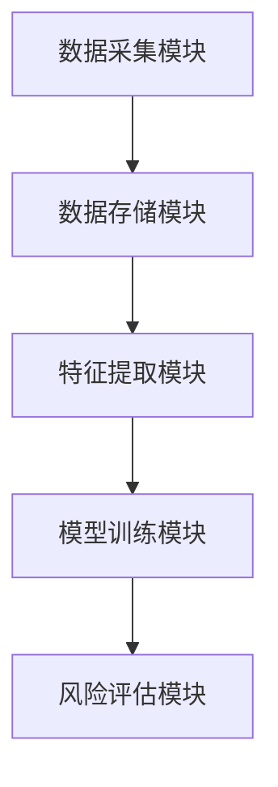
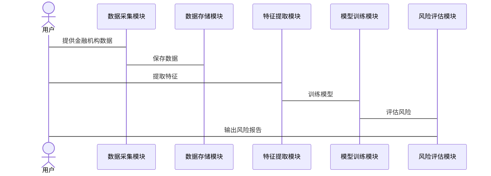

                 


```markdown
# 图神经网络在金融网络风险传播中的应用

> 关键词：图神经网络，金融风险传播，网络风险，系统性风险，深度学习，风险传播模型

> 摘要：本文旨在探讨图神经网络在金融网络风险传播中的应用，结合金融网络的复杂性与图神经网络的强大建模能力，分析风险传播的数学模型与实现方案。文章从问题背景出发，详细阐述图神经网络的核心概念、算法原理、系统架构设计与项目实战，最后结合实际案例进行详细分析与总结。

---

# 第1章: 问题背景与核心概念

## 1.1 问题背景

### 1.1.1 金融网络风险传播的定义与特点
金融网络风险传播是指在金融系统中，由于金融机构之间的关联性，某一机构的负面事件可能通过直接或间接的金融联系传播到其他机构，从而引发系统性风险。这种传播过程可以通过图结构进行建模，节点代表金融机构，边代表它们之间的金融联系。

### 1.1.2 图神经网络在金融领域的应用前景
图神经网络（Graph Neural Networks，GNN）是一种处理图结构数据的深度学习模型，能够有效捕捉图中的节点特征与边关系。金融网络中的风险传播问题可以通过GNN进行建模，预测风险传播路径与影响范围。

### 1.1.3 问题解决的核心目标与边界
核心目标是通过GNN模型，识别金融网络中的高风险节点与风险传播路径，从而实现风险预警与控制。边界包括单个金融机构的风险分析、金融机构之间的直接与间接关联，以及系统性风险的量化与控制。

## 1.2 核心概念与联系

### 1.2.1 图神经网络的基本原理
图神经网络通过在图结构上进行消息传递，逐步聚合节点特征与邻居信息，最终生成节点的表示向量。这种机制能够捕捉图中的局部与全局结构信息。

### 1.2.2 金融网络中的节点与边关系
节点代表金融机构，边代表它们之间的金融联系，如借贷关系、投资关系等。边的权重可以表示金融机构之间的关联强度。

### 1.2.3 风险传播的数学模型与图结构
风险传播模型可以通过图结构进行建模，节点的初始风险值通过传播过程影响其邻居节点，最终形成整体的风险传播网络。

---

# 第2章: 图神经网络的核心概念与联系

## 2.1 图神经网络的基本原理

### 2.1.1 节点表示与特征提取
图神经网络通过聚合节点的特征信息与邻居节点的信息，生成节点的表示向量。节点特征可以是金融机构的资产规模、负债情况等。

### 2.1.2 边信息与权重计算
边信息表示节点之间的关联强度，可以通过权重进行量化。权重可以基于金融机构之间的业务往来数据进行计算。

### 2.1.3 图结构与传播机制
图结构决定了风险传播的路径与速度。传播机制通过消息传递的方式，将节点的风险值传播给其邻居节点。

## 2.2 图神经网络的模型对比

### 2.2.1 GCN、GAT、GraphSAGE等模型对比
| 模型 | 核心思想 | 优缺点 |
|------|----------|--------|
| GCN | 基于图卷积操作 | 适用于规则图结构，计算简单 |
| GAT | 基于自注意力机制 | 能捕捉长距离依赖，但计算复杂 |
| GraphSAGE | 基于归纳式聚合 | 适用于大规模图数据 |

### 2.2.2 模型特点与适用场景
GCN适用于规则的金融网络，GAT适用于复杂的非规则网络，GraphSAGE适用于大规模金融网络。

### 2.2.3 模型选择与优化策略
根据金融网络的规模与复杂性选择模型，并通过超参数调优与数据增强优化模型性能。

---

# 第3章: 图神经网络算法原理

## 3.1 图卷积网络（GCN）算法

### 3.1.1 GCN的工作流程
1. 输入图结构与节点特征。
2. 通过图卷积操作聚合节点特征。
3. 通过池化操作降低图的规模。
4. 输出节点的表示向量。

### 3.1.2 GCN的数学公式与实现
图卷积操作的数学公式如下：
$$ H^{(l+1)} = \hat{A} H^{(l)} W^{(l)} $$
其中，$\hat{A} = \epsilon (D^{-1/2} A D^{-1/2})$ 是归一化后的邻接矩阵。

### 3.1.3 GCN在风险传播中的应用
通过GCN模型，可以预测金融机构的风险等级，识别高风险节点。

## 3.2 图注意力网络（GAT）算法

### 3.2.1 GAT的工作流程
1. 输入图结构与节点特征。
2. 通过多头注意力机制聚合节点特征。
3. 输出节点的表示向量。

### 3.2.2 GAT的数学公式与实现
注意力机制的数学公式如下：
$$ \alpha_{ij} = \text{softmax}(e^{f_{\theta}(x_i, x_j)}}) $$
其中，$f_{\theta}$ 是注意力计算函数。

### 3.2.3 GAT在风险传播中的应用
通过GAT模型，可以捕捉金融机构之间的长距离依赖关系，更准确地预测风险传播路径。

## 3.3 图嵌入与传播算法

### 3.3.1 图嵌入算法的原理与实现
图嵌入算法通过将图中的节点表示为低维向量，捕捉节点的特征与图结构信息。

### 3.3.2 风险传播的数学模型
风险传播的数学模型如下：
$$ r_i^{t+1} = \sigma(\sum_{j} A_{ij} r_j^t W) $$
其中，$r_i^t$ 表示节点$i$在时间$t$的风险值，$A_{ij}$是邻接矩阵的元素。

### 3.3.3 图嵌入与传播的结合应用
通过结合图嵌入与传播算法，可以实现金融机构风险的实时预测与传播路径分析。

---

# 第4章: 图神经网络在金融网络风险传播中的系统分析与架构设计

## 4.1 问题场景介绍
金融网络风险传播的系统场景包括金融机构之间的关联、风险事件的发生与传播。

## 4.2 项目介绍

### 4.2.1 系统功能设计
| 功能模块 | 描述 |
|----------|------|
| 数据采集 | 采集金融机构的业务数据 |
| 特征提取 | 提取金融机构的特征向量 |
| 模型训练 | 训练图神经网络模型 |
| 风险评估 | 评估金融机构的风险等级 |

### 4.2.2 系统架构设计


### 4.2.3 系统交互设计


---

# 第5章: 图神经网络在金融网络风险传播中的项目实战

## 5.1 环境安装

### 5.1.1 安装Python环境
```bash
python --version
pip install --upgrade pip
```

### 5.1.2 安装相关库
```bash
pip install tensorflow==2.10.0
pip install pyg==2.6.0
pip install networkx==3.1
```

## 5.2 系统核心实现源代码

### 5.2.1 数据预处理
```python
import numpy as np
import pandas as pd

# 读取金融机构数据
data = pd.read_csv("financial_data.csv")
# 提取特征向量
features = data.drop(columns=["机构ID", "风险等级"])
```

### 5.2.2 图结构构建
```python
from pyg import DataList, Data, EdgeList

# 构建图结构
edges = EdgeList([(0, 1), (1, 2), (2, 3)])
```

### 5.2.3 模型训练
```python
from pyg.nn import GCN

# 初始化模型
model = GCN(in_channels=features.shape[1], out_channels=2)
# 编译模型
model.compile(optimizer="adam", loss="cross_entropy")
# 训练模型
model.fit(data, epochs=100, batch_size=32)
```

### 5.2.4 风险评估
```python
# 预测风险等级
predictions = model.predict(data)
# 输出结果
print("预测风险等级：", predictions)
```

## 5.3 代码应用解读与分析
通过上述代码，可以实现金融机构风险等级的预测。模型通过图卷积操作聚合节点特征与邻居信息，最终输出风险等级。

## 5.4 实际案例分析
以某银行为例，通过模型预测其风险等级，分析其风险传播路径。

## 5.5 项目小结
通过本项目，可以实现金融机构风险的实时预测与传播路径分析，为金融风险管理提供有力支持。

---

# 第6章: 总结与展望

## 6.1 总结
本文详细介绍了图神经网络在金融网络风险传播中的应用，从理论到实践，全面探讨了风险传播的建模与实现方案。

## 6.2 展望
未来的研究方向包括图神经网络的实时性优化、多模态数据的融合、以及复杂金融网络的建模与分析。

## 6.3 小结
通过图神经网络，可以更准确地预测金融风险，为金融系统的稳定运行提供保障。

---

# 参考文献

（此处可根据实际需要添加相关文献）

---

# 致谢

感谢读者的支持与关注，希望本文能为图神经网络在金融领域的研究与应用提供有益的参考。
```

