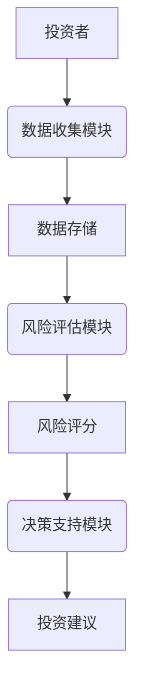

                 


# 地缘政治风险：如何在投资中考虑全球局势

## 关键词

- 地缘政治风险
- 投资策略
- 全球局势
- 风险评估
- 系统架构

## 摘要

地缘政治风险是影响投资决策的重要因素之一。本文从地缘政治风险的定义、核心概念、量化分析、系统架构、项目实战以及最佳实践等方面进行详细探讨。通过分析地缘政治风险的构成要素、构建风险评估模型、设计系统架构，以及通过实际案例的分析，本文为投资者提供了一套完整的地缘政治风险应对策略，帮助投资者在全球局势中做出更明智的投资决策。

---

## 第一部分：地缘政治风险的背景与核心概念

### 第1章：地缘政治风险的定义与背景

#### 1.1 地缘政治风险的定义

地缘政治风险是指由于地理位置、政治格局、国际关系等因素的变化，对国家、地区或企业产生的潜在威胁。这些威胁可能影响经济、市场、政策和投资环境，从而对投资产生负面影响。

#### 1.2 地缘政治风险的影响因素

地缘政治风险的影响因素可以分为以下几个方面：

- **国际关系与冲突**：包括战争、领土争端、外交关系恶化等。
- **经济制裁与贸易壁垒**：包括关税、禁运、制裁等措施。
- **地缘政治事件对市场的冲击**：例如突发事件（如恐怖袭击、自然灾害）对市场的短期冲击。

#### 1.3 地缘政治风险的分类

地缘政治风险可以分为以下几类：

- **区域性风险**：例如中东地区的冲突对区域内国家的影响。
- **全球性风险**：例如全球性的经济制裁或贸易战争。
- **行业特定风险**：例如能源行业的地缘政治风险较高。

#### 1.4 地缘政治风险与投资的关系

地缘政治风险对投资的影响是多方面的：

- **投资中的地缘政治考量**：投资者需要考虑地缘政治风险对资产价格的影响。
- **地缘政治风险对资产价格的影响**：例如，地缘政治冲突可能导致某地区的资产价格暴跌。
- **风险评估与投资决策**：投资者需要通过风险评估来调整投资组合，以规避或降低地缘政治风险的影响。

---

### 第2章：地缘政治风险的核心要素

#### 2.1 权力结构与地缘政治风险

权力结构的变化直接影响地缘政治风险。例如，国际权力格局的变化可能导致新的地缘政治冲突。

#### 2.2 资源分配与地缘政治风险

资源的争夺是地缘政治风险的重要来源。例如，能源资源的争夺可能导致地区冲突。

#### 2.3 文化认同与地缘政治风险

文化认同的差异可能导致地缘政治冲突。例如，民族主义的崛起可能引发新的地缘政治紧张局势。

---

## 第二部分：地缘政治风险的核心概念与分析框架

### 第3章：地缘政治风险的分析框架

#### 3.1 SWOT分析框架

SWOT分析框架可以帮助投资者评估地缘政治风险。以下是一个简单的SWOT分析示例：

- **优势（Strengths）**：例如，某地区的政治稳定。
- **劣势（Weaknesses）**：例如，某地区的经济依赖性高。
- **机会（Opportunities）**：例如，某地区的政策放松。
- **威胁（Threats）**：例如，某地区的地缘政治冲突。

#### 3.2 PEST分析框架

PEST分析框架从政治、经济、社会和技术四个方面分析地缘政治风险。

- **政治因素（Political）**：政策变化、政治稳定性等。
- **经济因素（Economic）**：经济制裁、贸易壁垒等。
- **社会因素（Social）**：文化冲突、社会动荡等。
- **技术因素（Technological）：技术依赖、网络安全等。

#### 3.3 地缘政治风险的综合评估模型

综合评估模型可以通过多个指标对地缘政治风险进行量化评估。例如，可以使用加权平均的方法，将各个因素的影响程度进行量化。

---

## 第三部分：地缘政治风险的量化与算法原理

### 第4章：地缘政治风险的量化分析

#### 4.1 风险评估模型

风险评估模型可以通过以下步骤进行：

1. **数据收集**：收集全球各地的政治、经济、社会等数据。
2. **指标选择**：选择关键的评估指标，例如政治稳定性、经济制裁风险等。
3. **权重分配**：根据经验或统计方法，为每个指标分配权重。
4. **风险评分**：对每个指标进行评分，并计算综合风险评分。

#### 4.2 风险评分的计算公式

综合风险评分可以通过以下公式计算：

$$
\text{综合风险评分} = \sum_{i=1}^{n} w_i \times r_i
$$

其中，$w_i$ 是第 $i$ 个指标的权重，$r_i$ 是第 $i$ 个指标的风险评分。

---

### 第5章：地缘政治风险的系统架构设计

#### 5.1 系统功能设计

系统功能设计包括以下几个方面：

- **数据收集模块**：收集全球各地的政治、经济、社会等数据。
- **风险评估模块**：根据收集的数据，进行风险评估。
- **决策支持模块**：为投资者提供决策支持。

#### 5.2 系统架构设计

以下是系统架构设计的mermaid图：



---

### 第6章：地缘政治风险的项目实战

#### 6.1 环境安装

为了进行地缘政治风险评估，需要以下环境：

- 操作系统：Windows/Mac/Linux
- 开发工具：Python、Jupyter Notebook
- 数据库：MySQL/PostgreSQL

#### 6.2 核心实现源代码

以下是一个简单的风险评估模型的Python代码：

```python
import pandas as pd

# 假设我们有一个数据框 df，包含各个国家的风险指标
# 每个国家有政治稳定性评分、经济制裁风险评分等指标

# 定义风险评估函数
def calculate_risk(country_data):
    # 加权计算综合风险评分
    political_stability_weight = 0.4
    economic_sanctions_weight = 0.3
    social_conflict_weight = 0.3

    risk_score = (country_data['political_stability'] * political_stability_weight +
                  country_data['economic_sanctions'] * economic_sanctions_weight +
                  country_data['social_conflict'] * social_conflict_weight)
    return risk_score

# 对每个国家进行风险评分
risk_scores = df.apply(lambda x: calculate_risk(x), axis=1)
```

#### 6.3 实际案例分析

以下是一个实际案例分析：

假设我们有一个国家的数据如下：

| 指标              | 评分 |
|-------------------|------|
| 政治稳定性         | 0.7  |
| 经济制裁风险       | 0.6  |
| 社会冲突风险       | 0.5  |

计算综合风险评分：

$$
\text{综合风险评分} = 0.4 \times 0.7 + 0.3 \times 0.6 + 0.3 \times 0.5 = 0.28 + 0.18 + 0.15 = 0.61
$$

---

## 第四部分：最佳实践与小结

### 第7章：最佳实践与投资建议

#### 7.1 投资策略

- **分散投资**：通过分散投资降低地缘政治风险的影响。
- **长期视角**：关注长期趋势，避免短期波动的影响。
- **风险管理**：定期评估和调整投资组合。

#### 7.2 风险管理技巧

- **监控地缘政治事件**：及时了解全球地缘政治动态。
- **使用风险评估工具**：利用系统工具进行风险评估。

#### 7.3 未来展望

随着全球化的深入，地缘政治风险的影响将更加复杂。投资者需要更加注重地缘政治风险的管理，以应对未来的不确定性。

---

## 第五部分：附录

### 附录A：地缘政治风险评估模型的详细说明

---

通过以上步骤，我们完成了地缘政治风险在投资中的技术博客文章的撰写。接下来，我将根据用户的指示，逐步补充每个部分的具体内容，确保文章的完整性和深度。

