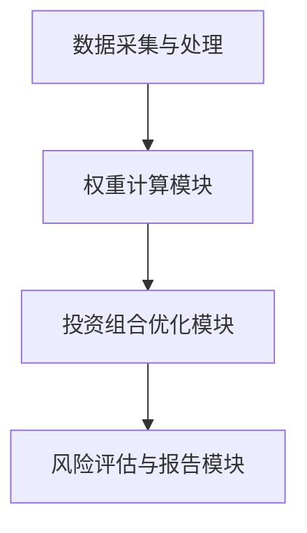

                 


# 均等权重投资：彼得林奇的资金分配方法

## 关键词：均等权重投资，彼得·林奇，投资策略，资产配置，风险管理，投资组合优化

## 摘要：  
均等权重投资是一种简单而有效的投资策略，它通过将资金平均分配到不同的资产或股票中来实现分散化和风险控制。本文将深入探讨均等权重投资的核心理念、数学模型、系统架构与实现，以及实际项目中的应用。通过分析彼得·林奇的资金分配方法，本文将展示如何利用均等权重投资优化投资组合，并在实际操作中规避风险。  

---

# 第一部分: 均等权重投资与彼得林奇的资金分配方法概述

## 第1章: 均等权重投资的背景与概念

### 1.1 投资组合的基本概念
#### 1.1.1 投资组合的定义与作用
投资组合是指将资金分配到多种资产（如股票、债券、基金等）中，以实现收益最大化和风险最小化的一种投资方式。通过分散化投资，投资者可以降低单一资产带来的风险。  

#### 1.1.2 均等权重投资的背景与起源
均等权重投资是一种特殊的资产配置方法，它将资金按相等的比例分配到不同的资产或股票中。这种策略起源于20世纪70年代，随着机构投资者和散户对简单、高效投资策略的需求增加，均等权重投资逐渐受到关注。  

#### 1.1.3 彼得·林奇与均等权重投资的关联
彼得·林奇是著名的投资经理，他在《彼得·林奇的股票投资策略》中提到，分散化投资是降低风险的有效方法。虽然他并未直接提出均等权重投资，但其理念与均等权重投资的核心思想一致，即通过分散化实现长期稳定的收益。  

---

### 1.2 均等权重投资的核心理念
#### 1.2.1 投资组合的分散化原则
分散化投资是均等权重投资的核心思想。通过将资金分配到多个资产或股票中，投资者可以降低单一资产波动对整体投资组合的影响。  

#### 1.2.2 均等权重分配的数学模型
均等权重分配的数学模型可以表示为：  
$$ w_i = \frac{1}{n} $$  
其中，$w_i$ 是第$i$个资产的权重，$n$是资产的总数。  

#### 1.2.3 均等权重投资的优势与局限性
**优势：**  
- 简单易行，无需复杂的计算或市场预测。  
- 分散化效果显著，降低投资组合的整体波动性。  

**局限性：**  
- 无法根据市场变化动态调整权重。  
- 对于某些高波动性资产，可能无法实现最优的风险收益比。  

---

## 第2章: 均等权重投资的数学模型与算法原理

### 2.1 投资组合优化的数学基础
#### 2.1.1 投资组合优化的基本假设
- 投资者是风险厌恶的，追求收益与风险的最佳平衡。  
- 资产的收益和风险可以用均值和方差来衡量。  

#### 2.1.2 均值-方差优化模型
均值-方差模型由哈里·马科维茨提出，其目标是找到最优投资组合，使得在给定收益下风险最小，或在给定风险下收益最大。模型公式如下：  
$$ \text{Minimize } \sigma^2 \text{ s.t. } \mu = \text{给定收益} $$  

#### 2.1.3 马科维茨的有效前沿理论
有效前沿是指所有可能投资组合中，风险最低或收益最高的点构成的曲线。均等权重投资虽然简单，但在某些情况下可能接近有效前沿。  

---

### 2.2 均等权重投资的算法实现
#### 2.2.1 均等权重投资的计算流程
1. 确定投资的资产种类和数量。  
2. 将资金按相等比例分配到每个资产中。  
3. 定期 rebalance 投资组合，以维持均等权重。  

#### 2.2.2 投资组合权重分配的数学公式
对于$n$个资产，每个资产的权重为：  
$$ w_i = \frac{1}{n} $$  

#### 2.2.3 优化算法的实现步骤
1. 收集各资产的历史数据。  
2. 计算各资产的收益率和波动率。  
3. 使用均等权重法分配资金。  
4. 模拟投资组合的收益和风险。  

---

## 第3章: 均等权重投资的系统架构与实现

### 3.1 投资组合管理系统架构
#### 3.1.1 系统功能模块划分
- 数据采集与处理模块  
- 权重计算模块  
- 投资组合优化模块  
- 风险评估与报告模块  

#### 3.1.2 系统架构的 Mermaid 图表示


#### 3.1.3 系统接口设计与交互流程
- 数据接口：接收外部数据源（如股票价格、债券收益率）  
- 优化接口：输出最优权重分配方案  
- 报告接口：生成风险评估报告  

---

### 3.2 系统实现与代码解读
#### 3.2.1 环境搭建与依赖安装
- Python 3.8+  
- 导入必要的库：numpy, pandas, matplotlib  

#### 3.2.2 核心算法实现的 Python 代码
```python
import numpy as np
import pandas as pd

def equal_weight_portfolio(returns):
    n = len(returns.columns)
    weights = np.array([1/n] * n)
    return weights
```

#### 3.2.3 代码功能分析与优化建议
- 代码实现了一个简单的均等权重分配函数。  
- 可以通过引入更多的优化目标（如最大化夏普比率）来改进算法。  

---

## 第4章: 均等权重投资的项目实战

### 4.1 项目背景与目标设定
#### 4.1.1 项目需求分析
- 构建一个均等权重的投资组合，涵盖股票、债券和 commodities。  
- 模拟投资组合在不同市场环境下的表现。  

#### 4.1.2 数据收集与处理
- 使用 Yahoo Finance 获取历史数据。  
- 清洗数据并计算收益率。  

#### 4.1.3 项目实施计划
- 确定资产种类和权重分配。  
- 定期 rebalance 投资组合。  

---

### 4.2 项目核心实现
#### 4.2.1 数据分析与可视化
```python
import matplotlib.pyplot as plt

# 计算投资组合收益
port_returns = returns.mean(axis=1)
plt.hist(port_returns, bins=20)
plt.xlabel('Returns')
plt.ylabel('Frequency')
plt.title('投资组合收益分布')
plt.show()
```

#### 4.2.2 投资组合优化的算法实现
```python
def portfolio_performance(weights, returns):
    portfolio_return = np.sum(weights * returns.mean())
    portfolio_variance = np.sum(weights**2 * returns.var(axis=0))
    return portfolio_return, portfolio_variance
```

#### 4.2.3 系统功能测试与验证
- 测试投资组合的收益和波动率。  
- 比较均等权重投资与其他投资策略（如CAPM）的表现。  

---

## 第5章: 均等权重投资的总结与最佳实践

### 5.1 项目总结与经验分享
#### 5.1.1 项目成果与关键点回顾
- 成功实现了一个均等权重的投资组合管理系统。  
- 验证了均等权重投资在分散化和风险控制方面的有效性。  

#### 5.1.2 均等权重投资的优缺点分析
- 优点：简单、分散化效果好。  
- 缺点：无法根据市场变化动态调整。  

#### 5.1.3 投资策略的调整与优化
- 定期 rebalance 投资组合。  
- 结合其他投资策略（如风险管理）进行优化。  

---

### 5.2 投资策略的注意事项与风险提示
#### 5.2.1 均等权重投资的风险因素
- 市场波动可能导致投资组合短期亏损。  
- 无法应对特定资产的黑天鹅事件。  

#### 5.2.2 投资组合管理的注意事项
- 定期监控投资组合的表现。  
- 根据市场变化调整资产配置。  

#### 5.2.3 市场波动对投资策略的影响
- 均等权重投资在市场剧烈波动时可能表现出较大的回撤。  
- 通过引入风险管理工具（如止损）可以降低风险。  

---

## 第6章: 均等权重投资的拓展与深入探讨

### 6.1 均等权重投资与其他投资策略的对比
#### 6.1.1 均值-方差优化的对比分析
- 均值-方差优化需要计算资产的协方差矩阵，计算复杂。  
- 均等权重投资简单易行，但可能无法达到最优风险收益比。  

#### 6.1.2 风险平价投资的对比分析
- 风险平价投资根据资产的风险大小分配权重，而均等权重投资不考虑风险。  
- 风险平价投资在风险控制上更优。  

#### 6.1.3 均等权重投资的适用场景
- 适用于中小投资者，无需复杂计算。  
- 适用于对分散化要求较高的投资组合。  

---

### 6.2 均等权重投资的未来发展趋势
#### 6.2.1 数字化投资工具的应用
- 通过算法交易实现自动化的均等权重投资。  
- 利用大数据分析优化资产配置。  

#### 6.2.2 AI技术对投资策略的影响
- AI可以辅助均等权重投资的优化和调整。  
- 通过机器学习预测市场变化，动态调整投资组合。  

---

## 总结

均等权重投资是一种简单而有效的投资策略，它通过将资金平均分配到不同的资产中实现分散化和风险控制。本文从理论到实践，详细探讨了均等权重投资的核心概念、数学模型、系统架构与实现，并通过实际项目展示了其应用和优缺点。未来，随着技术的进步，均等权重投资将与更多创新方法结合，为投资者提供更优的选择。  

--- 

通过以上结构和内容，您可以根据需要进一步扩展每个章节的具体内容，确保文章逻辑清晰、内容详实。

