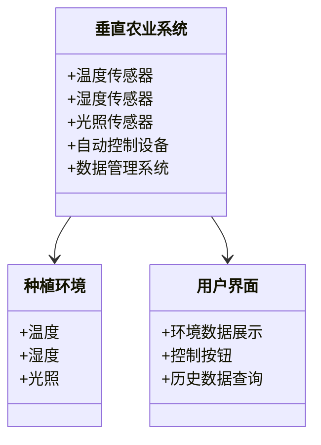
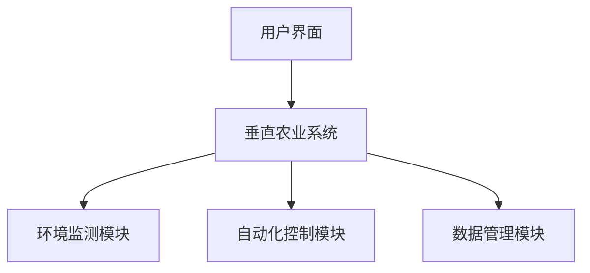

                 


# 垂直农业技术的发展与投资前景

## 关键词：垂直农业、技术发展、投资前景、环境控制、自动化种植、农业智能化、可持续发展

## 摘要：  
本文系统地探讨了垂直农业技术的发展现状、技术原理、系统架构以及投资前景。文章从垂直农业的核心概念出发，分析了其与传统农业的差异，详细阐述了垂直农业的关键技术，包括环境控制、自动化种植和智能管理系统。通过实际案例分析，本文展示了垂直农业技术的应用场景，并结合市场数据和行业趋势，评估了垂直农业的投资机会和未来发展方向。

---

## 第一部分: 垂直农业技术的背景与概念

### 第1章: 垂直农业的起源与演变

#### 1.1 问题背景与问题描述
- 传统农业的局限性：土地资源有限、水资源浪费、环境污染、病虫害问题严重。
- 人口增长与城市化：城市化进程中，土地资源紧张，传统农业难以满足城市居民的食品需求。
- 技术驱动的变革：信息技术、物联网、人工智能等技术的进步为农业现代化提供了新的可能性。

#### 1.2 垂直农业的定义与特点
- 定义：垂直农业是一种在垂直空间中进行高效种植的技术，通过多层种植结构和环境控制技术实现高密度种植。
- 特点：
  - 高密度种植：利用空间垂直化，大幅提高单位面积产量。
  - 环境可控：通过人工环境控制技术，实现对温度、湿度、光照等条件的精确管理。
  - 自动化程度高：采用自动化设备和智能管理系统，减少人工干预。
  - 可持续性：节水、节地、节肥，减少环境污染。

#### 1.3 问题解决思路与方法
- 技术手段：引入LED照明、垂直支架、智能传感器、自动控制系统等技术。
- 系统化解决方案：构建一个集环境监测、数据采集、自动化控制于一体的种植系统。
- 边界与外延：垂直农业主要应用于城市化程度高、土地资源紧张的地区，外延包括家庭种植、社区种植等小规模应用。

### 第2章: 垂直农业的核心概念与联系

#### 2.1 垂直农业技术的核心原理
- 垂直种植系统：通过多层种植架实现空间利用的最大化。
- 环境控制技术：利用传感器和自动控制系统实现对温度、湿度、光照等环境参数的精确控制。
- 自动化种植系统：通过机械臂、自动化输送系统实现种植过程的自动化。

#### 2.2 垂直农业技术的核心属性对比
| 属性          | 传统农业        | 垂直农业        |
|---------------|-----------------|-----------------|
| 土地利用效率  | 低              | 高              |
| 水资源消耗    | 高              | 低              |
| 环境污染      | 严重            | 较小            |
| 种植周期      | 长              | 短              |
| 自动化程度    | 低              | 高              |

#### 2.3 垂直农业技术的ER实体关系图
```mermaid
er
actor 垂直农业系统 {
  id
  name
  location
}
actor 种植环境 {
  id
  temperature
  humidity
  light
}
actor 自动化设备 {
  id
  type
  status
}
```

---

## 第二部分: 垂直农业技术的核心概念与联系

### 第3章: 垂直农业技术的算法原理与数学模型

#### 3.1 垂直农业技术的算法原理
- 算法流程图：
```mermaid
graph TD
    A[开始] -> B[环境监测]
    B -> C[数据采集]
    C -> D[数据处理]
    D -> E[环境控制]
    E -> F[种植过程]
    F -> G[结束]
```

- 数学模型与公式：
$$ 温度控制模型：T_{target} = T_{current} + \Delta T $$
$$ 湿度控制模型：H_{target} = H_{current} + \Delta H $$

#### 3.2 垂直农业技术的数学公式推导
- 灯光强度计算：
$$ I = k \times (T - T_{base}) $$
其中，$k$ 是比例系数，$T$ 是当前温度，$T_{base}$ 是基准温度。

---

## 第三部分: 垂直农业技术的系统分析与架构设计

### 第4章: 垂直农业技术的系统分析

#### 4.1 问题场景介绍
- 种植环境复杂：温度、湿度、光照等环境参数需要精确控制。
- 自动化需求高：种植过程需要实现自动化，减少人工干预。
- 数据管理需求：需要实时采集和处理种植数据。

#### 4.2 系统功能设计
- 系统功能需求：
  - 环境监测：实时采集温度、湿度、光照等数据。
  - 自动化控制：根据环境数据自动调节灯光、温湿度等设备。
  - 数据分析：对历史数据进行分析，优化种植参数。
- 领域模型：


#### 4.3 系统架构设计
- 系统架构：


---

## 第四部分: 垂直农业技术的项目实战

### 第5章: 垂直农业技术的项目实战

#### 5.1 项目环境安装
- 硬件设备：垂直种植架、温度传感器、湿度传感器、光照传感器、自动控制设备。
- 软件环境：Python、物联网开发框架（如Node-RED）、数据库（如MySQL）。

#### 5.2 系统核心实现源代码
```python
# 环境监测代码
import RPi.GPIO as GPIO
import time

# 温度传感器代码
def read_temperature():
    # 模拟温度传感器数据
    return 25.0 + 2.0 * random.random()

# 自动化控制代码
def control_light(light_pin, status):
    GPIO.output(light_pin, status)
```

#### 5.3 项目小结
- 项目实现的关键点：环境监测、数据采集、自动化控制。
- 项目应用案例：智能温室种植系统。

---

## 第五部分: 垂直农业技术的投资前景

### 第6章: 垂直农业技术的投资分析

#### 6.1 垂直农业的商业模式
- B2B模式：向企业客户提供种植系统解决方案。
- B2C模式：面向消费者销售小型垂直种植设备。

#### 6.2 垂直农业的投资机会
- 市场需求：城市化进程加快，垂直农业需求增长。
- 技术进步：人工智能和物联网技术推动垂直农业发展。
- 政策支持：政府鼓励农业技术创新和可持续发展。

#### 6.3 垂直农业的风险评估
- 技术风险：技术成熟度较低，存在不确定性。
- 市场风险：市场需求可能受到价格和技术接受度的影响。
- 运营风险：种植环境的复杂性可能增加运营难度。

---

## 第六部分: 总结与展望

### 第7章: 总结与展望

#### 7.1 总结
- 垂直农业技术的核心优势：高密度种植、环境可控、自动化程度高。
- 技术发展：人工智能和物联网技术将进一步推动垂直农业的发展。

#### 7.2 展望
- 未来发展方向：智能种植系统、垂直农业与城市规划的结合、家庭种植市场的拓展。
- 投资建议：关注技术创新和市场应用，选择具有技术优势和市场潜力的企业。

---

## 总结
垂直农业技术作为现代农业的重要发展方向，具有广阔的应用前景和投资潜力。随着技术的不断进步和市场需求的增加，垂直农业将在未来的农业发展中发挥重要作用。

