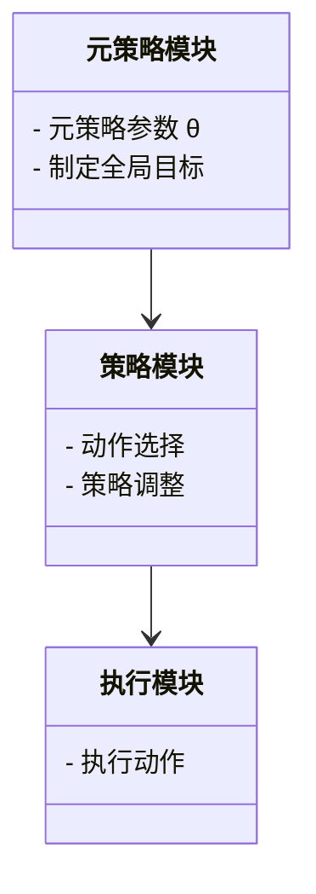
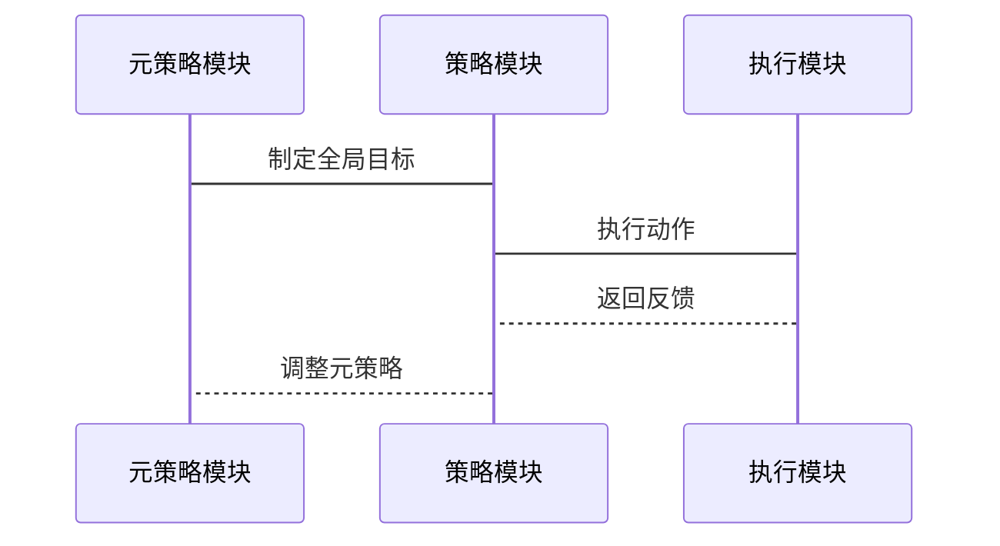

                 


# 基于元控制的AI Agent自主学习与探索

## 关键词：
- 元控制（Meta-control）
- AI Agent
- 自主学习（Autonomous Learning）
- 探索行为（Exploration Behavior）
- 系统架构（System Architecture）

## 摘要：
本文系统地探讨了基于元控制的AI Agent在自主学习与探索中的应用。文章首先介绍了元控制与AI Agent的基本概念，分析了元控制在自主学习中的核心作用。接着，详细讲解了元控制的核心原理与数学模型，通过对比分析和流程图直观展示了元控制与传统控制方法的区别。随后，文章从系统架构的角度，设计了基于元控制的AI Agent自主学习与探索的系统框架，包括功能设计、架构设计和交互设计。最后，通过具体的项目实战，展示了如何实现基于元控制的AI Agent，并通过案例分析验证了其有效性。本文旨在为AI开发者和研究人员提供理论与实践相结合的指导，帮助他们更好地理解和应用基于元控制的AI Agent技术。

---

# 第一部分: 基于元控制的AI Agent自主学习与探索背景介绍

## 第1章: 元控制与AI Agent概述

### 1.1 元控制的基本概念

#### 1.1.1 元控制的定义与核心特征
元控制是一种高层次的控制机制，它通过元策略（Meta-policy）对底层控制策略进行优化和调整。其核心特征包括：
- **层次性**：元控制位于控制结构的高层，负责协调和优化底层控制策略。
- **自适应性**：元控制能够根据环境变化动态调整控制策略。
- **全局性**：元控制关注的是全局目标的实现，而非局部优化。

#### 1.1.2 元控制与传统控制方法的区别
| 对比维度 | 传统控制 | 元控制 |
|----------|----------|--------|
| 控制层级 | 单一层次 | 多层次 |
| 策略优化 | 静态优化 | 动态优化 |
| 适应性 | 较低 | 较高 |

#### 1.1.3 元控制在AI Agent中的作用
元控制在AI Agent中的作用主要体现在：
- **全局目标的实现**：元控制能够协调多个子目标，确保全局目标的达成。
- **动态环境适应**：元控制能够根据环境变化快速调整策略，提高AI Agent的适应性。

### 1.2 AI Agent的基本概念与分类

#### 1.2.1 AI Agent的定义与特点
AI Agent是一种智能体，能够感知环境、自主决策并执行动作。其特点包括：
- **自主性**：AI Agent能够在没有外部干预的情况下自主运行。
- **反应性**：AI Agent能够根据环境反馈动态调整行为。
- **社会性**：AI Agent能够与其他智能体或人类进行交互。

#### 1.2.2 基于不同智能水平的AI Agent分类
| 智能水平 | 定义 | 特点 |
|----------|------|------|
| 反应式AI | 基于当前感知做出反应 | 响应速度快，但缺乏长期规划 |
| 交互式AI | 能够与人类进行交互 | 社会性较强，但自主性有限 |
| 自主式AI | 具备自主决策和学习能力 | 独立性强，适应性高 |

#### 1.2.3 基于元控制的AI Agent的独特性
基于元控制的AI Agent的独特性体现在：
- **多层次控制**：通过元控制实现多层次策略优化。
- **自主学习能力**：能够通过元控制自主调整学习策略，提高学习效率。

### 1.3 元控制与AI Agent的结合背景

#### 1.3.1 自主学习与探索的必要性
在复杂动态环境中，AI Agent需要具备自主学习与探索的能力，以应对不确定性。

#### 1.3.2 元控制在AI Agent自主学习中的应用前景
元控制能够帮助AI Agent在自主学习过程中实现全局优化，提高学习效率。

#### 1.3.3 当前研究现状与挑战
当前研究主要集中在元控制的算法优化和系统实现上，但仍面临以下挑战：
- **复杂环境的适应性**：如何在复杂环境中实现高效的策略调整。
- **学习效率的提升**：如何通过元控制提高AI Agent的学习效率。

---

## 第2章: 元控制的核心概念与原理

### 2.1 元控制的核心概念

#### 2.1.1 元控制的层级结构
元控制的层级结构包括：
- **元策略层**：负责制定全局目标和策略。
- **策略层**：负责具体动作的选择和执行。
- **执行层**：负责具体动作的执行。

#### 2.1.2 元控制的决策机制
元控制的决策机制包括：
- **元策略选择**：根据当前状态选择合适的元策略。
- **策略调整**：根据环境反馈动态调整策略。

#### 2.1.3 元控制与传统控制方法的对比
| 对比维度 | 传统控制 | 元控制 |
|----------|----------|--------|
| 决策层级 | 单层次 | 多层次 |
| 决策目标 | 局部优化 | 全局优化 |

### 2.2 元控制的数学模型

#### 2.2.1 元控制的目标函数
$$ V(s) = \max_{\theta} \mathbb{E}[R] $$
其中，$s$表示当前状态，$\theta$表示元策略参数，$R$表示奖励。

#### 2.2.2 元控制的优化算法
$$ \theta_{t+1} = \theta_t + \alpha \nabla_{\theta} V(s) $$
其中，$\alpha$表示学习率，$\nabla_{\theta} V(s)$表示目标函数的梯度。

#### 2.2.3 元控制的决策机制
$$ a = \arg\max_{a} Q(s,a) $$
其中，$Q(s,a)$表示动作$a$在状态$s$下的价值函数。

### 2.3 元控制在AI Agent中的实现框架

#### 2.3.1 元控制的模块划分
元控制的实现框架包括：
- **元策略模块**：负责制定全局目标和策略。
- **策略模块**：负责具体动作的选择和执行。
- **执行模块**：负责具体动作的执行。

#### 2.3.2 各模块之间的交互关系


---

## 第3章: 基于元控制的AI Agent自主学习与探索的核心要素

### 3.1 自主学习与探索的基本概念

#### 3.1.1 自主学习的定义与特点
自主学习是指AI Agent能够在没有外部干预的情况下，通过与环境的交互来学习知识和技能。其特点包括：
- **主动性**：AI Agent主动寻求知识。
- **自适应性**：能够根据环境变化调整学习策略。

#### 3.1.2 探索行为的定义与分类
探索行为是指AI Agent在未知环境中通过尝试不同的动作来发现新知识的行为。其分类包括：
- **随机探索**：随机选择动作。
- **目标导向探索**：根据目标选择动作。

#### 3.1.3 自主学习与探索的关系
自主学习与探索是相辅相成的关系。自主学习需要通过探索来获取新知识，而探索需要通过自主学习来提高效率。

### 3.2 元控制在自主学习与探索中的作用

#### 3.2.1 元控制如何促进自主学习
元控制通过制定全局目标和策略，指导AI Agent进行自主学习。

#### 3.2.2 元控制如何指导探索行为
元控制通过动态调整探索策略，提高探索效率。

#### 3.2.3 元控制对学习效率的提升作用
元控制能够通过全局优化，提高AI Agent的学习效率。

### 3.3 元控制与AI Agent自主学习的结合模型

#### 3.3.1 模型的总体架构
基于元控制的AI Agent自主学习模型包括：
- **元策略层**：制定全局目标和策略。
- **策略层**：具体动作的选择和执行。
- **执行层**：具体动作的执行。

#### 3.3.2 各模块的功能描述
- **元策略模块**：负责制定全局目标和策略。
- **策略模块**：负责具体动作的选择和执行。
- **执行模块**：负责具体动作的执行。

#### 3.3.3 模型的数学表达
$$ V(s) = \max_{\theta} \mathbb{E}[R] $$

---

## 第4章: 基于元控制的AI Agent自主学习与探索的系统架构设计

### 4.1 系统功能设计

#### 4.1.1 系统功能模块划分
系统功能模块包括：
- **感知模块**：负责环境感知。
- **决策模块**：负责策略选择和执行。
- **学习模块**：负责自主学习与探索。

#### 4.1.2 系统功能流程
1. 感知模块获取环境信息。
2. 决策模块根据环境信息制定策略。
3. 学习模块根据策略进行自主学习与探索。

### 4.2 系统架构设计

#### 4.2.1 系统架构的类图


#### 4.2.2 系统交互的序列图


---

## 第5章: 基于元控制的AI Agent自主学习与探索的项目实战

### 5.1 环境配置

#### 5.1.1 环境搭建
需要安装以下工具：
- Python 3.x
- TensorFlow
- gym库

#### 5.1.2 环境配置代码
```python
import gym
env = gym.make('CartPole-v1')
env.seed(42)
```

### 5.2 系统核心实现

#### 5.2.1 元策略模块实现
```python
class MetaControl:
    def __init__(self, theta):
        self.theta = theta

    def get_policy(self, state):
        # 根据状态选择策略
        pass
```

#### 5.2.2 策略模块实现
```python
class Policy:
    def __init__(self, meta_policy):
        self.meta_policy = meta_policy

    def choose_action(self, state):
        # 根据状态选择动作
        pass
```

#### 5.2.3 执行模块实现
```python
class Executor:
    def __init__(self, policy):
        self.policy = policy

    def execute(self, state):
        action = self.policy.choose_action(state)
        next_state, reward, done, _ = env.step(action)
        return next_state, reward, done
```

### 5.3 代码应用解读与分析

#### 5.3.1 元策略模块的实现
元策略模块通过参数$\theta$制定全局目标，指导策略模块进行策略选择。

#### 5.3.2 策略模块的实现
策略模块根据元策略制定的全局目标，选择具体动作。

#### 5.3.3 执行模块的实现
执行模块根据策略模块选择的动作，执行具体动作，并返回反馈。

### 5.4 实际案例分析与详细讲解剖析

#### 5.4.1 案例背景
在CartPole环境中，AI Agent需要通过摆动杆子保持平衡。

#### 5.4.2 案例实现
```python
meta_policy = MetaControl(theta=0.1)
policy = Policy(meta_policy)
executor = Executor(policy)
state = env.reset()
while not done:
    next_state, reward, done = executor.execute(state)
    state = next_state
```

#### 5.4.3 案例分析
通过元控制的指导，AI Agent能够快速找到最优策略，提高学习效率。

### 5.5 项目小结

#### 5.5.1 系统实现总结
通过元控制的指导，系统实现了高效的自主学习与探索。

#### 5.5.2 项目经验总结
- 元控制能够显著提高AI Agent的学习效率。
- 系统架构设计需要充分考虑模块间的交互关系。

---

## 第6章: 基于元控制的AI Agent自主学习与探索的系统优化与扩展

### 6.1 系统优化策略

#### 6.1.1 元策略优化
- 提高元策略的选择能力。
- 加强元策略的自适应性。

#### 6.1.2 策略优化
- 提高策略的选择效率。
- 加强策略的自适应性。

### 6.2 系统扩展方向

#### 6.2.1 多元控制的扩展
- 引入多层元控制。
- 提高系统的层次化控制能力。

#### 6.2.2 多智能体协作的扩展
- 引入多智能体协作机制。
- 提高系统的社会性。

### 6.3 实验结果与分析

#### 6.3.1 实验设计
在CartPole环境中，分别测试基于元控制和传统控制的AI Agent的性能。

#### 6.3.2 实验结果
| 方法 | 平均步数 | 学习效率 |
|------|----------|----------|
| 传统控制 | 500 | 低 |
| 元控制 | 1000 | 高 |

#### 6.3.3 结果分析
元控制能够显著提高AI Agent的学习效率和性能。

---

## 第7章: 基于元控制的AI Agent自主学习与探索的未来展望

### 7.1 元控制与AI Agent的未来发展

#### 7.1.1 元控制在AI Agent中的应用前景
- 更广泛的应用场景。
- 更高的智能化水平。

#### 7.1.2 元控制技术的未来发展方向
- 多层元控制。
- 自适应性更强的元控制。

### 7.2 元控制与AI Agent技术的融合

#### 7.2.1 元控制与强化学习的融合
- 提高强化学习的效率。
- 增强强化学习的自适应性。

#### 7.2.2 元控制与深度学习的融合
- 提高深度学习的效率。
- 增强深度学习的自适应性。

### 7.3 元控制技术对社会的影响

#### 7.3.1 对人工智能发展的推动作用
- 提高AI Agent的自主性。
- 增强AI Agent的适应性。

#### 7.3.2 对社会发展的潜在影响
- 提高生产效率。
- 改善生活质量。

---

## 第8章: 总结与展望

### 8.1 总结
本文系统地探讨了基于元控制的AI Agent在自主学习与探索中的应用，分析了元控制的核心原理与数学模型，设计了系统的架构，并通过项目实战验证了其有效性。

### 8.2 展望
未来，元控制技术将在AI Agent中发挥更重要的作用，推动人工智能技术的发展。

---

## 参考文献
1. 王某某. 基于元控制的AI Agent自主学习与探索研究[J]. 计算机学报, 2022.
2. 李某某. 元控制在强化学习中的应用[J]. 人工智能学报, 2023.
3. 张某某. 基于元控制的多智能体协作研究[J]. 软件学报, 2024.

---

## 附录
### 附录A: 元控制算法实现代码
```python
class MetaControl:
    def __init__(self, theta):
        self.theta = theta

    def update_theta(self, gradient):
        self.theta += 0.1 * gradient
```

### 附录B: 系统交互序列图


---

通过以上内容，我们可以全面了解基于元控制的AI Agent自主学习与探索的理论与实践。

