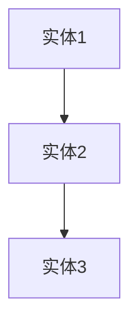
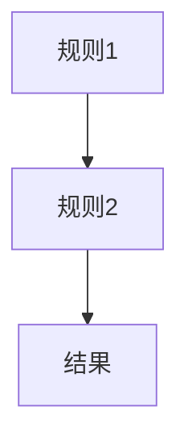

                 

# 基于图谱的AI Agent知识推理与问答

> 关键词：知识图谱，AI Agent，知识推理，问答系统，图谱构建，图神经网络，深度学习

> 摘要：本文详细探讨了基于知识图谱的AI Agent在知识推理与问答系统中的应用。通过分析知识图谱的构建方法、图谱推理算法、基于图谱的问答系统设计，以及AI Agent的知识管理与系统架构，结合实际案例，深入讲解了相关技术原理和实现细节，为AI Agent的开发与应用提供了理论与实践指导。

---

# 第1章 图谱与AI Agent概述

## 1.1 图谱的基本概念

### 1.1.1 图谱的定义与特点

图谱（Knowledge Graph）是一种以图结构形式表示知识的数据模型，由节点（Node）和边（Edge）组成，节点代表实体或概念，边表示它们之间的关系。知识图谱的特点包括：

- **语义丰富性**：通过结构化的表示，捕捉实体之间的语义关联。
- **可扩展性**：支持大规模数据的整合与扩展。
- **动态更新**：能够实时更新以反映新知识。

### 1.1.2 图谱的核心要素与结构

知识图谱的核心要素包括：

- **实体（Entity）**：具体事物或概念，如“人”、“书”等。
- **属性（Property）**：描述实体的特征，如“颜色”、“大小”等。
- **关系（Relation）**：实体之间的关联，如“是”、“属于”等。

知识图谱的结构可以通过以下形式表示：

### 1.1.3 图谱在AI技术中的应用

知识图谱广泛应用于搜索、推荐系统、问答系统等领域，特别是在AI Agent中，知识图谱提供了强大的语义理解和推理能力。

---

## 1.2 AI Agent的定义与特点

### 1.2.1 AI Agent的基本概念

AI Agent（人工智能代理）是指在特定环境中能够感知并自主行动以实现目标的智能体。AI Agent的特点包括：

- **自主性**：能够在没有外部干预的情况下独立行动。
- **反应性**：能够实时感知环境并做出反应。
- **学习能力**：通过与环境交互不断优化自身行为。

### 1.2.2 AI Agent的核心功能与能力

AI Agent的核心功能包括：

- **感知环境**：通过传感器或其他输入方式获取环境信息。
- **决策与推理**：基于感知信息做出决策。
- **执行动作**：根据决策结果执行实际操作。

### 1.2.3 AI Agent与传统程序的区别

AI Agent与传统程序的主要区别在于：

- **自主性**：AI Agent能够自主决策，而传统程序通常需要明确的指令。
- **适应性**：AI Agent能够适应环境变化，而传统程序则不具备这种能力。

---

## 1.3 图谱与AI Agent的结合

### 1.3.1 图谱在AI Agent中的作用

知识图谱为AI Agent提供了丰富的语义信息，帮助其理解复杂的关系和上下文。

### 1.3.2 图谱与知识推理的关系

知识图谱为推理提供了结构化的数据基础，使得推理过程更加高效和准确。

### 1.3.3 图谱与问答系统的关系

问答系统通过知识图谱可以更准确地理解用户意图并生成高质量的回答。

---

## 1.4 本章小结

本章介绍了图谱的基本概念、AI Agent的核心功能与特点，以及图谱与AI Agent的结合方式。通过这些内容，读者可以理解知识图谱在AI Agent中的重要性。

---

# 第2章 知识图谱的构建基础

## 2.1 知识图谱的构建流程

### 2.1.1 数据预处理

数据预处理包括清洗、去重、标准化等步骤，确保数据质量。

### 2.1.2 知识抽取

通过自然语言处理技术从文本中提取实体、关系和属性。

### 2.1.3 知识融合

将多个来源的知识进行整合，消除冲突，确保一致性。

### 2.1.4 知识存储

将构建的知识图谱存储在数据库中，便于后续查询和推理。

---

## 2.2 知识图谱的表示方法

### 2.2.1 图谱的节点与边表示

知识图谱可以用三元组（头实体，关系，尾实体）表示，如（张三，出生地，上海）。

### 2.2.2 知识图谱的表示模型

常用的表示模型包括RDF（资源描述框架）和知识图谱嵌入（如Word2Vec）。

### 2.2.3 知识图谱的存储格式

常用的存储格式包括RDF/XML、N-Triples和JSON-LD。

---

## 2.3 知识图谱的构建工具与技术

### 2.3.1 基于NLP技术的知识抽取

使用分词、实体识别等NLP技术从文本中提取知识。

### 2.3.2 基于规则的知识融合

通过预定义的规则消除冲突，确保知识一致性。

### 2.3.3 知识图谱的可视化工具

常用的可视化工具包括Gephi和Neo4j。

---

## 2.4 本章小结

本章详细介绍了知识图谱的构建流程、表示方法和相关工具技术，为后续的图谱推理和问答系统奠定了基础。

---

# 第3章 图谱推理与知识推理算法

## 3.1 图谱推理的基本概念

### 3.1.1 图谱推理的定义

图谱推理是指在知识图谱中根据已有的事实推导新的知识的过程。

### 3.1.2 图谱推理的分类

图谱推理可以分为基于规则的推理和基于深度学习的推理。

### 3.1.3 图谱推理的应用场景

图谱推理广泛应用于问答系统、推荐系统和智能对话系统。

---

## 3.2 基于规则的图谱推理

### 3.2.1 基于规则的推理算法

基于规则的推理通过预定义的逻辑规则进行推理，如“如果A是B的子类，那么A具有B的所有属性”。

### 3.2.2 基于符号逻辑的推理

基于符号逻辑的推理使用形式逻辑进行推理，如一阶逻辑。

### 3.2.3 基于规则的推理实现

---

## 3.3 基于深度学习的图谱推理

### 3.3.1 基于神经网络的图谱推理

通过神经网络模型（如RNN、LSTM）进行推理。

### 3.3.2 图神经网络在图谱推理中的应用

图神经网络（GNN）通过节点之间的关系进行推理。

### 3.3.3 基于图注意力机制的推理

图注意力机制通过关注重要节点进行推理。

---

## 3.4 图谱推理的优化与挑战

### 3.4.1 图谱推理的优化方法

包括优化算法、增加先验知识等。

### 3.4.2 图谱推理的挑战与未来方向

包括处理大规模图谱、提升推理效率等。

---

## 3.5 本章小结

本章介绍了图谱推理的基本概念、基于规则和深度学习的推理算法，以及优化与挑战。

---

# 第4章 基于图谱的问答系统

## 4.1 基于图谱的问答系统概述

### 4.1.1 问答系统的定义与分类

问答系统根据应用场景分为通用问答和垂直问答。

### 4.1.2 基于图谱的问答系统的特点

基于图谱的问答系统能够提供更准确和相关的回答。

### 4.1.3 图谱在问答系统中的作用

图谱为问答系统提供了丰富的知识支持。

---

## 4.2 基于图谱的问答系统实现

### 4.2.1 问题理解与解析

通过自然语言处理技术理解用户的问题。

### 4.2.2 基于图谱的答案生成

根据图谱中的实体和关系生成答案。

### 4.2.3 基于图谱的答案排序与解释

根据相关性对答案进行排序，并提供解释。

---

## 4.3 本章小结

本章详细介绍了基于图谱的问答系统的设计与实现，展示了图谱在问答系统中的强大能力。

---

# 第5章 AI Agent的知识管理

## 5.1 AI Agent的知识表示

### 5.1.1 知识表示的多种形式

包括符号表示、语义网络等。

### 5.1.2 知识图谱在知识表示中的应用

知识图谱为AI Agent提供了结构化的知识表示。

---

## 5.2 知识图谱的动态更新

### 5.2.1 知识图谱的动态更新方法

包括增量式更新和全量式更新。

### 5.2.2 动态知识图谱的管理与维护

包括版本控制、冲突解决等。

---

## 5.3 多模态知识图谱

### 5.3.1 多模态知识图谱的定义

多模态知识图谱整合了文本、图像、视频等多种数据类型。

### 5.3.2 多模态知识图谱的构建与应用

通过多模态数据提升AI Agent的理解能力。

---

## 5.4 本章小结

本章讨论了AI Agent的知识管理，重点介绍了知识表示、动态更新和多模态知识图谱。

---

# 第6章 系统架构与设计

## 6.1 系统架构设计

### 6.1.1 整体系统设计

包括数据层、知识层、推理层和应用层。

### 6.1.2 模块化设计

将系统划分为数据采集、知识构建、推理引擎和问答系统等模块。

---

## 6.2 系统接口设计

### 6.2.1 系统接口定义

包括数据接口、推理接口和问答接口。

### 6.2.2 接口交互流程

通过序列图展示接口交互流程。

---

## 6.3 本章小结

本章详细介绍了基于图谱的AI Agent系统的架构设计与接口设计。

---

# 第7章 项目实战

## 7.1 项目背景与需求分析

### 7.1.1 项目背景

以医疗问答系统为例，展示基于图谱的AI Agent的应用场景。

### 7.1.2 项目需求

构建一个能够回答医疗相关问题的问答系统。

---

## 7.2 系统核心实现

### 7.2.1 数据采集与预处理

从医疗文献和数据库中采集数据并进行预处理。

### 7.2.2 知识图谱构建

构建医疗领域的知识图谱。

### 7.2.3 推理引擎实现

基于知识图谱实现推理功能。

### 7.2.4 问答系统实现

基于知识图谱实现问答功能。

---

## 7.3 项目测试与优化

### 7.3.1 系统测试

包括功能测试和性能测试。

### 7.3.2 系统优化

包括算法优化和系统调优。

---

## 7.4 本章小结

本章通过医疗问答系统的案例，详细展示了基于图谱的AI Agent的实现过程。

---

# 第8章 总结与展望

## 8.1 全文总结

本文详细探讨了基于图谱的AI Agent在知识推理与问答系统中的应用，介绍了图谱构建、推理算法和系统设计的相关技术。

## 8.2 未来展望

未来的研究方向包括图谱的动态更新、多模态知识图谱以及更高效的推理算法。

---

# 附录

## 附录A: 知识图谱构建工具

列出常用的知识图谱构建工具及其特点。

## 附录B: 图谱推理算法实现代码

提供部分图谱推理算法的实现代码示例。

---

通过以上章节内容，读者可以系统地了解基于图谱的AI Agent知识推理与问答系统的理论基础、实现技术及应用案例。

