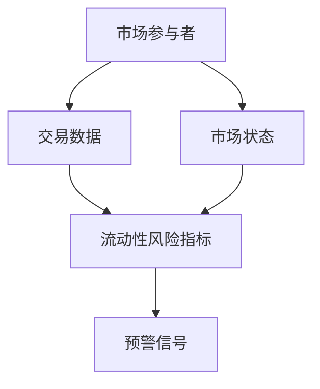
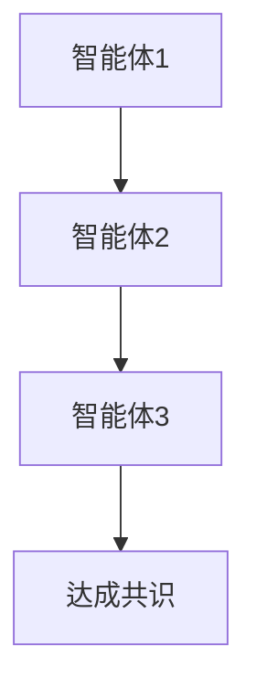
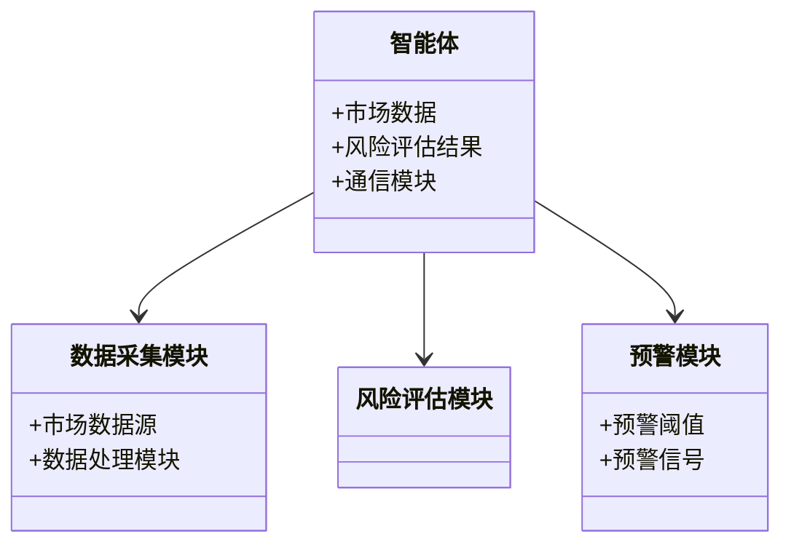
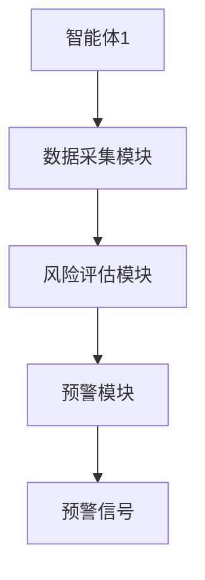
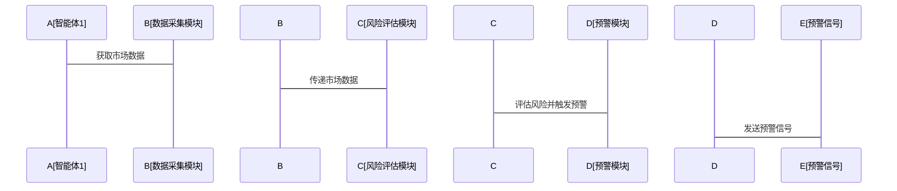

                 


# 基于多智能体的动态市场流动性风险预警系统

## 关键词
- 多智能体系统
- 流动性风险
- 动态市场
- 风险预警
- 金融风险管理

## 摘要
本文探讨了基于多智能体的动态市场流动性风险预警系统的设计与实现。通过分析动态市场环境下的流动性风险特征，提出了一种多智能体协同的预警机制，结合数学模型和算法原理，构建了一个高效的预警系统。文章详细介绍了系统的架构设计、算法实现、项目实战及优化建议，为金融风险管理提供了新的思路和方法。

---

# 第一部分: 引言

## 第1章: 问题背景与研究意义

### 1.1 问题背景
#### 1.1.1 流动性风险的定义与特征
流动性风险是指由于市场参与者行为或市场结构变化导致资产无法以合理价格迅速变现的风险。其主要特征包括动态性、突发性和传染性。

#### 1.1.2 多智能体系统在金融市场的应用
多智能体系统由多个分布式智能体构成，能够协同完成复杂任务。在金融市场中，多智能体系统可以模拟市场参与者的行为，分析市场动态。

#### 1.1.3 动态市场环境下的流动性风险挑战
动态市场环境复杂多变，传统单体系统难以实时捕捉和处理市场变化。多智能体系统通过分布式的感知和协同，能够更好地应对这些挑战。

### 1.2 研究意义
#### 1.2.1 提升市场风险管理能力
通过多智能体系统实时监控市场动态，提前发现潜在风险，帮助市场参与者制定有效的风险管理策略。

#### 1.2.2 优化多智能体协同机制
研究多智能体在流动性风险预警中的协同机制，可以为分布式系统的设计提供新的思路。

#### 1.2.3 推动金融科技创新
结合多智能体系统和人工智能技术，推动金融风险管理的创新，提升金融市场的稳定性。

---

## 第2章: 多智能体系统与流动性风险预警

### 2.1 多智能体系统的核心概念
#### 2.1.1 多智能体系统的定义
多智能体系统由多个智能体组成，每个智能体具备一定的自主性、反应性和协同性，能够通过通信和协作完成复杂任务。

#### 2.1.2 多智能体系统的特征
- 分布式：智能体分布在不同的节点，独立运行。
- 协作性：智能体之间通过通信协同完成任务。
- 反应性：智能体能够实时感知环境变化并做出反应。

#### 2.1.3 多智能体系统的应用场景
- 金融市场：模拟投资者行为，分析市场动态。
- 网络安全：分布式安全监测与防御。
- 物联网：设备协同完成复杂任务。

### 2.2 动态市场环境下的流动性风险
#### 2.2.1 动态市场的定义与特点
动态市场是指市场环境不断变化，参与者行为和市场结构随之调整的市场。其特点是不确定性高、信息更新快。

#### 2.2.2 流动性风险的动态变化
- 市场波动：突发事件引发的市场流动性骤降。
- 信息不对称：参与者行为差异导致的流动性风险加剧。
- 时间依赖性：流动性风险在短时间内迅速变化。

#### 2.2.3 多智能体系统在动态市场中的优势
- 分布式感知：多个智能体同时监测市场不同部分，提供全面的数据支持。
- 协同决策：智能体之间协同分析，提高风险预警的准确性和及时性。

### 2.3 多智能体系统与流动性风险预警的结合
#### 2.3.1 多智能体系统在流动性风险预警中的作用
- 实时监测：智能体实时采集市场数据，快速识别潜在风险。
- 分析预测：基于历史数据和当前市场情况，预测流动性风险。
- 协同预警：多个智能体协同工作，提高预警的准确性和可靠性。

#### 2.3.2 动态市场环境下的预警机制
- 数据采集：智能体从不同渠道获取市场数据。
- 风险评估：基于多智能体协同分析，评估当前市场流动性风险。
- 预警发布：当风险超过阈值时，系统向相关方发送预警信号。

#### 2.3.3 系统的边界与外延
- 系统边界：仅关注流动性风险，不涉及其他类型金融风险。
- 外延：可扩展到其他市场风险预警，如信用风险和市场波动风险。

---

## 第3章: 核心概念与联系

### 3.1 核心概念原理
#### 3.1.1 多智能体系统的通信机制
- 智能体之间通过消息传递进行通信。
- 通信内容包括市场数据、风险评估结果等。

#### 3.1.2 动态市场的数据流分析
- 数据来源：市场交易数据、参与者行为数据。
- 数据处理：实时数据流处理和历史数据分析。

#### 3.1.3 流动性风险的数学模型
- 风险评估公式：
  $$
  \text{流动性风险} = f(\text{市场深度}, \text{买卖价差}, \text{成交量})
  $$

### 3.2 核心概念属性对比
| 概念 | 定义 | 特征 |
|------|------|------|
| 多智能体系统 | 分布式智能体协同系统 | 分布式、协作性、反应性 |
| 动态市场 | 环境不断变化的市场 | 不确定性高、时间依赖性 |
| 流动性风险 | 资产变现难度增加的风险 | 动态性、突发性、传染性 |

### 3.3 ER实体关系图


---

## 第4章: 算法原理讲解

### 4.1 多智能体系统的通信机制
#### 4.1.1 通信协议设计
- 消息格式：JSON格式，包含发送方、接收方、消息内容。
- 通信频率：实时通信，每秒更新一次。

#### 4.1.2 通信安全
- 加密算法：使用AES加密保证通信内容的安全性。
- 认证机制：通过数字签名验证消息来源。

### 4.2 共识算法
#### 4.2.1 共识算法的选择
- 采用基于拜占庭容错的共识算法，确保智能体之间达成一致。

#### 4.2.2 共识算法流程


#### 4.2.3 共识算法实现
- 使用Python编写共识算法，实现智能体之间的消息传递和验证。

### 4.3 决策机制
#### 4.3.1 风险评估模型
- 基于线性回归的流动性风险评估模型：
  $$
  \text{风险值} = \beta_0 + \beta_1 \times \text{市场深度} + \beta_2 \times \text{买卖价差}
  $$

#### 4.3.2 决策规则
- 当风险值超过预设阈值时，触发预警机制。

---

## 第5章: 系统分析与架构设计

### 5.1 问题场景介绍
- 系统需要实时监控多个市场的流动性风险。
- 市场参与者包括机构投资者、散户等。

### 5.2 系统功能设计
#### 5.2.1 功能模块
- 数据采集模块：实时采集市场数据。
- 风险评估模块：基于多智能体协同分析，评估流动性风险。
- 预警模块：当风险超过阈值时，发送预警信号。

#### 5.2.2 领域模型


### 5.3 系统架构设计
#### 5.3.1 系统架构
- 采用分布式架构，智能体部署在不同的节点。
- 使用微服务架构，每个功能模块独立运行。

#### 5.3.2 系统架构图


### 5.4 系统接口设计
- API接口：提供给其他系统调用，获取风险评估结果和预警信号。

### 5.5 系统交互流程


---

## 第6章: 项目实战

### 6.1 环境配置
- 操作系统：Linux
- 开发工具：PyCharm
- 依赖库：Python的多线程库、网络通信库。

### 6.2 核心代码实现
#### 6.2.1 智能体通信代码
```python
import json
import socket

class Agent:
    def __init__(self, host, port):
        self.host = host
        self.port = port
        self.sock = socket.socket(socket.AF_INET, socket.SOCK_DGRAM)
    
    def send_message(self, message, recipient):
        msg = json.dumps({'sender': self.host, 'message': message})
        self.sock.sendto(msg.encode(), (recipient, self.port))
    
    def receive_message(self):
        data, addr = self.sock.recvfrom(1024)
        return json.loads(data.decode())
```

#### 6.2.2 风险评估代码
```python
import numpy as np

class RiskAssessment:
    def __init__(self):
        self.model = self.build_model()
    
    def build_model(self):
        # 线性回归模型
        return np.random.rand(3)

    def predict(self, market_depth, bid_ask_spread, volume):
        return self.model[0] + self.model[1] * market_depth + self.model[2] * bid_ask_spread
```

### 6.3 实际案例分析
- 案例背景：某市场出现突发新闻，导致流动性风险急剧上升。
- 预警过程：智能体实时监测市场数据，评估风险并触发预警。

---

## 第7章: 最佳实践与小结

### 7.1 最佳实践 tips
- 系统优化：定期更新模型参数，提升预测准确性。
- 部署建议：采用云部署，确保系统的高可用性。
- 维护建议：定期检查系统日志，及时处理异常情况。

### 7.2 小结
本文详细介绍了基于多智能体的动态市场流动性风险预警系统的构建过程，从核心概念到算法实现，再到系统架构设计，最后通过项目实战验证了系统的有效性。

### 7.3 注意事项
- 数据隐私：确保系统数据的安全性和隐私性。
- 系统稳定性：保证系统的高可用性和容错能力。

### 7.4 拓展阅读
- 推荐阅读相关领域的书籍，如《分布式系统：概念与设计》、《人工智能在金融中的应用》等。

---

# 结语

通过本文的探讨，我们深入理解了基于多智能体的动态市场流动性风险预警系统的构建与实现。希望本文能够为金融风险管理领域的研究者和实践者提供有价值的参考和启示。

