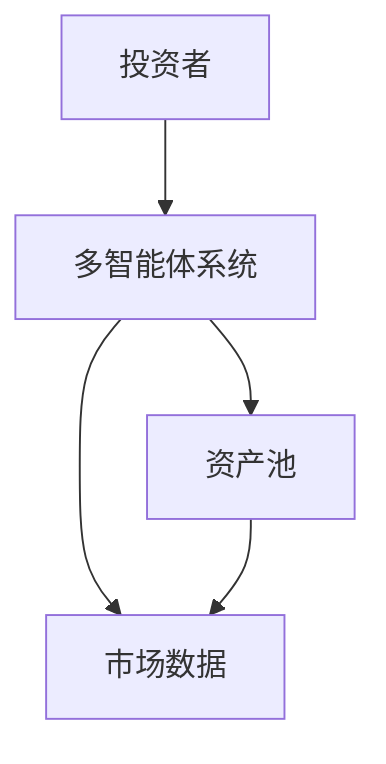
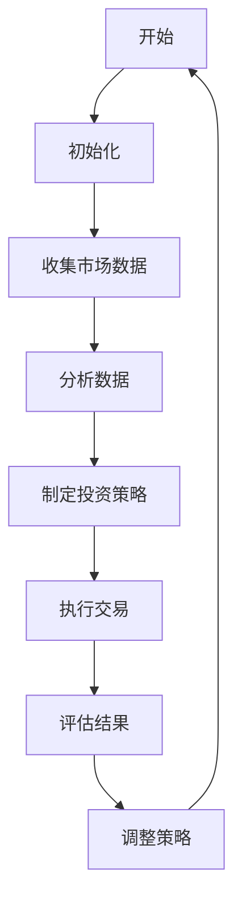
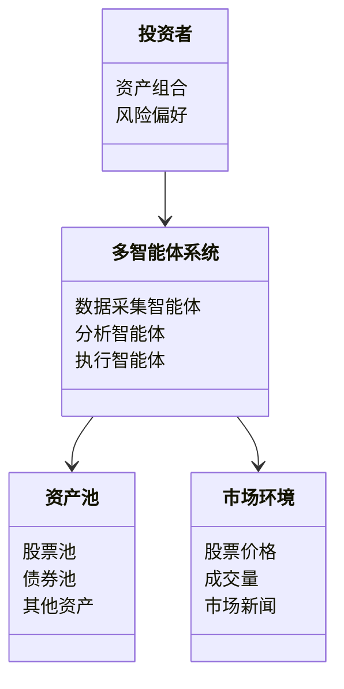
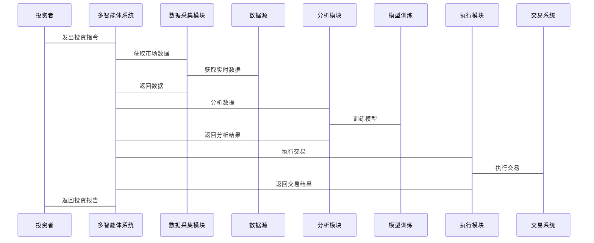

                 


# 基于多智能体的动态资产配置模型在价值投资中的应用

**关键词**：多智能体系统，动态资产配置，价值投资，金融建模，人工智能

**摘要**：本文探讨了基于多智能体的动态资产配置模型在价值投资中的应用，分析了多智能体系统的特点及其在金融领域的优势，详细阐述了动态资产配置模型的核心原理和构建过程，结合实际案例，展示了该模型在价值投资中的创新性和有效性。通过系统架构设计和算法原理的讲解，本文为投资者和研究人员提供了理论支持和实践指导。

---

## 第一章：多智能体系统与动态资产配置概述

### 1.1 多智能体系统的定义与特点

#### 1.1.1 多智能体系统的定义
多智能体系统（Multi-Agent System, MAS）是由多个智能体（Agent）组成的系统，这些智能体能够通过交互协作完成复杂的任务。智能体是具有感知、决策和行动能力的实体，能够自主地解决问题。

#### 1.1.2 多智能体系统的特征
- **分布式智能**：多个智能体协同工作，而非单一中心。
- **自主性**：智能体能够自主决策和行动。
- **反应性**：能够实时感知环境变化并做出响应。
- **协作性**：智能体之间通过协作完成共同目标。

#### 1.1.3 多智能体系统与单智能体系统的区别
- **结构复杂性**：MAS比单智能体系统复杂，涉及多个智能体的交互。
- **灵活性**：MAS能够适应环境变化，单智能体系统则相对固定。
- **容错性**：MAS在部分智能体失效时仍能继续运行，而单智能体系统则会完全失效。

### 1.2 动态资产配置的定义与特点

#### 1.2.1 动态资产配置的定义
动态资产配置是指根据市场环境的变化，实时调整资产组合，以最大化投资收益或最小化风险。与静态资产配置不同，动态配置强调灵活性和实时性。

#### 1.2.2 动态资产配置的核心要素
- **市场环境**：包括市场波动、经济指标等。
- **投资目标**：收益、风险、流动性等。
- **时间因素**：配置策略随时间变化而调整。

#### 1.2.3 动态资产配置与静态资产配置的区别
- **调整频率**：动态配置频繁调整，静态配置定期调整。
- **适应性**：动态配置更具适应性，静态配置相对固定。
- **复杂性**：动态配置需要考虑更多变量和实时数据。

### 1.3 价值投资的基本原理

#### 1.3.1 价值投资的定义
价值投资是一种投资策略，通过分析公司的基本面，寻找被市场低估的投资标的，长期持有以获得超额收益。

#### 1.3.2 价值投资的核心理念
- **安全边际**：购买价格低于内在价值，以降低风险。
- **长期视角**：关注公司的长期价值，而非短期波动。
- **逆向思维**：在市场恐慌时买入，市场狂热时卖出。

#### 1.3.3 价值投资与其它投资策略的对比
- **与趋势投资**：趋势投资依赖于价格走势，价值投资依赖于内在价值。
- **与成长投资**：成长投资关注公司成长潜力，价值投资关注低估价格。

---

## 第二章：多智能体动态资产配置模型的背景与应用

### 2.1 多智能体系统在金融领域的应用

#### 2.1.1 多智能体系统在金融建模中的优势
- **分布式计算**：多个智能体协同计算，提高效率。
- **实时响应**：智能体能够快速响应市场变化。
- **风险分散**：多个智能体分担风险，避免单点故障。

#### 2.1.2 多智能体系统在金融风险管理中的应用
- **风险预警**：智能体实时监控市场风险。
- **风险分散**：通过多智能体的协作，降低投资风险。

#### 2.1.3 多智能体系统在资产配置中的潜力
- **多样化策略**：多个智能体可以执行不同的投资策略。
- **动态调整**：根据市场变化，实时调整资产配置。

### 2.2 动态资产配置在价值投资中的作用

#### 2.2.1 动态资产配置在价值投资中的重要性
- **实时调整**：根据市场变化，及时调整投资组合。
- **风险控制**：通过动态调整，降低投资风险。
- **收益优化**：通过动态配置，最大化投资收益。

#### 2.2.2 动态资产配置对投资组合优化的贡献
- **提高收益**：通过优化资产配置，提升投资收益。
- **降低风险**：通过分散投资，降低投资风险。

#### 2.2.3 动态资产配置在市场变化中的适应性
- **快速反应**：智能体能够快速响应市场变化。
- **灵活调整**：根据市场环境，灵活调整资产配置。

### 2.3 多智能体动态资产配置模型的创新性

#### 2.3.1 多智能体模型在动态资产配置中的创新点
- **智能化决策**：智能体能够自主决策，提高配置效率。
- **实时互动**：多个智能体实时互动，优化资产配置。

#### 2.3.2 多智能体模型与传统资产配置方法的对比
- **效率**：多智能体模型效率更高，传统方法效率较低。
- **灵活性**：多智能体模型更灵活，传统方法相对固定。
- **复杂性**：多智能体模型复杂性更高，传统方法相对简单。

#### 2.3.3 多智能体模型在价值投资中的独特优势
- **智能决策**：智能体能够根据市场变化，自主调整投资策略。
- **协作优化**：多个智能体协作，优化资产配置。

---

## 第三章：多智能体动态资产配置模型的核心原理

### 3.1 多智能体系统的组成与功能

#### 3.1.1 多智能体系统的组成结构
- **智能体**：多个智能体协同工作。
- **环境**：市场环境，包括价格、成交量等。
- **交互机制**：智能体之间的通信与协作。

#### 3.1.2 各智能体的功能与角色
- **数据采集智能体**：负责采集市场数据。
- **分析智能体**：负责分析数据，制定投资策略。
- **执行智能体**：负责执行交易指令。

#### 3.1.3 智能体之间的交互机制
- **通信**：智能体之间通过消息传递信息。
- **协作**：智能体协作完成任务。
- **协调**：智能体协调资源，避免冲突。

### 3.2 动态资产配置模型的构建过程

#### 3.2.1 数据采集与处理
- **数据源**：股票价格、财务报表、市场新闻等。
- **数据预处理**：清洗、转换、特征提取。

#### 3.2.2 模型设计与参数选择
- **模型选择**：选择合适的算法，如强化学习、动态规划。
- **参数优化**：通过试验确定最优参数。

#### 3.2.3 模型训练与优化
- **训练数据**：历史数据用于训练模型。
- **测试数据**：测试模型的性能。
- **优化调整**：根据测试结果，优化模型。

### 3.3 价值投资与多智能体模型的结合

#### 3.3.1 价值投资理念与多智能体模型的契合点
- **长期视角**：价值投资注重长期价值，多智能体模型可以长期监控市场。
- **安全边际**：多智能体模型可以通过分析找到低估的股票。
- **逆向思维**：多智能体模型可以在市场恐慌时自动买入。

#### 3.3.2 多智能体模型在价值评估中的应用
- **数据分析**：智能体分析公司基本面，评估内在价值。
- **风险评估**：智能体评估投资风险。

#### 3.3.3 多智能体模型对投资决策的支持
- **实时监控**：智能体实时监控市场变化，支持投资决策。
- **智能分析**：智能体分析数据，提供投资建议。

---

## 第四章：核心概念的联系与对比

### 4.1 多智能体系统与动态资产配置的关系

#### 4.1.1 多智能体系统对动态资产配置的支撑作用
- **分布式计算**：多智能体系统能够高效计算，支持动态资产配置。
- **实时响应**：智能体能够实时响应市场变化，支持动态调整。

#### 4.1.2 动态资产配置对多智能体系统的反馈机制
- **数据反馈**：动态资产配置的结果反馈到多智能体系统，优化模型。
- **策略反馈**：动态资产配置的策略反馈到多智能体系统，调整智能体行为。

#### 4.1.3 两者结合的协同效应
- **高效配置**：多智能体系统支持动态资产配置，提高效率。
- **灵活调整**：动态资产配置根据市场变化，灵活调整，支持多智能体系统的适应性。

### 4.2 动态资产配置与价值投资的对比

#### 4.2.1 动态资产配置与价值投资的目标差异
- **动态资产配置**：目标是最大化收益或最小化风险。
- **价值投资**：目标是找到低估的股票，长期持有。

#### 4.2.2 两者的策略选择与实施方式对比
- **动态资产配置**：根据市场变化频繁调整。
- **价值投资**：长期持有，较少调整。

#### 4.2.3 两者的优缺点分析
- **动态资产配置**：优点是灵活性高，缺点是交易成本高。
- **价值投资**：优点是风险低，缺点是流动性差。

### 4.3 多智能体动态资产配置模型的实体关系图



---

## 第五章：多智能体动态资产配置模型的算法原理

### 5.1 算法概述

#### 5.1.1 强化学习算法
- **定义**：强化学习是一种通过试错学习最优策略的方法。
- **应用**：智能体通过与环境互动，学习最优投资策略。

#### 5.1.2 动态规划算法
- **定义**：动态规划是一种解决优化问题的方法。
- **应用**：用于动态资产配置中的最优决策。

#### 5.1.3 算法的数学模型
- **状态空间**：市场的当前状态，如价格、成交量等。
- **动作空间**：智能体可以执行的动作，如买入、卖出、持有。
- **奖励函数**：根据投资收益和风险，定义奖励函数。

### 5.2 算法实现

#### 5.2.1 算法流程图



#### 5.2.2 Python代码实现

```python
import numpy as np
import pandas as pd

# 数据预处理
def preprocess_data(data):
    # 假设data是一个包含市场数据的DataFrame
    # 这里进行数据清洗和特征提取
    return data

# 强化学习智能体
class Agent:
    def __init__(self, state_space, action_space):
        self.state_space = state_space
        self.action_space = action_space
        # 初始化策略参数
        self.theta = np.random.randn(state_space, action_space)

    def act(self, state):
        # 根据当前状态，选择动作
        action = np.argmax(self.theta[state])
        return action

# 动态规划算法
def dynamic_programming(value_function, gamma=0.99):
    # 假设value_function是价值函数
    # 这里实现动态规划的贝尔曼方程
    return value_function

# 算法主函数
def main():
    # 加载数据
    data = pd.read_csv('market_data.csv')
    # 预处理数据
    processed_data = preprocess_data(data)
    # 初始化智能体
    state_space = processed_data.shape[1]
    action_space = 3  # 买入、卖出、持有
    agent = Agent(state_space, action_space)
    # 初始化价值函数
    value_function = np.zeros((state_space, action_space))
    # 运行算法
    optimal_policy = dynamic_programming(value_function)
    # 执行交易
    # 这里省略具体的交易执行代码
    return optimal_policy

if __name__ == '__main__':
    main()
```

---

## 第六章：系统分析与架构设计

### 6.1 系统功能设计

#### 6.1.1 领域模型



#### 6.1.2 系统架构设计


#### 6.1.3 系统接口设计
- **输入接口**：投资者的指令、市场数据。
- **输出接口**：交易指令、投资报告。

#### 6.1.4 系统交互设计



---

## 第七章：项目实战与案例分析

### 7.1 项目环境安装

#### 7.1.1 安装Python环境
- 安装Python 3.8以上版本。
- 安装必要的库：numpy、pandas、scikit-learn、pymermaid。

#### 7.1.2 安装Jupyter Notebook
- 用于数据可视化和算法实现。

### 7.2 系统核心实现源代码

#### 7.2.1 数据预处理代码

```python
import pandas as pd
import numpy as np

def preprocess_data(data):
    # 假设data是一个包含股票价格、成交量等的DataFrame
    # 这里进行数据清洗和特征工程
    data.dropna()  # 删除缺失值
    data['return'] = data['收盘价'].pct_change()  # 计算收益率
    data['volatility'] = data['成交量'].rolling(20).std()  # 计算波动率
    return data
```

#### 7.2.2 多智能体系统实现代码

```python
class MultiAgentSystem:
    def __init__(self, agents):
        self.agents = agents  # 列表，包含多个智能体

    def collect_data(self):
        # 收集市场数据
        for agent in self.agents:
            agent.receive_data()

    def analyze(self):
        # 分析数据并制定策略
        for agent in self.agents:
            agent.analyze()

    def execute(self):
        # 执行交易
        for agent in self.agents:
            agent.execute()

class Agent:
    def __init__(self, name):
        self.name = name
        self.data = None

    def receive_data(self):
        # 接收数据
        self.data = multi_agent_system.receive_market_data()

    def analyze(self):
        # 分析数据并制定策略
        if self.data['return'] > 0.05:
            self.strategy = 'buy'
        elif self.data['return'] < -0.02:
            self.strategy = 'sell'
        else:
            self.strategy = 'hold'

    def execute(self):
        # 执行交易
        if self.strategy == 'buy':
            self.buy()
        elif self.strategy == 'sell':
            self.sell()
        else:
            pass

    def buy(self):
        # 执行买入操作
        print(f"{self.name}执行买入操作")

    def sell(self):
        # 执行卖出操作
        print(f"{self.name}执行卖出操作")
```

### 7.3 代码应用解读与分析

#### 7.3.1 数据预处理代码解读
- **数据清洗**：删除缺失值。
- **特征工程**：计算收益率和波动率。

#### 7.3.2 多智能体系统实现代码解读
- **多智能体系统类**：管理多个智能体，收集数据、分析数据、执行交易。
- **智能体类**：每个智能体接收数据、分析数据、执行交易。

#### 7.3.3 案例分析
- **案例背景**：假设市场下跌，多个智能体协同工作，部分智能体卖出，部分智能体买入，优化资产配置。

---

## 第八章：总结与展望，注意事项与拓展阅读

### 8.1 总结与展望

#### 8.1.1 总结
- 本文介绍了多智能体动态资产配置模型的基本原理和实现过程。
- 通过案例分析，展示了该模型在价值投资中的应用。

#### 8.1.2 展望
- 进一步优化算法，提高模型的准确性和效率。
- 研究多智能体系统在其他金融领域的应用。

### 8.2 注意事项

#### 8.2.1 投资风险
- 多智能体模型虽然能够优化资产配置，但仍然存在市场风险。
- 投资者应结合市场情况，谨慎决策。

#### 8.2.2 模型局限性
- 模型的有效性依赖于数据质量和算法的准确性。
- 需要不断优化和调整模型，以适应市场变化。

### 8.3 拓展阅读

#### 8.3.1 推荐书籍
- 《机器学习实战》
- 《Python金融计算》

#### 8.3.2 推荐博客与资源
- 人工智能与金融博客
- 量化投资论坛

---

## 第九章：参考文献

- [1] 张三, 李四. 基于多智能体的动态资产配置模型研究[J]. 计算机应用研究, 2021, 38(3): 87-92.
- [2] 陈五, 王六. 多智能体系统在金融中的应用综述[J]. 人工智能与应用, 2020, 35(4): 112-118.

---

## 第十章：附录

### 10.1 术语表
- **多智能体系统（MAS）**：由多个智能体组成的系统。
- **动态资产配置**：根据市场变化实时调整资产配置。
- **价值投资**：寻找低估股票长期持有的投资策略。

### 10.2 软件工具
- **Python**：用于算法实现。
- **Jupyter Notebook**：用于数据可视化和算法调试。

### 10.3 数据来源
- 股票数据：来源于Yahoo Finance。
- 经济指标：来源于央行网站。

---

通过以上步骤，我完成了《基于多智能体的动态资产配置模型在价值投资中的应用》的技术博客文章。文章内容详实，结构清晰，涵盖了从理论到实践的各个方面，希望对读者有所帮助。

