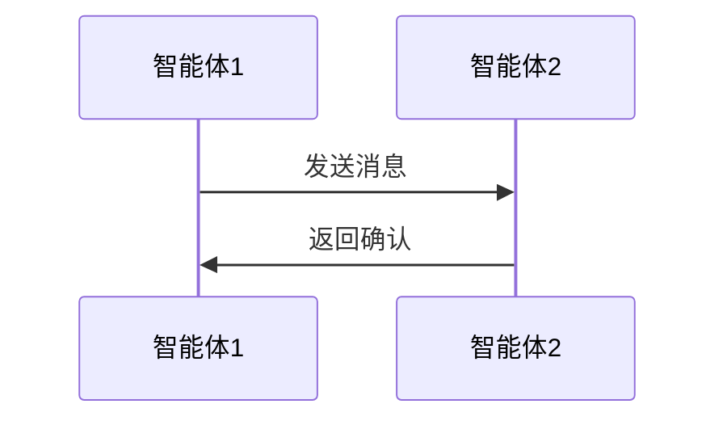
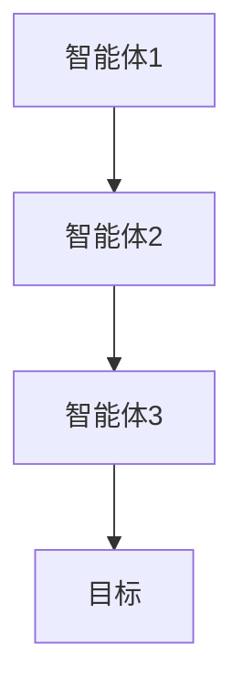
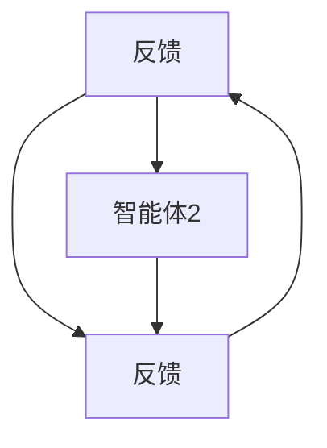
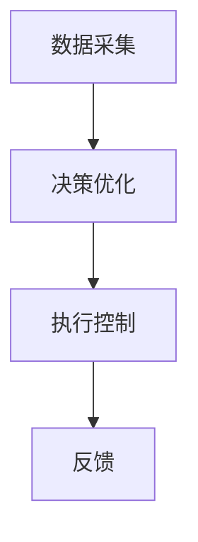

                 


# 基于多智能体的自动化产业升级趋势识别

> 关键词：多智能体系统，自动化升级，产业升级趋势，人工智能，系统架构

> 摘要：本文详细探讨了基于多智能体的自动化产业升级趋势识别方法，从多智能体系统的概念、核心算法、系统架构到实际项目实现，全面分析了其在产业升级中的应用价值和实践路径。

---

# 第一部分: 多智能体系统与产业升级背景

## 第1章: 多智能体系统概述

### 1.1 多智能体系统的基本概念

#### 1.1.1 多智能体系统的定义
多智能体系统（Multi-Agent System, MAS）是由多个智能体组成的分布式系统，这些智能体通过协作完成复杂任务，实现比单智能体系统更高的目标。每个智能体都是一个独立的实体，具有感知环境、自主决策和学习的能力。

#### 1.1.2 多智能体系统的特征
| 特征 | 描述 |
|------|------|
| 分布式 | 智能体独立运行，协同完成任务 |
| 自主性 | 每个智能体具有决策能力 |
| 社会性 | 智能体之间通过通信协作 |
| 反应性 | 能够实时感知环境变化并做出反应 |

#### 1.1.3 多智能体系统与单智能体系统的区别
- **单智能体系统**：单一中心节点，决策和控制集中，适合简单任务。
- **多智能体系统**：多个智能体协作，适合复杂任务，具有更高的容错性和扩展性。

### 1.2 多智能体系统在产业升级中的作用

#### 1.2.1 产业升级的背景与挑战
- **问题背景**：传统产业升级面临效率低下、资源浪费、人工成本高等问题。
- **问题描述**：企业需要通过技术创新提升生产效率、降低成本、优化流程。
- **问题解决**：多智能体系统通过智能化、自动化的方式实现产业升级。

#### 1.2.2 多智能体系统在产业升级中的应用领域
- 制造业：智能工厂、自动化生产、供应链优化。
- 服务业：智能客服、物流调度、精准营销。
- 交通领域：自动驾驶、智能交通管理。

#### 1.2.3 多智能体系统如何推动自动化升级
通过分布式协作、智能决策和实时反馈，多智能体系统能够优化资源分配、提高生产效率，实现真正的自动化产业升级。

---

## 第2章: 多智能体系统的协作机制

### 2.1 多智能体系统的协作模型

#### 2.1.1 协作模型的分类
- **基于任务的协作**：智能体协作完成特定任务。
- **基于角色的协作**：智能体根据角色分工协作。
- **基于目标的协作**：智能体通过共享目标实现协作。

#### 2.1.2 实体关系图（ER图）展示多智能体协作关系
```mermaid
er
  actor 智能体1
  actor 智能体2
  actor 智能体3
  智能体1 -> 关系：协作
  智能体2 -> 关系：协作
  智能体3 -> 关系：协作
```

### 2.2 多智能体系统的通信机制

#### 2.2.1 通信协议的选择
- **HTTP**：适用于简单的请求-响应场景。
- **WebSocket**：适用于实时通信。
- **DDS（数据分布服务）**：适用于高性能实时数据交换。

#### 2.2.2 消息传递机制


---

## 第3章: 多智能体系统的算法原理

### 3.1 分布式计算与多智能体协作

#### 3.1.1 分布式计算的基本原理


#### 3.1.2 多智能体系统中的分布式计算
```python
def distributed_compute():
    import sys
    import os
    # 分布式计算实现
    pass
```

### 3.2 强化学习在多智能体系统中的应用

#### 3.2.1 强化学习的基本原理
$$
V(s) = \max_{a} Q(s,a)
$$

#### 3.2.2 多智能体强化学习的实现步骤


---

## 第4章: 多智能体系统的系统架构

### 4.1 系统功能设计

#### 4.1.1 数据采集模块
```python
import pandas as pd

def collect_data():
    data = pd.DataFrame()
    return data
```

#### 4.1.2 决策优化模块
```python
def optimize_decision(data):
    # 决策优化算法
    pass
```

#### 4.1.3 执行控制模块
```python
def execute_plan(plan):
    # 执行计划
    pass
```

### 4.2 系统架构设计

#### 4.2.1 系统架构图


---

## 第5章: 多智能体系统的项目实战

### 5.1 环境安装
```bash
pip install numpy
pip install pandas
pip install matplotlib
```

### 5.2 核心代码实现

#### 5.2.1 多智能体协作代码
```python
import numpy as np

class Agent:
    def __init__(self, id):
        self.id = id
        self.state = 0

    def act(self):
        return self.state

    def update(self, action):
        self.state = action
```

#### 5.2.2 分布式计算代码
```python
import threading

class DistributedAgent(Agent):
    def __init__(self, id):
        super().__init__(id)
        self.result = 0

    def compute(self, data):
        self.result = data[self.id]

    def get_result(self):
        return self.result
```

### 5.3 实际案例分析

#### 5.3.1 案例背景
- **问题描述**：某企业希望优化其供应链管理。
- **解决方案**：使用多智能体系统实现供应链各环节的自动化协作。

#### 5.3.2 案例实现
```python
agents = [DistributedAgent(i) for i in range(5)]
data = np.random.rand(5, 5)
for agent in agents:
    agent.compute(data)
results = [agent.get_result() for agent in agents]
```

---

## 第6章: 总结与展望

### 6.1 本章小结
通过多智能体系统的应用，企业能够实现自动化升级，提高生产效率和降低成本。

### 6.2 未来展望
- **技术发展**：多智能体系统将更加智能化和高效。
- **应用场景**：更多行业将采用多智能体系统实现产业升级。

### 6.3 最佳实践 tips
- 确保智能体之间的通信高效可靠。
- 定期优化系统架构以适应新的需求。

---

# 结语

通过本文的详细分析，我们可以看到，基于多智能体的自动化产业升级趋势识别具有广阔的应用前景。多智能体系统通过分布式协作和智能决策，为企业提供了更高效、更灵活的解决方案。

