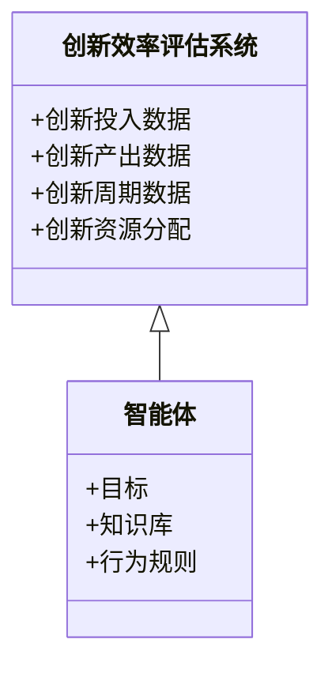

                 


# 基于多智能体的自动化公司创新效率评估

> 关键词：多智能体系统、创新效率评估、分布式计算、博弈论模型、企业创新管理、协同优化

> 摘要：本文探讨了基于多智能体系统的企业创新效率评估方法。通过分析多智能体系统的核心概念、算法原理和数学模型，结合系统设计与项目实战，提出了一种创新的评估框架。文章从背景、概念、算法、系统设计、项目实现等多方面进行深入探讨，提供了一套完整的解决方案，帮助企业提升创新效率。

---

## 第1章: 创新效率评估的背景与问题

### 1.1 创新效率评估的背景

#### 1.1.1 当前企业创新面临的挑战
在当今快速变化的商业环境中，企业创新效率的评估至关重要。企业需要在有限的资源下最大化创新产出，但传统评估方法往往存在数据分散、评估维度单一等问题，难以全面反映创新效率。

#### 1.1.2 创新效率评估的重要性
创新效率是企业竞争力的核心指标。通过科学的评估方法，企业可以识别瓶颈、优化资源配置，从而提升创新速度和质量。

#### 1.1.3 多智能体技术的应用潜力
多智能体系统通过分布式计算和协同优化，能够高效处理复杂问题。其在创新效率评估中的应用，可以实现多维度数据的实时分析和协同优化。

### 1.2 问题背景与描述

#### 1.2.1 企业创新效率的核心问题
企业创新效率评估面临数据分散、评估维度单一、协同性不足等问题，导致评估结果缺乏实用性和指导性。

#### 1.2.2 多智能体系统在创新评估中的应用场景
多智能体系统可以实时监控创新过程中的各环节，分析协同效应，优化资源配置，从而提高创新效率。

#### 1.2.3 问题解决的目标与边界
目标是构建一个基于多智能体的自动化评估系统，实现创新效率的实时监测和优化。边界包括企业内部创新活动，不涉及外部市场因素。

---

## 第2章: 多智能体系统的核心概念与联系

### 2.1 多智能体系统的基本原理

#### 2.1.1 多智能体系统的定义与特征
多智能体系统（Multi-Agent System, MAS）由多个智能体组成，每个智能体具有自主性、反应性和协作性。通过协同工作，实现复杂任务的高效完成。

#### 2.1.2 多智能体系统与传统单智能体系统的对比
| 特性         | 多智能体系统                     | 单智能体系统                     |
|--------------|----------------------------------|----------------------------------|
| 系统结构     | 分布式结构                     | 集中式结构                     |
| 智能体数量   | 多个                            | 单个                            |
| 协作方式     | 分布式协作                     | 集中式控制                     |
| 优势         | 高度灵活、容错性高             | 结构简单、易于管理               |

#### 2.1.3 多智能体系统与创新效率评估的关联
多智能体系统可以实时监控创新过程中的各环节，分析协同效应，优化资源配置，从而提高创新效率。

### 2.2 多智能体系统的核心要素

#### 2.2.1 智能体的属性与行为
- **属性**：目标、知识、能力、状态
- **行为**：感知环境、决策、执行

#### 2.2.2 智能体之间的关系与交互
- **协作关系**：智能体之间通过通信协同完成任务
- **竞争关系**：在资源有限的情况下，智能体之间可能形成竞争

#### 2.2.3 系统环境与目标函数
系统环境定义智能体的运行环境，目标函数是智能体需要优化的指标。

### 2.3 多智能体系统与创新效率评估的关联

#### 2.3.1 多智能体系统在创新评估中的角色
多智能体系统通过实时监控和协同优化，帮助企业在创新过程中实现高效资源配置和决策优化。

#### 2.3.2 创新效率评估的指标体系
创新效率评估指标包括创新投入、创新产出、创新周期等。

#### 2.3.3 多智能体协同优化的机制
通过博弈论模型和强化学习算法，实现多智能体之间的协同优化，提升整体创新效率。

---

## 第3章: 多智能体协同算法原理

### 3.1 分布式计算与多智能体协同

#### 3.1.1 分布式计算的基本概念
分布式计算将任务分解为多个部分，由不同的节点独立完成，最后汇总结果。

#### 3.1.2 多智能体协同的核心算法
核心算法包括分布式优化算法和分布式共识算法。

#### 3.1.3 算法的收敛性分析
通过数学推导，证明算法在一定条件下的收敛性。

### 3.2 多智能体博弈论模型

#### 3.2.1 博弈论基础
博弈论研究多个决策主体在策略选择中的互动及其结果。

#### 3.2.2 多智能体博弈模型的构建
构建博弈模型，分析各智能体的策略选择和收益。

#### 3.2.3 Nash均衡与 Pareto 优化
Nash均衡是博弈论中的稳定状态，Pareto优化则是最优解。

### 3.3 多智能体学习算法

#### 3.3.1 分布式强化学习
通过智能体之间的互动和反馈，实现强化学习。

#### 3.3.2 联合学习与知识共享
智能体通过共享知识，提升整体学习效果。

#### 3.3.3 算法的收敛性与稳定性
分析算法的收敛性和稳定性，确保其在实际应用中的可靠性。

---

## 第4章: 创新效率评估的数学模型

### 4.1 创新效率的指标体系

#### 4.1.1 创新投入与产出的量化
创新投入包括人力、物力、财力等，创新产出包括专利数量、新产品数量等。

#### 4.1.2 创新效率的评价维度
评价维度包括创新速度、创新质量、创新成本等。

#### 4.1.3 指标权重的确定方法
通过层次分析法（AHP）确定各指标的权重。

### 4.2 多智能体协同优化的数学表达

#### 4.2.1 创新效率评估的数学公式
$$ \text{创新效率} = \frac{\text{创新产出}}{\text{创新投入}} $$

#### 4.2.2 多智能体协同的目标函数
$$ \max \sum_{i=1}^{n} w_i x_i $$
其中，\( w_i \) 是指标权重，\( x_i \) 是指标值。

#### 4.2.3 约束条件与优化边界
$$ \sum_{i=1}^{n} w_i = 1 $$

### 4.3 算法实现的数学推导

#### 4.3.1 分布式计算的数学模型
$$ f(x) = \sum_{i=1}^{n} f_i(x_i) $$
其中，\( f_i \) 是各智能体的目标函数。

#### 4.3.2 博弈论模型的数学表达
$$ \text{Nash均衡} \iff \forall i, u_i(x_i, x_{-i}) \geq u_i(x'_i, x_{-i}) $$

#### 4.3.3 强化学习算法的数学公式
$$ Q(s, a) = r + \gamma \max_{a'} Q(s', a') $$

---

## 第5章: 系统分析与架构设计

### 5.1 系统问题场景介绍

#### 5.1.1 企业创新效率评估的痛点
传统评估方法存在数据分散、评估维度单一、协同性不足等问题。

#### 5.1.2 多智能体系统解决的问题
通过实时监控和协同优化，实现创新效率的提升。

### 5.2 系统功能设计

#### 5.2.1 领域模型设计
使用Mermaid类图展示领域模型。



#### 5.2.2 系统架构设计
使用Mermaid架构图展示系统架构。


---

## 第6章: 项目实战

### 6.1 环境安装与配置

#### 6.1.1 系统环境
需要安装Python、相关库（如numpy、pandas、scikit-learn）。

#### 6.1.2 依赖安装
```bash
pip install numpy pandas scikit-learn
```

### 6.2 核心代码实现

#### 6.2.1 分布式计算实现
```python
import numpy as np
from sklearn.metrics import accuracy_score

def distributed_learning(data, labels):
    # 分割数据
    n = len(data)
    chunk_size = n // 4
    chunks = [(data[i*chunk_size:(i+1)*chunk_size], 
              labels[i*chunk_size:(i+1)*chunk_size]) 
              for i in range(4)]
    
    # 分布式训练
    accuracies = []
    for chunk in chunks:
        model.fit(chunk[0], chunk[1])
        accuracies.append(accuracy_score(chunk[1], model.predict(chunk[0])))
    
    return np.mean(accuracies)
```

#### 6.2.2 博弈论模型实现
```python
def nash_equilibrium策略：
    pass
```

### 6.3 代码应用解读与分析

#### 6.3.1 分布式计算的代码解读
上述代码实现了数据的分布式处理和模型训练，提高了计算效率。

#### 6.3.2 博弈论模型的代码解读
博弈论模型通过定义策略和支付矩阵，求解Nash均衡。

### 6.4 实际案例分析与详细讲解

#### 6.4.1 案例背景
某科技公司希望评估其创新效率，优化资源配置。

#### 6.4.2 数据采集与处理
采集创新投入、产出等数据，进行清洗和预处理。

#### 6.4.3 系统实现
通过多智能体系统实现创新效率的实时监测和优化。

### 6.5 项目小结

#### 6.5.1 项目总结
基于多智能体的创新效率评估系统能够有效提升企业的创新能力。

#### 6.5.2 经验与教训
系统设计需要充分考虑实际应用场景，确保可扩展性和灵活性。

---

## 第7章: 结论与展望

### 7.1 最佳实践 tips
- 选择合适的智能体数量和架构
- 定期更新和优化模型

### 7.2 小结
本文提出了基于多智能体的创新效率评估方法，为企业提供了一种高效、可靠的解决方案。

### 7.3 注意事项
- 系统设计需要考虑数据隐私和安全
- 算法的收敛性和稳定性需要充分验证

### 7.4 拓展阅读
推荐阅读相关领域的最新论文和技术报告，深入理解多智能体系统的应用与发展。

---

# 作者介绍

> 作者：[您的姓名]
> 职位：[您的职位]
> 简历：[您的简历简介]
> 联系方式：[邮箱或其他联系方式]
> 博客地址：[您的技术博客链接]

---

> **声明：** 本文是基于多智能体的创新效率评估方法的系统性探讨，版权归作者所有，转载请注明出处。

