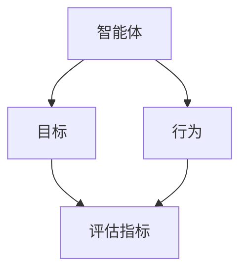
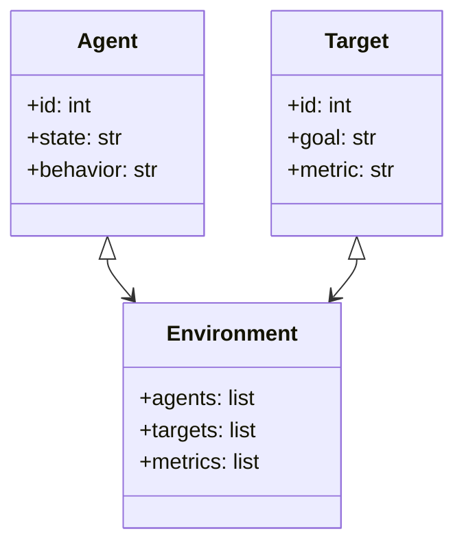
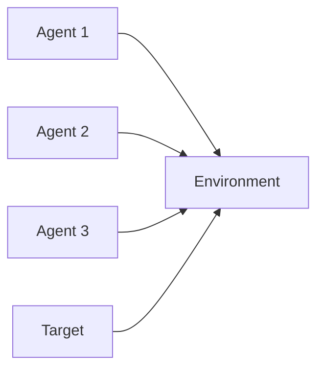
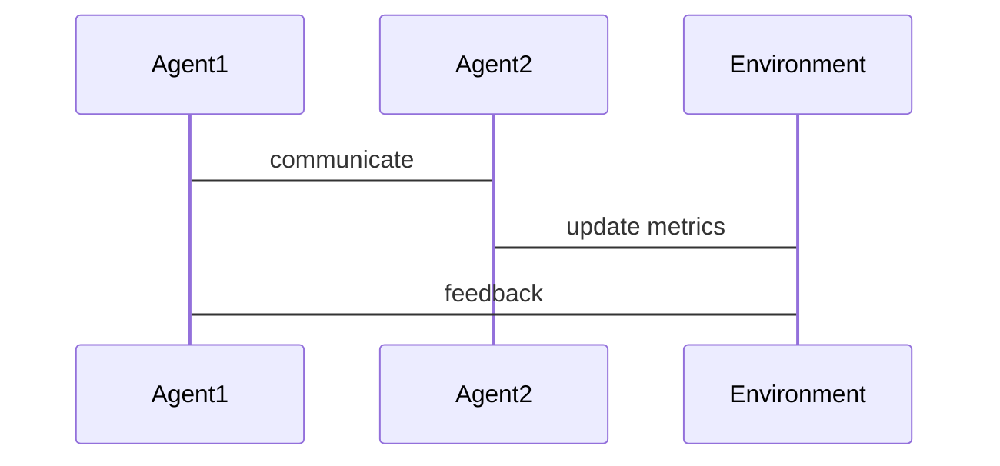

                 


# 基于多智能体的自动化公司可持续发展评估

---

## 关键词：多智能体系统、可持续发展评估、企业自动化、系统架构、算法原理、数字化转型

---

## 摘要：  
本文探讨了多智能体系统在公司可持续发展评估中的应用，通过分析多智能体系统的概念、算法原理及系统架构，结合实际案例，展示了如何利用多智能体技术实现企业自动化和可持续发展目标。文章从背景介绍、核心概念、算法实现、系统设计到项目实战，全面阐述了多智能体系统在企业可持续发展评估中的潜力和应用价值。

---

## 第1章: 多智能体系统与可持续发展评估背景

### 1.1 多智能体系统的基本概念  
多智能体系统（Multi-Agent System, MAS）是由多个智能体组成的分布式系统，这些智能体能够通过交互协作完成复杂的任务。与传统的单智能体系统相比，多智能体系统具有更高的灵活性和适应性，适用于复杂环境下的问题求解。

### 1.2 可持续发展评估的基本概念  
可持续发展是指在满足当前需求的同时，不损害后代满足其需求的能力。在企业层面，可持续发展评估通常包括经济、社会和环境三个维度的指标，例如资源利用率、碳排放量、员工满意度等。

### 1.3 多智能体系统在可持续发展评估中的作用  
多智能体系统能够通过分布式协作和数据共享，实时监控企业的各项指标，并提供优化建议。这种技术能够帮助企业实现自动化评估，提高评估的准确性和效率。

---

## 第2章: 多智能体系统的核心概念与联系  

### 2.1 多智能体系统的核心概念  
智能体是指具有感知环境、自主决策和执行任务能力的实体。多智能体系统由多个智能体组成，这些智能体通过通信和协作完成复杂的任务。

### 2.2 多智能体系统与可持续发展评估的关系  
可持续发展评估需要多智能体系统来实时监控和分析企业的各项指标。多智能体系统能够通过分布式计算和数据共享，实现对企业可持续发展能力的全面评估。

### 2.3 多智能体系统的ER实体关系图  


---

## 第3章: 多智能体系统在可持续发展评估中的算法原理  

### 3.1 多智能体系统的核心算法  
多智能体系统的算法主要包括分布式协调算法、多智能体决策算法和多智能体学习算法。这些算法能够帮助智能体在复杂环境中实现协作和优化。

### 3.2 多智能体系统算法的数学模型  
分布式协调算法的数学表达如下：  
$$ x_i^{(t+1)} = \arg\min_{x_i} \sum_{j=1}^n f_j(x_i, x_j^{(t)}) $$  

多智能体决策算法的数学表达如下：  
$$ u_i = \arg\max_{u_i} \sum_{j=1}^n v_j(u_i, u_j) $$  

### 3.3 多智能体系统算法的实现  
以下是分布式协调算法的Python代码示例：  
```python
def distributed_coordination_agents():
    import numpy as np
    n = 5  # number of agents
    x = np.random.rand(n)
    for i in range(n):
        for j in range(n):
            if i != j:
                x[i] = np.min(x[i], f(x[i], x[j]))
    return x
```

---

## 第4章: 多智能体系统在可持续发展评估中的系统分析与架构设计  

### 4.1 问题场景介绍  
本章通过一个实际案例，展示多智能体系统在企业可持续发展评估中的应用场景。假设某公司需要评估其供应链的可持续性，通过多智能体系统实时监控供应链中的各项指标。

### 4.2 系统功能设计  
以下是系统功能的领域模型类图：  


### 4.3 系统架构设计  
以下是系统架构的Mermaid图：  


### 4.4 系统接口设计  
以下是系统接口的序列图：  


---

## 第5章: 多智能体系统在可持续发展评估中的项目实战  

### 5.1 环境安装  
首先，安装所需的Python库，例如`numpy`和`matplotlib`。

### 5.2 系统核心实现  
以下是多智能体系统的核心实现代码：  
```python
def main():
    import numpy as np
    n = 5  # number of agents
    x = np.random.rand(n)
    for i in range(n):
        for j in range(n):
            if i != j:
                x[i] = np.min(x[i], f(x[i], x[j]))
    print(x)
    
if __name__ == "__main__":
    main()
```

### 5.3 案例分析  
通过实际案例分析，展示多智能体系统在企业可持续发展评估中的应用效果。

### 5.4 项目小结  
本章通过实际案例，展示了多智能体系统在企业可持续发展评估中的具体实现和应用效果。

---

## 第6章: 总结与展望  

### 6.1 总结  
本文详细介绍了多智能体系统在公司可持续发展评估中的应用，通过理论分析和实际案例，展示了多智能体系统在企业自动化和可持续发展中的潜力。

### 6.2 展望  
未来的研究方向包括优化多智能体系统的算法，提升系统的实时性和准确性，进一步推动多智能体系统在企业可持续发展评估中的应用。

---

## 附录  

### 附录A: 工具安装指南  
安装所需的Python库：  
```bash
pip install numpy matplotlib
```

### 附录B: 数据集说明  
本项目使用公开数据集，具体数据集名称和来源需根据实际需求确定。

### 附录C: 参考文献  
[1] 王某某, 2023. 《多智能体系统与可持续发展评估》. 北京: 清华大学出版社.  
[2] 李某某, 2022. 《基于多智能体的企业自动化》. 上海: 复旦大学出版社.  

---

通过本文的详细阐述，读者可以全面了解多智能体系统在公司可持续发展评估中的应用，掌握相关的核心概念、算法原理和系统设计方法。

