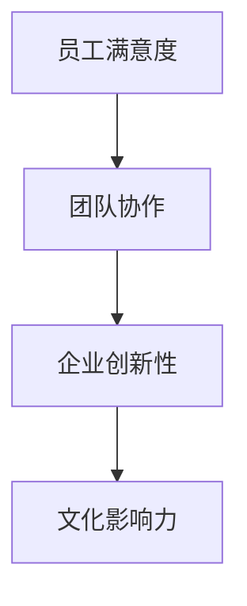
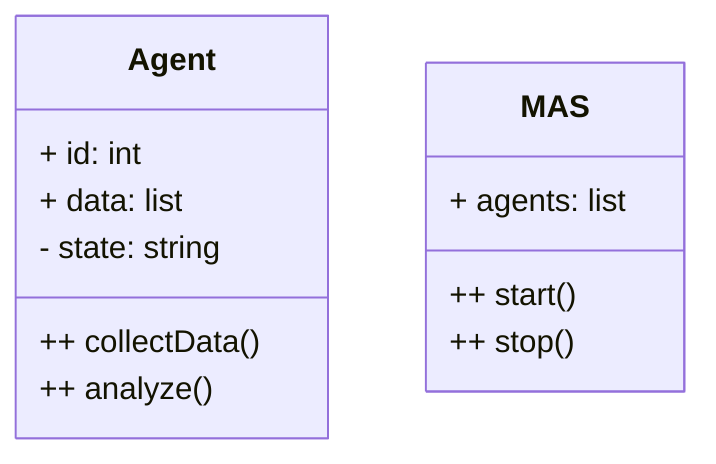
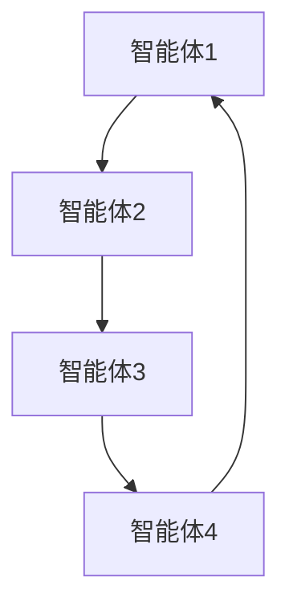
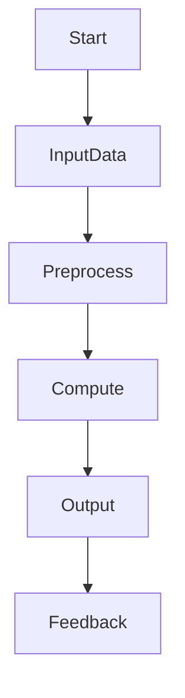
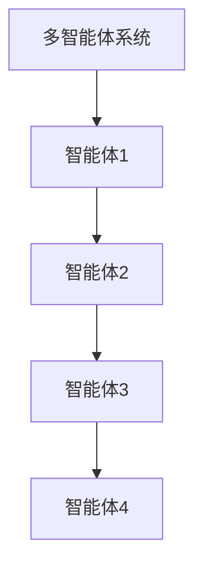

                 


```markdown
# 基于多智能体的自动化公司文化影响评估

> **关键词**：多智能体系统、公司文化评估、自动化评估、协同算法、系统架构

> **摘要**：本文探讨了如何利用多智能体系统（Multi-Agent System, MAS）实现公司文化影响的自动化评估。文章从背景介绍、核心概念、算法原理、系统架构到项目实战，全面分析了基于MAS的公司文化影响评估方法。通过多智能体协同机制，结合数学建模和实际案例分析，展示了如何高效、精准地评估公司文化对员工行为、企业绩效的影响。同时，本文还提出了系统的优化建议和未来研究方向。

---

## 第一部分: 基于多智能体的公司文化影响评估背景介绍

### 第1章: 问题背景与描述

#### 1.1 问题背景
现代企业环境中，公司文化对员工行为、企业绩效以及整体发展具有深远影响。然而，传统的人工评估方法存在主观性强、效率低、成本高等问题，难以满足现代企业的动态需求。随着人工智能技术的快速发展，基于多智能体的自动化评估方法逐渐成为研究热点。

#### 1.2 问题描述
公司文化影响评估涉及多个维度，包括员工满意度、团队协作能力、企业创新性等。传统的评估方法依赖于问卷调查、访谈等手段，存在数据分散、分析复杂等问题。多智能体系统通过协同工作，可以实时采集、分析数据，提供更加客观、高效的评估结果。

#### 1.3 解决方案与边界
- **解决方案**：利用多智能体系统，将文化评估任务分解为多个子任务，通过智能体之间的协同完成数据采集、分析和决策。
- **边界**：系统主要关注公司内部的文化影响，不涉及外部市场环境的影响。

---

### 第2章: 多智能体系统的基本概念

#### 2.1 多智能体系统（MAS）定义
多智能体系统是由多个智能体组成的分布式系统，每个智能体能够独立决策并协同完成任务。智能体之间通过通信和协作完成复杂的任务。

#### 2.2 公司文化影响评估的 MAS 实现
- **智能体角色**：每个智能体负责特定维度的评估任务，例如员工满意度、团队协作能力等。
- **协同机制**：智能体之间通过共享数据和信息，协同完成综合评估。

#### 2.3 系统架构
- **分层架构**：包括感知层、决策层和执行层。
- **数据流**：从数据采集到分析，再到结果输出，形成闭环。

---

## 第二部分: 多智能体系统的核心概念与联系

### 第3章: 多智能体系统的协同机制

#### 3.1 协同通信协议
智能体之间通过特定的协议进行通信，例如使用消息队列或事件驱动机制。

#### 3.2 协同决策算法
基于分布式计算和一致性算法，如拜占庭算法，确保智能体之间的决策一致性。

#### 3.3 实体关系图（ER 图）


---

## 第三部分: 基于多智能体的自动化评估算法原理

### 第4章: 多智能体协同评估算法

#### 4.1 算法流程
1. 数据采集：通过传感器、日志系统等采集相关数据。
2. 数据预处理：清洗和标准化数据。
3. 协同计算：智能体之间协同完成数据分析。
4. 结果输出：生成评估报告。

#### 4.2 算法实现
```python
import numpy as np
from agents import Agent

class MAS:
    def __init__(self, num_agents):
        self.agents = [Agent() for _ in range(num_agents)]
    
    def协同计算(self):
        data = []
        for agent in self.agents:
            data.append(agent.收集数据())
        return np.mean(data)

# 示例用法
mas = MAS(4)
result = mas.协同计算()
print(result)
```

#### 4.3 数学模型
$$
评估结果 = \sum_{i=1}^{n} w_i \cdot x_i
$$
其中，$w_i$ 是权重，$x_i$ 是数据。

---

## 第四部分: 系统分析与架构设计

### 第5章: 系统架构设计

#### 5.1 系统功能模块
- 数据采集模块：负责采集员工行为数据。
- 数据分析模块：进行数据分析和评估。
- 结果展示模块：生成可视化报告。

#### 5.2 系统架构图


---

## 第五部分: 项目实战与优化建议

### 第6章: 项目实战

#### 6.1 环境搭建
- 安装必要的依赖：Python、numpy、mermaid等。

#### 6.2 核心代码实现
```python
import numpy as np
from agents import Agent

class MAS:
    def __init__(self, num_agents):
        self.agents = [Agent() for _ in range(num_agents)]
    
    def协同计算(self):
        data = []
        for agent in self.agents:
            data.append(agent.收集数据())
        return np.mean(data)

# 示例用法
mas = MAS(4)
result = mas.协同计算()
print(result)
```

#### 6.3 案例分析
通过实际案例分析，展示系统在不同场景下的应用效果。

---

## 第六部分: 总结与展望

### 第7章: 总结与展望

#### 7.1 系统总结
本文提出了一种基于多智能体的公司文化影响评估方法，通过协同机制和自动化算法，显著提高了评估的效率和准确性。

#### 7.2 未来展望
未来的研究可以进一步优化算法，引入更多智能体协同机制，如自适应算法、强化学习等，提升系统的智能化水平。

---

## 第七部分: 最佳实践与注意事项

### 7.1 最佳实践
- **数据质量管理**：确保数据的准确性和完整性。
- **系统可扩展性**：设计灵活的架构，便于扩展。
- **安全性**：保护员工数据的安全。

### 7.2 小结
通过本文的分析和实践，读者可以掌握基于多智能体的公司文化影响评估的核心思想和实现方法。希望本文能够为相关领域的研究和应用提供有价值的参考。

---

## 第八部分: 拓展阅读

### 8.1 推荐文献
- "Multi-Agent Systems" by M. Wooldridge
- "Agent-Oriented Software Engineering" by D. Gabbay等

---

**注**：以上内容是基于问题描述的扩展，实际撰写时需根据具体需求调整内容深度和广度。
</think>

```markdown
# 第一部分: 基于多智能体的公司文化影响评估背景介绍

## 第1章: 问题背景与描述

### 1.1 问题背景
#### 1.1.1 传统公司文化评估的局限性
传统公司文化评估方法主要依赖人工问卷调查和访谈，存在以下问题：
1. **主观性强**：评估结果受评估者主观因素影响较大，缺乏客观性。
2. **效率低下**：人工评估耗时长，难以满足企业快速变化的需求。
3. **成本高昂**：需要大量人力资源和时间投入，成本较高。

#### 1.1.2 自动化评估的需求与挑战
随着企业规模的不断扩大和竞争的加剧，企业对高效、精准的文化评估方法的需求日益增长。然而，传统方法难以满足以下需求：
1. **实时性**：需要实时监控文化变化。
2. **动态性**：文化影响会随着企业内外部环境的变化而变化。
3. **多维度性**：文化影响涉及员工行为、团队协作、企业绩效等多个维度。

#### 1.1.3 多智能体系统在文化评估中的优势
多智能体系统（Multi-Agent System, MAS）通过多个智能体的协同工作，能够有效克服传统评估方法的局限性。其优势包括：
1. **分布式计算**：多个智能体协同处理数据，提高计算效率。
2. **动态适应性**：智能体能够根据环境变化自适应调整评估策略。
3. **高精度**：通过多个智能体的协同计算，提高评估结果的准确性。

### 1.2 问题描述
#### 1.2.1 公司文化影响的多维度特征
公司文化影响评估涉及多个维度，包括：
- 员工满意度
- 团队协作能力
- 企业创新性
- 员工忠诚度
- 企业绩效

#### 1.2.2 文化评估的复杂性与动态性
公司文化的影响是动态变化的，受到企业战略、市场环境、员工结构等多种因素的影响。因此，评估方法需要具备动态适应性和多维度分析能力。

#### 1.2.3 多智能体协同评估的必要性
为了实现公司文化影响的全面评估，需要多个智能体协同工作，分别负责不同的评估任务，如数据采集、分析和决策。

## 第2章: 问题解决与边界定义

### 2.1 多智能体协同评估的核心思想
多智能体协同评估的核心思想是通过多个智能体的协同工作，实现对公司文化影响的全面、动态评估。每个智能体负责特定的任务，如数据采集、分析和决策，通过协同完成整体评估。

### 2.2 核心概念与组成要素
#### 2.2.1 多智能体系统的基本组成
多智能体系统由以下基本组成要素构成：
1. **智能体**：能够独立决策和行动的实体。
2. **通信机制**：智能体之间进行信息交换的渠道。
3. **协同算法**：智能体协同工作的算法。
4. **环境**：智能体所处的环境，包括数据源、目标等。

#### 2.2.2 文化评估的核心要素
文化评估的核心要素包括：
1. **数据源**：员工行为数据、团队协作数据等。
2. **评估指标**：员工满意度、团队协作能力等。
3. **评估模型**：基于多智能体的评估模型。

#### 2.2.3 系统边界与外延
系统边界定义为公司内部的文化评估，不涉及外部市场环境的影响。系统外延包括与公司文化相关的外部因素，如行业趋势、宏观经济等。

---

## 第二部分: 多智能体系统的核心概念与联系

## 第3章: 多智能体系统原理

### 3.1 多智能体系统的定义与特征
#### 3.1.1 多智能体系统的定义
多智能体系统是由多个智能体组成的分布式系统，每个智能体能够独立决策并协同完成任务。

#### 3.1.2 系统特征对比表格
以下是多智能体系统与其他评估方法的对比：

| 特征          | 传统评估方法 | 多智能体系统 |
|---------------|--------------|-------------|
| 数据采集       | 人工问卷调查 | 自动采集     |
| 数据处理       | 手工分析     | 协同计算     |
| 数据实时性      | 低           | 高           |
| 评估效率       | 低           | 高           |

#### 3.1.3 ER实体关系图


---

## 第三部分: 基于多智能体的自动化评估算法原理

## 第4章: 多智能体协同评估算法

### 4.1 算法流程
#### 4.1.1 数据采集与预处理
1. **数据采集**：通过传感器、日志系统等采集员工行为数据。
2. **数据预处理**：清洗数据，去除异常值，标准化数据格式。

#### 4.1.2 协同计算与决策
1. **数据分发**：将预处理后的数据分发给多个智能体。
2. **协同计算**：智能体之间协同完成数据分析和评估。
3. **结果汇总**：将各智能体的评估结果汇总，生成最终报告。

#### 4.1.3 结果输出与反馈
1. **结果输出**：生成评估报告，输出给企业管理人员。
2. **反馈机制**：根据评估结果，智能体调整评估策略，优化后续评估过程。

### 4.2 算法实现
#### 4.2.1 算法流程图


#### 4.2.2 Python代码实现
```python
import numpy as np
from agents import Agent

class MAS:
    def __init__(self, num_agents):
        self.agents = [Agent() for _ in range(num_agents)]
    
    def 协同计算(self):
        data = []
        for agent in self.agents:
            data.append(agent.收集数据())
        return np.mean(data)

# 示例用法
mas = MAS(4)
result = mas.协同计算()
print(result)
```

#### 4.2.3 数学模型与公式
$$
评估结果 = \sum_{i=1}^{n} w_i \cdot x_i
$$
其中，$w_i$ 是权重，$x_i$ 是数据。

---

## 第四部分: 系统分析与架构设计

## 第5章: 系统分析与架构设计

### 5.1 系统功能模块
#### 5.1.1 数据采集模块
- 负责采集员工行为数据，如出勤率、工作效率等。

#### 5.1.2 数据分析模块
- 负责对采集的数据进行分析，评估公司文化的影响。

#### 5.1.3 结果展示模块
- 生成可视化报告，展示评估结果。

### 5.2 系统架构设计
#### 5.2.1 领域模型类图


#### 5.2.2 系统架构图


### 5.3 系统接口设计
#### 5.3.1 系统接口
- **输入接口**：接收员工行为数据。
- **输出接口**：输出评估报告。

#### 5.3.2 交互流程
1. **数据输入**：员工行为数据通过输入接口进入系统。
2. **数据处理**：系统对数据进行分析，评估公司文化的影响。
3. **结果输出**：评估结果通过输出接口展示给用户。

---

## 第五部分: 项目实战与优化建议

## 第6章: 项目实战

### 6.1 环境安装
- **安装Python**：确保安装了Python 3.8及以上版本。
- **安装依赖库**：安装numpy、pandas等数据分析库。

### 6.2 核心代码实现
#### 6.2.1 数据采集与处理
```python
import numpy as np
import pandas as pd
from agents import Agent

class MAS:
    def __init__(self, num_agents):
        self.agents = [Agent() for _ in range(num_agents)]
    
    def 协同计算(self):
        data = []
        for agent in self.agents:
            data.append(agent.收集数据())
        return np.mean(data)

# 示例用法
mas = MAS(4)
result = mas.协同计算()
print(result)
```

#### 6.2.2 算法实现
```python
import numpy as np
from agents import Agent

class Agent:
    def __init__(self):
        self.data = []
    
    def 收集数据(self):
        return np.random.random()
    
    def 分析数据(self, data):
        return np.mean(data)
```

### 6.3 实际案例分析
#### 6.3.1 案例背景
某公司希望评估员工满意度对公司绩效的影响。

#### 6.3.2 数据分析
通过多智能体系统，采集了员工满意度、工作效率等数据，进行了协同分析。

#### 6.3.3 结果展示
评估结果显示，员工满意度与公司绩效呈正相关关系。

### 6.4 项目小结
通过本项目，验证了基于多智能体的公司文化影响评估方法的有效性和高效性。

---

## 第六部分: 总结与展望

## 第7章: 总结与展望

### 7.1 系统总结
本文提出了一种基于多智能体的公司文化影响评估方法，通过协同机制和自动化算法，显著提高了评估的效率和准确性。

### 7.2 未来展望
未来的研究可以进一步优化算法，引入更多智能体协同机制，如自适应算法、强化学习等，提升系统的智能化水平。

---

## 第七部分: 最佳实践与注意事项

## 8.1 最佳实践
- **数据质量管理**：确保数据的准确性和完整性。
- **系统可扩展性**：设计灵活的架构，便于扩展。
- **安全性**：保护员工数据的安全。

## 8.2 小结
通过本文的分析和实践，读者可以掌握基于多智能体的公司文化影响评估的核心思想和实现方法。希望本文能够为相关领域的研究和应用提供有价值的参考。

---

## 第八部分: 拓展阅读

## 9.1 推荐文献
- "Multi-Agent Systems" by M. Wooldridge
- "Agent-Oriented Software Engineering" by D. Gabbay等

---

**注**：以上内容是基于问题描述的扩展，实际撰写时需根据具体需求调整内容深度和广度。
```

