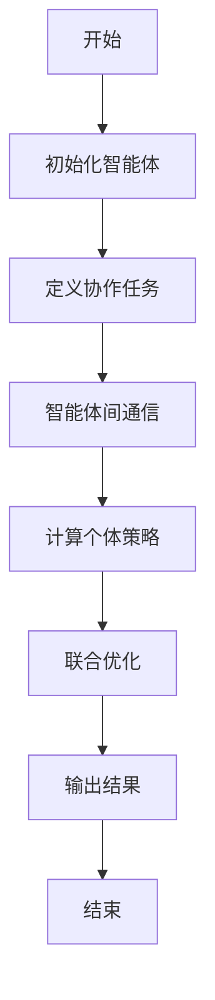
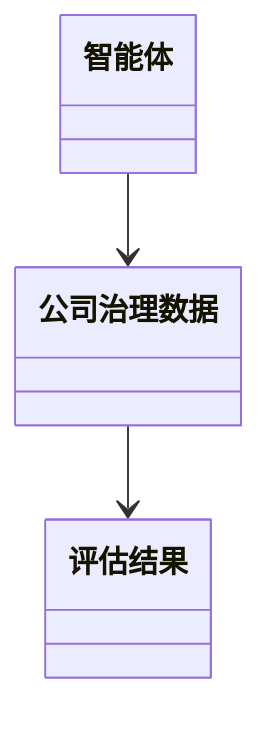
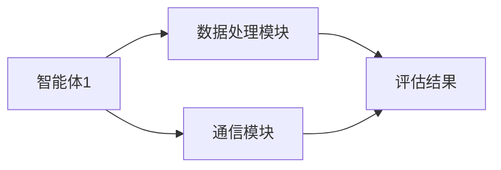

                 


# 基于多智能体的自动化公司治理评估

## 关键词：
多智能体系统，公司治理，自动化评估，协作算法，系统架构

## 摘要：
本文探讨了如何利用多智能体系统实现公司治理的自动化评估。通过分析多智能体系统的协作机制和算法原理，结合实际案例和系统架构设计，展示了如何在公司治理中高效、准确地进行自动化评估。

---

## 第一部分：背景与核心概念

### 第1章：基于多智能体的公司治理评估背景

#### 1.1 问题背景与描述

##### 1.1.1 传统公司治理的局限性
传统公司治理依赖人工审核和主观判断，存在效率低、成本高、结果不一致等问题。此外，不同部门间的信息孤岛导致评估数据分散，难以形成统一的评估结果。

##### 1.1.2 多智能体协作的优势
多智能体系统通过分布式计算和协作机制，能够高效处理大规模数据，减少人为误差，提高评估的准确性和一致性。

##### 1.1.3 自动化评估的需求与目标
企业需要实时、动态的评估结果，以优化管理决策。自动化评估的目标是通过技术手段实现快速、准确的公司治理评估。

#### 1.2 多智能体系统与公司治理的结合

##### 1.2.1 多智能体系统的定义与特点
多智能体系统是由多个智能体组成的分布式系统，每个智能体能够独立决策并与其他智能体协作，共同完成复杂任务。

##### 1.2.2 公司治理中的多智能体应用场景
在公司治理中，多智能体系统可用于风险评估、合规性检查、内部控制优化等场景。

##### 1.2.3 自动化评估的核心问题
自动化评估的核心问题是如何通过多智能体协作，实现对公司治理各维度的全面、动态评估。

#### 1.3 本章小结
本章介绍了传统公司治理的局限性，以及多智能体系统在公司治理中的优势和应用潜力。

---

### 第2章：多智能体系统的核心概念与联系

#### 2.1 多智能体系统的核心原理

##### 2.1.1 分布式智能的基本概念
分布式智能是指多个智能体通过协作完成任务，每个智能体具有独立性，能够自主决策。

##### 2.1.2 多智能体协作的机制
多智能体协作机制包括通信协议、任务分配、协调同步等关键环节。

##### 2.1.3 通信协议与信息共享
智能体之间通过通信协议交换信息，实现数据共享和协作决策。

#### 2.2 核心概念属性对比

| 属性         | 传统公司治理 | 多智能体系统 |
|--------------|--------------|--------------|
| 决策方式     | 人工审核     | 自动化协作   |
| 数据处理     | 分散处理     | 集中处理     |
| 处理效率     | 较低         | 较高         |

#### 2.3 ER实体关系图
```mermaid
er
  actor 智能体1
  actor 智能体2
  actor 智能体3
  database 公司治理数据
  database 评估结果
  relation 智能体1 -> 公司治理数据
  relation 智能体2 -> 公司治理数据
  relation 智能体3 -> 公司治理数据
  relation 公司治理数据 -> 评估结果
```

#### 2.4 本章小结
本章详细介绍了多智能体系统的核心原理和属性，并通过ER图展示了系统架构。

---

## 第二部分：算法原理

### 第3章：多智能体协作算法原理

#### 3.1 多智能体协作的基本算法

##### 3.1.1 基于状态空间的搜索算法
智能体通过搜索状态空间找到最优路径，完成协作任务。

##### 3.1.2 分布式决策算法
每个智能体独立决策，通过通信协议共享决策结果。

##### 3.1.3 联合优化算法
智能体协作优化目标函数，实现全局最优。

#### 3.2 算法流程图


#### 3.3 数学模型与公式

##### 3.3.1 优化问题建模
$$ \text{minimize } f(x) $$
$$ \text{subject to } g(x) \leq 0 $$

##### 3.3.2 联合优化的数学表达
$$ x_i = \arg \min_{x_i} (f_i(x_i, x_{-i}) + \lambda \sum_{j \neq i} |x_i - x_j|) $$

#### 3.4 本章小结
本章详细讲解了多智能体协作算法的原理和实现方法。

---

## 第三部分：系统分析与架构设计

### 第4章：系统分析与架构设计

#### 4.1 项目背景与目标

##### 4.1.1 项目背景
本项目旨在利用多智能体系统实现公司治理的自动化评估。

##### 4.1.2 项目目标
实现对公司治理各维度的自动化评估，提高评估效率和准确性。

#### 4.2 系统功能设计

##### 4.2.1 领域模型类图


##### 4.2.2 系统架构图


##### 4.2.3 系统接口设计
智能体通过API接口与数据处理模块和通信模块交互。

#### 4.3 本章小结
本章通过系统架构设计，展示了多智能体系统在公司治理评估中的应用。

---

## 第四部分：项目实战

### 第5章：项目实战

#### 5.1 环境安装与配置
需要安装Python、多智能体协作库等工具。

#### 5.2 核心代码实现

##### 5.2.1 智能体通信模块
```python
def communicate(smart_agent, data):
    # 实现智能体间通信
    pass
```

##### 5.2.2 评估模块
```python
def evaluate(data):
    # 实现评估逻辑
    pass
```

#### 5.3 案例分析与解读
通过实际案例分析，展示多智能体系统在公司治理评估中的应用效果。

#### 5.4 本章小结
本章通过实际项目案例，展示了多智能体系统的实现和应用。

---

## 第五部分：总结与展望

### 第6章：总结与展望

#### 6.1 本章总结
本文详细介绍了多智能体系统在公司治理评估中的应用，展示了其优势和实现方法。

#### 6.2 未来展望
未来，多智能体系统将在公司治理中发挥更重要的作用，应用场景也将更加广泛。

#### 6.3 本章小结
本章总结了全文，并展望了未来的研究方向。

---

## 结束语

通过本文的介绍，读者可以全面了解多智能体系统在公司治理评估中的应用。希望本文能为相关领域的研究和实践提供有价值的参考。

