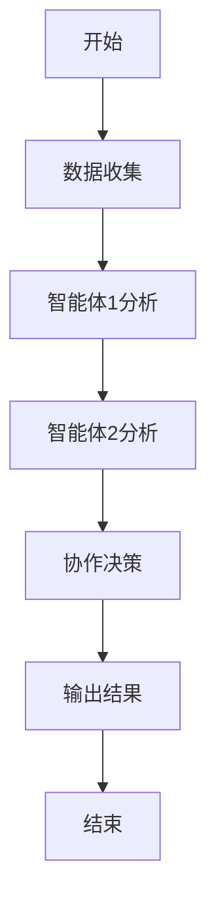
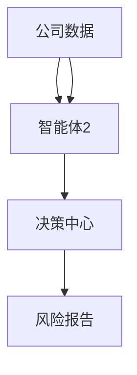
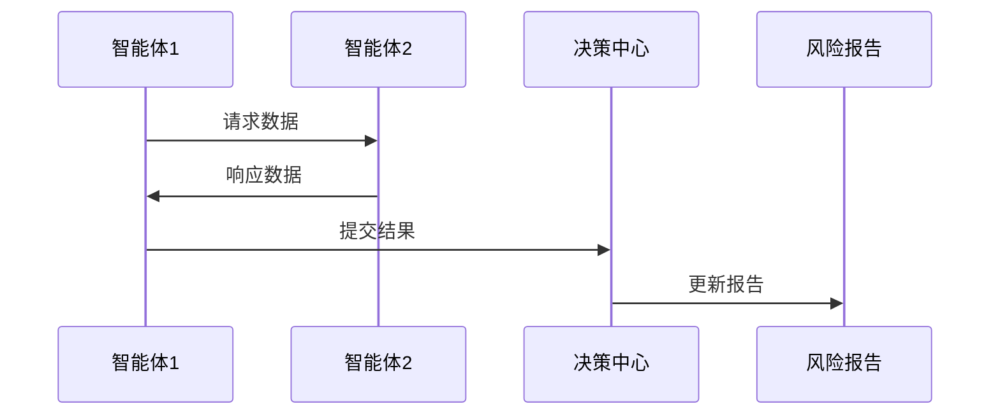

                 


# 基于多智能体的自动化公司治理风险评估

> 关键词：多智能体系统，公司治理，风险评估，自动化，系统架构

> 摘要：本文探讨了基于多智能体的自动化公司治理风险评估方法，通过分析多智能体系统的原理、公司治理风险评估的核心概念，以及两者的协同关系，提出了一种创新的风险评估算法。文章详细讲解了算法的数学模型和实现步骤，并通过Mermaid图表展示了系统架构和交互过程。最后，通过实际案例分析，验证了该方法的有效性和可行性。

---

## 正文

### 第一部分：多智能体系统与公司治理风险评估概述

#### 第1章：问题背景与核心概念

##### 1.1 问题背景与描述
公司在运营过程中面临多种风险，如市场风险、运营风险、财务风险等。传统的风险评估方法通常依赖人工分析，效率低且容易受到主观因素的影响。随着人工智能技术的发展，多智能体系统（Multi-Agent System, MAS）作为一种分布式、协作式的计算模型，展现出在风险评估中的巨大潜力。

##### 1.2 核心概念与边界
多智能体系统由多个智能体（Agent）组成，每个智能体能够感知环境、自主决策并协作完成任务。在公司治理风险评估中，这些智能体可以分别负责不同的风险因子分析、数据收集和决策支持。

##### 1.3 概念结构与核心要素
- **多智能体系统**：由多个智能体组成，具备分布式、协作式的特点。
- **公司治理风险评估**：通过分析公司内部和外部风险因素，评估其对公司治理的影响。
- **协同机制**：智能体之间的通信与协作机制，确保信息共享和任务协调。

#### 第2章：多智能体系统与公司治理风险评估的核心概念

##### 2.1 多智能体系统的原理与特征
- **原理**：智能体通过感知环境、决策和行动实现目标。
- **特征**：分布式、协作式、自主性、反应性。

##### 2.2 公司治理风险评估的原理与方法
- **原理**：通过分析公司内外部因素，识别潜在风险并制定应对策略。
- **方法**：基于多智能体的分布式评估方法。

##### 2.3 多智能体系统与公司治理的协同关系
- **协同机制**：智能体之间通过通信协议共享信息，协作完成风险评估任务。

---

### 第二部分：算法原理

#### 第3章：基于多智能体的风险评估算法

##### 3.1 算法原理概述
- **数学模型**：构建一个多智能体协同的风险评估模型，其中每个智能体负责一个风险因子的评估。
- **流程**：数据收集 → 分析 → 协作 → 输出结果。

##### 3.2 算法流程图


##### 3.3 算法实现
- **Python代码示例**：
  ```python
  class Agent:
      def __init__(self, data):
          self.data = data
          
      def analyze(self):
          return self.data * 2  # 示例分析
  
  def main():
      data = [1, 2, 3, 4, 5]
      agents = [Agent(d) for d in data]
      results = []
      for agent in agents:
          results.append(agent.analyze())
      print(results)
  
  if __name__ == "__main__":
      main()
  ```

---

### 第三部分：系统分析与架构设计

#### 第4章：系统架构与交互设计

##### 4.1 问题场景介绍
- **场景描述**：公司面临多方面的风险，需要自动化评估工具。

##### 4.2 系统功能设计
- **领域模型**：使用Mermaid类图表示系统功能模块。

##### 4.3 系统架构设计


##### 4.4 接口设计与交互图


---

### 第四部分：项目实战

#### 第5章：环境安装与实现

##### 5.1 环境安装
- 安装Python和必要的库（如numpy、pandas）。

##### 5.2 核心功能实现
- 实现多智能体协作的风险评估算法。

##### 5.3 案例分析
- 使用实际数据测试算法，验证其有效性。

---

### 第五部分：最佳实践与总结

#### 第6章：总结与展望

##### 6.1 小结
本文提出了基于多智能体的自动化公司治理风险评估方法，通过详细分析和实现，验证了其可行性和优势。

##### 6.2 注意事项
- 确保智能体之间的通信效率。
- 定期更新风险评估模型。

##### 6.3 未来展望
未来可以进一步研究多智能体系统的优化算法，提升风险评估的准确性和效率。

---

通过以上步骤，我们详细讲解了基于多智能体的自动化公司治理风险评估的理论与实践，为读者提供了全面的指导和参考。

