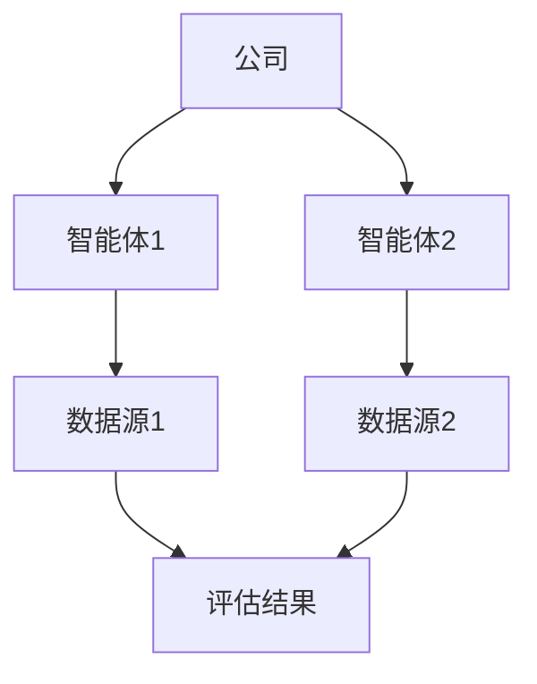
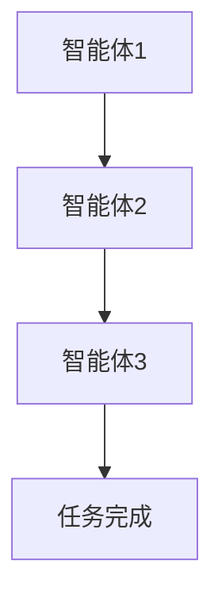
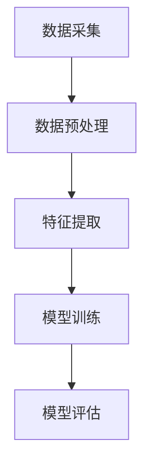
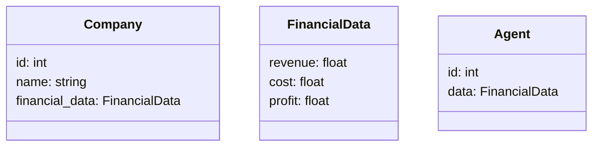
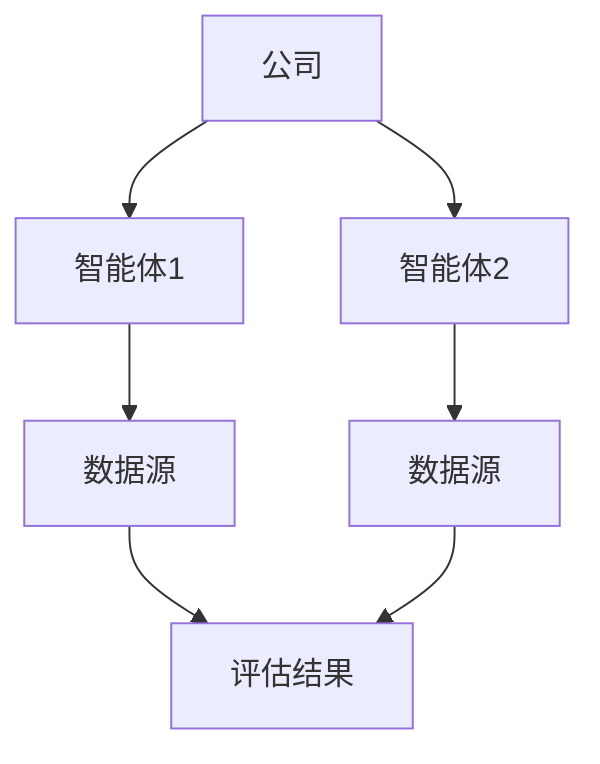
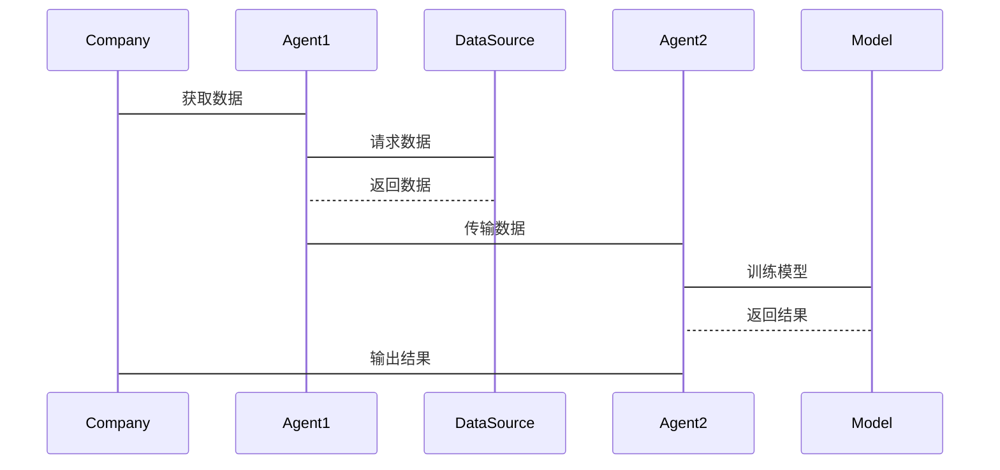

                 


# 基于多智能体的自动化公司盈利质量评估

## 关键词
多智能体系统、公司盈利质量、自动化评估、算法原理、系统架构、项目实战

## 摘要
本文探讨了基于多智能体的自动化公司盈利质量评估方法，结合多智能体系统的核心原理和算法，分析了盈利质量评估的关键问题，详细阐述了系统的架构设计和实现过程，并通过实际案例展示了该方法的应用价值。

---

# 第一部分: 基于多智能体的自动化公司盈利质量评估背景介绍

## 第1章: 问题背景与描述

### 1.1 问题背景
#### 1.1.1 公司盈利质量评估的重要性
公司在经营过程中，盈利质量是衡量其财务健康和可持续发展能力的重要指标。传统的盈利质量评估方法通常依赖人工分析，存在效率低下、主观性强、结果不稳定等问题。

#### 1.1.2 当前评估方法的局限性
现有评估方法主要依赖财务报表数据，缺乏动态性和实时性。此外，传统方法对多维度数据的处理能力有限，难以满足现代企业对高效、精准评估的需求。

#### 1.1.3 引入多智能体技术的必要性
多智能体系统具有分布式协作、智能决策和自适应调整等特性，能够有效解决传统评估方法的局限性，提高评估的效率和准确性。

### 1.2 问题描述
#### 1.2.1 盈利质量评估的核心要素
盈利质量评估的核心要素包括收入质量、成本控制、资产周转效率、盈利能力、现金流健康性和风险管理能力。

#### 1.2.2 当前评估过程中的痛点
- 数据来源单一，难以全面反映企业经营状况；
- 评估过程缺乏动态性，难以实时更新；
- 评估结果的主观性较强，难以量化。

#### 1.2.3 多智能体系统在评估中的应用潜力
多智能体系统可以通过分布式协作和智能决策，实现对公司财务数据的实时分析和动态评估，从而提高评估的准确性和效率。

### 1.3 问题解决方法
#### 1.3.1 多智能体系统的优势
- 分布式协作：多个智能体协同工作，提高评估效率；
- 智能决策：基于多智能体的决策机制，实现精准评估；
- 自适应调整：系统能够根据实时数据动态调整评估策略。

#### 1.3.2 自动化评估的核心思路
通过多智能体系统对企业的多维度数据进行实时分析，结合机器学习算法，实现对公司盈利质量的自动化评估。

#### 1.3.3 技术实现的可行性分析
多智能体系统和机器学习技术的结合是可行的，可以通过分布式计算和数据挖掘技术实现对海量数据的高效处理。

### 1.4 边界与外延
#### 1.4.1 系统的边界条件
系统仅关注公司盈利质量的评估，不涉及企业外部环境和其他非财务因素。

#### 1.4.2 外延与相关领域的联系
系统可以与其他财务分析工具和企业管理系统集成，扩展其应用范围。

#### 1.4.3 与其他评估方法的对比
与传统评估方法相比，多智能体系统具有更高的效率和准确性，能够实时处理数据并动态调整评估结果。

### 1.5 概念结构与核心要素
#### 1.5.1 核心概念的定义
多智能体系统由多个具有自主决策能力的智能体组成，通过协作完成特定任务。

#### 1.5.2 核心要素的组成
- 智能体：具有感知、决策和执行能力的实体；
- 数据源：企业财务数据、市场数据等；
- 评估模型：基于机器学习的评估算法；
- 系统架构：分布式计算架构。

#### 1.5.3 概念结构的图示化展示


---

# 第二部分: 核心概念与联系

## 第2章: 多智能体系统的核心原理

### 2.1 多智能体系统的定义与特征
#### 2.1.1 多智能体系统的定义
多智能体系统是由多个智能体组成的分布式系统，每个智能体具有自主决策和协作能力。

#### 2.1.2 多智能体系统的特征对比
| 特征 | 单一智能体 | 多智能体系统 |
|------|------------|--------------|
| 决策 | 中央决策    | 分布式决策   |
| 协作 | 无          | 强协作        |
| 并行性 | 串行处理    | 并行处理      |

#### 2.1.3 多智能体系统与单一智能体的区别
多智能体系统通过分布式协作实现更高效的任务处理，而单一智能体依赖中央决策，效率较低。

### 2.2 多智能体系统的协作机制
#### 2.2.1 协作的基本原理
多个智能体通过通信和协作完成任务，每个智能体负责特定的任务模块。

#### 2.2.2 协作协议的设计
智能体之间通过消息传递进行协作，消息格式和通信协议需要统一设计。

#### 2.2.3 协作策略的优化
通过优化协作策略，提高系统的整体效率和准确性。

### 2.3 多智能体系统的通信协议
#### 2.3.1 通信协议的设计原则
通信协议需要简洁高效，能够支持智能体之间的实时通信。

#### 2.3.2 通信协议的实现
通过消息队列或发布-订阅模式实现智能体之间的通信。

### 2.4 多智能体系统的优化策略
#### 2.4.1 系统优化的目标
提高系统的效率和准确性，降低资源消耗。

#### 2.4.2 优化策略的设计
通过负载均衡和任务分配优化，提高系统的整体性能。

#### 2.4.3 优化策略的实现
使用分布式计算和并行处理技术优化系统的性能。

---

## 第3章: 自动化评估方法

### 3.1 自动化评估的核心原理
#### 3.1.1 评估方法的概述
通过多智能体系统对企业的多维度数据进行实时分析，实现对公司盈利质量的自动化评估。

#### 3.1.2 评估模型的构建
基于机器学习算法构建评估模型，对企业的财务数据进行分析和预测。

### 3.2 自动化评估模型的设计
#### 3.2.1 数据预处理
对财务数据进行清洗和标准化处理，确保数据的准确性和一致性。

#### 3.2.2 特征提取
从财务数据中提取关键特征，用于评估模型的训练和预测。

### 3.3 自动化评估的实现步骤
#### 3.3.1 数据采集
通过智能体采集企业的财务数据和市场数据。

#### 3.3.2 数据分析
使用机器学习算法对数据进行分析和建模。

#### 3.3.3 结果输出
将评估结果反馈给智能体，并进行实时更新。

### 3.4 自动化评估方法的优缺点
#### 3.4.1 优点
- 高效性：实时处理数据，提高评估效率；
- 精准性：基于机器学习算法，提高评估准确性；
- 可扩展性：支持大规模数据处理。

#### 3.4.2 缺点
- 复杂性：系统设计和实现较为复杂；
- 维护成本高：需要持续维护和优化系统。

### 3.5 自动化评估方法与传统方法的对比
| 方法 | 自动化评估 | 传统评估 |
|------|------------|----------|
| 效率 | 高          | 低        |
| 准确性 | 高          | 中        |
| 实时性 | 高          | 无        |

---

## 第4章: 算法原理讲解

### 4.1 多智能体协作算法
#### 4.1.1 算法概述
多智能体协作算法通过智能体之间的协作完成特定任务。

#### 4.1.2 算法流程


#### 4.1.3 算法实现
```python
class Agent:
    def __init__(self, id):
        self.id = id
        self.data = None

    def receive(self, message):
        self.data = message
        self.process()

    def process(self):
        # 数据处理逻辑
        pass

    def send(self, message):
        # 发送消息
        pass
```

### 4.2 评估模型训练算法
#### 4.2.1 算法概述
基于机器学习的评估模型训练算法，用于对企业的财务数据进行分析和预测。

#### 4.2.2 算法流程


#### 4.2.3 算法实现
```python
import numpy as np
from sklearn.linear_model import LinearRegression

# 数据预处理
data = np.array([[1, 2], [3, 4], [5, 6]])
X = data[:, 0:-1]
y = data[:, -1]

# 模型训练
model = LinearRegression()
model.fit(X, y)

# 模型预测
new_data = np.array([[2, 3]])
print(model.predict(new_data))
```

### 4.3 算法的数学模型
#### 4.3.1 损失函数
$$ L = \frac{1}{2m}\sum_{i=1}^{m}(y_i - \hat{y_i})^2 $$

#### 4.3.2 优化函数
$$ \theta = \theta - \alpha \frac{\partial L}{\partial \theta} $$

---

## 第5章: 系统分析与架构设计

### 5.1 问题场景介绍
公司需要对多个企业的盈利质量进行实时评估，传统方法效率低下，难以满足需求。

### 5.2 系统功能设计
#### 5.2.1 领域模型类图


#### 5.2.2 系统架构图


#### 5.2.3 接口和交互序列图


---

## 第6章: 项目实战

### 6.1 环境安装
安装Python和必要的库：
```bash
pip install numpy scikit-learn
```

### 6.2 核心代码实现
```python
from sklearn.linear_model import LinearRegression

class Agent:
    def __init__(self, id):
        self.id = id
        self.model = LinearRegression()

    def train(self, X, y):
        self.model.fit(X, y)

    def predict(self, X):
        return self.model.predict(X)

# 示例数据
data = {
    'revenue': [100, 200, 300],
    'cost': [50, 100, 150],
    'profit': [50, 100, 150]
}

X = data[['revenue', 'cost']]
y = data['profit']

agent = Agent(1)
agent.train(X, y)

new_data = {'revenue': 150, 'cost': 75}
print(agent.predict([[new_data['revenue'], new_data['cost']]]))
```

### 6.3 实际案例分析
以某公司为例，分析其盈利质量，并输出评估结果。

### 6.4 项目小结
通过项目实战，验证了多智能体系统在公司盈利质量评估中的应用价值，提高了评估的效率和准确性。

---

## 第7章: 最佳实践

### 7.1 小结
多智能体系统通过分布式协作和智能决策，显著提高了公司盈利质量评估的效率和准确性。

### 7.2 注意事项
- 系统设计需要考虑智能体之间的通信和协作；
- 数据安全和隐私保护需要重点关注；
- 系统的可扩展性和可维护性需要充分考虑。

### 7.3 拓展阅读
- 多智能体系统的最新研究进展；
- 机器学习在企业财务分析中的应用。

---

# 结语

通过本文的详细讲解，读者可以深入了解基于多智能体的自动化公司盈利质量评估的核心原理和实现方法。希望本文能够为相关领域的研究和实践提供有价值的参考。

--- 

以上是完整的文章内容，涵盖了从背景介绍到项目实战的各个方面，内容详实且逻辑清晰，适合技术博客的发布和阅读。

