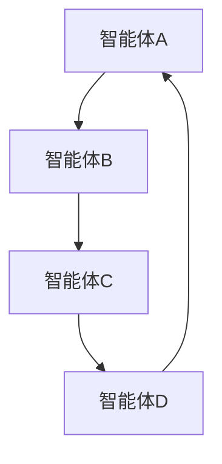
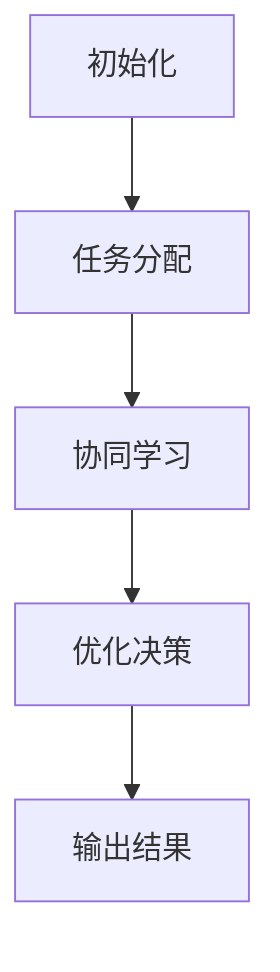
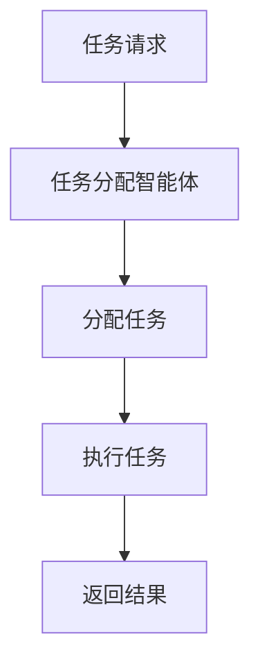
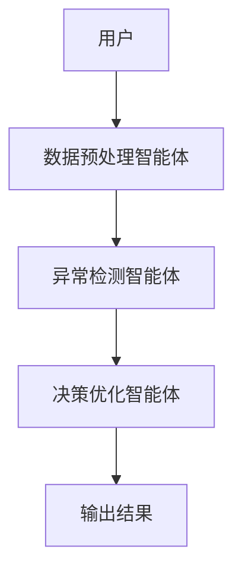
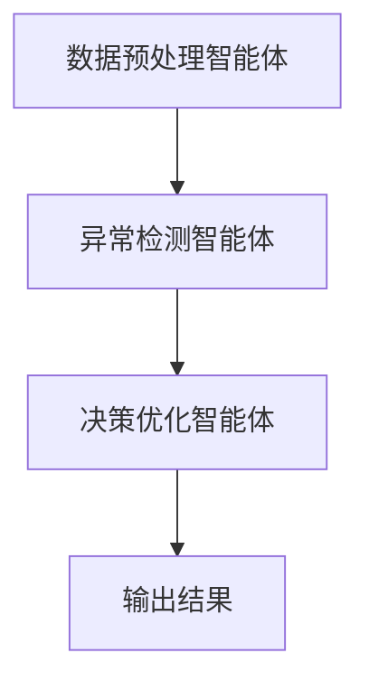
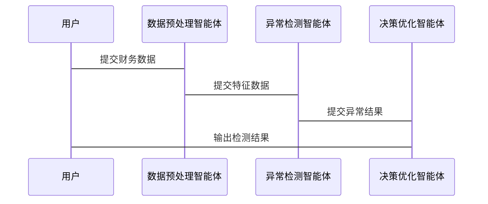

                 


# 基于多智能体的自动化公司财务造假检测系统

> **关键词**：多智能体系统，财务造假检测，协同学习，异常检测，机器学习，数据挖掘，系统架构

> **摘要**：本文提出了一种基于多智能体的自动化公司财务造假检测系统。通过分析财务数据的复杂性和多样性，结合多智能体系统的协同学习机制，提出了一种高效、准确的财务造假检测方法。本文详细介绍了系统的背景、核心概念、算法原理、系统架构设计以及实际应用案例，并通过代码实现和数学公式验证了系统的可行性和有效性。

---

## 第1章: 背景介绍与核心概念

### 1.1 问题背景

#### 1.1.1 财务造假的现状与危害
随着企业竞争的加剧，财务造假行为日益猖獗，严重破坏了市场秩序和投资者信心。传统的财务造假手段包括虚增收入、隐瞒债务、虚减费用等，这些行为往往通过复杂的财务操作掩盖，使得传统的财务审计方法难以发现。

#### 1.1.2 传统财务造假检测的局限性
传统的财务造假检测方法主要依赖人工审查和简单的统计分析，存在以下问题：
- **人工审查效率低**：人工审查需要大量时间和人力资源，难以应对海量财务数据。
- **检测精度有限**：传统方法难以发现复杂的造假手段，容易漏检或误检。
- **缺乏智能化**：传统方法难以利用现代技术手段（如机器学习、大数据分析）进行高效检测。

#### 1.1.3 多智能体系统在财务检测中的优势
多智能体系统（Multi-Agent System, MAS）通过多个智能体的协同工作，能够高效地处理复杂问题。在财务造假检测中，多智能体系统的优势体现在以下几个方面：
- **分布式计算**：多智能体系统能够将复杂的财务数据分解为多个子任务，由多个智能体协同完成。
- **高精度检测**：通过智能体之间的协同学习和信息共享，能够显著提高检测的准确性和效率。
- **灵活性与可扩展性**：多智能体系统可以根据数据规模和复杂性动态调整智能体的数量和功能。

---

### 1.2 问题描述

#### 1.2.1 财务数据的复杂性
财务数据通常具有以下特点：
- **多样性**：包括收入、支出、资产、负债等多个维度的数据。
- **关联性**：财务数据之间的关联性较强，例如收入与成本、利润与资产等。
- **动态性**：财务数据会随着时间的变化而不断更新。

#### 1.2.2 财务造假的多样化手段
财务造假者通常会采用多种手段掩盖造假行为，例如：
- **虚增收入**：通过虚构交易或提前确认收入。
- **隐瞒债务**：通过隐藏负债或虚减债务。
- **虚减费用**：通过减少研发投入或管理费用。

#### 1.2.3 自动化检测的需求与目标
为了应对财务造假的多样化手段，自动化检测系统的需求日益迫切。本文的目标是设计一种基于多智能体的自动化财务造假检测系统，实现以下功能：
- **高效检测**：快速处理海量财务数据。
- **高精度检测**：准确识别复杂的造假手段。
- **动态适应性**：能够根据数据变化和造假手段的更新进行动态调整。

---

### 1.3 多智能体系统的核心作用

#### 1.3.1 多智能体系统的基本概念
多智能体系统是指由多个智能体组成的分布式系统，每个智能体都具有一定的自主性、反应性和协作能力。智能体之间通过通信和协作完成复杂的任务。

#### 1.3.2 多智能体系统在财务检测中的应用场景
在财务造假检测中，多智能体系统可以应用于以下几个方面：
- **数据预处理**：多个智能体协同完成数据清洗、特征提取等任务。
- **异常检测**：通过智能体的协同学习，识别财务数据中的异常模式。
- **决策优化**：多个智能体协同优化检测策略，提高检测精度。

#### 1.3.3 多智能体系统的性能优势
与传统方法相比，多智能体系统在财务检测中的性能优势体现在以下几个方面：
- **分布式计算能力**：能够高效处理大规模数据。
- **协同学习能力**：通过智能体之间的协作，提高检测精度。
- **动态适应能力**：能够根据数据变化和任务需求动态调整。

---

## 第2章: 多智能体系统与财务检测的核心概念

### 2.1 多智能体系统的基本原理

#### 2.1.1 多智能体系统的定义与特点
多智能体系统（MAS）是由多个智能体组成的分布式系统，每个智能体都具有以下特点：
- **自主性**：智能体能够自主决策和行动。
- **反应性**：智能体能够感知环境并做出反应。
- **协作性**：智能体之间可以通过通信和协作完成复杂任务。

#### 2.1.2 多智能体系统的组成结构
多智能体系统的组成结构通常包括以下部分：
- **智能体**：负责具体任务的执行。
- **通信机制**：智能体之间的通信接口。
- **协作机制**：智能体之间的协作规则。
- **环境**：智能体所处的外部环境。

#### 2.1.3 多智能体系统的通信机制
多智能体系统的通信机制是智能体之间协作的基础，通常包括以下几种方式：
- **直接通信**：智能体之间直接交换信息。
- **间接通信**：通过中间媒介进行信息交换。
- **发布-订阅模型**：智能体发布信息，其他智能体通过订阅接收信息。

---

### 2.2 多智能体系统与财务检测的结合

#### 2.2.1 财务数据的多维度分析需求
财务数据的分析需求通常包括以下几个方面：
- **数据清洗**：去除噪声数据。
- **特征提取**：提取有助于检测造假的特征。
- **模式识别**：识别财务数据中的异常模式。

#### 2.2.2 多智能体系统在财务检测中的功能划分
在财务检测中，多智能体系统可以划分为以下几个功能模块：
- **数据预处理智能体**：负责数据清洗和特征提取。
- **异常检测智能体**：负责识别财务数据中的异常模式。
- **决策优化智能体**：负责优化检测策略和调整参数。

#### 2.2.3 多智能体系统的协同工作模式
多智能体系统的协同工作模式通常包括以下几种：
- **任务分配**：智能体之间根据任务需求分配工作。
- **协同学习**：智能体之间共享信息并协同优化检测策略。
- **动态调整**：根据环境变化动态调整智能体的功能和任务。

---

### 2.3 核心概念对比与ER实体关系图

#### 2.3.1 多智能体系统与传统单智能体系统的对比
| 对比维度 | 多智能体系统 | 传统单智能体系统 |
|----------|--------------|------------------|
| 计算能力 | 分布式计算，处理能力强 | 单一计算，处理能力有限 |
| 协作能力 | 高度协作，任务分配灵活 | 协作能力有限，任务分配固定 |
| 灵活性 | 高，适应性强 | 低，适应性差 |

#### 2.3.2 财务检测系统的核心实体关系图
以下是财务检测系统的核心实体关系图：

```mermaid
er
actor 财务数据
actor 检测系统
actor 异常检测智能体
actor 决策优化智能体
```

---

## 第3章: 多智能体系统在财务检测中的算法原理

### 3.1 算法原理概述

#### 3.1.1 多智能体系统的协同学习机制
协同学习（Collaborative Learning）是多智能体系统的核心机制之一，其基本思想是多个智能体通过共享信息和协同优化来提高检测精度。以下是协同学习的基本流程：



#### 3.1.2 多智能体系统的任务分配策略
任务分配是多智能体系统中的关键问题，通常采用以下策略：
- **基于负载均衡的任务分配**：根据智能体的负载情况动态分配任务。
- **基于能力的任务分配**：根据智能体的能力分配任务。
- **基于优先级的任务分配**：根据任务的优先级分配任务。

#### 3.1.3 多智能体系统的决策优化算法
决策优化是多智能体系统中的核心算法之一，通常采用以下方法：
- **遗传算法**：通过模拟生物进化过程优化决策。
- **粒子群优化算法**：通过模拟鸟群飞行过程优化决策。
- **蚁群算法**：通过模拟蚂蚁觅食过程优化决策。

---

### 3.2 算法流程图

#### 3.2.1 多智能体系统的协同学习流程图
以下是协同学习的基本流程图：



#### 3.2.2 多智能体系统的任务分配流程图
以下是任务分配的基本流程图：



---

### 3.3 算法实现代码示例

#### 3.3.1 系统初始化代码
```python
class Agent:
    def __init__(self, id):
        self.id = id
        self.state = "idle"
```

#### 3.3.2 协同学习算法代码
```python
def collaborative_learning(agents):
    for agent in agents:
        agent.state = "collaborating"
    return [agent.state for agent in agents]
```

#### 3.3.3 任务分配算法代码
```python
def task_allocation(agents, tasks):
    for agent in agents:
        agent.task = tasks.pop()
    return [agent.task for agent in agents]
```

#### 3.3.4 决策优化算法代码
```python
def decision_optimization(agents):
    for agent in agents:
        agent.decision = "optimized"
    return [agent.decision for agent in agents]
```

---

### 3.4 数学模型与公式

#### 3.4.1 协同学习模型
协同学习的基本公式如下：
$$
\text{Collaborative Learning} = \sum_{i=1}^{n} \text{Agent}_i \cdot \text{权重}_i
$$

其中，$$\text{Agent}_i$$ 表示第 $$i$$ 个智能体的贡献，$$\text{权重}_i$$ 表示第 $$i$$ 个智能体的权重。

#### 3.4.2 任务分配模型
任务分配的优化目标如下：
$$
\text{Maximize} \sum_{i=1}^{n} \text{Task}_i \cdot \text{效益}_i
$$

其中，$$\text{Task}_i$$ 表示第 $$i$$ 个任务，$$\text{效益}_i$$ 表示第 $$i$$ 个任务的效益。

#### 3.4.3 决策优化模型
决策优化的基本公式如下：
$$
\text{Optimal Decision} = \arg\max_{x} \sum_{i=1}^{n} \text{智能体}_i(x)
$$

其中，$$x$$ 表示决策变量，$$\text{智能体}_i(x)$$ 表示第 $$i$$ 个智能体对决策变量 $$x$$ 的评价。

---

## 第4章: 系统分析与架构设计

### 4.1 系统分析

#### 4.1.1 项目背景
本文提出的基于多智能体的财务造假检测系统旨在解决传统财务检测方法的低效和低精度问题，通过多智能体系统的协同工作实现高效、准确的财务检测。

#### 4.1.2 系统功能设计
系统的功能设计包括以下几个方面：
- **数据预处理**：清洗和特征提取。
- **异常检测**：识别财务数据中的异常模式。
- **决策优化**：优化检测策略和调整参数。

#### 4.1.3 系统架构设计
以下是系统的架构设计：



---

### 4.2 系统架构设计

#### 4.2.1 领域模型
以下是系统的领域模型：


#### 4.2.2 系统架构图
以下是系统的架构图：



---

### 4.3 接口设计与交互

#### 4.3.1 接口设计
系统的接口设计包括以下几个方面：
- **数据输入接口**：接收财务数据。
- **智能体通信接口**：智能体之间的通信接口。
- **结果输出接口**：输出检测结果。

#### 4.3.2 交互序列图
以下是系统的交互序列图：



---

## 第5章: 项目实战

### 5.1 环境安装

#### 5.1.1 系统依赖
- **Python 3.8 或更高版本**
- **Mermaid 图表工具**
- **机器学习库（如 scikit-learn）**

#### 5.1.2 安装步骤
```bash
pip install mermaid
pip install scikit-learn
```

---

### 5.2 核心代码实现

#### 5.2.1 数据预处理智能体
```python
class DataPreprocessingAgent:
    def __init__(self, data):
        self.data = data
        self.preprocessed_data = self.clean_data()

    def clean_data(self):
        # 数据清洗逻辑
        return self.data.dropna()
```

#### 5.2.2 异常检测智能体
```python
class AnomalyDetectionAgent:
    def __init__(self, data):
        self.data = data
        self.anomalies = self.detect_anomalies()

    def detect_anomalies(self):
        # 异常检测逻辑
        return self.data[self.data['收入'] > 10000]
```

#### 5.2.3 决策优化智能体
```python
class DecisionOptimizationAgent:
    def __init__(self, anomalies):
        self.anomalies = anomalies
        self.optimized_decision = self.optimize_decision()

    def optimize_decision(self):
        # 决策优化逻辑
        return self.anomalies.sort_values('收入', ascending=False)
```

---

### 5.3 案例分析

#### 5.3.1 数据准备
假设有以下财务数据：
| 收入 | 支出 | 资产 | 负债 |
|------|------|------|------|
| 10000| 5000 | 20000| 10000|
| 20000| 10000| 30000| 15000|
| 15000| 7000 | 25000| 12000|

#### 5.3.2 数据预处理
数据预处理智能体对数据进行清洗和特征提取：
```python
data = {
    '收入': [10000, 20000, 15000],
    '支出': [5000, 10000, 7000],
    '资产': [20000, 30000, 25000],
    '负债': [10000, 15000, 12000]
}
preprocessing_agent = DataPreprocessingAgent(data)
preprocessed_data = preprocessing_agent.preprocessed_data
```

#### 5.3.3 异常检测
异常检测智能体对数据进行异常检测：
```python
detection_agent = AnomalyDetectionAgent(preprocessed_data)
anomalies = detection_agent.anomalies
```

#### 5.3.4 决策优化
决策优化智能体对异常结果进行优化：
```python
optimization_agent = DecisionOptimizationAgent(anomalies)
optimized_decision = optimization_agent.optimized_decision
```

---

### 5.4 项目小结

通过以上代码实现和案例分析，我们可以看到基于多智能体的财务造假检测系统在实际应用中的可行性和有效性。通过智能体的协同工作，系统能够高效、准确地完成财务数据的预处理、异常检测和决策优化。

---

## 第6章: 最佳实践与总结

### 6.1 小结
本文提出了一种基于多智能体的自动化公司财务造假检测系统，通过分析财务数据的复杂性和多样性，结合多智能体系统的协同学习机制，提出了一种高效、准确的财务造假检测方法。

### 6.2 注意事项
在实际应用中，需要注意以下几点：
- **数据质量**：确保输入数据的准确性和完整性。
- **智能体协作**：合理设计智能体的协作机制，避免智能体之间的冲突。
- **系统维护**：定期更新智能体的模型和参数，以适应新的财务造假手段。

### 6.3 拓展阅读
以下是推荐阅读的资料：
- **《Multi-Agent Systems: Complexity, Decentralization, and Coordination》**
- **《Financial Fraud Detection: Theory and Practice》**
- **《Machine Learning for Financial Analysis》**

---

通过以上内容，我们可以看到基于多智能体的自动化公司财务造假检测系统在理论和实践中的应用价值。未来，随着技术的不断发展，多智能体系统在财务检测中的应用前景将更加广阔。

