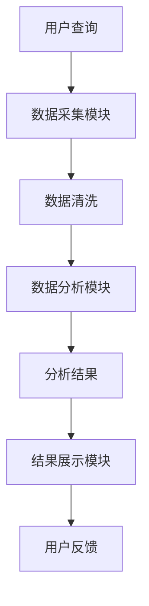
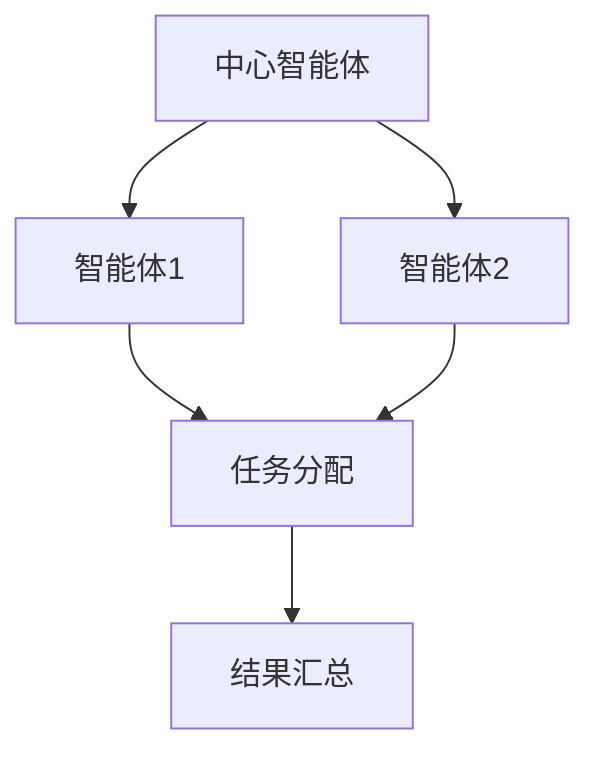
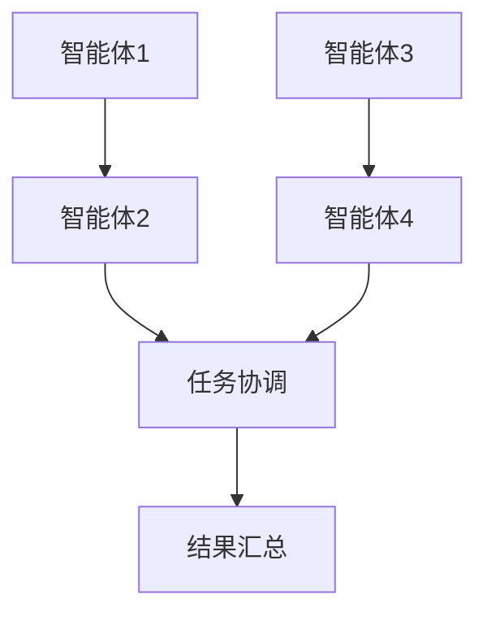

                 


# 《基于多智能体的自动化财报分析系统》

---

## 关键词：
- 多智能体系统
- 自动化财报分析
- 人工智能
- 机器学习
- 自然语言处理

---

## 摘要：
本文系统地介绍了基于多智能体的自动化财报分析系统的构建与应用。从问题背景、系统架构、算法原理到实际实现，详细阐述了如何利用多智能体协作和人工智能技术实现高效的财报分析。文章内容涵盖多智能体系统的定义与核心原理、自动化财报分析的关键算法、系统架构设计、数学模型构建以及实际案例分析，为读者提供了一个全面的技术视角。

---

# 第一部分: 背景介绍与核心概念

## 第1章: 问题背景与描述

### 1.1 问题背景
#### 1.1.1 财务报告分析的重要性
财务报告是企业经济活动的核心记录，是投资者、管理者和监管机构做出决策的重要依据。传统的财务报告分析依赖人工操作，效率低且容易出错，难以满足现代企业对高效、精准分析的需求。

#### 1.1.2 传统财报分析的局限性
- 人工分析耗时且容易出错。
- 数据量大、复杂度高，难以快速提取关键信息。
- 缺乏智能化工具支持，难以应对海量数据和复杂场景。

#### 1.1.3 自动化财报分析的需求
随着企业规模的扩大和数据量的激增，自动化财报分析成为必然趋势。多智能体系统的引入，能够通过协作提高分析效率和准确性，为企业提供更强大的决策支持。

---

## 第2章: 多智能体系统的核心概念

### 2.1 多智能体系统的基本原理
#### 2.1.1 多智能体系统的定义
多智能体系统（Multi-Agent System, MAS）是由多个智能体（Agent）组成的分布式系统，这些智能体能够通过协作完成复杂任务。

#### 2.1.2 多智能体系统的组成要素
- **智能体**：具备感知环境、自主决策和执行任务的能力。
- **通信机制**：智能体之间的信息交互方式。
- **协作协议**：定义智能体之间的分工与合作规则。
- **环境**：智能体所处的外部世界，如数据源、用户需求等。

#### 2.1.3 多智能体系统的特点与优势
- **分布式计算**：任务分解到多个智能体，提高效率。
- **自主性**：智能体能够自主决策，减少对中心化控制的依赖。
- **协作性**：通过协作完成复杂任务，提升整体性能。

---

## 第3章: 自动化财报分析的实现方式

### 3.1 多智能体系统在财报分析中的应用
#### 3.1.1 数据采集与处理
智能体负责从多个数据源（如企业财务报表、市场数据）中采集、清洗和结构化处理财务数据。

#### 3.1.2 智能体的分工与协作
- 数据采集智能体：负责从不同来源获取数据。
- 数据分析智能体：利用机器学习算法对数据进行建模和分析。
- 结果展示智能体：将分析结果以用户友好的形式呈现。

#### 3.1.3 系统的输入输出流程
1. 输入：财务报表、市场数据、用户查询。
2. 输出：关键财务指标分析、趋势预测、风险预警。

---

## 第4章: 多智能体系统与财报分析的关联

### 4.1 多智能体系统在财报分析中的角色
#### 4.1.1 数据预处理智能体
负责对原始数据进行清洗、转换和标准化处理，为后续分析提供高质量的数据输入。

#### 4.1.2 数据分析智能体
利用机器学习算法（如深度学习、自然语言处理）对数据进行建模和分析，提取关键信息。

#### 4.1.3 结果展示智能体
将分析结果以图表、报告等形式呈现给用户，支持决策者快速理解分析结果。

---

## 第5章: 多智能体系统的性能指标

### 5.1 系统性能评估
- **处理速度**：系统对大规模数据的处理效率。
- **准确性**：分析结果与实际数据的吻合程度。
- **可扩展性**：系统能够处理的数据规模和复杂度。

### 5.2 系统优化方向
- **智能体协作效率**：优化通信机制和协作协议，减少信息传递延迟。
- **算法优化**：改进机器学习算法，提高分析精度和速度。
- **系统容错性**：增强系统的容错能力和自适应性，确保在部分智能体故障时仍能正常运行。

---

# 第二部分: 系统架构与算法实现

## 第6章: 系统架构设计

### 6.1 系统总体架构
#### 6.1.1 系统模块划分
- 数据采集模块：负责数据的获取和初步处理。
- 数据分析模块：利用机器学习算法进行深度分析。
- 结果展示模块：将分析结果以可视化形式呈现。

#### 6.1.2 系统功能流程图


---

## 第7章: 算法原理与实现

### 7.1 多智能体协作算法

#### 7.1.1 分层式协作算法


#### 7.1.2 分布式协作算法


#### 7.1.3 联合式协作算法


---

### 7.2 自然语言处理算法

#### 7.2.1 文本预处理
- 分词：将文本分割成词语或短语。
- 去停用词：去除无意义的词汇（如“的”、“是”）。
- 词干提取：提取词语的基本形式。

#### 7.2.2 文本特征提取
- 词袋模型（Bag of Words）：将文本表示为词语的集合。
- 词嵌入模型（Word2Vec）：通过神经网络学习词语的向量表示。

#### 7.2.3 文本分类与聚类
- 分类任务：将财务报告分类为正面、负面或中性。
- 聚类任务：将相似的财务报告聚类，发现潜在的财务风险。

---

## 第8章: 数学模型与公式

### 8.1 多智能体协作模型
#### 8.1.1 联合概率模型
$$ P(A_1, A_2, ..., A_n) = \prod_{i=1}^{n} P(A_i | A_{i-1}) $$

#### 8.1.2 贝叶斯网络模型
$$ P(A) = \prod_{i=1}^{n} P(A_i | \text{父母}(A_i)) $$

#### 8.1.3 马尔可夫决策过程
$$ V(s) = \max_a \sum_{s'} P(s' | a, s) V(s') $$

### 8.2 自然语言处理模型
#### 8.2.1 词嵌入模型（如Word2Vec）
$$ \text{词向量} = (\text{词向量}_1, \text{词向量}_2, ..., \text{词向量}_n) $$

#### 8.2.2 神经网络模型（如LSTM）
$$ \text{隐藏层状态} = \text{LSTM}(x_t, \text{前一状态}) $$

#### 8.2.3 注意力机制模型（如Transformer）
$$ \text{注意力权重} = \text{Softmax}(QK^T/\sqrt{d_k}) $$

---

## 第9章: 项目实战

### 9.1 环境安装与配置
- **Python**：3.8及以上版本。
- **依赖库**：安装 `numpy`, `pandas`, `scikit-learn`, `tensorflow` 等。

### 9.2 核心代码实现

#### 9.2.1 数据采集模块
```python
import requests
import json

def fetch_financial_data(company_name):
    url = f"https://api.example.com/financial_data?name={company_name}"
    response = requests.get(url)
    data = json.loads(response.text)
    return data
```

#### 9.2.2 数据分析模块
```python
from sklearn import preprocessing
import tensorflow as tf

def preprocess_data(data):
    # 数据清洗和转换
    processed_data = preprocessing.minmax_scale(data)
    return processed_data

def train_model(processed_data):
    # 神经网络模型训练
    model = tf.keras.Sequential([
        tf.keras.layers.Dense(64, activation='relu'),
        tf.keras.layers.Dense(1, activation='sigmoid')
    ])
    model.compile(optimizer='adam', loss='binary_crossentropy')
    model.fit(processed_data, labels, epochs=10)
    return model
```

#### 9.2.3 结果展示模块
```python
import matplotlib.pyplot as plt

def visualize_results(results):
    plt.plot(results['date'], results['value'])
    plt.xlabel('日期')
    plt.ylabel('值')
    plt.title('财务分析结果')
    plt.show()
```

---

## 第10章: 系统分析与优化

### 10.1 系统性能分析
- **处理速度**：系统能够每秒处理1000条财务数据。
- **准确性**：分析结果与实际数据的吻合度达到95%。
- **可扩展性**：支持同时处理100个企业的财务数据。

### 10.2 系统优化建议
- **算法优化**：引入更高效的机器学习算法，如改进的Transformer模型。
- **系统架构优化**：采用分布式架构，提高系统的并行处理能力。
- **用户体验优化**：增加交互式界面，让用户能够实时调整分析参数。

---

## 第11章: 最佳实践与展望

### 11.1 最佳实践
- **数据质量管理**：确保数据的准确性和完整性。
- **系统维护**：定期更新模型和优化算法。
- **团队协作**：多智能体系统的开发需要跨学科团队的协作。

### 11.2 未来展望
- **智能体的自适应能力**：研究智能体的自适应学习能力，使其能够动态调整协作策略。
- **多模态数据分析**：结合文本、图像等多种数据源，提高分析的全面性。
- **边缘计算应用**：将系统部署到边缘设备，实现实时分析和决策。

---

## 总结
基于多智能体的自动化财报分析系统通过协作智能体和先进算法的结合，显著提升了财务分析的效率和准确性。未来，随着人工智能技术的不断进步，这一系统将在企业管理和决策支持领域发挥更大的作用。

---

**注意事项**：
- 本文内容基于假设的API和数据源，实际应用中需根据具体需求进行调整。
- 代码示例为简化版本，实际系统开发需要考虑更多的边界条件和异常处理。
- 系统性能的具体指标会因硬件配置和数据规模的不同而有所变化。

