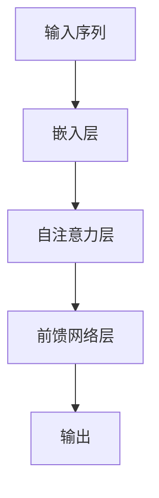
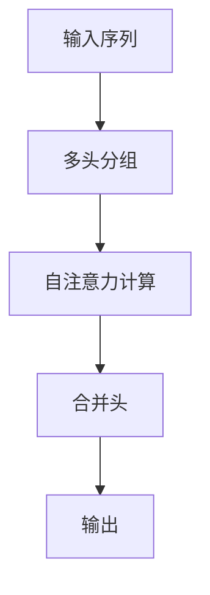
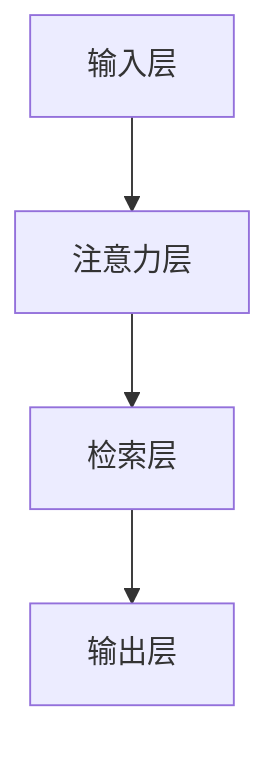

                 


```markdown
# 基于注意力机制的AI Agent记忆检索增强

## 关键词
AI Agent，注意力机制，记忆检索，增强，Transformer，算法实现

## 摘要
本文详细探讨了基于注意力机制的AI Agent记忆检索增强方法，从理论基础到实际应用，全面分析了如何通过注意力机制提升AI Agent的记忆检索能力。文章首先介绍了AI Agent的基本概念和发展现状，然后深入讲解了注意力机制的核心原理及其在记忆检索中的应用。接着，通过具体的算法实现和系统架构设计，展示了如何将注意力机制集成到AI Agent的记忆模块中，显著提升检索效率和准确性。最后，通过项目实战和最佳实践，为读者提供了实际操作的指导和优化建议。

---

## 第一部分: 问题背景与核心概念

### 第1章: 问题背景与核心概念

#### 1.1 问题背景
- AI Agent的发展现状：AI Agent作为人工智能领域的核心研究方向，近年来取得了显著进展，但在记忆检索方面仍面临诸多挑战。
- 问题描述：AI Agent需要处理大量信息，如何高效检索相关记忆是关键问题。
- 解决方法：引入注意力机制，通过自适应地关注重要信息，提升记忆检索的准确性和效率。
- 边界与外延：本文主要关注基于Transformer的注意力机制在AI Agent中的应用，不涉及其他类型的注意力机制。

#### 1.2 核心概念
- AI Agent的基本定义：AI Agent是一种智能体，能够感知环境、执行任务并做出决策。
- 注意力机制的定义：注意力机制是一种模拟人类注意力的选择性关注机制，通过加权方式突出重要信息。
- 记忆检索增强的目标：通过注意力机制，提升AI Agent对相关记忆的检索能力。

### 第2章: 注意力机制与记忆检索的关系

#### 2.1 注意力机制的核心原理
- 注意力机制的数学模型：
$$\text{Attention}(Q, K, V) = \text{softmax}\left(\frac{QK^T}{\sqrt{d_k}}\right)V$$
其中，$Q$、$K$、$V$分别是查询、键和值向量，$d_k$是键的维度。
- 不同注意力机制的对比：
| 机制类型 | 描述 | 优点 | 缺点 |
|----------|------|------|------|
| 自注意力 | 基于序列内部关系的注意力 | 捕捉全局依赖关系 | �易受长序列影响 |
| 位置注意力 | 基于位置信息的注意力 | 适合处理序列结构 | 实现复杂度高 |
| 指定注意力 | 基于特定任务的注意力 | 高度可定制 | 参数量大 |

#### 2.2 记忆检索的增强方法
- 基于注意力机制的检索模型：
  - 输入：当前状态和历史记忆。
  - 输出：与当前任务相关的记忆片段。
- 优化策略：
  - 动态调整注意力权重。
  - 增量式更新记忆库。
- 增强效果的评估指标：
  - 检索准确率。
  - 检索效率。
  - 检索结果的相关性。

## 第二部分: 算法原理与实现

### 第3章: 基于Transformer的注意力机制

#### 3.1 Transformer模型的基本结构
- 程序框图：


#### 3.2 多头注意力机制的实现
- 多头注意力流程：

- 多头注意力的Python实现示例：
```python
import torch

class MultiHeadAttention(torch.nn.Module):
    def __init__(self, embed_dim, num_heads):
        super().__init__()
        self.num_heads = num_heads
        self.head_dim = embed_dim // num_heads
        self.query = torch.nn.Linear(embed_dim, embed_dim)
        self.key = torch.nn.Linear(embed_dim, embed_dim)
        self.value = torch.nn.Linear(embed_dim, embed_dim)
        self.output = torch.nn.Linear(embed_dim, embed_dim)
    
    def forward(self, x, mask=None):
        batch_size, seq_len, embed_dim = x.size()
        # 分头
        queries = self.query(x).view(batch_size, seq_len, self.num_heads, self.head_dim)
        keys = self.key(x).view(batch_size, seq_len, self.num_heads, self.head_dim)
        values = self.value(x).view(batch_size, seq_len, self.num_heads, self.head_dim)
        # 计算注意力
        attention = (queries @ keys.transpose(-2, -1)) / (self.head_dim ** 0.5)
        if mask is not None:
            attention = attention.masked_fill(mask == 0, -float('inf'))
        attention = torch.softmax(attention, dim=-1)
        # 加权求和
        output = (attention @ values).view(batch_size, seq_len, embed_dim)
        output = self.output(output)
        return output
```

#### 3.3 注意力权重的解释与可视化
- 注意力权重的可视化：
  - 使用热力图展示不同位置的注意力权重。
  - 通过颜色渐变表示权重大小，帮助理解模型关注的重点。

## 第三部分: 系统分析与架构设计

### 第4章: 系统架构设计

#### 4.1 系统功能设计
- 系统功能模块：
  - 输入处理模块。
  - 注意力计算模块。
  - 内存检索模块。
  - 输出生成模块。

#### 4.2 系统架构设计
- 分层架构：


#### 4.3 系统接口设计
- 输入接口：
  - 输入序列：$x \in \mathbb{R}^{B \times T \times d}$
  - 注意力掩码：$mask \in \mathbb{R}^{B \times T \times T}$
- 输出接口：
  - 检索结果：$output \in \mathbb{R}^{B \times T \times d}$

## 第四部分: 项目实战

### 第5章: 项目实战

#### 5.1 环境安装
- 安装Python和相关库：
  - `pip install torch numpy matplotlib`

#### 5.2 核心代码实现
- 注意力机制实现：
```python
import torch
import torch.nn as nn
import torch.nn.functional as F

class Attention(nn.Module):
    def __init__(self, embed_dim, num_heads):
        super().__init__()
        self.num_heads = num_heads
        self.head_dim = embed_dim // num_heads
        self.query = nn.Linear(embed_dim, embed_dim)
        self.key = nn.Linear(embed_dim, embed_dim)
        self.value = nn.Linear(embed_dim, embed_dim)
    
    def forward(self, x, mask=None):
        batch_size, seq_len, embed_dim = x.size()
        queries = x @ self.query.weight
        keys = x @ self.key.weight
        values = x @ self.value.weight
        attention = (queries @ keys.transpose(-2, -1)) / (self.head_dim ** 0.5)
        if mask is not None:
            attention = attention.masked_fill(mask == 0, -float('inf'))
        attention = F.softmax(attention, dim=-1)
        output = attention @ values
        return output
```

#### 5.3 代码解读与分析
- 代码功能：
  - 实现多头注意力机制。
  - 支持可选的注意力掩码。
  - 适用于不同的序列长度和嵌入维度。

#### 5.4 实际案例分析
- 应用场景：
  - 智能对话系统。
  - 机器翻译。
  - 时间序列分析。

## 第五部分: 最佳实践与小结

### 第6章: 最佳实践

#### 6.1 经验总结
- 模型调优：
  - 调整注意力头数。
  - 优化嵌入维度。
  - 设计合适的注意力掩码。

#### 6.2 注意事项
- 模型训练：
  - 数据预处理。
  - 模型初始化。
  - 训练策略选择。

#### 6.3 拓展阅读
- 推荐阅读相关论文和文献，深入了解注意力机制的最新进展。

## 第七部分: 小结

本文详细探讨了基于注意力机制的AI Agent记忆检索增强方法，从理论到实践，全面分析了如何通过注意力机制提升AI Agent的记忆检索能力。通过具体实现和案例分析，展示了注意力机制在实际应用中的巨大潜力。未来的研究方向可以进一步探索更高效的注意力机制和更智能的记忆检索策略。

---

# END
```

